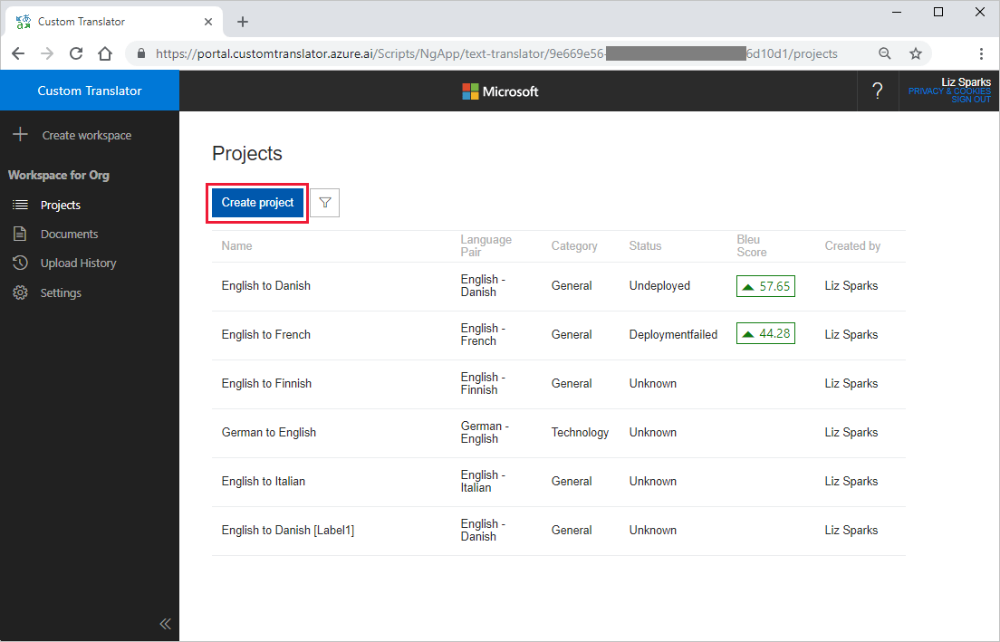
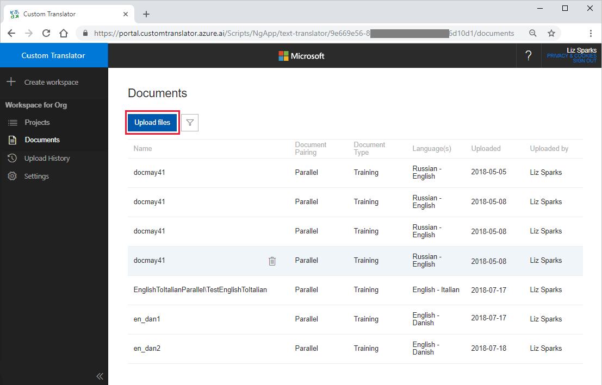

# Quickstart: Build, deploy, and use a custom model for translation

This article provides step-by-step instructions to build a translation system with Custom Translator.

## Prerequisites

1. To use the [Custom Translator](https://portal.customtranslator.azure.ai)
    Portal, you will need a [Microsoft account](https://signup.live.com) or [Azure AD account](https://docs.microsoft.com/azure/active-directory/fundamentals/active-directory-whatis)
    (organization account hosted on Azure) to sign in.

2. A subscription to the Translator Text API via the Azure portal. You will need the Translator Text API subscription key to associate with your workspace in Custom Translator. See [how to sign up for the Translator Text API](https://docs.microsoft.com/azure/cognitive-services/translator/translator-text-how-to-signup).

3. When you have both of the above, sign in to the
    [Custom Translator](https://portal.customtranslator.azure.ai) portal. Once
    on the Custom Translator portal,
    navigate to the Settings page where you can associate your Microsoft
    Translator Text API subscription key with your workspace.

## Create a project

On the Custom Translator portal landing page, click New Project. On the dialog you can enter your desired project
name, language pair, and category, as well as other relevant fields. Then, save
your project. For more details, visit [Create Project](how-to-create-project.md).

## Upload documents

Next, upload [training](training-and-model.md#training-dataset-for-custom-translator), [tuning](training-and-model.md#tuning-dataset-for-custom-translator) and [testing](training-and-model.md#testing-dataset-for-custom-translator) document sets. You can upload both [parallel](what-are-parallel-documents.md) and combo documents. You can also upload [dictionary](what-is-dictionary.md).

You can upload documents from either the documents tab or from a specific
project's page.

When uploading documents, choose the document type (training, tuning, or
testing), and the language pair. When uploading parallel documents, you'll need
to additionally specify a document name. For more details, visit [Upload document](how-to-upload-document.md).

## Create a model

When all your required documents are uploaded the next step is to build your
model.

Select the project you've created. You'll see all the documents you've uploaded
that share a language pair with this project. Select the documents that you want
included in your model. You can select [training](training-and-model.md#training-dataset-for-custom-translator),
[tuning](training-and-model.md#tuning-dataset-for-custom-translator), and [testing](training-and-model.md#testing-dataset-for-custom-translator) data or select just
training data and let Custom Translator automatically build tuning and test sets
for your model.

When you've finished selecting your desired documents, click Create Model button to
create your model and start training. You can see the status of your training,
and details for all the models you've trained, in the Models tab.

For more details, visit [Create a Model](how-to-train-model.md).

## Analyze your model

Once your training has completed successfully, inspect the results. The BLEU
score is one metric that indicates the quality of your translation. You can also
manually compare the translations made with your custom model to the
translations provided in your test set by navigating to the "Test" tab and
clicking "System Results." Manually inspecting a few of these translations will
give you a good idea of the quality of translation produced by your system. For
more details, visit [System Test Results](how-to-view-system-test-results.md).

## Deploy a trained model

When you are ready to deploy your trained model, click the "Deploy" button. You
can have one deployed model per project, and you can view the status of your
deployment in the Status column. For more details, visit [Model
Deployment](how-to-view-system-test-results.md#deploy-a-model)

## Use a deployed model

Deployed models can be accessed via the Microsoft Translator [Text API V3 by
specifying the CategoryID](https://docs.microsoft.com/azure/cognitive-services/translator/reference/v3-0-translate?tabs=curl). More information about the Translator Text API can
be found on the [API
Reference](https://docs.microsoft.com/azure/cognitive-services/translator/reference/v3-0-reference) webpage.

## Next steps

- Learn how to navigate the [Custom Translator workspace and manage your projects](workspace-and-project.md).
