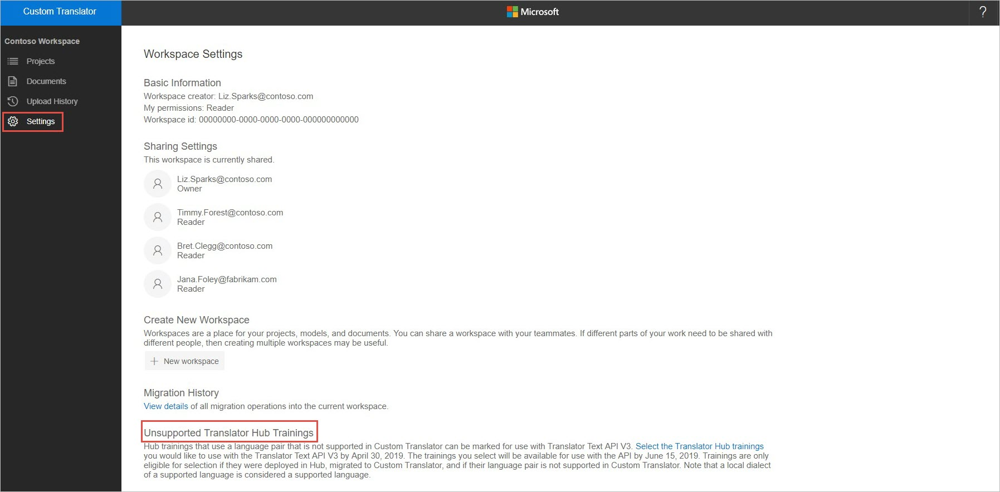
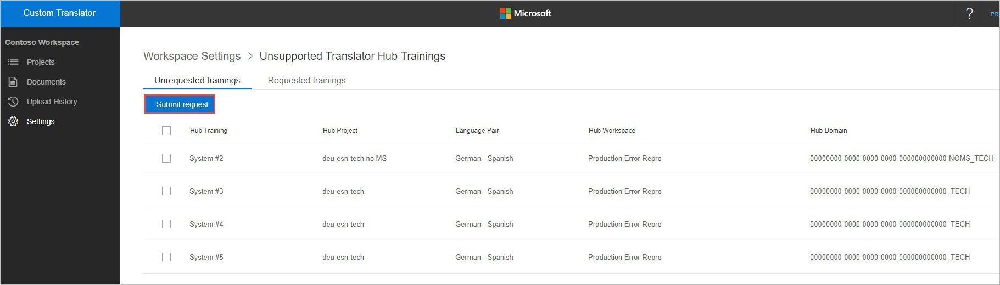

# Unsupported language deployments

<!--Custom Translator provides the highest-quality translations possible using the latest techniques in neural machine learning. While Microsoft intends to make neural training available in all languages, there are some limitations that prevent us from being able to offer neural machine translation in all language pairs.-->  

With the upcoming retirement of the Microsoft Translator Hub, Microsoft will be undeploying all models currently deployed through the Hub. Many of you have models deployed in the Hub whose language pairs are not supported in Custom Translator.  We do not want users in this situation to have no recourse for translating their content.

We now have a process that allows you to deploy your unsupported models through the Custom Translator.  This process enables you to continue to translate content using the latest V3 API.  These models will be hosted until you choose to undeploy them or the language pair becomes available in Custom Translator.  This article explains the process to deploy models with unsupported language pairs.

## Prerequisites

In order for your models to be candidates for deployment, they must meet the following criteria:
* The project containing the model must have been migrated from the Hub to the Custom Translator using the Migration Tool.  The process for migrating projects and workspaces can be found [here](how-to-migrate.md).
* The model must be in the deployed state when the migration happens.  
* The language pair of the model must be an unsupported language pair in Custom Translator.  Language pairs in which a language is supported to or from English, but the pair itself does not include English, are candidates for unsupported language deployments.  For example, a Hub model for a French to German language pair is considered an unsupported language pair even though French to English and English to German are supported language pair.

## Process
Once you have migrated models from the Hub that are candidates for deployment, you can find them by going to the **Settings** page for your workspace and scrolling to the end of the page where you will see an **Unsupported Translator Hub Trainings** section.  This section only appears if you have projects that meet the prerequisites mentioned above.

Within the **Unsupported Translator Hub Trainings** selection page, the **Unrequested trainings** tab contains models that are eligible for deployment.  Select the models you wish to deploy and submit a request.   Before the April 30 deployment deadline, you can select as many models as you wish for deployment.
 

Once submitted, the model will no longer be available on the **Unrequested trainings** tab and will instead appear on the **Requested trainings** tab.  You can view your requested trainings at any time.

 

## What's next?

The models you selected for deployment are saved once the Hub is decommissioned and all models are undeployed.  You have until May 24 to submit requests for deployment of unsupported models.  We will deploy these models on June 15 at which point they will be accessible through the Translator V3 API.  In addition, they will be available through the V2 API until July 1.  

For further information on important dates in the deprecation of the Hub check [here](https://www.microsoft.com/translator/business/hub/).
Once deployed, normal hosting charges will apply.  See [pricing](https://azure.microsoft.com/pricing/details/cognitive-services/translator-text-api/) for details.  

Unlike standard Custom Translator models, Hub models will only be available in a single region, so multi-region hosting charges will not apply.  Once deployed, you will be able to undeploy your Hub model at any time through the migrated Custom Translator project.

## Next steps

- [Train a model](how-to-train-model.md).
- Start using your deployed custom translation model via [Translator V3](https://docs.microsoft.com/azure/cognitive-services/translator/reference/v3-0-translate?tabs=curl).
