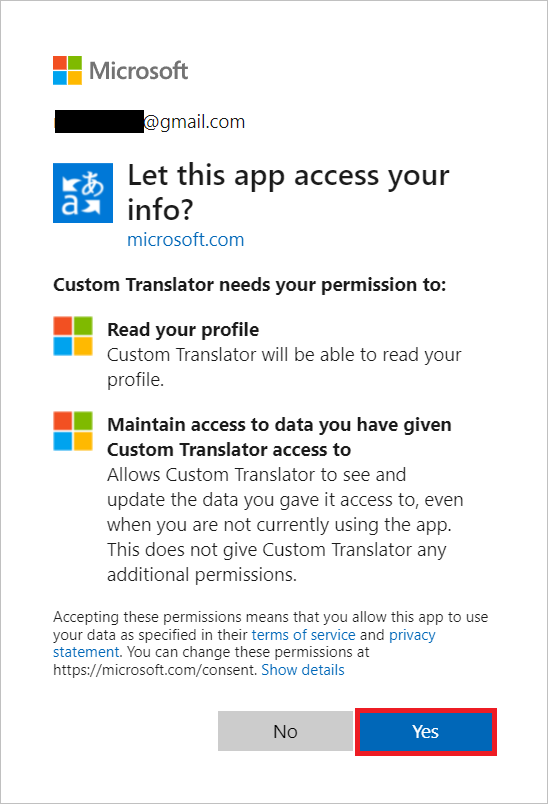
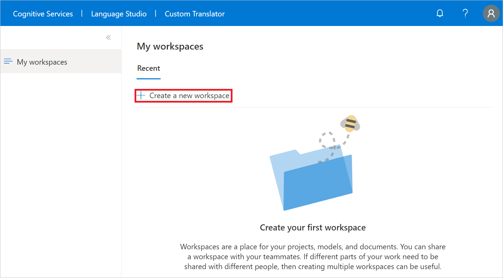
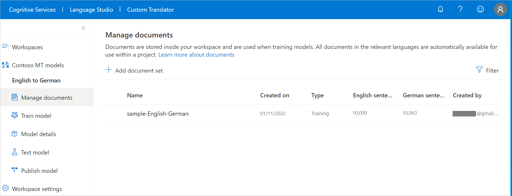
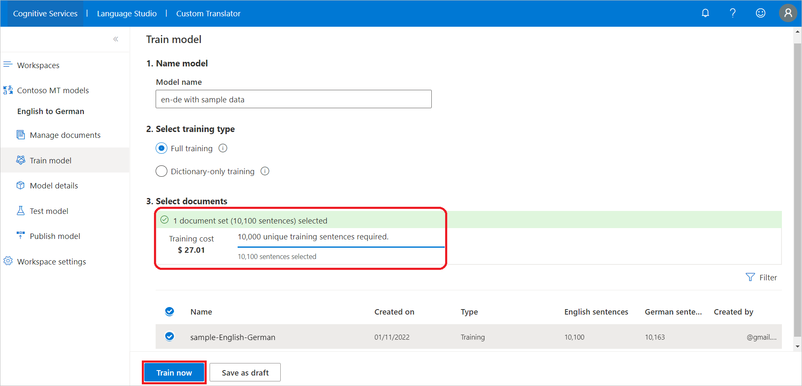
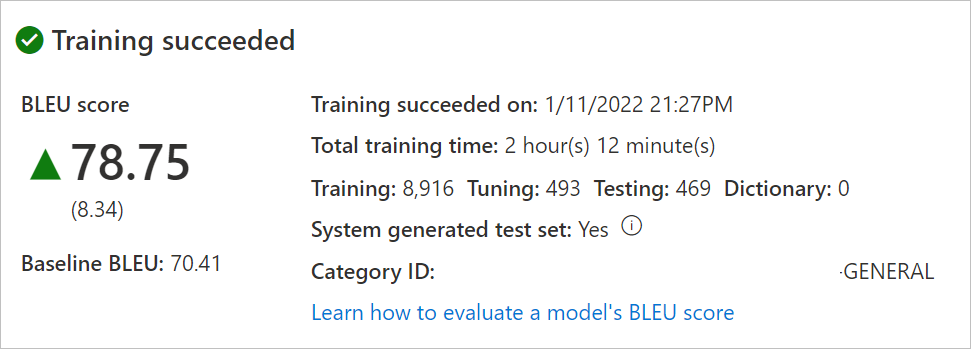
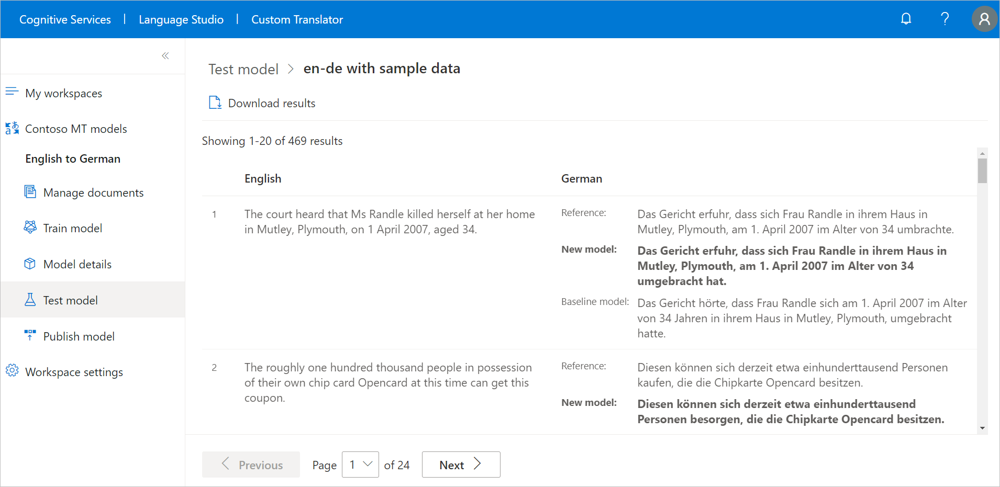

# Quickstart: Build, publish, and translate with custom models

> [!IMPORTANT]
> Custom Translator v2.1 is currently in public preview. Some features may not be supported or have constrained capabilities.

This article provides new users with basic knowledge to build, publish, and translate with custom models.

## Prerequisites

1. To use the [Custom Translator](https://portal.customtranslator.azure.ai)
    Portal, you will need a [Microsoft account](https://signup.live.com) or [Azure AD account](/azure/active-directory/fundamentals/active-directory-whatis)
    (organization account hosted on Azure) to sign in.

2. A subscription to the Translator Text API via the Azure portal. You will need the Translator Text API subscription key to associate with your workspace in Custom Translator. See [how to create a Translator resource](../../translator-how-to-signup.md).

3. When you have both of the above, sign in to the
    [Custom Translator](https://portal.customtranslator.azure.ai) portal to create workspaces, projects, upload files, create, and publish models.

You can read an overview of translation and custom translation, learn some tips, and watch a getting started video in the [Azure AI technical blog](https://techcommunity.microsoft.com/t5/azure-ai/customize-a-translation-to-make-sense-in-a-specific-context/ba-p/2811956). 

>[!Note]
>Custom Translator does not support creating workspace for Translator Text API resource that was created inside [Enabled VNET](/azure/api-management/api-management-using-with-vnet?tabs=stv2).

## Process summary

1. **Create a workspace** - A workspace is a work area for composing and building your custom translation system. A workspace can contain multiple projects, models, and documents. All the work you do in Custom Translator is inside a specific workspace.
2. **Create a project** - A project is a wrapper for a model, documents, and tests. Each project automatically includes all documents that are uploaded into that workspace that have the correct language pair. For example, if you have both an English to Spanish project and a Spanish to English project, the same documents will be included in both projects.
3. **Upload parallel documents** - Parallel documents are pairs of documents where one is the translation of the other. One document in the pair contains sentences in the source language and the other document contains these sentences translated into the target language. It doesn't matter which language is marked as "source" and which language is marked as "target" – a parallel document can be used to train a translation system in either direction.
4. **Train a model** - A model is the system, which provides translation for a specific language pair. The outcome of a successful training is a model. When training a model, three mutually exclusive document types are required: training, tuning, and testing. If only training data is provided when queuing a training, Custom Translator will automatically assemble tuning and testing data. It will use a random subset of sentences from your training documents, and exclude these sentences from the training data itself. A 10,000 parallel sentences is the minimum requirement to train a model.
5. **Test (human evaluate)** - The testing set is used to compute the BLEU (Bilingual Evaluation Understudy) score. This score indicates the quality of your translation system. 
6. **Publish (aka deploy)** - Custom model is made available for runtime translation requests.
7. **Translate** - Use the same cloud-based, secure, high performance, highly scalable Microsoft Translator [Text API V3](../../reference/v3-0-translate.md?tabs=curl) to make translation requests.

## Create workspace

After your `first sign-in`, you are asked for permission to read your profile from the Microsoft identity platform to request your user access token and refresh token. Both tokens are needed to authenticate you and to ensure you are not signed out during your live session or while we are training your models. Select `Yes.`

### Create workspace steps:

1. Select **My workspaces**
2. Select **Create a new workspace**
3. Type "Contoso MT models" for **Workspace name** and select **Next**
4. Select "Global" for **Select resource region** from the dropdown list, and copy/paste your **Translator or Cognitive Services** key
5. Select **Next**
6. Select **Done**

>[!Note]
>Region must match the region that was selected during the resource creation. You can use **KEY 1** or **KEY 2.**

## Create project

Once the workspace is created successfully, you are taken to **Projects** page. 

You will create English to German project to train a custom model with only [training](../training-and-model.md#training-document-type-for-custom-translator) document type. You can also create [Dictionary-only training](../what-is-dictionary.md); covered in [How to create a dictionary only model.](../how-to-train-model.md)

### Create project steps:

1. Select **Create project**
2. Type "English to German" for **Project name** 
3. Select "English (en)" as **Source language** from the dropdown list
4. Select "German (de)" as **Target language** from the dropdown list
5. Select "General" for **Domain** from the dropdown list
6. Select **Create project** 

## Upload documents

In order to create a custom model, you upload all or a combination of [training](../training-and-model.md#training-document-type-for-custom-translator), [tuning](../training-and-model.md#tuning-document-type-for-custom-translator), [testing](../training-and-model.md#testing-dataset-for-custom-translator), and [dictionary](../what-is-dictionary.md) document types. 

You will upload [training](../training-and-model.md#training-document-type-for-custom-translator) to do **Full training** customization.

>[!Note] 
>We share sample training, phrase and sentence dictionaries dataset, [Customer sample English to German datasets](https://github.com/MicrosoftTranslator/CustomTranslatorSampleDatasets), to download and use for training. However, it's better to upload your own training dataset.

### Upload documents steps:

1. Select "English to German" project name
2. Select **Manage documents** blade
3. Select **Add document set**
4. Check **Training set** and select **Next**
5. Keep **Parallel documents** checked and type "sample-English-German"
6. Under **Source (English - EN) file**, select **Browse files** and select "sample-English-German-Training-en.txt"
7. Under **Target (German - EN) file**, select **Browse files** and select "sample-English-German-Training-de.txt"
8. Select **Upload**

>[!Note]
>You can upload the sample phrase and sentence dictionaries dataset. This step is left for you to complete.

## Create model

Now you are ready to train your English to German model.

### Create model steps:

1. Select **Train model** blade
2. Type "en-de with sample data" for **Model name**
3. Keep **Full training** checked
4. Under **Select documents**, check "sample-English-German" and review the training cost associated with the selected number of sentences.
5. Select **Train now**
6. Select **Train** to confirm

>[!Note]
>**Notifications** displays model training in progress, e.g., **Submitting data** state. Training model takes few hours, subject to the number of selected sentences.

7. After successful model training, select **Model details** blade
8. Select the model name "en-de with sample data" to review training date/time, total training time, number of sentences used for training, tuning, testing, dictionary, and whether the system generated the test and tuning sets. You will use the "Category ID" to make translation requests.
9. Evaluate the model BLEU score. Using the test set, **BLEU score** is the custom model score and **Baseline BLEU** is the pre-trained baseline model used for customization. Higher **BLEU score** means higher translation quality using the custom model.

>[!Note]
>If you train with our shared customer sample datasets, BLEU score will be different than the image.

## Test (human evaluate) model translation

Once your training has completed successfully, inspect the test set translated sentences.

### Test model translation steps:

1. Select **Test model** blade
2. Select "en-de with sample data"
3. Human evaluate translation from **New model** (custom model), and **Baseline model** (our pre-trained baseline used for customization) against **Reference** (target translation from the test set)

## Publish a trained model

You can publish one model per project to any region of our three geographies regions; North America, Europe, and Asia Pacific.

### Publish a trained model steps:

1. Select **Publish model** blade
2. Select "en-de with sample data" and select **Publish**
3. Check desired region(s) 
4. Select **Publish** (Status should transition from Deploying to Deployed)

## Translate

1. Developers should use the category ID when making translation requests using Microsoft Translator [Text API V3](../../reference/v3-0-translate.md?tabs=curl). More information about the Translator Text API can be found on the [API Reference](../../reference/v3-0-reference.md) webpage.
2. Business users may want to download and install our free [DocumentTranslator app for Windows](https://github.com/MicrosoftTranslator/DocumentTranslator/releases/tag/V2.9.4).

## Next steps

- Read about [How to manage workspaces](how-to/manage-workspaces.md) to know, how to manage workspace settings and share it for collaboration.
