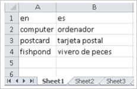

# What is a dictionary?

A dictionary is an aligned pair of documents that specifies a list of phrases or sentences and their translations that you always want Microsoft Translator to translate the same way. Dictionaries are sometimes also called glossaries or term bases. You can think of the dictionary as a brute force “copy and replace” for all the terms you list. Your dictionary should not contain multiple translations of the same word.

Use a phrase dictionary to define proper names and product names exactly the way you want to see them translated. Use sentence dictionaries when you want to translate an entire sentence exactly into the corresponding dictionary entry. In order for your translations to use your sentence dictionary, the sentence must not contain any additional words or clauses that didn't appear in your specified source sentence. You can create a dictionary only training, or include a dictionary with the rest of your training files.

Use of a dictionary has the potential to degrade the quality of your translations. Here are some guidelines and hints:

-   Training documents showing the terms used in context are better than a plain dictionary. Terms used in sentence form teach the system correct inflection and agreement better than a dictionary can. Thus, try to minimize your usage of terms in the dictionary to terms the system doesn't already learn from the training documents. 

-   The dictionary works well for compound nouns like product names (“Microsoft SQL Server”), proper names (“City of Hamburg”), or features of the product (“pivot table”). It doesn’t work equally well for verbs or adjectives because these are typically highly inflected in the source or in the target language. Avoid dictionary entries for anything but compound nouns.

-   When using a dictionary, capitalization and punctuation in your translations will reflect the capitalization and punctuation provided in your target file. Capitalization and punctuation are ignored when trying to identify matches between your input sentence and the source sentences in your dictionary file. For example, let’s say we trained an English to Spanish system that used a dictionary that specified “City of Hamburg” in the source file, and “Ciudad de Hamburg” in the target file. If I requested translation of a sentence that included the phrase “city of Hamburg”, then “city of Hamburg” would match to my dictionary file for the entry “City of Hamburg”, and would map to “Ciudad de Hamburg” in my final translation.

-   If a word appears more than once in a dictionary file, the system will always use the last entry provided (and the casing and punctuation found in the target phrase.

## How to create a dictionary file?

To create a dictionary, follow the steps listed here.

1.  Create an Excel file. Custom Translator supports only
    “.xlsx” files created using Excel 2007 and later. This file contains a
    list of source-language terms and a list of corresponding
    target-language equivalents in the first sheet of the Workbook. Other
    sheets in the workbook will be ignored.

2.  In cell A1 of the first sheet, enter the ISO standard Language IDs for
    the source language (for example “en” or “en-us” for English)

3.  In cell B1 of the first sheet, enter the ISO standard language IDs for
    the target language (for example “es” or “es-es” for Spanish)

4.  Enter the source language terms in Column A, and the equivalent
    translations for these terms in the target Language in Column B. HTML
    tags in the dictionary will be ignored.

The image below shows an Excel file containing a dictionary of terms mapped from
English to Spanish.

## Next steps

- Read about [guidelines on document formats](document-formats-naming-convention.md).