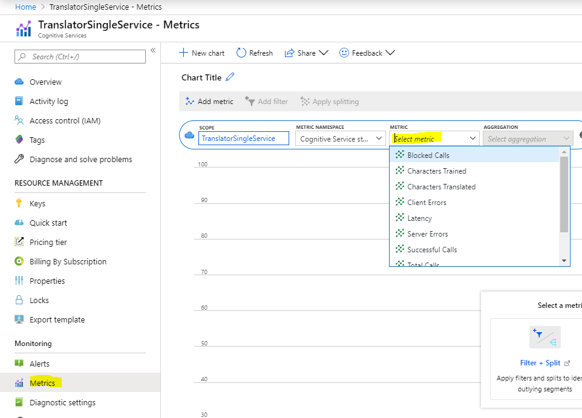

# Translator v3.0

## What's new?

Version 3 of the Translator provides a modern JSON-based Web API. It improves usability and performance by consolidating existing features into fewer operations and it provides new features.

 * Transliteration to convert text in one language from one script to another script.
 * Translation to multiple languages in one request.
 * Language detection, translation, and transliteration in one request.
 * Dictionary to look up alternative translations of a term, to find back-translations and examples showing terms used in context.
 * More informative language detection results.

## Base URLs

Microsoft Translator is served out of multiple datacenter locations. Currently they are located in 10 [Azure geographies](https://azure.microsoft.com/global-infrastructure/regions):

* **Americas:** East US, South Central US, West Central US, and West US 2 
* **Asia Pacific:** Korea South, Japan East, Southeast Asia, and Australia East
* **Europe:** North Europe and West Europe

Requests to the Microsoft Translator are in most cases handled by the datacenter that is closest to where the request originated. In case of a datacenter failure, the request may be routed outside of the Azure geography.

To force the request to be handled by a specific Azure geography, change the Global endpoint in the API request to the desired regional endpoint:

|Description|Azure geography|Base URL|
|:--|:--|:--|
|Azure|Global (non-regional)|	api.cognitive.microsofttranslator.com|
|Azure|United States|	api-nam.cognitive.microsofttranslator.com|
|Azure|Europe|	api-eur.cognitive.microsofttranslator.com|
|Azure|Asia Pacific|	api-apc.cognitive.microsofttranslator.com|

## Authentication

Subscribe to Translator or [Cognitive Services multi-service](https://azure.microsoft.com/pricing/details/cognitive-services/) in Azure Cognitive Services, and use your subscription key (available in the Azure portal) to authenticate. 

There are three headers that you can use to authenticate your subscription. This table describes how each is used:

|Headers|Description|
|:----|:----|
|Ocp-Apim-Subscription-Key|*Use with Cognitive Services subscription if you are passing your secret key*.<br/>The value is the Azure secret key for your subscription to Translator.|
|Authorization|*Use with Cognitive Services subscription if you are passing an authentication token.*<br/>The value is the Bearer token: `Bearer <token>`.|
|Ocp-Apim-Subscription-Region|*Use with Cognitive Services multi-service and regional translator resource.*<br/>The value is the region of the multi-service or regional translator resource. This value is optional when using a global translator resource.|

###  Secret key
The first option is to authenticate using the `Ocp-Apim-Subscription-Key` header. Add the `Ocp-Apim-Subscription-Key: <YOUR_SECRET_KEY>` header to your request.

#### Authenticating with a global resource

When you use a [global translator resource](https://ms.portal.azure.com/#create/Microsoft.CognitiveServicesTextTranslation), you need to include one header to call the Translator.

|Headers|Description|
|:-----|:----|
|Ocp-Apim-Subscription-Key| The value is the Azure secret key for your subscription to Translator.|

Here's an example request to call the Translator using the global translator resource

```curl
// Pass secret key using headers
curl -X POST "https://api.cognitive.microsofttranslator.com/translate?api-version=3.0&to=es" \
     -H "Ocp-Apim-Subscription-Key:<your-key>" \
     -H "Content-Type: application/json" \
     -d "[{'Text':'Hello, what is your name?'}]"
```

#### Authenticating with a regional resource

When you use a [regional translator resource](https://ms.portal.azure.com/#create/Microsoft.CognitiveServicesTextTranslation).
There are 2 headers that you need to call the Translator.

|Headers|Description|
|:-----|:----|
|Ocp-Apim-Subscription-Key| The value is the Azure secret key for your subscription to Translator.|
|Ocp-Apim-Subscription-Region| The value is the region of the translator resource. |

Here's an example request to call the Translator using the regional translator resource

```curl
// Pass secret key and region using headers
curl -X POST "https://api.cognitive.microsofttranslator.com/translate?api-version=3.0&to=es" \
     -H "Ocp-Apim-Subscription-Key:<your-key>" \
     -H "Ocp-Apim-Subscription-Region:<your-region>" \
     -H "Content-Type: application/json" \
     -d "[{'Text':'Hello, what is your name?'}]"
```

#### Authenticating with a Multi-service resource

When you use a Cognitive Service’s multi-service resource. This allows you to use a single secret key to authenticate requests for multiple services. 

When you use a multi-service secret key, you must include two authentication headers with your request. There are 2 headers that you need to call the Translator.

|Headers|Description|
|:-----|:----|
|Ocp-Apim-Subscription-Key| The value is the Azure secret key for your multi-service resource.|
|Ocp-Apim-Subscription-Region| The value is the region of the multi-service resource. |

Region is required for the multi-service Text API subscription. The region you select is the only region that you can use for text translation when using the multi-service subscription key, and must be the same region you selected when you signed up for your multi-service subscription through the Azure portal.

Available regions are `australiaeast`, `brazilsouth`, `canadacentral`, `centralindia`, `centralus`, `centraluseuap`, `eastasia`, `eastus`, `eastus2`, `francecentral`, `japaneast`, `japanwest`, `koreacentral`, `northcentralus`, `northeurope`, `southcentralus`, `southeastasia`, `uksouth`, `westcentralus`, `westeurope`, `westus`, `westus2`, and `southafricanorth`.

If you pass the secret key in the query string with the parameter `Subscription-Key`, then you must specify the region with query parameter `Subscription-Region`.

### Authenticating with an access token
Alternatively, you can exchange your secret key for an access token. This token is included with each request as the `Authorization` header. To obtain an authorization token, make a `POST` request to the following URL:

| Resource type     | Authentication service URL                                |
|-----------------|-----------------------------------------------------------|
| Global          | `https://api.cognitive.microsoft.com/sts/v1.0/issueToken` |
| Regional or Multi-Service | `https://<your-region>.api.cognitive.microsoft.com/sts/v1.0/issueToken` |

Here are example requests to obtain a token given a secret key:

```curl
// Pass secret key using header
curl --header 'Ocp-Apim-Subscription-Key: <your-key>' --data "" 'https://api.cognitive.microsoft.com/sts/v1.0/issueToken'

// Pass secret key using query string parameter
curl --data "" 'https://api.cognitive.microsoft.com/sts/v1.0/issueToken?Subscription-Key=<your-key>'
```

A successful request returns the encoded access token as plain text in the response body. The valid token is passed to the Translator service as a bearer token in the Authorization.

```http
Authorization: Bearer <Base64-access_token>
```

An authentication token is valid for 10 minutes. The token should be reused when making multiple calls to the Translator. However, if your program makes requests to the Translator over an extended period of time, then your program must request a new access token at regular intervals (for example, every 8 minutes).

## Virtual Network support

Translator service is now available with Virtual Network capabilities in limited regions (`WestUS2`, `EastUS`, `SouthCentralUS`, `WestUS`, `CentralUSEUAP`, `global`). To enable Virtual Network, please see [Configuring Azure Cognitive Services Virtual Networks](https://docs.microsoft.com/azure/cognitive-services/cognitive-services-virtual-networks?tabs=portal). 

Once you turn on this capability, you must use the custom endpoint to call the Translator. You cannot use the global translator endpoint ("api.cognitive.microsofttranslator.com") and you cannot authenticate with an access token.

You can find the custom endpoint once you create the [translator resource](https://ms.portal.azure.com/#create/Microsoft.CognitiveServicesTextTranslation).

|Headers|Description|
|:-----|:----|
|Ocp-Apim-Subscription-Key| The value is the Azure secret key for your subscription to Translator.|
|Ocp-Apim-Subscription-Region| The value is the region of the translator resource. This value is optional if the resource is `global`|

Here's an example request to call the Translator using the custom endpoint

```curl
// Pass secret key and region using headers
curl -X POST "https://<your-custom-domain>.cognitiveservices.azure.com/translator/text/v3.0/translate?api-version=3.0&to=es" \
     -H "Ocp-Apim-Subscription-Key:<your-key>" \
     -H "Ocp-Apim-Subscription-Region:<your-region>" \
     -H "Content-Type: application/json" \
     -d "[{'Text':'Hello, what is your name?'}]"
```

## Errors

A standard error response is a JSON object with name/value pair named `error`. The value is also a JSON object with properties:

  * `code`: A server-defined error code.
  * `message`: A string giving a human-readable representation of the error.

For example, a customer with a free trial subscription would receive the following error once the free quota is exhausted:

```json
{
  "error": {
    "code":403001,
    "message":"The operation is not allowed because the subscription has exceeded its free quota."
    }
}
```
The error code is a 6-digit number combining the 3-digit HTTP status code followed by a 3-digit number to further categorize the error. Common error codes are:

| Code | Description |
|:----|:-----|
| 400000| One of the request inputs is not valid.|
| 400001| The "scope" parameter is invalid.|
| 400002| The "category" parameter is invalid.|
| 400003| A language specifier is missing or invalid.|
| 400004| A target script specifier ("To script") is missing or invalid.|
| 400005| An input text is missing or invalid.|
| 400006| The combination of language and script is not valid.|
| 400018| A source script specifier ("From script") is missing or invalid.|
| 400019| One of the specified languages is not supported.|
| 400020| One of the elements in the array of input text is not valid.|
| 400021| The API version parameter is missing or invalid.|
| 400023| One of the specified language pair is not valid.|
| 400035| The source language ("From" field) is not valid.|
| 400036| The target language ("To" field) is missing or invalid.|
| 400042| One of the options specified ("Options" field) is not valid.|
| 400043| The client trace ID (ClientTraceId field or X-ClientTranceId header) is missing or invalid.|
| 400050| The input text is too long. View [request limits](../request-limits.md).|
| 400064| The "translation" parameter is missing or invalid.|
| 400070| The number of target scripts (ToScript parameter) does not match the number of target languages (To parameter).|
| 400071| The value is not valid for TextType.|
| 400072| The array of input text has too many elements.|
| 400073| The script parameter is not valid.|
| 400074| The body of the request is not valid JSON.|
| 400075| The language pair and category combination is not valid.|
| 400077| The maximum request size has been exceeded. View [request limits](../request-limits.md).|
| 400079| The custom system requested for translation between from and to language does not exist.|
| 400080| Transliteration is not supported for the language or script.|
| 401000| The request is not authorized because credentials are missing or invalid.|
| 401015| "The credentials provided are for the Speech API. This request requires credentials for the Text API. Use a subscription to Translator."|
| 403000| The operation is not allowed.|
| 403001| The operation is not allowed because the subscription has exceeded its free quota.|
| 405000| The request method is not supported for the requested resource.|
| 408001| The translation system requested is being prepared. Please retry in a few minutes.|
| 408002| Request timed out waiting on incoming stream. The client did not produce a request within the time that the server was prepared to wait. The client may repeat the request without modifications at any later time.|
| 415000| The Content-Type header is missing or invalid.|
| 429000, 429001, 429002| The server rejected the request because the client has exceeded request limits.|
| 500000| An unexpected error occurred. If the error persists, report it with date/time of error, request identifier from response header X-RequestId, and client identifier from request header X-ClientTraceId.|
| 503000| Service is temporarily unavailable. Please retry. If the error persists, report it with date/time of error, request identifier from response header X-RequestId, and client identifier from request header X-ClientTraceId.|

## Metrics 
Metrics allow you to view the translator usage and availability information in Azure portal, under metrics section as shown in the below screenshot. For more information, see [Data and platform metrics](https://docs.microsoft.com/azure/azure-monitor/platform/data-platform-metrics).



This table lists available metrics with description of how they are used to monitor translation API calls.

| Metrics | Description |
|:----|:-----|
| TotalCalls| Total number of API calls.|
| TotalTokenCalls| Total number of API calls via token service using authentication token.|
| SuccessfulCalls| Number of successful calls.|
| TotalErrors| Number of calls with error response.|
| BlockedCalls| Number of calls that exceeded rate or quota limit.|
| ServerErrors| Number of calls with server internal error(5XX).|
| ClientErrors| Number of calls with client side error(4XX).|
| Latency| Duration to complete request in milliseconds.|
| CharactersTranslated| Total number of characters in incoming text request.|
