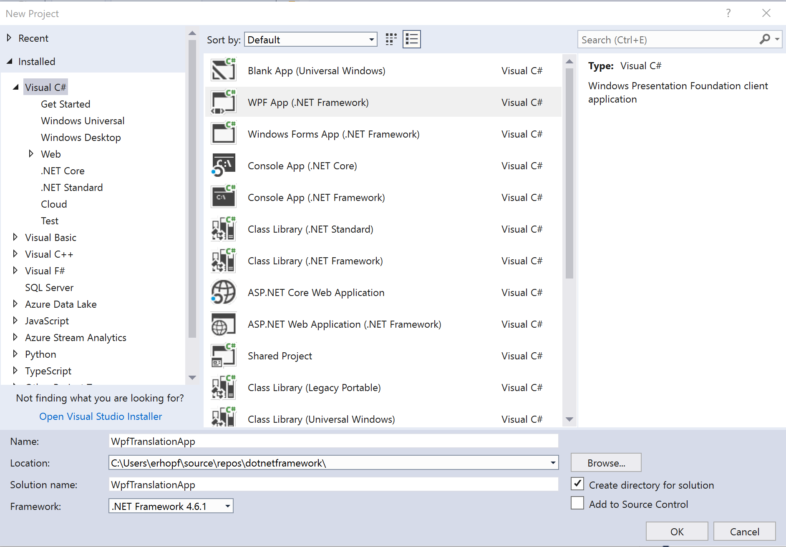
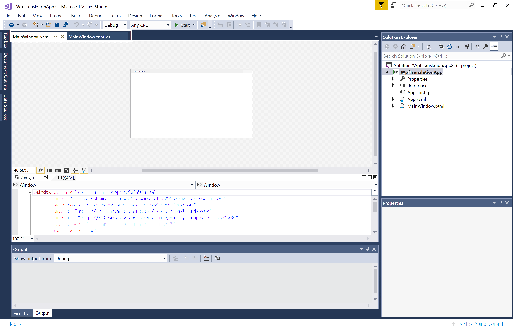
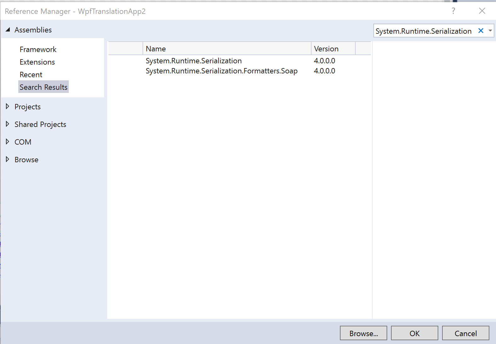
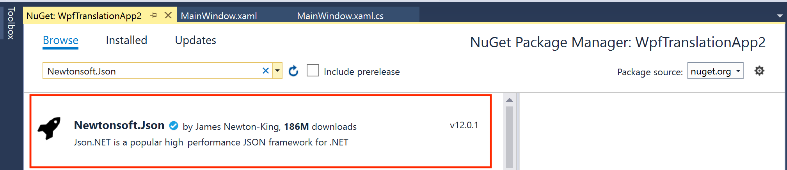
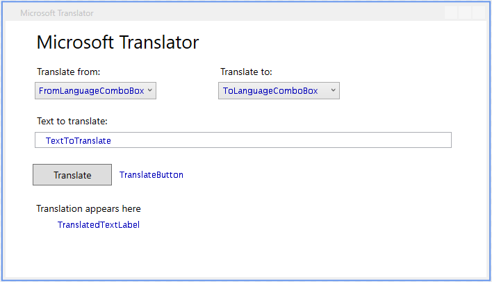

# Tutorial: Create a translation app with WPF

In this tutorial, you'll build a [Windows Presentation Foundation (WPF)](https://docs.microsoft.com/visualstudio/designers/getting-started-with-wpf?view=vs-2017) app that uses Azure Cognitive Services for text translation, language detection, and spell checking with a single subscription key. Specifically, your app will call APIs from Translator Text and [Bing Spell Check](https://azure.microsoft.com/services/cognitive-services/spell-check/).

What is WPF? It's a UI framework that creates desktop client apps. The WPF development platform supports a broad set of app development features, including an app model, resources, controls, graphics, layout, data binding, documents, and security. It's a subset of the .NET Framework, so if you have previously built apps with the .NET Framework using ASP.NET or Windows Forms, the programming experience should be familiar. WPF uses the Extensible app Markup Language (XAML) to provide a declarative model for app programming, which we'll review in the coming sections.

In this tutorial, you'll learn how to:

> [!div class="checklist"]
> * Create a WPF project in Visual Studio
> * Add assemblies and NuGet packages to your project
> * Create your app's UI with XAML
> * Use the Translator Text API to get languages, translate text, and detect the source language
> * Use the Bing Spell Check API to validate your input and improve translation accuracy
> * Run your WPF app

### Cognitive Services used in this tutorial

This list includes the Cognitive Services used in this tutorial. Follow the link to browse the API reference for each feature.

| Service | Feature | Description |
|---------|---------|-------------|
| Translator Text | [Get Languages](https://docs.microsoft.com/azure/cognitive-services/translator/reference/v3-0-languages) | Retrieve a complete list of supported languages for text translation. |
| Translator Text | [Translate](https://docs.microsoft.com/azure/cognitive-services/translator/reference/v3-0-translate) | Translate text into more than 60 languages. |
| Translator Text | [Detect](https://docs.microsoft.com/azure/cognitive-services/translator/reference/v3-0-detect) | Detect the language of the input text. Includes confidence score for detection. |
| Bing Spell Check | [Spell Check](https://docs.microsoft.com/rest/api/cognitiveservices/bing-spell-check-api-v7-reference) | Correct spelling errors to improve translation accuracy. |

## Prerequisites

Before we continue, you'll need the following:

* An Azure Cognitive Services subscription. [Get a Cognitive Services key](https://docs.microsoft.com/azure/cognitive-services/cognitive-services-apis-create-account#multi-service-subscription).
* A Windows machine
* [Visual Studio 2017](https://www.visualstudio.com/downloads/) - Community or Enterprise

> [!NOTE]
> We recommend creating the subscription in the West US region for this tutorial. Otherwise, you'll need to change endpoints and regions in the code as you work through this exercise.  

## Create a WPF app in Visual Studio

The first thing we need to do is set up our project in Visual Studio.

1. Open Visual Studio. Then select **File > New > Project**.
2. In the left panel, locate and select **Visual C#**. Then, select **WPF App (.NET Framework)** in the center panel.
   
3. Name your project `MSTranslatorTextDemo`, set the framework version to **.NET Framework 4.5.2 or later**, then click **OK**.
4. Your project has been created. You'll notice that there are two tabs open: `MainWindow.xaml` and `MainWindow.xaml.cs`. Throughout this tutorial, we'll be adding code to these two files. The first for the app's user interface; the latter for our calls to Translator Text and Bing Spell Check.
   

In the next section we're going to add assemblies and a NuGet package to our project for additional functionality, like JSON parsing.

## Add references and NuGet packages to your project

Our project requires a handful of .NET Framework assemblies and NewtonSoft.Json, which we'll install using the NuGet package manager.

### Add .NET Framework assemblies

Let's add assemblies to our project to serialize and deserialize objects, and to manage HTTP requests and responses.

1. Locate your project in Visual Studio's Solution Explorer (right panel). Right click on your project, then select **Add > Reference...**, which opens **Reference Manager**.
   
2. The assemblies tab lists all .NET Framework assemblies that are available to reference. Use the search bar in the upper right of the screen to search for these references and add them to your project:
   * [System.Runtime.Serialization](https://docs.microsoft.com/dotnet/api/system.runtime.serialization)
   * [System.Web](https://docs.microsoft.com/dotnet/api/system.web)
   * [System.Web.Extensions](https://docs.microsoft.com/dotnet/api/system.web)
   * [System.Windows](https://docs.microsoft.com/dotnet/api/system.windows)
3. After you've added these references to your project, you can click **OK** to close **Reference Manager**.

> [!NOTE]
> If you'd like to learn more about assembly references, see [How to: Add or remove reference using the Reference Manager](https://docs.microsoft.com/visualstudio/ide/how-to-add-or-remove-references-by-using-the-reference-manager?view=vs-2017).

### Install NewtonSoft.Json

Our app will use NewtonSoft.Json to deserialize JSON objects. Follow these instructions to install the package.

1. Locate your project in Visual Studio's Solution Explorer and right click on your project. Select **Manage NuGet Packages...**.
2. Locate and select the **Browse** tab.
3. Type [NewtonSoft.Json](https://www.nuget.org/packages/Newtonsoft.Json/) into the search bar.
   
4. Select the package and click **Install**.
5. When the installation is complete, close the tab.

## Create a WPF form using XAML

To use your app, you're going to need a user interface. Using XAML, we'll create a form that allows users to select input and translation languages, enter text to translate, and displays the translation output.

Let's take a look at what we're building.



The user interfacer includes these components:

| Name | Type | Description |
|------|------|-------------|
| `FromLanguageComboBox` | ComboBox | Displays a list of the languages supported by Microsoft Translator for text translation. The user selects the language they are translating from. |
| `ToLanguageComboBox` | ComboBox | Displays the same list of languages as `FromComboBox`, but is used to select the language the user is translating to. |
| `TextToTranslate` | TextBox | Allows the user to enter text to be translated. |
| `TranslateButton` | Button | Use this button to translate text. |
| `TranslatedTextLabel` | Label | Displays the translation. |
| `DetectedLanguageLabel` | Label | Displays the detected language of the text to be translated (`TextToTranslate`). |

> [!NOTE]
> We're creating this form using the XAML source code, however, you can create the form with the editor in Visual Studio.

Let's add the code to our project.

1. In Visual Studio, select the tab for `MainWindow.xaml`.
2. Copy this code into your project and save.
   ```xaml
   <Window x:Class="MSTranslatorTextDemo.MainWindow"
           xmlns="http://schemas.microsoft.com/winfx/2006/xaml/presentation"
           xmlns:x="http://schemas.microsoft.com/winfx/2006/xaml"
           xmlns:d="http://schemas.microsoft.com/expression/blend/2008"
           xmlns:mc="http://schemas.openxmlformats.org/markup-compatibility/2006"
           xmlns:local="clr-namespace:MSTranslatorTextDemo"
           mc:Ignorable="d"
           Title="Microsoft Translator" Height="400" Width="700" BorderThickness="0">
       <Grid>
           <Label x:Name="label" Content="Microsoft Translator" HorizontalAlignment="Left" Margin="39,6,0,0" VerticalAlignment="Top" Height="49" FontSize="26.667"/>
           <TextBox x:Name="TextToTranslate" HorizontalAlignment="Left" Height="23" Margin="42,160,0,0" TextWrapping="Wrap" VerticalAlignment="Top" Width="600" FontSize="14" TabIndex="3"/>
           <Label x:Name="EnterTextLabel" Content="Text to translate:" HorizontalAlignment="Left" Margin="40,129,0,0" VerticalAlignment="Top" FontSize="14"/>
           <Label x:Name="toLabel" Content="Translate to:" HorizontalAlignment="Left" Margin="304,58,0,0" VerticalAlignment="Top" FontSize="14"/>

           <Button x:Name="TranslateButton" Content="Translate" HorizontalAlignment="Left" Margin="39,206,0,0" VerticalAlignment="Top" Width="114" Height="31" Click="TranslateButton_Click" FontSize="14" TabIndex="4" IsDefault="True"/>
           <ComboBox x:Name="ToLanguageComboBox"
                   HorizontalAlignment="Left"
                   Margin="306,88,0,0"
                   VerticalAlignment="Top"
                   Width="175" FontSize="14" TabIndex="2">

           </ComboBox>
           <Label x:Name="fromLabel" Content="Translate from:" HorizontalAlignment="Left" Margin="40,58,0,0" VerticalAlignment="Top" FontSize="14"/>
           <ComboBox x:Name="FromLanguageComboBox"
               HorizontalAlignment="Left"
               Margin="42,88,0,0"
               VerticalAlignment="Top"
               Width="175" FontSize="14" TabIndex="1"/>
           <Label x:Name="TranslatedTextLabel" Content="Translation is displayed here." HorizontalAlignment="Left" Margin="39,255,0,0" VerticalAlignment="Top" Width="620" FontSize="14" Height="85" BorderThickness="0"/>
           <Label x:Name="DetectedLanguageLabel" Content="Autodetected language is displayed here." HorizontalAlignment="Left" Margin="39,288,0,0" VerticalAlignment="Top" Width="620" FontSize="14" Height="84" BorderThickness="0"/>
       </Grid>
   </Window>
   ```
3. You should now see a preview of the app's user interface in Visual Studio. It should look similar to the image above.

That's it, your form is ready. Now let's write some code to use Text Translation and Bing Spell Check.

> [!NOTE]
> Feel free to tweak this form or create your own.

## Create your app

`MainWindow.xaml.cs` contains the code that controls our app. In the next few sections, we're going to add code to populate our drop-down menus, and to call a handful of API exposed by Translator Text and Bing Spell Check.

* When the program starts and `MainWindow` is instantiated, the `Languages` method of the Translator Text API is called to retrieve and populate our language selection drop-downs. This happens once at the beginning of each session.
* When the **Translate** button is clicked, the user's language selection and text are retrieved, spell check is performed on the input, and the translation and detected language are displayed for the user.
  * The `Translate` method of the Translator Text API is called to translate text from `TextToTranslate`. This call also includes the `to` and `from` languages selected using the drop-down menus.
  * The `Detect` method of the Translator Text API is called to determine the text language of `TextToTranslate`.
  * Bing Spell Check is used to validate `TextToTranslate` and adjust misspellings.

All of our project is encapsulated in the `MainWindow : Window` class. Let's start by adding code to set your subscription key, declare endpoints for Translator Text and Bing Spell Check, and initialize the app.

1. In Visual Studio, select the tab for `MainWindow.xaml.cs`.
2. Replace the pre-populated `using` statements with the following.  
   ```csharp
   using System;
   using System.Windows;
   using System.Net;
   using System.Net.Http;
   using System.IO;
   using System.Collections.Generic;
   using System.Linq;
   using System.Text;
   using Newtonsoft.Json;
   ```
3. Locate the `MainWindow : Window` class, and replace it with this code:
   ```csharp
   {
       // This sample uses the Cognitive Services subscription key for all services. To learn more about
       // authentication options, see: https://docs.microsoft.com/azure/cognitive-services/authentication.
       const string COGNITIVE_SERVICES_KEY = "YOUR_COG_SERVICES_KEY";
       // Endpoints for Translator Text and Bing Spell Check
       public static readonly string TEXT_TRANSLATION_API_ENDPOINT = "https://api.cognitive.microsofttranslator.com/{0}?api-version=3.0";
       const string BING_SPELL_CHECK_API_ENDPOINT = "https://westus.api.cognitive.microsoft.com/bing/v7.0/spellcheck/";
       // An array of language codes
       private string[] languageCodes;

       // Dictionary to map language codes from friendly name (sorted case-insensitively on language name)
       private SortedDictionary<string, string> languageCodesAndTitles =
           new SortedDictionary<string, string>(Comparer<string>.Create((a, b) => string.Compare(a, b, true)));

       // Global exception handler to display error message and exit
       private static void HandleExceptions(object sender, UnhandledExceptionEventArgs args)
       {
           Exception e = (Exception)args.ExceptionObject;
           MessageBox.Show("Caught " + e.Message, "Error", MessageBoxButton.OK, MessageBoxImage.Error);
           System.Windows.Application.Current.Shutdown();
       }
       // MainWindow constructor
       public MainWindow()
       {
           // Display a message if unexpected error is encountered
           AppDomain.CurrentDomain.UnhandledException += new UnhandledExceptionEventHandler(HandleExceptions);

           if (COGNITIVE_SERVICES_KEY.Length != 32)
           {
               MessageBox.Show("One or more invalid API subscription keys.\n\n" +
                   "Put your keys in the *_API_SUBSCRIPTION_KEY variables in MainWindow.xaml.cs.",
                   "Invalid Subscription Key(s)", MessageBoxButton.OK, MessageBoxImage.Error);
               System.Windows.Application.Current.Shutdown();
           }
           else
           {
               // Start GUI
               InitializeComponent();
               // Get languages for drop-downs
               GetLanguagesForTranslate();
               // Populate drop-downs with values from GetLanguagesForTranslate
               PopulateLanguageMenus();
           }
       }
   // NOTE:
   // In the following sections, we'll add code below this.
   }
   ```
   1. Add your Cognitive Services subscription key and save.

In this code block, we've declared two member variables that contain information about available languages for translation:

| Variable | Type | Description |
|----------|------|-------------|
|`languageCodes` | Array of strings |C aches the language codes. The Translator service uses short codes, such as `en` for English, to identify languages. |
|`languageCodesAndTitles` | Sorted dictionary | Maps the "friendly" names in the user interface back to the short codes used in the API. Kept sorted alphabetically without regard for case. |

Then, within the `MainWindow` constructor, we've added error handling with `HandleExceptions`. This ensures that an alert is provided if an exception isn't handled. Then a check is run to confirm the subscription key provided is 32 characters in length. An error is thrown if the key is less than/greater than 32 characters.

If there are keys that are at least the right length, the `InitializeComponent()` call gets the user interface rolling by locating, loading, and instantiating the XAML description of the main app window.

Last, we've added code to call methods to retrieve languages for translation and to populate the drop-down menus for our app's user interface. Don't worry, we'll get to the code behind these calls soon.

## Get supported languages

The Translator Text API currently supports more than 60 languages. Since new language support will be added over time, we recommend calling the Languages resource exposed by Translator Text rather than hardcoding the language list in your app.

In this section, we'll create a `GET` request to the Languages resource, specifying that we want a list of languages available for translation.

> [!NOTE]
> The Languages resource allows you to filter language support with the following query parameters: transliteration, dictionary, and translation. For more information, see [API reference](https://docs.microsoft.com/azure/cognitive-services/translator/reference/v3-0-languages).

Before we go any further, let's take a look at a sample output for a call to the Languages resource:

```json
{
  "translation": {
    "af": {
      "name": "Afrikaans",
      "nativeName": "Afrikaans",
      "dir": "ltr"
    },
    "ar": {
      "name": "Arabic",
      "nativeName": "العربية",
      "dir": "rtl"
    }
    // Additional languages are provided in the full JSON output.
}
```

From this output, we can extract the language code and the `name` of a specific language. Our app uses NewtonSoft.Json to deserialize the JSON object ([`JsonConvert.DeserializeObject`](https://www.newtonsoft.com/json/help/html/M_Newtonsoft_Json_JsonConvert_DeserializeObject__1.htm)).

Picking up where we left off in the last section, let's add a method to get supported languages to our app.

1. In Visual Studio, open the tab for `MainWindow.xaml.cs`.
2. Add this code to your project:
   ```csharp
   // ***** GET TRANSLATABLE LANGUAGE CODES
   private void GetLanguagesForTranslate()
   {
       // Send request to get supported language codes
       string uri = String.Format(TEXT_TRANSLATION_API_ENDPOINT, "languages") + "&scope=translation";
       WebRequest WebRequest = WebRequest.Create(uri);
       WebRequest.Headers.Add("Accept-Language", "en");
       WebResponse response = null;
       // Read and parse the JSON response
       response = WebRequest.GetResponse();
       using (var reader = new StreamReader(response.GetResponseStream(), UnicodeEncoding.UTF8))
       {
           var result = JsonConvert.DeserializeObject<Dictionary<string, Dictionary<string, Dictionary<string, string>>>>(reader.ReadToEnd());
           var languages = result["translation"];

           languageCodes = languages.Keys.ToArray();
           foreach (var kv in languages)
           {
               languageCodesAndTitles.Add(kv.Value["name"], kv.Key);
           }
       }
   }
   // NOTE:
   // In the following sections, we'll add code below this.
   ```

The `GetLanguagesForTranslate()` method creates an HTTP GET request, and uses the `scope=translation` query string parameter is used to limit the scope of the request to supported languages for translation. The `Accept-Language` header with the value `en` is added so that the supported languages are returned in English.

The JSON response is parsed and converted to a dictionary. Then the language codes are added to the `languageCodes` member variable. The key/value pairs that contain the language codes and the friendly language names are looped through and added to the `languageCodesAndTitles` member variable. The drop-down menus in the form display the friendly names, but the codes are needed to request the translation.

## Populate language drop-down menus

The user interface is defined using XAML, so you don't need to do much to set it up besides call `InitializeComponent()`. The one thing you need to do is add the friendly language names to the **Translate from** and **Translate to** drop-down menus, this is done with the `PopulateLanguageMenus()` method.

1. In Visual Studio, open the tab for `MainWindow.xaml.cs`.
2. Add this code to your project below the `GetLanguagesForTranslate()` method:
   ```csharp
   private void PopulateLanguageMenus()
   {
       // Add option to automatically detect the source language
       FromLanguageComboBox.Items.Add("Detect");

       int count = languageCodesAndTitles.Count;
       foreach (string menuItem in languageCodesAndTitles.Keys)
       {
           FromLanguageComboBox.Items.Add(menuItem);
           ToLanguageComboBox.Items.Add(menuItem);
       }

       // Set default languages
       FromLanguageComboBox.SelectedItem = "Detect";
       ToLanguageComboBox.SelectedItem = "English";
   }
   // NOTE:
   // In the following sections, we'll add code below this.
   ```

This method iterates over the `languageCodesAndTitles` dictionary and adds each key to both menus. After the menus are populated, the default from and to languages are set to **Detect** and **English** respectively.

> [!TIP]
> Without a default selection for the menus, the user can click **Translate** without first choosing a "to" or "from" language. The defaults eliminate the need to deal with this problem.

Now that `MainWindow` has been initialized and the user interface created, this code won't run until the **Translate**  button is clicked.

## Detect language of source text

Now we're going to create method to detect the language of the source text (text entered into our text area) using the Translator Text API. The value returned by this request will be used in our translation request later.

1. In Visual Studio, open the tab for `MainWindow.xaml.cs`.
2. Add this code to your project below the `PopulateLanguageMenus()` method:
   ```csharp
   // ***** DETECT LANGUAGE OF TEXT TO BE TRANSLATED
   private string DetectLanguage(string text)
   {
       string detectUri = string.Format(TEXT_TRANSLATION_API_ENDPOINT ,"detect");

       // Create request to Detect languages with Translator Text
       HttpWebRequest detectLanguageWebRequest = (HttpWebRequest)WebRequest.Create(detectUri);
       detectLanguageWebRequest.Headers.Add("Ocp-Apim-Subscription-Key", COGNITIVE_SERVICES_KEY);
       detectLanguageWebRequest.Headers.Add("Ocp-Apim-Subscription-Region", "westus");
       detectLanguageWebRequest.ContentType = "application/json; charset=utf-8";
       detectLanguageWebRequest.Method = "POST";

       // Send request
       var serializer = new System.Web.Script.Serialization.JavaScriptSerializer();
       string jsonText = serializer.Serialize(text);

       string body = "[{ \"Text\": " + jsonText + " }]";
       byte[] data = Encoding.UTF8.GetBytes(body);

       detectLanguageWebRequest.ContentLength = data.Length;

       using (var requestStream = detectLanguageWebRequest.GetRequestStream())
           requestStream.Write(data, 0, data.Length);

       HttpWebResponse response = (HttpWebResponse)detectLanguageWebRequest.GetResponse();

       // Read and parse JSON response
       var responseStream = response.GetResponseStream();
       var jsonString = new StreamReader(responseStream, Encoding.GetEncoding("utf-8")).ReadToEnd();
       dynamic jsonResponse = serializer.DeserializeObject(jsonString);

       // Fish out the detected language code
       var languageInfo = jsonResponse[0];
       if (languageInfo["score"] > (decimal)0.5)
       {
           DetectedLanguageLabel.Content = languageInfo["language"];
           return languageInfo["language"];
       }
       else
           return "Unable to confidently detect input language.";
   }
   // NOTE:
   // In the following sections, we'll add code below this.
   ```

This method creates an HTTP `POST` request to the Detect resource. It takes a single argument, `text`, which is passed along as the body of the request. Later, we when we create our translation request, the text entered into our UI will be passed to this method for language detection.

Additionally, this method evaluates the confidence score of the response. If the score is greater than `0.5`, then the detected language is displayed in our user interface.

## Spell check the source text

Now we're going to create a method to spell check our source text using the Bing Spell Check API. This ensures that we'll get back accurate translations from Translator Text API. Any corrections to the source text are passed along in our translation request when the **Translate** button is clicked.

1. In Visual Studio, open the tab for `MainWindow.xaml.cs`.
2. Add this code to your project below the `DetectLanguage()` method:

```csharp
// ***** CORRECT SPELLING OF TEXT TO BE TRANSLATED
private string CorrectSpelling(string text)
{
    string uri = BING_SPELL_CHECK_API_ENDPOINT + "?mode=spell&mkt=en-US";

    // Create a request to Bing Spell Check API
    HttpWebRequest spellCheckWebRequest = (HttpWebRequest)WebRequest.Create(uri);
    spellCheckWebRequest.Headers.Add("Ocp-Apim-Subscription-Key", COGNITIVE_SERVICES_KEY);
    spellCheckWebRequest.Method = "POST";
    spellCheckWebRequest.ContentType = "application/x-www-form-urlencoded"; // doesn't work without this

    // Create and send the request
    string body = "text=" + System.Web.HttpUtility.UrlEncode(text);
    byte[] data = Encoding.UTF8.GetBytes(body);
    spellCheckWebRequest.ContentLength = data.Length;
    using (var requestStream = spellCheckWebRequest.GetRequestStream())
        requestStream.Write(data, 0, data.Length);
    HttpWebResponse response = (HttpWebResponse)spellCheckWebRequest.GetResponse();

    // Read and parse the JSON response; get spelling corrections
    var serializer = new System.Web.Script.Serialization.JavaScriptSerializer();
    var responseStream = response.GetResponseStream();
    var jsonString = new StreamReader(responseStream, Encoding.GetEncoding("utf-8")).ReadToEnd();
    dynamic jsonResponse = serializer.DeserializeObject(jsonString);
    var flaggedTokens = jsonResponse["flaggedTokens"];

    // Construct sorted dictionary of corrections in reverse order (right to left)
    // This ensures that changes don't impact later indexes
    var corrections = new SortedDictionary<int, string[]>(Comparer<int>.Create((a, b) => b.CompareTo(a)));
    for (int i = 0; i < flaggedTokens.Length; i++)
    {
        var correction = flaggedTokens[i];
        var suggestion = correction["suggestions"][0];  // Consider only first suggestion
        if (suggestion["score"] > (decimal)0.7)         // Take it only if highly confident
            corrections[(int)correction["offset"]] = new string[]   // dict key   = offset
                { correction["token"], suggestion["suggestion"] };  // dict value = {error, correction}
    }

    // Apply spelling corrections, in order, from right to left
    foreach (int i in corrections.Keys)
    {
        var oldtext = corrections[i][0];
        var newtext = corrections[i][1];

        // Apply capitalization from original text to correction - all caps or initial caps
        if (text.Substring(i, oldtext.Length).All(char.IsUpper)) newtext = newtext.ToUpper();
        else if (char.IsUpper(text[i])) newtext = newtext[0].ToString().ToUpper() + newtext.Substring(1);

        text = text.Substring(0, i) + newtext + text.Substring(i + oldtext.Length);
    }
    return text;
}
// NOTE:
// In the following sections, we'll add code below this.
```

## Translate text on click

The last thing that we need to do is create a method that is invoked when the **Translate** button in our user interface is clicked.

1. In Visual Studio, open the tab for `MainWindow.xaml.cs`.
2. Add this code to your project below the `CorrectSpelling()` method and save:  
   ```csharp
   // ***** PERFORM TRANSLATION ON BUTTON CLICK
   private async void TranslateButton_Click(object sender, EventArgs e)
   {
       string textToTranslate = TextToTranslate.Text.Trim();

       string fromLanguage = FromLanguageComboBox.SelectedValue.ToString();
       string fromLanguageCode;

       // auto-detect source language if requested
       if (fromLanguage == "Detect")
       {
           fromLanguageCode = DetectLanguage(textToTranslate);
           if (!languageCodes.Contains(fromLanguageCode))
           {
               MessageBox.Show("The source language could not be detected automatically " +
                   "or is not supported for translation.", "Language detection failed",
                   MessageBoxButton.OK, MessageBoxImage.Error);
               return;
           }
       }
       else
           fromLanguageCode = languageCodesAndTitles[fromLanguage];

       string toLanguageCode = languageCodesAndTitles[ToLanguageComboBox.SelectedValue.ToString()];

       // spell-check the source text if the source language is English
       if (fromLanguageCode == "en")
       {
           if (textToTranslate.StartsWith("-"))    // don't spell check in this case
               textToTranslate = textToTranslate.Substring(1);
           else
           {
               textToTranslate = CorrectSpelling(textToTranslate);
               TextToTranslate.Text = textToTranslate;     // put corrected text into input field
           }
       }
       // handle null operations: no text or same source/target languages
       if (textToTranslate == "" || fromLanguageCode == toLanguageCode)
       {
           TranslatedTextLabel.Content = textToTranslate;
           return;
       }

       // send HTTP request to perform the translation
       string endpoint = string.Format(TEXT_TRANSLATION_API_ENDPOINT, "translate");
       string uri = string.Format(endpoint + "&from={0}&to={1}", fromLanguageCode, toLanguageCode);

       System.Object[] body = new System.Object[] { new { Text = textToTranslate } };
       var requestBody = JsonConvert.SerializeObject(body);

       using (var client = new HttpClient())
       using (var request = new HttpRequestMessage())
       {
           request.Method = HttpMethod.Post;
           request.RequestUri = new Uri(uri);
           request.Content = new StringContent(requestBody, Encoding.UTF8, "app/json");
           request.Headers.Add("Ocp-Apim-Subscription-Key", COGNITIVE_SERVICES_KEY);
           request.Headers.Add("Ocp-Apim-Subscription-Region", "westus");
           request.Headers.Add("X-ClientTraceId", Guid.NewGuid().ToString());

           var response = await client.SendAsync(request);
           var responseBody = await response.Content.ReadAsStringAsync();

           var result = JsonConvert.DeserializeObject<List<Dictionary<string, List<Dictionary<string, string>>>>>(responseBody);
           var translation = result[0]["translations"][0]["text"];

           // Update the translation field
           TranslatedTextLabel.Content = translation;
       }
   }
   ```

The first step is to get the "from" and "to" languages, and the text the user entered into our form. If the source language is set to **Detect**, `DetectLanguage()` is called to determine the language of the source text. The text might be in a language that the Translator API doesn't support. In that case, display a message to inform the user, and return without translating the text.

If the source language is English (whether specified or detected), check the spelling of the text with `CorrectSpelling()` and apply any corrections. The corrected text is added back into the text area so that the user sees that a correction was made.

The code to translate text should look familiar: build the URI, create a request, send it, and parse the response. The JSON array may contain more than one object for translation, however, our app only requires one.

After a successful request, `TranslatedTextLabel.Content` is replaced with the `translation`, which updates the user interface to display the translated text.

## Run your WPF app

That's it, you have a working translation app built using WPF. To run your app, click the **Start** button in Visual Studio.

## Source code

Source code for this project is available on GitHub.

* [Explore source code](https://github.com/MicrosoftTranslator/Text-Translation-API-V3-C-Sharp-Tutorial)

## Next steps

> [!div class="nextstepaction"]
> [Microsoft Translator Text API reference](https://docs.microsoft.com/azure/cognitive-services/Translator/reference/v3-0-reference)
