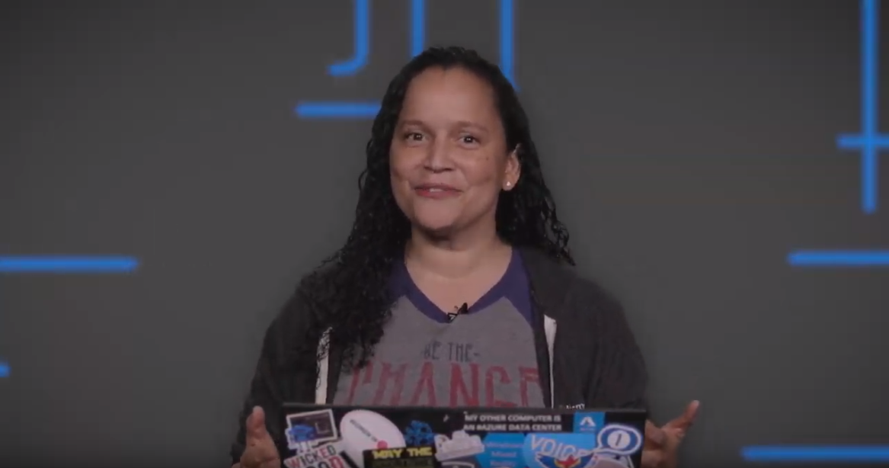

# Authenticate requests to Azure Cognitive Services

Each request to an Azure Cognitive Service must include an authentication header. This header passes along a subscription key or access token, which is used to validate your subscription for a service or group of services. In this article, you'll learn about three ways to authenticate a request and the requirements for each.

* [Authenticate with a single-service subscription key](#authenticate-with-a-single-service-subscription-key)
* [Authenticate with a multi-service subscription key](#authenticate-with-a-multi-service-subscription-key)
* [Authenticate with a token](#authenticate-with-an-authentication-token)

## Prerequisites

Before you make a request, you need an Azure account and an Azure Cognitive Services subscription. If you already have an account, go ahead and skip to the next section. If you don't have an account, we have a guide to get you set up in minutes: [Create a Cognitive Services account for Azure](cognitive-services-apis-create-account.md).

You can get your subscription key from the [Azure portal](cognitive-services-apis-create-account.md#get-the-keys-for-your-subscription) after creating your account, or activating a [free trial](https://azure.microsoft.com/try/cognitive-services/my-apis).

## Authentication headers

Let's quickly review the authentication headers available for use with Azure Cognitive Services.

| Header | Description |
|--------|-------------|
| Ocp-Apim-Subscription-Key | Use this header to authenticate with a subscription key for a specific service or a multi-service subscription key. |
| Ocp-Apim-Subscription-Region | This header is only required when using a multi-service subscription key with the [Translator Text API](./Translator/reference/v3-0-reference.md). Use this header to specify the subscription region. |
| Authorization | Use this header if you are using an authentication token. The steps to perform a token exchange are detailed in the following sections. The value provided follows this format: `Bearer <TOKEN>`. |

## Authenticate with a single-service subscription key

The first option is to authenticate a request with a subscription key for a specific service, like Translator Text. The keys are available in the Azure portal for each resource that you've created. To use a subscription key to authenticate a request, it must be passed along as the `Ocp-Apim-Subscription-Key` header.

These sample requests demonstrates how to use the `Ocp-Apim-Subscription-Key` header. Keep in mind, when using this sample you'll need to include a valid subscription key.

This is a sample call to the Bing Web Search API:
```cURL
curl -X GET 'https://api.cognitive.microsoft.com/bing/v7.0/search?q=Welsch%20Pembroke%20Corgis' \
-H 'Ocp-Apim-Subscription-Key: YOUR_SUBSCRIPTION_KEY' | json_pp
```

This is a sample call to the Translator Text API:
```cURL
curl -X POST 'https://api.cognitive.microsofttranslator.com/translate?api-version=3.0&from=en&to=de' \
-H 'Ocp-Apim-Subscription-Key: YOUR_SUBSCRIPTION_KEY' \
-H 'Content-Type: application/json' \
--data-raw '[{ "text": "How much for the cup of coffee?" }]' | json_pp
```

The following video demonstrates using a Cognitive Services key.

## Authenticate with a multi-service subscription key

>[!WARNING]
> At this time, these services **don't** support multi-service keys: QnA Maker, Speech Services, and Custom Vision.

This option also uses a subscription key to authenticate requests. The main difference is that a subscription key is not tied to a specific service, rather, a single key can be used to authenticate requests for multiple Cognitive Services. See [Cognitive Services pricing](https://azure.microsoft.com/pricing/details/cognitive-services/) for information about regional availability, supported features, and pricing.

The subscription key is provided in each request as the `Ocp-Apim-Subscription-Key` header.

[](https://www.youtube.com/watch?v=psHtA1p7Cas&feature=youtu.be)

### Supported regions

When using the multi-service subscription key to make a request to `api.cognitive.microsoft.com`, you must include the region in the URL. For example: `westus.api.cognitive.microsoft.com`.

When using multi-service subscription key with the Translator Text API, you must specify the subscription region with the `Ocp-Apim-Subscription-Region` header.

Multi-service authentication is supported in these regions:

| | | |
|-|-|-|
| `australiaeast` | `brazilsouth` | `canadacentral` |
| `centralindia` | `eastasia` | `eastus` |
| `japaneast` | `northeurope` | `southcentralus` |
| `southeastasia` | `uksouth` | `westcentralus` |
| `westeurope` | `westus` | `westus2` |


### Sample requests

This is a sample call to the Bing Web Search API:

```cURL
curl -X GET 'https://YOUR-REGION.api.cognitive.microsoft.com/bing/v7.0/search?q=Welsch%20Pembroke%20Corgis' \
-H 'Ocp-Apim-Subscription-Key: YOUR_SUBSCRIPTION_KEY' | json_pp
```

This is a sample call to the Translator Text API:

```cURL
curl -X POST 'https://api.cognitive.microsofttranslator.com/translate?api-version=3.0&from=en&to=de' \
-H 'Ocp-Apim-Subscription-Key: YOUR_SUBSCRIPTION_KEY' \
-H 'Ocp-Apim-Subscription-Region: YOUR_SUBSCRIPTION_REGION' \
-H 'Content-Type: application/json' \
--data-raw '[{ "text": "How much for the cup of coffee?" }]' | json_pp
```

## Authenticate with an authentication token

Some Azure Cognitive Services accept, and in some cases require, an authentication token. Currently, these services support authentication tokens:

* Text Translation API
* Speech Services: Speech-to-text REST API
* Speech Services: Text-to-speech REST API

>[!NOTE]
> QnA Maker also uses the Authorization header, but requires an endpoint key. For more information, see [QnA Maker: Get answer from knowledge base](./qnamaker/quickstarts/get-answer-from-kb-using-curl.md).

>[!WARNING]
> The services that support authentication tokens may change over time, please check the API reference for a service before using this authentication method.

Both single service and multi-service subscription keys can be exchanged for authentication tokens. Authentication tokens are valid for 10 minutes.

Authentication tokens are included in a request as the `Authorization` header. The token value provided must be preceded by `Bearer`, for example: `Bearer YOUR_AUTH_TOKEN`.

### Sample requests

Use this URL to exchange a subscription key for an authentication token: `https://YOUR-REGION.api.cognitive.microsoft.com/sts/v1.0/issueToken`.

```cURL
curl -v -X POST \
"https://YOUR-REGION.api.cognitive.microsoft.com/sts/v1.0/issueToken" \
-H "Content-type: application/x-www-form-urlencoded" \
-H "Content-length: 0" \
-H "Ocp-Apim-Subscription-Key: YOUR_SUBSCRIPTION_KEY"
```

These multi-service regions support token exchange:

| | | |
|-|-|-|
| `australiaeast` | `brazilsouth` | `canadacentral` |
| `centralindia` | `eastasia` | `eastus` |
| `japaneast` | `northeurope` | `southcentralus` |
| `southeastasia` | `uksouth` | `westcentralus` |
| `westeurope` | `westus` | `westus2` |

After you get an authentication token, you'll need to pass it in each request as the `Authorization` header. This is a sample call to the Translator Text API:

```cURL
curl -X POST 'https://api.cognitive.microsofttranslator.com/translate?api-version=3.0&from=en&to=de' \
-H 'Authorization: Bearer YOUR_AUTH_TOKEN' \
-H 'Content-Type: application/json' \
--data-raw '[{ "text": "How much for the cup of coffee?" }]' | json_pp
```

## See also

* [What is Cognitive Services?](welcome.md)
* [Cognitive Services pricing](https://azure.microsoft.com/pricing/details/cognitive-services/)
* [Create an account](cognitive-services-apis-create-account.md)
