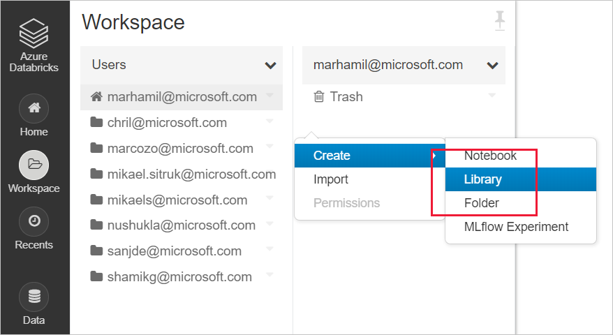
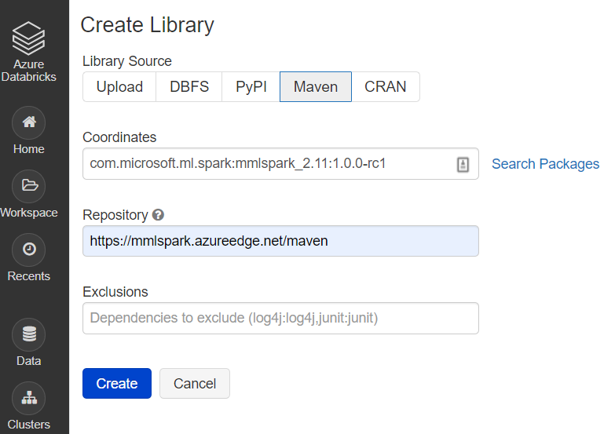
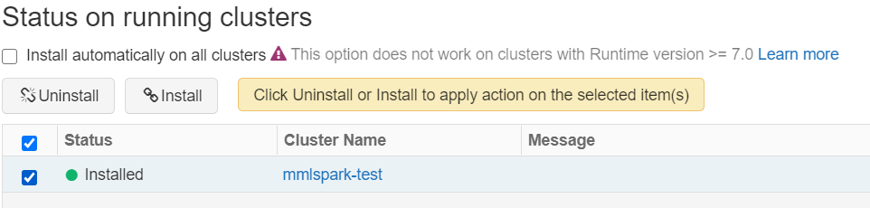

# Getting started 

Setting up your environment is the first step to building a pipeline for your data. It is best to start choosing and installing the services first, then connect them all to Spark. After your environment is ready, running a sample is quick and easy. 

In this document we will walk through the following steps to get started:
1. Create a Cognitive Services resource
1. Create an Apache Spark Cluster
1. Try a sample

## Step 1: Create a Cognitive Services resource

To use the big data cognitive services we must first create a cognitive service to use in our workflow. There are two main trypes of cognitive service: cloud services hosted in Azure and containerized services managed by users. We suggest to begin with the simpler cloud-based cognitive services.

### Cloud services

Cloud-based cognitive services are ready-to-use intelligent algorithims hosted in Azure. Any device with an internet connection can leverage these services. One can [create a cognitive service resource through the Azure CLI](https://docs.microsoft.com/en-us/azure/cognitive-services/cognitive-services-apis-create-account-cli?tabs=windows), or one can [create a service in the Azure portal](https://docs.microsoft.com/en-us/azure/cognitive-services/cognitive-services-apis-create-account?tabs=multiservice%2Cwindows). 

### Containerized services (optional)

If your application or workload uses very large datasets, requires private networking, or cannot contact the cloud, communicating with cloud services might be impossible. In this situation. containerized cognitive services provide the following benefits:

* **Low Connectivity**: One can deploy containerized cognitive services in any computing environment, both on-cloud and off. If your application cannot contact the cloud consider deploying containerized cognitive services on your application.

* **Low Latency**: Because containerized services do not require the round-trip communication to and from the cloud, responses are returned with much lower latencies.

* **Privacy and Data Security**: One can deploy containerized services into private networks, so that sensitive data does not leave the network.

* **High Scalability**: Containerized services do not have "rate limits" and run on user-managed computers. This allows one to scale cognitive services limitlessly to handle much larger workloads.

Follow [this guide](https://docs.microsoft.com/en-us/azure/cognitive-services/cognitive-services-container-support?tabs=luis) to create a containerized cogntive service.

## Step 2: Create an Apache Spark cluster

[Apache Spark™](http://spark.apache.org/) is a distributed computing framework designed for big-data data processing. Users can work with Apache Spark in a variety of places in azure such as Azure Databricks, Azure Synapse Analytics, HD Insight, and Azure Kubernetes Services. To use the Big Data Cognitive Services we must first create a cluster. If you already have a spark cluster please feel free to move to trying an example.

### Azure Databricks

Azure databricks is an Apache Spark-based analytics platform with one-click setup, streamlined workflows, and an interactive workspace for collaboration between data scientists, engineers, and business analysts.

To use the Big Data cognitive services on Azure Databricks follow the following steps:

1. [Create an Azure Databricks workspace](https://docs.microsoft.com/en-us/azure/azure-databricks/quickstart-create-databricks-workspace-portal#create-an-azure-databricks-workspace)

1. [Create a Spark cluster in Databricks](https://docs.microsoft.com/en-us/azure/azure-databricks/quickstart-create-databricks-workspace-portal#create-a-spark-cluster-in-databricks)

1. Install the Big Data Cognitive Services
    * Create a new library in your databricks workspace

       

    * Input the following maven coordinates
      
      Coordinates:  `com.microsoft.ml.spark:mmlspark_2.11:1.0.0-rc1`

      Repository: `https://mmlspark.azureedge.net/maven`
      
      

    * Install the library onto a cluster
      
      


### Synapse Analytics

Alternatively, you can use Synapse Analytics to create a spark cluster. Azure Synapse Analytics brings together enterprise data warehousing and big data analytics. It gives you the freedom to query data on your terms, using either serverless on-demand or provisioned resources at scale.

To get started using synapse analytics follow the following steps 

1. [Create a Synapse Workspace (preview)](https://docs.microsoft.com/en-us/azure/synapse-analytics/quickstart-create-workspace).

1. [Create a new Apache Spark pool (preview) using the Azure portal](https://docs.microsoft.com/en-us/azure/synapse-analytics/quickstart-create-apache-spark-pool-portal).

In Synapse Analytics the Big Data Cognitive services are already installed by default. 

### Azure Kubernetes Service

If you are using containerized cognitive services, one popular option for deploying Spark alongside containers is Azure Kubernetes Service. 

To get started on Azure Kubernetes Service:
1. [Deploy an Azure Kubernetes Service (AKS) cluster using the Azure portal](https://docs.microsoft.com/en-us/azure/aks/kubernetes-walkthrough-portal)
1. [Install the Apache Spark 2.4.0 helm chart](https://hub.helm.sh/charts/microsoft/spark)
1. [Install a cognitive service container using Helm](https://docs.microsoft.com/en-us/azure/cognitive-services/computer-vision/deploy-computer-vision-on-premises)

## Step 3: Try a sample

Now that our environment is set up and we are running code on a Spark cluster we can run a simple example in Python. This section demonstrates how to use the Big Data Cognitive Services in Azure Databricks.

Firstly, we can create a notebook in Azure Dtabricks. For other Spark cluster providers please use their notebooks or Spark Submit. 

1. Create a new Databricks notebook, by choosing **New notebook** from the **Azure Databricks** menu.

    

1. In the **Create Notebook** dialog box, enter a name, select **Python** as the language, and select the Spark cluster that you created earlier.
   
    

    Select **Create**.
1. Copy/paste the code snippet below into your new notebook.
```python
from mmlspark.cognitive import *
from pyspark.sql.functions import col

# Add your subscription key from Text Analytics (or a general Cognitive Service key)
service_key = "ADD-SUBSCRIPTION-KEY-HERE"

df = spark.createDataFrame([
  ("I am so happy today, its sunny!", "en-US"),
  ("I am frustrated by this rush hour traffic", "en-US"),
  ("The cognitive services on spark aint bad", "en-US"),
], ["text", "language"])

sentiment = (TextSentiment()
    .setTextCol("text")
    .setLocation("eastus")
    .setSubscriptionKey(service_key)
    .setOutputCol("sentiment")
    .setErrorCol("error")
    .setLanguageCol("language"))

results = sentiment.transform(df)

# Show the results in a table
display(results.select("text", col("sentiment")[0].getItem("score").alias("sentiment")))

```

1. Retrieve your subscription key from the **Keys and Endpoint** menu option from your Text Analytics dashboard in the Azure portal.
1. Replace the subscription key placeholder in your Databricks notebook code with your subscription key.
1. Select the play triangle symbol in the upper right of your notebook cell to run the sample or select **Run All** at the top of your notebook, and the answers will display below the cell in a table.

### Expected results

| text                                      |   sentiment |
|:------------------------------------------|------------:|
| I am so happy today, its sunny!           |   0.978959  |
| I am frustrated by this rush hour traffic |   0.0237956 |
| The cognitive services on spark aint bad  |   0.888896  |

## Next steps

- [Simple Python Examples](samples-python.md)
- [Simple Scala Examples](samples-scala.md)
- [Recipe: Predictive Maintenance](recipes/anamoly-detection.md)
- [Recipe: Intelligent Art Exploration](recipes/art-explorer.md)


