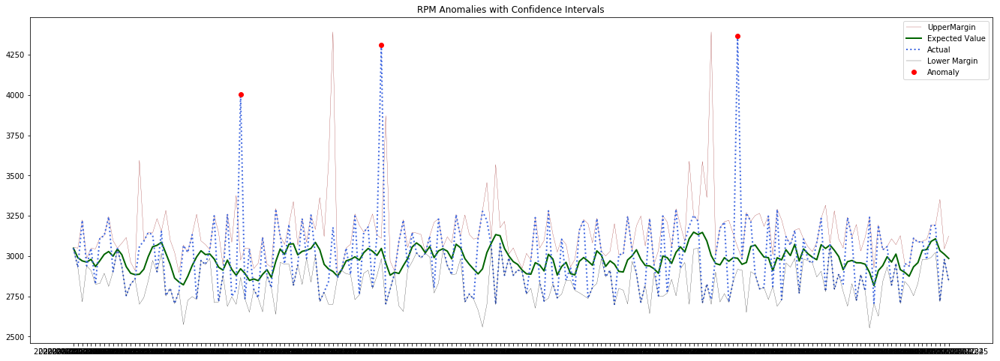

# Recipe: Predictive maintenance with the Cognitive Services for Big Data

This recipe shows how you can use Azure Synapse Analytics and Cognitive Services on Apache Spark for predictive maintenance of IoT devices. We'll follow along with the [CosmosDB and Synapse Link](https://github.com/Azure-Samples/cosmosdb-synapse-link-samples) sample. To keep things simple, in this recipe we'll read the data straight from a CSV file rather than getting streamed data through CosmosDB and Synapse Link. We strongly encourage you to look over the Synapse Link sample.

## Hypothetical scenario

The hypothetical scenario is a Power Plant, where IoT devices are monitoring [steam turbines](https://en.wikipedia.org/wiki/Steam_turbine). The IoTSignals collection has Revolutions per minute (RPM) and Megawatts (MW) data for each turbine. Signals from steam turbines are being analyzed and anomalous signals are detected.

There could be outliers in the data in random frequency. In those situations, RPM values will go up and MW output will go down, for circuit protection. The idea is to see the data varying at the same time, but with different signals.

## Prerequisites

* An Azure subscription - [Create one for free](https://azure.microsoft.com/free/cognitive-services)
* [Azure Synapse workspace](../../../synapse-analytics/quickstart-create-workspace.md) configured with a [serverless Apache Spark pool](../../../synapse-analytics/quickstart-create-apache-spark-pool-portal.md)

## Setup

### Create an Anomaly Detector resource

Azure Cognitive Services are represented by Azure resources that you subscribe to. Create a resource for Translator using the [Azure portal](../../cognitive-services-apis-create-account.md) or [Azure CLI](../../cognitive-services-apis-create-account-cli.md). You can also:

- View an existing resource in the  [Azure portal](https://portal.azure.com/).

Make note of the endpoint and the key for this resource, you'll need it in this guide.

## Enter your service keys

Let's start by adding your key and location.

```python
service_key = None # Paste your anomaly detector key here
location = None # Paste your anomaly detector location here

assert (service_key is not None)
assert (location is not None)
```

## Read data into a DataFrame

Next, let's read the IoTSignals file into a DataFrame. Open a new notebook in your Synapse workspace and create a DataFrame from the file.

```python
df_signals = spark.read.csv("wasbs://publicwasb@mmlspark.blob.core.windows.net/iot/IoTSignals.csv", header=True, inferSchema=True)
```

### Run anomaly detection using Cognitive Services on Spark

The goal is to find instances where the signals from the IoT devices were outputting anomalous values so that we can see when something is going wrong and do predictive maintenance. To do that, let's use Anomaly Detector on Spark:

```python
from pyspark.sql.functions import col, struct
from mmlspark.cognitive import SimpleDetectAnomalies
from mmlspark.core.spark import FluentAPI

detector = (SimpleDetectAnomalies()
    .setSubscriptionKey(service_key)
    .setLocation(location)
    .setOutputCol("anomalies")
    .setGroupbyCol("grouping")
    .setSensitivity(95)
    .setGranularity("secondly"))

df_anomaly = (df_signals
    .where(col("unitSymbol") == 'RPM')
    .withColumn("timestamp", col("dateTime").cast("string"))
    .withColumn("value", col("measureValue").cast("double"))
    .withColumn("grouping", struct("deviceId"))
    .mlTransform(detector)).cache()

df_anomaly.createOrReplaceTempView('df_anomaly')
```

Let's take a look at the data:

```python
df_anomaly.select("timestamp","value","deviceId","anomalies.isAnomaly").show(3)
```

This cell should yield a result that looks like:

| timestamp           |   value | deviceId   | isAnomaly   |
|:--------------------|--------:|:-----------|:------------|
| 2020-05-01 18:33:51 |    3174 | dev-7      | False       |
| 2020-05-01 18:33:52 |    2976 | dev-7      | False       |
| 2020-05-01 18:33:53 |    2714 | dev-7      | False       |


 ## Visualize anomalies for one of the devices

IoTSignals.csv has signals from multiple IoT devices. We'll focus on a specific device and visualize anomalous outputs from the device.

```python
df_anomaly_single_device = spark.sql("""
select
  timestamp,
  measureValue,
  anomalies.expectedValue,
  anomalies.expectedValue + anomalies.upperMargin as expectedUpperValue,
  anomalies.expectedValue - anomalies.lowerMargin as expectedLowerValue,
  case when anomalies.isAnomaly=true then 1 else 0 end as isAnomaly
from
  df_anomaly
where deviceid = 'dev-1' and timestamp < '2020-04-29'
order by timestamp
limit 200""")
```

Now that we have created a dataframe that represents the anomalies for a particular device, we can visualize these anomalies:

```python
import matplotlib.pyplot as plt
from pyspark.sql.functions import col

adf = df_anomaly_single_device.toPandas()
adf_subset = df_anomaly_single_device.where(col("isAnomaly") == 1).toPandas()

plt.figure(figsize=(23,8))
plt.plot(adf['timestamp'],adf['expectedUpperValue'], color='darkred', linestyle='solid', linewidth=0.25, label='UpperMargin')
plt.plot(adf['timestamp'],adf['expectedValue'], color='darkgreen', linestyle='solid', linewidth=2, label='Expected Value')
plt.plot(adf['timestamp'],adf['measureValue'], 'b', color='royalblue', linestyle='dotted', linewidth=2, label='Actual')
plt.plot(adf['timestamp'],adf['expectedLowerValue'],  color='black', linestyle='solid', linewidth=0.25, label='Lower Margin')
plt.plot(adf_subset['timestamp'],adf_subset['measureValue'], 'ro', label = 'Anomaly')
plt.legend()
plt.title('RPM Anomalies with Confidence Intervals')
plt.show()
```

If successful, your output will look like this:



## Next steps

Learn how to do predictive maintenance at scale with Azure Cognitive Services, Azure Synapse Analytics, and Azure CosmosDB. For more information, see the full sample on [GitHub](https://github.com/Azure-Samples/cosmosdb-synapse-link-samples).
