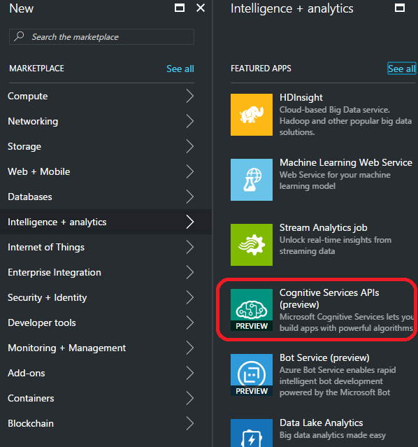
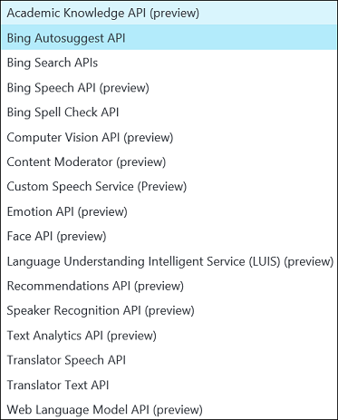
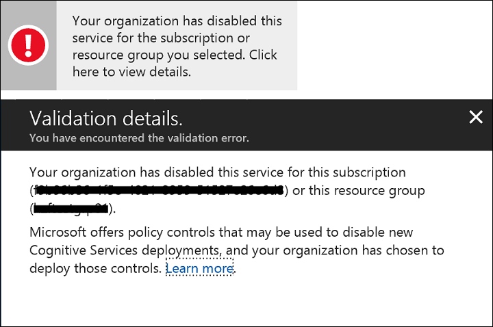
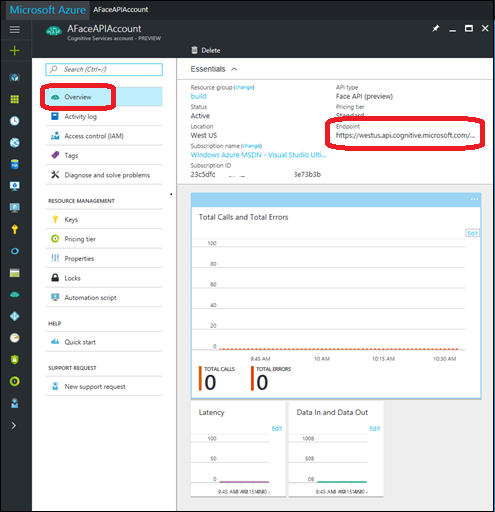
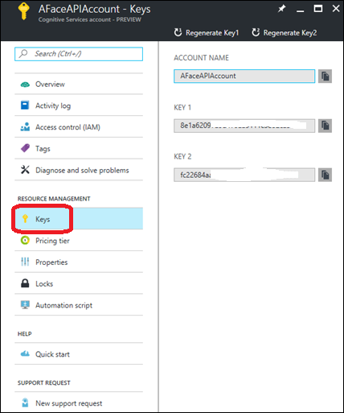

# Create a Cognitive Services APIs account in the Azure Portal

To use Microsoft Cognitive Service APIs, you first need to create an account in the Azure portal.

1. Sign in to the [Azure portal](http://portal.azure.com).

2. Click **+ NEW**.

3. Select **Intelligence + Analytics** and then **Cognitive Services APIs (preview)**.

    

4. On the **Create** page, provide the following information:

   - **Account Name:** Name of the account. We recommend using a descriptive name, for example *AFaceAPIAccount*.

   - **Subscription:** Select one of the available Azure subscriptions in which you have at least Contributor permissions.

   - **API Type:** Choose the Cognitive Services API you want to use. For more information about the various Cognitive Services APIs available, please refer to the [Cognitive Services](https://azure.microsoft.com/services/cognitive-services/) site.

   

   - **Pricing tier:** The cost of your Cognitive Services account depends on the actual usage and the options you choose. For more information about pricing for each API, please refer to the [pricing pages](https://azure.microsoft.com/pricing/details/cognitive-services/).

   - **Resource Group:** A resource group is a collection of resources that share the same lifecycle, permissions, and policies. To learn more about Resource Groups, see [Manage Azure resources through portal](https://docs.microsoft.com/azure/azure-resource-manager/resource-group-portal).

   - **Resource Group Location:** This is required only if the API selected is global (not bound to a location). If the API is global and not bound to a location, however, you must specify a location for the resource group where the metadata associated with the Cognitive Services API account will reside. This location will have no impact on the runtime availability of your account. To learn more about resource group, please refer to [Manage Azure resources through portal](https://docs.microsoft.com/azure/azure-resource-manager/resource-group-portal).

   - **Explicit acknowledgment of Online Service Terms:** In order to create an account, subscription Owners or Contributors (as defined by [Azure Role-Based Access Control](https://docs.microsoft.com/azure/active-directory/role-based-access-control-what-is)) need to explicitly acknowledge the terms that apply to Cognitive Services in [Online Service Terms](https://www.microsoft.com/en-us/Licensing/product-licensing/products.aspx). 

     The subscription Owner can disable the creation of Cognitive Services account for a specific resource group or subscription through [resource policy](https://docs.microsoft.com/azure/azure-resource-manager/resource-manager-policy) by following the article [Using Azure portal to assign and manage resource policies](https://docs.microsoft.com/azure/azure-resource-manager/resource-manager-policy-portal) and assigning a “Not allowed resource types” policy definition and specifying **Microsoft.CognitiveServices/accounts** as the target resource type.

     If account creation was disabled, the following error would be displayed at the time of account creation:

     

5. To pin the account to the Azure portal dashboard, click **Pin to Dashboard**.

6. Click **Create** to create the account.

After the Cognitive Services account is successfully deployed,
click the tile in the dashboard to view the account information.

You can use the **Endpoint URL** in the **Overview** section and keys in the **Keys** section to start making
API calls in your applications.

### Next Steps

- For more information about all the Microsoft Cognitive Services available, see [Cognitive Services](https://azure.microsoft.com/services/cognitive-services/).

- For quick start guides to using some example Cognitive Services APIs, see:
    - [Getting started with the Text Analytics APIs to detect sentiment, key phrases, topics and language](cognitive-services-text-analytics-quick-start.md)
    - [Quick start guide for the Cognitive Services Recommendations API](cognitive-services-recommendations-quick-start.md)