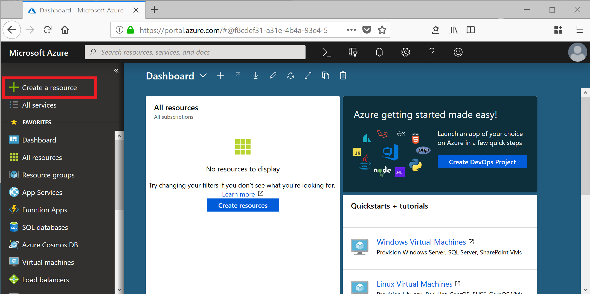

# Create and access a Cognitive Services API resource in the Azure portal

Before accessing Azure Cognitive Services, you must create and subscribe to at least one Cognitive Services resource in the Azure portal. These resources enable you to connect to one or more of the many Cognitive Services APIs available. If you don't have an Azure subscription, you can [create an account](https://azure.microsoft.com/free/) for free. Note that transaction limits and pricing varies between APIs.  

1. Sign in to the [Azure portal](http://portal.azure.com), and click **+ Create a resource**.
    
    

2. Under Azure Marketplace, select **AI + Machine Learning**. If you don't see the API you're interested in, click on **See all** to view the entire catalog of Cognitive Services APIs.

    

3. On the **Create** page, provide the following information:

|    |    |
|--|--|
| **Name** | A descriptive name for your cognitive services resource. We recommend using a descriptive name, for example *MyNameFaceAPIAccount*. |
| **Subscription:** | Select one of your available Azure subscriptions. |
| **Pricing tier:** | The cost of your Cognitive Services account depends on the options you choose and your usage. For more information, see the API [pricing details](https://azure.microsoft.com/pricing/details/cognitive-services/).
| **Resource Group Location:** | This is required only if the API selected is global (not bound to a location). If the API is global and not bound to a location, however, you must specify a location for the resource group where the metadata associated with the Cognitive Services API account resides. This location has no impact on the runtime availability of your account. |

4. Click **Create** to create the account.

If you pinned the resource to the Azure dashboard, select the tile. Otherwise, you can find it in **Resource Groups**.

Within your Cognitive Services resource, You can use the **Endpoint URL** in the **Overview** section, and keys in the **Keys** section to start making API calls in your applications.

### Next Steps

See the [Cognitive Services](https://azure.microsoft.com/services/cognitive-services/) page to find quickstarts, tutorials, and other documentation for the API you're using.