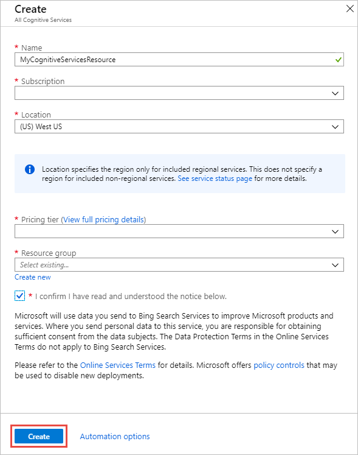
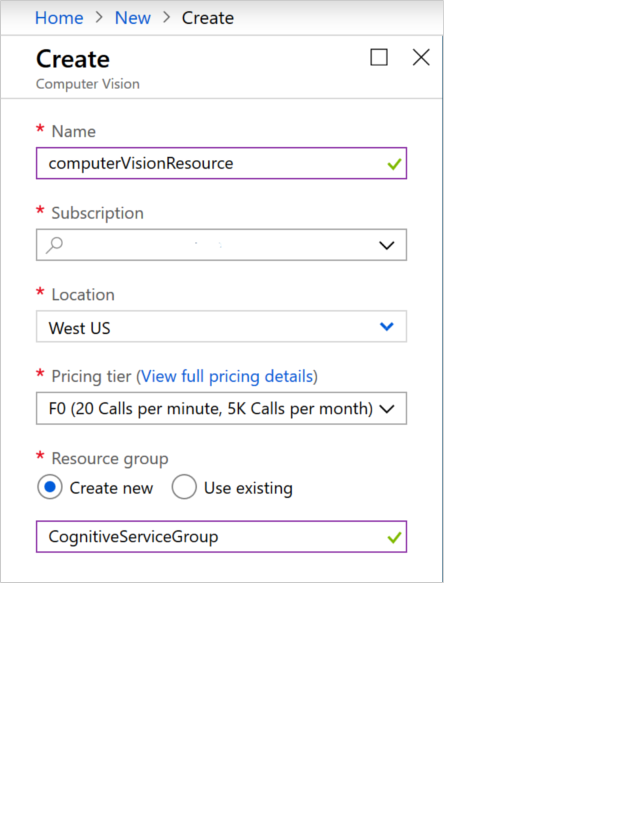
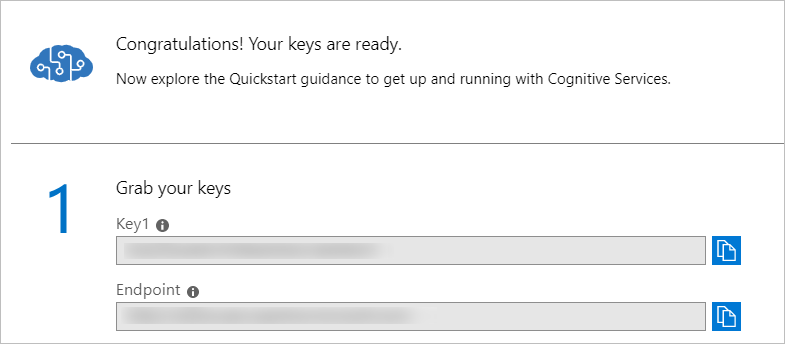

# Create a Cognitive Services resource using the Azure portal

Use this quickstart to start using Azure Cognitive Services. After creating a Cognitive Service resource in the Azure portal, you'll get an endpoint and a key for authenticating your applications.

[!INCLUDE [cognitive-services-subscription-types](../../includes/cognitive-services-subscription-types.md)]

## Prerequisites

* A valid Azure subscription - [Create one for free](https://azure.microsoft.com/free/).

## Create a new Azure Cognitive Services resource

1. Create a resource.

    #### [Multi-service resource](#tab/multiservice)
    
    The multi-service resource is named **Cognitive Services** in the portal. [Create a Cognitive Services resource](https://ms.portal.azure.com/#create/Microsoft.CognitiveServicesAllInOne).
    
    At this time, the multi-service resource enables access to the following Cognitive Services:
    
    |                  |                                                      |                    |                               |                  |
    |------------------|------------------------------------------------------|--------------------|-------------------------------|------------------|
    | Computer Vision  | Content Moderator                                    | Face               | Language Understanding (LUIS) | Text Analytics   |
    | Translator  | Bing Search v7  (Web, Image, News, Video, Visual) | Bing Custom Search | Bing Entity Search            | Bing Autosuggest |
    | Bing Spell Check |                                                      |                    |                               |                  |
    
    #### [Single-service resource](#tab/singleservice)

    Use the below links to create a resource for the available Cognitive Services:

    | Vision                      | Speech                  | Language                          | Decision             | Search                 |
    |-----------------------------|-------------------------|-----------------------------------|----------------------|------------------------|
    | [Computer vision](https://ms.portal.azure.com/#create/Microsoft.CognitiveServicesComputerVision)         | [Speech Services](https://ms.portal.azure.com/#create/Microsoft.CognitiveServicesSpeechServices)     | [Immersive reader](https://ms.portal.azure.com/#create/Microsoft.CognitiveServicesImmersiveReader)              | [Anomaly Detector](https://ms.portal.azure.com/#create/Microsoft.CognitiveServicesAnomalyDetector) | [Bing Search API V7](https://ms.portal.azure.com/#create/Microsoft.CognitiveServicesBingSearch-v7) |
    | [Custom vision service](https://ms.portal.azure.com/#create/Microsoft.CognitiveServicesCustomVision) | [Speaker Recognition](https://ms.portal.azure.com/#create/Microsoft.CognitiveServicesSpeakerRecognition) | [Language Understanding (LUIS)](https://ms.portal.azure.com/#create/Microsoft.CognitiveServicesLUISAllInOne) | [Content Moderator](https://ms.portal.azure.com/#create/Microsoft.CognitiveServicesContentModerator) | [Bing Custom Search](https://ms.portal.azure.com/#create/Microsoft.CognitiveServicesBingCustomSearch) |
    | [Face](https://ms.portal.azure.com/#create/Microsoft.CognitiveServicesFace)                    |                         | [QnA Maker](https://ms.portal.azure.com/#create/Microsoft.CognitiveServicesQnAMaker)                     | [Personalizer](https://ms.portal.azure.com/#create/Microsoft.CognitiveServicesPersonalizer)     | [Bing Entity Search](https://ms.portal.azure.com/#create/Microsoft.CognitiveServicesBingEntitySearch) |
    | [Ink Recognizer](https://ms.portal.azure.com/#create/Microsoft.CognitiveServicesInkRecognizer)        |                         | [Text Analytics](https://ms.portal.azure.com/#create/Microsoft.CognitiveServicesTextAnalytics)                |                      | [Bing Spell Check](https://ms.portal.azure.com/#create/Microsoft.CognitiveServicesBingSpellCheck-v7)   |
    |           |                         | [Translator](https://ms.portal.azure.com/#create/Microsoft.CognitiveServicesTextTranslation)               |                      | [Bing Autosuggest](https://ms.portal.azure.com/#create/Microsoft.CognitiveServicesBingAutosuggest-v7)                       |
    ***

3. On the **Create** page, provide the following information:

    #### [Multi-service resource](#tab/multiservice)

    |    |    |
    |--|--|
    | **Name** | A descriptive name for your cognitive services resource. For example, *MyCognitiveServicesResource*. |
    | **Subscription** | Select one of your available Azure subscriptions. |
    | **Location** | The location of your cognitive service instance. Different locations may introduce latency, but have no impact on the runtime availability of your resource. |
    | **Pricing tier** | The cost of your Cognitive Services account depends on the options you choose and your usage. For more information, see the API [pricing details](https://azure.microsoft.com/pricing/details/cognitive-services/).
    | **Resource group** | The Azure resource group that will contain your Cognitive Services resource. You can create a new group or add it to a pre-existing group. |

    

    Click **Create**.

    #### [Single-service resource](#tab/singleservice)

    |    |    |
    |--|--|
    | **Name** | A descriptive name for your cognitive services resource. For example, *TextAnalyticsResource*. |
    | **Subscription** | Select one of your available Azure subscriptions. |
    | **Location** | The location of your cognitive service instance. Different locations may introduce latency, but have no impact on the runtime availability of your resource. |
    | **Pricing tier** | The cost of your Cognitive Services account depends on the options you choose and your usage. For more information, see the API [pricing details](https://azure.microsoft.com/pricing/details/cognitive-services/).
    | **Resource group** | The Azure resource group that will contain your Cognitive Services resource. You can create a new group or add it to a pre-existing group. |

    

    Click **Create**.

    ***

## Get the keys for your resource

1. After your resource is successfully deployed, click on **Go to resource** under **Next Steps**.

    

2. From the quickstart pane that opens, you can access your key and endpoint.

    

[!INCLUDE [cognitive-services-environment-variables](../../includes/cognitive-services-environment-variables.md)]

## Clean up resources

If you want to clean up and remove a Cognitive Services subscription, you can delete the resource or resource group. Deleting the resource group also deletes any other resources contained in the group.

1. In the Azure portal, expand the menu on the left side to open the menu of services, and choose **Resource Groups** to display the list of your resource groups.
2. Locate the resource group containing the resource to be deleted
3. Right-click on the resource group listing. Select **Delete resource group**, and confirm.

## See also

* [Authenticate requests to Azure Cognitive Services](authentication.md)
* [What is Azure Cognitive Services?](Welcome.md)
* [Natural language support](language-support.md)
* [Docker container support](cognitive-services-container-support.md)
