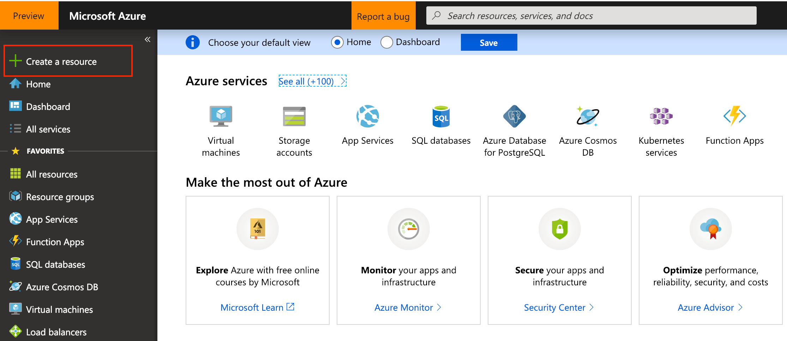
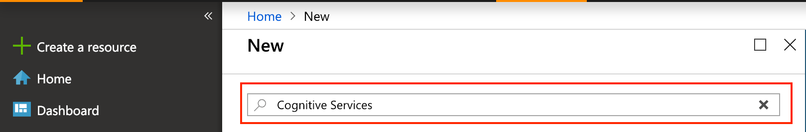
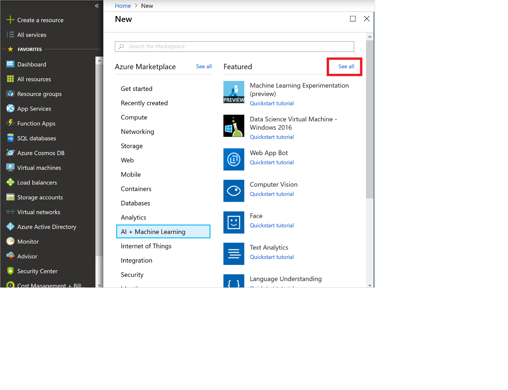

# Create a Cognitive Services account using the Azure portal

In this quickstart, you'll learn how to sign up for Azure Cognitive Services and create an account that has a single-service or multi-service subscription. These services are represented by Azure [resources](https://docs.microsoft.com/azure/azure-resource-manager/resource-group-portal), which enable you to connect to one or many of the Azure Cognitive Services APIs.

## Prerequisites

* A valid Azure subscription. [Create an account](https://azure.microsoft.com/free/) for free.

[!INCLUDE [cognitive-services-subscription-types](../../includes/cognitive-services-subscription-types.md)]

## Create a new Azure Cognitive Services resource

Before creating a resource, you must have an Azure resource group. Every Cognitive Services account (and its associated Azure resource) must belong to an Azure resource group. When you create an account, you have the option to either create a new resource group, or use an existing one. This article shows how to create a new resource group.

1. Sign in to the [Azure portal](https://portal.azure.com), and click **+Create a resource**.

    

2. You can find available Cognitive Services with in the following ways:
    * Use the search bar and enter the name of the service you want to subscribe to.
        * To create a resource for a multi-service subscription, enter **Cognitive Services** in the search bar, and select the **Cognitive Services** resource.

        

    * To see all available cognitive services, select **AI + Machine Learning**, under **Azure Marketplace**. If you don't see the service you're interested in, click on **See all** and scroll to **Cognitive Services**. Click **More** to view the entire catalog of Cognitive Services APIs.
    
        

3. On the **Create** page, provide the following information:

    > [!IMPORTANT]
    > Remember your Azure location, as you may need it when calling the Azure Cognitive Services.

    |    |    |
    |--|--|
    | **Name** | A descriptive name for your cognitive services resource. We recommend using a descriptive name, for example *MyCognitiveServicesAccount*. |
    | **Subscription** | Select one of your available Azure subscriptions. |
    | **Location** | The location of your cognitive service instance. Different locations may introduce latency, but have no impact on the runtime availability of your resource. |
    | **Pricing tier** | The cost of your Cognitive Services account depends on the options you choose and your usage. For more information, see the API [pricing details](https://azure.microsoft.com/pricing/details/cognitive-services/).
    | **Resource group** | The [Azure resource group](https://docs.microsoft.com/azure/architecture/cloud-adoption/governance/resource-consistency/azure-resource-access#what-is-an-azure-resource-group) that will contain your Cognitive Services resource. You can create a new group or add it to a pre-existing group. |

    

## Get the keys for your subscription

After creating your resource, you can access it from the Azure dashboard if you pinned it. Otherwise, you can find it in **Resource Groups**. After selecting your resource, you can get the keys by selecting **Keys** under **Resource Management**.

[!INCLUDE [cognitive-services-environment-variables](../../includes/cognitive-services-environment-variables.md)]

## Clean up resources

If you want to clean up and remove a Cognitive Services subscription, you can delete the resource or resource group. Deleting the resource group also deletes any other resources associated with the resource group.

To remove a resource group using the Azure portal:

1. In the Azure portal, expand the menu on the left side to open the menu of services, and choose **Resource Groups** to display the list of your resource groups.
2. Locate the resource group to delete, and right-click the More button (...) on the right side of the listing.
3. Select **Delete resource group**, and confirm.

## See also

* [Authenticate requests to Azure Cognitive Services](authentication.md)
* [What are Azure Cognitive Services?](Welcome.md)
* [Natural language support](language-support.md)
* [Docker container support](cognitive-services-container-support.md)
