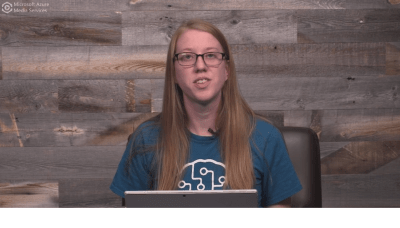

# Container support in Azure Cognitive Services

Container support in Azure Cognitive Services allows developers to use the same rich APIs that are available in Azure, and enables flexibility in where to deploy and host the services that come with [Docker containers](https://www.docker.com/what-container). Container support is currently available in preview for a subset of Azure Cognitive Services, including parts of:

* [Anomaly Detector][ad-containers]
* [Computer Vision][cv-containers]
* [Face][fa-containers]
* [Form Recognizer][fr-containers]
* [Language Understanding (LUIS)][lu-containers]
* [Speech Service API][sp-containers]
* [Text Analytics][ta-containers]

<!--
* [Personalizer](https://go.microsoft.com/fwlink/?linkid=2083923&clcid=0x409)
-->

Containerization is an approach to software distribution in which an application or service, including its dependencies & configuration, is packaged together as a container image. With little or no modification, a container image can be deployed on a container host. Containers are isolated from each other and the underlying operating system, with a smaller footprint than a virtual machine. Containers can be instantiated from container images for short-term tasks, and removed when no longer needed.

The following video demonstrates using a Cognitive Services container.

Cognitive Services resources are available on [Microsoft Azure](https://azure.microsoft.com). Sign into the [Azure portal](https://portal.azure.com/) to create and explore Azure resources for these services.

## Features and benefits

- **Control over data**: Allow customers to choose where these Cognitive Services process their data. This is essential for customers that cannot send data to the cloud but need access to Cognitive Services technology. Support consistency in hybrid environments – across data, management, identity, and security.
- **Control over model updates**: Provide customers flexibility in versioning and updating of models deployed in their solutions.
- **Portable architecture**: Enable the creation of a portable application architecture that can be deployed on Azure, on-premises and the edge. Containers can be deployed directly to [Azure Kubernetes Service](../aks/index.yml), [Azure Container Instances](../container-instances/index.yml), or to a [Kubernetes](https://kubernetes.io/) cluster deployed to [Azure Stack](/azure-stack/operator). For more information, see [Deploy Kubernetes to Azure Stack](/azure-stack/user/azure-stack-solution-template-kubernetes-deploy).
- **High throughput / low latency**: Provide customers the ability to scale for high throughput and low latency requirements by enabling Cognitive Services to run physically close to their application logic and data. Containers do not cap transactions per second (TPS) and can be made to scale both up and out to handle demand if you provide the necessary hardware resources. 

## Containers in Azure Cognitive Services

Azure Cognitive Services containers provide the following set of Docker containers, each of which contains a subset of functionality from services in Azure Cognitive Services:

| Service | Supported Pricing Tier | Container | Description |
|---------|----------|----------|-------------|
|[Anomaly detector][ad-containers] |F0, S0|**Anomaly-Detector** |The Anomaly Detector API enables you to monitor and detect abnormalities in your time series data with machine learning. [Request access](https://aka.ms/adcontainer)|
|[Computer Vision][cv-containers] |F0, S1|**Recognize Text** |Extracts printed text from images of various objects with different surfaces and backgrounds, such as receipts, posters, and business cards.  **Important:** The Recognize Text container currently works only with English. [Request access](Computer-vision/computer-vision-how-to-install-containers.md#request-access-to-the-private-container-registry)|
|[Face][fa-containers] |F0, S0|**Face** |Detects human faces in images, and identifies attributes, including face landmarks (such as noses and eyes), gender, age, and other machine-predicted facial features. In addition to detection, Face can check if two faces in the same image or different images are the same by using a confidence score, or compare faces against a database to see if a similar-looking or identical face already exists. It can also organize similar faces into groups, using shared visual traits. [Request access](Face/face-how-to-install-containers.md#request-access-to-the-private-container-registry) |
|[Form recognizer][fr-containers] |F0, S0|**Form Recognizer** |Form Understanding applies machine learning technology to identify and extract key-value pairs and tables from forms. [Request access](https://aka.ms/FormRecognizerContainerRequestAccess)|
|[LUIS][lu-containers] |F0, S0|**LUIS** ([image](https://go.microsoft.com/fwlink/?linkid=2043204&clcid=0x409))|Loads a trained or published Language Understanding model, also known as a LUIS app, into a docker container and provides access to the query predictions from the container's API endpoints. You can collect query logs from the container and upload these back to the [LUIS portal](https://www.luis.ai) to improve the app's prediction accuracy.|
|[Speech Service API][sp-containers] |F0, S0|**Speech-to-text** |Transcribes continuous real-time speech into text. [Request access](https://aka.ms/speechcontainerspreview/)|
|[Speech Service API][sp-containers] |F0, S0|**Text-to-speech** |Converts text to natural-sounding speech. [Request access](https://aka.ms/speechcontainerspreview/)|
|[Text Analytics][ta-containers] |F0, S|**Key Phrase Extraction** ([image](https://go.microsoft.com/fwlink/?linkid=2018757&clcid=0x409)) |Extracts key phrases to identify the main points. For example, for the input text "The food was delicious and there were wonderful staff", the API returns the main talking points: "food" and "wonderful staff". |
|[Text Analytics][ta-containers]|F0, S|**Language Detection** ([image](https://go.microsoft.com/fwlink/?linkid=2018759&clcid=0x409)) |For up to 120 languages, detects which language the input text is written in and report a single language code for every document submitted on the request. The language code is paired with a score indicating the strength of the score. |
|[Text Analytics][ta-containers]|F0, S|**Sentiment Analysis** ([image](https://go.microsoft.com/fwlink/?linkid=2018654&clcid=0x409)) |Analyzes raw text for clues about positive or negative sentiment. This API returns a sentiment score between 0 and 1 for each document, where 1 is the most positive. The analysis models are pre-trained using an extensive body of text and natural language technologies from Microsoft. For [selected languages](./text-analytics/language-support.md), the API can analyze and score any raw text that you provide, directly returning results to the calling application. |

<!--
|[Personalizer](https://go.microsoft.com/fwlink/?linkid=2083923&clcid=0x409) |F0, S0|**Personalizer** ([image](https://go.microsoft.com/fwlink/?linkid=2083928&clcid=0x409))|Azure Personalizer is a cloud-based API service that allows you to choose the best experience to show to your users, learning from their real-time behavior.|
-->

In addition, some containers are supported in Cognitive Services [**All-In-One offering**](https://ms.portal.azure.com/#create/Microsoft.CognitiveServicesAllInOne) resource keys. You can create one single Cognitive Services All-In-One resource and use the same billing key across supported services for the following services:

* Computer Vision
* Face
* LUIS
* Text Analytics

## Container availability in Azure Cognitive Services

Azure Cognitive Services containers are publicly available through your Azure subscription, and Docker container images can be pulled from either the Microsoft Container Registry or Docker Hub. You can use the [docker pull](https://docs.docker.com/engine/reference/commandline/pull/) command to download a container image from the appropriate registry.

> [!IMPORTANT]
> Currently, you must complete a sign-up process to access the following containers, in which you fill out and submit a questionnaire with questions about you, your company, and the use case for which you want to implement the containers. Once you're granted access and provided credentials, you can then pull the container images from a private container registry hosted by Azure Container Registry.
> * [Anomaly detector](Anomaly-Detector/anomaly-detector-container-howto.md#request-access-to-the-container-registry)
> * [Face](Face/face-how-to-install-containers.md)
> * [Form Recognizer](form-recognizer/form-recognizer-container-howto.md#request-access-to-the-container-registry)
> * [Recognize Text](Computer-vision/computer-vision-how-to-install-containers.md)
> * [Speech-to-text and Text-to-speech](Speech-Service/speech-container-howto.md#request-access-to-the-container-registry)

[!INCLUDE [Container repositories and images](containers/includes/cognitive-services-container-images.md)]

## Prerequisites

You must satisfy the following prerequisites before using Azure Cognitive Services containers:

**Docker Engine**: You must have Docker Engine installed locally. Docker provides packages that configure the Docker environment on [macOS](https://docs.docker.com/docker-for-mac/), [Linux](https://docs.docker.com/engine/installation/#supported-platforms), and [Windows](https://docs.docker.com/docker-for-windows/). On Windows, Docker must be configured to support Linux containers. Docker containers can also be deployed directly to [Azure Kubernetes Service](../aks/index.yml) or [Azure Container Instances](../container-instances/index.yml).

Docker must be configured to allow the containers to connect with and send billing data to Azure.

**Familiarity with Microsoft Container Registry and Docker**: You should have a basic understanding of both Microsoft Container Registry and Docker concepts, like registries, repositories, containers, and container images, as well as knowledge of basic `docker` commands.

For a primer on Docker and container basics, see the [Docker overview](https://docs.docker.com/engine/docker-overview/).

Individual containers can have their own requirements, as well, including server and memory allocation requirements.

[!INCLUDE [Discoverability of more container information](../../includes/cognitive-services-containers-discoverability.md)]

## Next steps

Learn about [container recipes](containers/container-reuse-recipe.md) you can use with the Cognitive Services.

Install and explore the functionality provided by containers in Azure Cognitive Services:

* [Anomaly Detector containers][ad-containers]
* [Computer Vision containers][cv-containers]
* [Face containers][fa-containers]
* [Form Recognizer containers][fr-containers]
* [Language Understanding (LUIS) containers][lu-containers]
* [Speech Service API containers][sp-containers]
* [Text Analytics containers][ta-containers]

<!--* [Personalizer containers](https://go.microsoft.com/fwlink/?linkid=2083928&clcid=0x409)
-->

[ad-containers]: anomaly-Detector/anomaly-detector-container-howto.md
[cv-containers]: computer-vision/computer-vision-how-to-install-containers.md
[fa-containers]: face/face-how-to-install-containers.md
[fr-containers]: form-recognizer/form-recognizer-container-howto.md
[lu-containers]: luis/luis-container-howto.md
[sp-containers]: speech-service/speech-container-howto.md
[ta-containers]: text-analytics/how-tos/text-analytics-how-to-install-containers.md