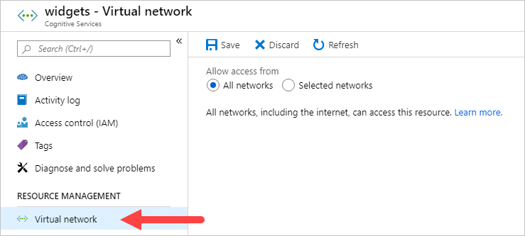
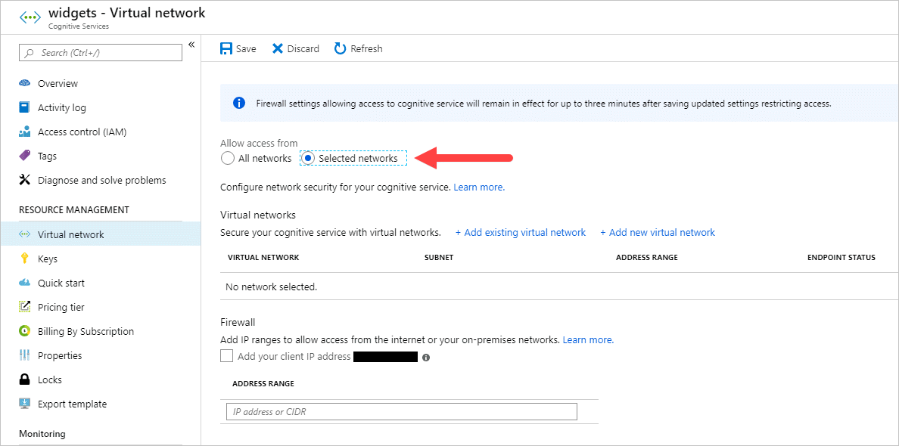
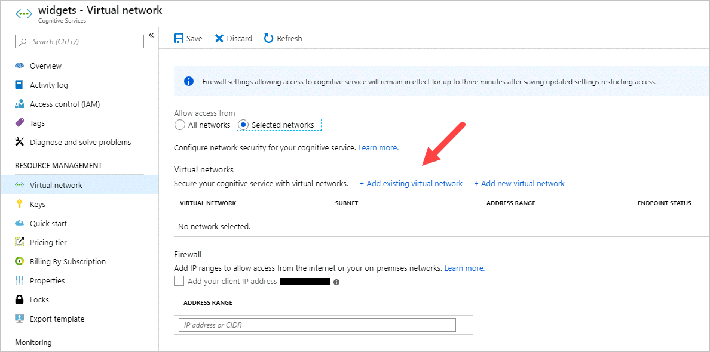
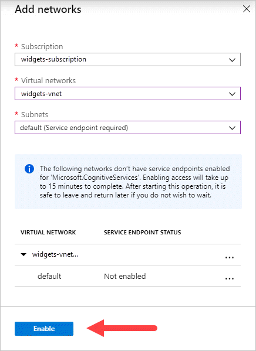
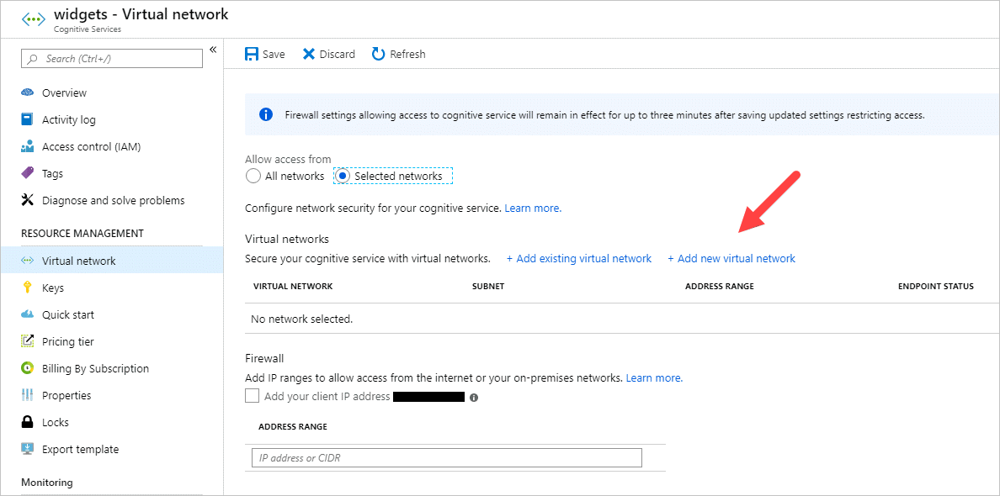
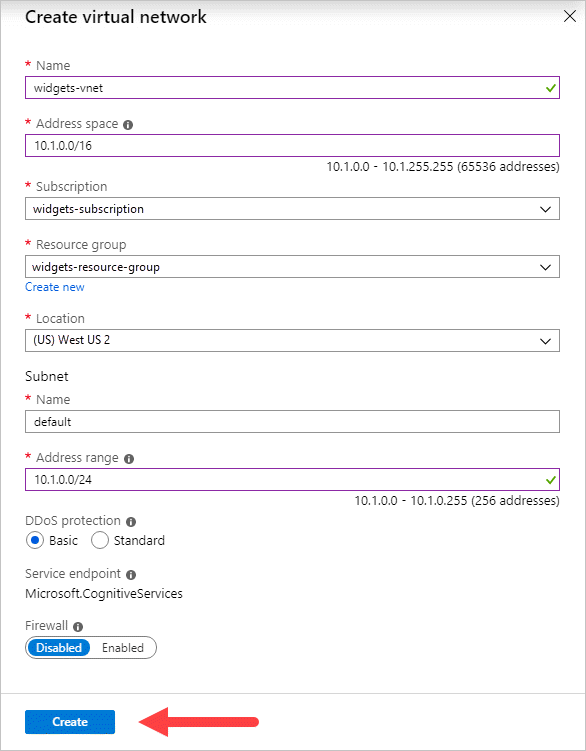
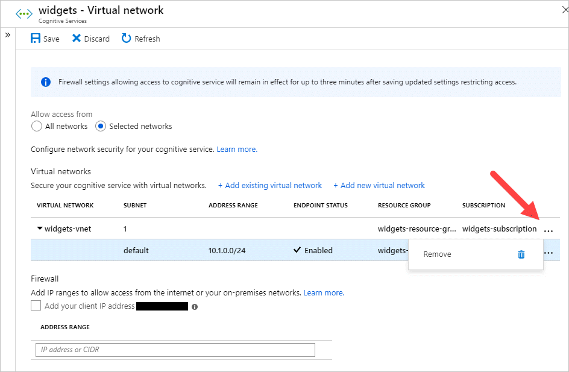
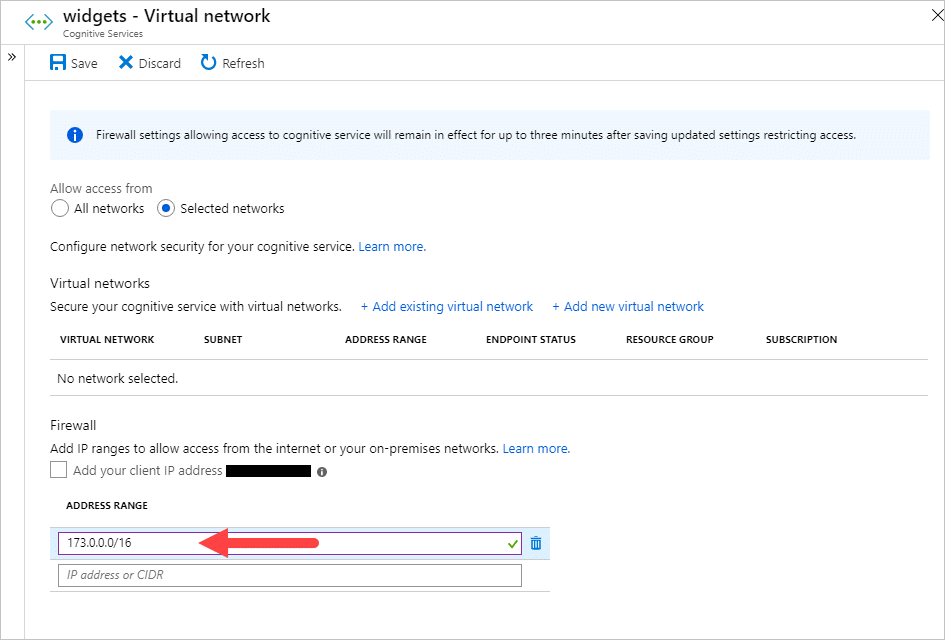
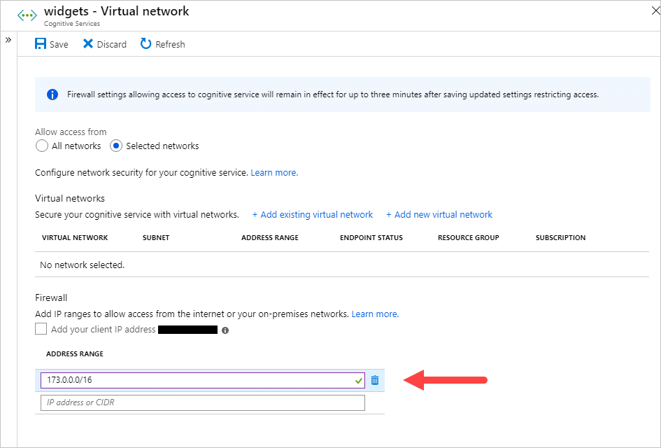

# Configure Azure Cognitive Services virtual networks

Azure Cognitive Services provides a layered security model. This model enables you to secure your Cognitive Services accounts to a specific subset of networks​. When network rules are configured, only applications requesting data over the specified set of networks can access the account. You can limit access to your resources with request filtering. Allowing only requests originating from specified IP addresses, IP ranges or from a list of subnets in [Azure Virtual Networks](../virtual-network/virtual-networks-overview.md). If you're interested in this offering, you'll need to [request preview access](https://aka.ms/cog-svc-vnet-signup).

An application that accesses a Cognitive Services resource when network rules are in effect requires authorization. Authorization is supported with [Azure Active Directory](../active-directory/fundamentals/active-directory-whatis.md) (Azure AD) credentials or with a valid API key.

> [!IMPORTANT]
> Turning on firewall rules for your Cognitive Services account blocks incoming requests for data by default. In order to allow requests through, one of the following conditions needs to be met:
> * The request should originate from a service operating within an Azure Virtual Network (VNet) on the allowed subnet list of the target Cognitive Services account. The endpoint in requests originated from VNet needs to be set as the [custom subdomain](cognitive-services-custom-subdomains.md) of your Cognitive Services account.
> * Or the request should originate from an allowed list of IP addresses.
>
> Requests that are blocked include those from other Azure services, from the Azure portal, from logging and metrics services, and so on.

[!INCLUDE [updated-for-az](../../includes/updated-for-az.md)]

## Scenarios

To secure your Cognitive Services resource, you should first configure a rule to deny access to traffic from all networks (including internet traffic) by default. Then, you should configure rules that grant access to traffic from specific VNets. This configuration enables you to build a secure network boundary for your applications. You can also configure rules to grant access to traffic from select public internet IP address ranges, enabling connections from specific internet or on-premises clients.

Network rules are enforced on all network protocols to Azure Cognitive Services, including REST and WebSocket. To access data using tools such as the Azure test consoles, explicit network rules must be configured. You can apply network rules to existing Cognitive Services resources, or when you create new Cognitive Services resources. Once network rules are applied, they're enforced for all requests.

## Supported regions and service offerings

Virtual network support for Cognitive Services listed below is limited to the *Central US EUAP*, *South Central US*, *East US*, *West US 2*, *North Europe*, *South Africa North*, *West Europe*, *Central India*, *Australia East*, *West US*, and *US Gov Virginia* Azure regions. If the service offering is not listed here, it doesn't support virtual networks.

> [!div class="checklist"]
> * [Anomaly Detector](./anomaly-detector/index.yml)
> * [Computer Vision](./computer-vision/index.yml)
> * [Content Moderator](./content-moderator/index.yml)
> * [Custom Vision](./custom-vision-service/index.yml)
> * [Face](./face/index.yml)
> * [Form Recognizer](./form-recognizer/index.yml)
> * [LUIS](./luis/index.yml)
> * [Personalizer](./personalizer/index.yml)
> * [Text Analytics](./text-analytics/index.yml)
> * [QnA Maker](./qnamaker/index.yml)

Virtual network support for Cognitive Services listed below is limited to the *Central US EUAP*, *South Central US*, *East US*, *West US 2*, *Global*, and *US Gov Virginia* Azure regions.
> [!div class="checklist"]
> * [Translator Text](https://docs.microsoft.com/azure/cognitive-services/translator/reference/v3-0-reference#virtual-network-support)

## Service Tags
In addition to supporting virtual network service endpoints for the services above, Cognitive Services also supports a service tag for outbound network rules configuration. The following services are included in the CognitiveServicesManagement service tag.
> [!div class="checklist"]
> * [Anomaly Detector](./anomaly-detector/index.yml)
> * [Computer Vision](./computer-vision/index.yml)
> * [Content Moderator](./content-moderator/index.yml)
> * [Custom Vision](./custom-vision-service/index.yml)
> * [Face](./face/index.yml)
> * [Form Recognizer](./form-recognizer/index.yml)
> * [LUIS](./luis/index.yml)
> * [Personalizer](./personalizer/index.yml)
> * [Text Analytics](./text-analytics/index.yml)
> * [QnA Maker](./qnamaker/index.yml)
> * [Translator](./translator/index.yml)
> * [Speech Service](./speech-service/index.yml)

## Change the default network access rule

By default, Cognitive Services resources accept connections from clients on any network. To limit access to selected networks, you must first change the default action.

> [!WARNING]
> Making changes to network rules can impact your applications' ability to connect to Azure Cognitive Services. Setting the default network rule to **deny** blocks all access to the data unless specific network rules that **grant** access are also applied. Be sure to grant access to any allowed networks using network rules before you change the default rule to deny access. If you are allow listing IP addresses for your on-premises network, be sure to add all possible outgoing public IP addresses from your on-premises network.

### Managing default network access rules

You can manage default network access rules for Cognitive Services resources through the Azure portal, PowerShell, or the Azure CLI.

# [Azure portal](#tab/portal)

1. Go to the Cognitive Services resource you want to secure.

1. Select the **RESOURCE MANAGEMENT** menu called **Virtual network**.

   

1. To deny access by default, choose to allow access from **Selected networks**. With the **Selected networks** setting alone, unaccompanied by configured **Virtual networks** or **Address ranges** - all access is effectively denied. When all access is denied, requests attempting to consume the Cognitive Services resource aren't permitted. The Azure portal, Azure PowerShell or, Azure CLI can still be used to configure the Cognitive Services resource.
1. To allow traffic from all networks, choose to allow access from **All networks**.

   

1. Select **Save** to apply your changes.

# [PowerShell](#tab/powershell)

1. Install the [Azure PowerShell](/powershell/azure/install-az-ps) and [sign in](/powershell/azure/authenticate-azureps), or select **Try it**.

1. Display the status of the default rule for the Cognitive Services resource.

    ```azurepowershell-interactive
    $parameters = @{
        -ResourceGroupName "myresourcegroup"
        -Name "myaccount"
    }
    (Get-AzCognitiveServicesAccountNetworkRuleSet @parameters).DefaultAction
    ```

1. Set the default rule to deny network access by default.

    ```azurepowershell-interactive
    $parameters = @{
        -ResourceGroupName "myresourcegroup"
        -Name "myaccount"
        -DefaultAction Deny
    }
    Update-AzCognitiveServicesAccountNetworkRuleSet @parameters
    ```

1. Set the default rule to allow network access by default.

    ```azurepowershell-interactive
    $parameters = @{
        -ResourceGroupName "myresourcegroup"
        -Name "myaccount"
        -DefaultAction Allow
    }
    Update-AzCognitiveServicesAccountNetworkRuleSet @parameters
    ```

# [Azure CLI](#tab/azure-cli)

1. Install the [Azure CLI](/cli/azure/install-azure-cli) and [sign in](/cli/azure/authenticate-azure-cli), or select **Try it**.

1. Display the status of the default rule for the Cognitive Services resource.

    ```azurecli-interactive
    az cognitiveservices account show \
        -g "myresourcegroup" -n "myaccount" \
        --query networkRuleSet.defaultAction
    ```

1. Set the default rule to deny network access by default.

    ```azurecli-interactive
    az cognitiveservices account update \
        -g "myresourcegroup" -n "myaccount" \
        --default-action Deny
    ```

1. Set the default rule to allow network access by default.

    ```azurecli-interactive
    az cognitiveservices account update \
        -g "myresourcegroup" -n "myaccount" \
        --default-action Allow
    ```

***

## Grant access from a virtual network

You can configure Cognitive Services resources to allow access only from specific subnets. The allowed subnets may belong to a VNet in the same subscription, or in a different subscription, including subscriptions belonging to a different Azure Active Directory tenant.

Enable a [service endpoint](../virtual-network/virtual-network-service-endpoints-overview.md) for Azure Cognitive Services within the VNet. The service endpoint routes traffic from the VNet through an optimal path to the Azure Cognitive Services service. The identities of the subnet and the virtual network are also transmitted with each request. Administrators can then configure network rules for the Cognitive Services resource that allow requests to be received from specific subnets in a VNet. Clients granted access via these network rules must continue to meet the authorization requirements of the Cognitive Services resource to access the data.

Each Cognitive Services resource supports up to 100 virtual network rules, which may be combined with [IP network rules](#grant-access-from-an-internet-ip-range).

### Required permissions

To apply a virtual network rule to a Cognitive Services resource, the user must have the appropriate permissions for the subnets being added. The required permission is the default *Contributor* role, or the *Cognitive Services Contributor* role. Required permissions can also be added to custom role definitions.

Cognitive Services resource and the virtual networks granted access may be in different subscriptions, including subscriptions that are a part of a different Azure AD tenant.

> [!NOTE]
> Configuration of rules that grant access to subnets in virtual networks that are a part of a different Azure Active Directory tenant are currently only supported through Powershell, CLI and REST APIs. Such rules cannot be configured through the Azure portal, though they may be viewed in the portal.

### Managing virtual network rules

You can manage virtual network rules for Cognitive Services resources through the Azure portal, PowerShell, or the Azure CLI.

# [Azure portal](#tab/portal)

1. Go to the Cognitive Services resource you want to secure.

1. Select the **RESOURCE MANAGEMENT** menu called **Virtual network**.

1. Check that you've selected to allow access from **Selected networks**.

1. To grant access to a virtual network with an existing network rule, under **Virtual networks**, select **Add existing virtual network**.

   

1. Select the **Virtual networks** and **Subnets** options, and then select **Enable**.

   

1. To create a new virtual network and grant it access, select **Add new virtual network**.

   

1. Provide the information necessary to create the new virtual network, and then select **Create**.

   

    > [!NOTE]
    > If a service endpoint for Azure Cognitive Services wasn't previously configured for the selected virtual network and subnets, you can configure it as part of this operation.
    >
    > Presently, only virtual networks belonging to the same Azure Active Directory tenant are shown for selection during rule creation. To grant access to a subnet in a virtual network belonging to another tenant, please use Powershell, CLI or REST APIs.

1. To remove a virtual network or subnet rule, select **...** to open the context menu for the virtual network or subnet, and select **Remove**.

   

1. Select **Save** to apply your changes.

# [PowerShell](#tab/powershell)

1. Install the [Azure PowerShell](/powershell/azure/install-az-ps) and [sign in](/powershell/azure/authenticate-azureps), or select **Try it**.

1. List virtual network rules.

    ```azurepowershell-interactive
    $parameters = @{
        -ResourceGroupName "myresourcegroup"
        -Name "myaccount"
    }
    (Get-AzCognitiveServicesAccountNetworkRuleSet @parameters).VirtualNetworkRules
    ```

1. Enable service endpoint for Azure Cognitive Services on an existing virtual network and subnet.

    ```azurepowershell-interactive
    Get-AzVirtualNetwork -ResourceGroupName "myresourcegroup" `
        -Name "myvnet" | Set-AzVirtualNetworkSubnetConfig -Name "mysubnet" `
        -AddressPrefix "10.0.0.0/24" `
        -ServiceEndpoint "Microsoft.CognitiveServices" | Set-AzVirtualNetwork
    ```

1. Add a network rule for a virtual network and subnet.

    ```azurepowershell-interactive
    $subParameters = @{
        -ResourceGroupName "myresourcegroup"
        -Name "myvnet"
    }
    $subnet = Get-AzVirtualNetwork @subParameters | Get-AzVirtualNetworkSubnetConfig -Name "mysubnet"

    $parameters = @{
        -ResourceGroupName "myresourcegroup"
        -Name "myaccount"
        -VirtualNetworkResourceId $subnet.Id
    }
    Add-AzCognitiveServicesAccountNetworkRule @parameters
    ```

    > [!TIP]
    > To add a network rule for a subnet in a VNet belonging to another Azure AD tenant, use a fully-qualified **VirtualNetworkResourceId** parameter in the form "/subscriptions/subscription-ID/resourceGroups/resourceGroup-Name/providers/Microsoft.Network/virtualNetworks/vNet-name/subnets/subnet-name".

1. Remove a network rule for a virtual network and subnet.

    ```azurepowershell-interactive
    $subParameters = @{
        -ResourceGroupName "myresourcegroup"
        -Name "myvnet"
    }
    $subnet = Get-AzVirtualNetwork @subParameters | Get-AzVirtualNetworkSubnetConfig -Name "mysubnet"

    $parameters = @{
        -ResourceGroupName "myresourcegroup"
        -Name "myaccount"
        -VirtualNetworkResourceId $subnet.Id
    }
    Remove-AzCognitiveServicesAccountNetworkRule @parameters
    ```

# [Azure CLI](#tab/azure-cli)

1. Install the [Azure CLI](/cli/azure/install-azure-cli) and [sign in](/cli/azure/authenticate-azure-cli), or select **Try it**.

1. List virtual network rules.

    ```azurecli-interactive
    az cognitiveservices account network-rule list \
        -g "myresourcegroup" -n "myaccount" \
        --query virtualNetworkRules
    ```

1. Enable service endpoint for Azure Cognitive Services on an existing virtual network and subnet.

    ```azurecli-interactive
    az network vnet subnet update -g "myresourcegroup" -n "mysubnet" \
    --vnet-name "myvnet" --service-endpoints "Microsoft.CognitiveServices"
    ```

1. Add a network rule for a virtual network and subnet.

    ```azurecli-interactive
    $subnetid=(az network vnet subnet show \
        -g "myresourcegroup" -n "mysubnet" --vnet-name "myvnet" \
        --query id --output tsv)

    # Use the captured subnet identifier as an argument to the network rule addition
    az cognitiveservices account network-rule add \
        -g "myresourcegroup" -n "myaccount" \
        --subnet $subnetid
    ```

    > [!TIP]
    > To add a rule for a subnet in a VNet belonging to another Azure AD tenant, use a fully-qualified subnet ID in the form "/subscriptions/subscription-ID/resourceGroups/resourceGroup-Name/providers/Microsoft.Network/virtualNetworks/vNet-name/subnets/subnet-name".
    > 
    > You can use the **subscription** parameter to retrieve the subnet ID for a VNet belonging to another Azure AD tenant.

1. Remove a network rule for a virtual network and subnet.

    ```azurecli-interactive
    $subnetid=(az network vnet subnet show \
        -g "myresourcegroup" -n "mysubnet" --vnet-name "myvnet" \
        --query id --output tsv)

    # Use the captured subnet identifier as an argument to the network rule removal
    az cognitiveservices account network-rule remove \
        -g "myresourcegroup" -n "myaccount" \
        --subnet $subnetid
    ```
***

> [!IMPORTANT]
> Be sure to [set the default rule](#change-the-default-network-access-rule) to **deny**, or network rules have no effect.

## Grant access from an internet IP range

You can configure Cognitive Services resources to allow access from specific public internet IP address ranges. This configuration grants access to specific services and on-premises networks, effectively blocking general internet traffic.

Provide allowed internet address ranges using [CIDR notation](https://tools.ietf.org/html/rfc4632) in the form `16.17.18.0/24` or as individual IP addresses like `16.17.18.19`.

   > [!Tip]
   > Small address ranges using "/31" or "/32" prefix sizes are not supported. These ranges should be configured using individual IP address rules.

IP network rules are only allowed for **public internet** IP addresses. IP address ranges reserved for private networks (as defined in [RFC 1918](https://tools.ietf.org/html/rfc1918#section-3)) aren't allowed in IP rules. Private networks include addresses that start with `10.*`, `172.16.*` - `172.31.*`, and `192.168.*`.

   > [!NOTE]
   > IP network rules have no effect on requests originating from the same Azure region as the Cognitive Services resource. Use [Virtual network rules](#grant-access-from-a-virtual-network) to allow same-region requests.

Only IPV4 addresses are supported at this time. Each Cognitive Services resource supports up to 100 IP network rules, which may be combined with [Virtual network rules](#grant-access-from-a-virtual-network).

### Configuring access from on-premises networks

To grant access from your on-premises networks to your Cognitive Services resource with an IP network rule, you must identify the internet facing IP addresses used by your network. Contact your network administrator for help.

If you are using [ExpressRoute](../expressroute/expressroute-introduction.md) on-premises for public peering or Microsoft peering, you will need to identify the NAT IP addresses. For public peering, each ExpressRoute circuit by default uses two NAT IP addresses. Each is applied to Azure service traffic when the traffic enters the Microsoft Azure network backbone. For Microsoft peering, the NAT IP addresses that are used are either customer provided or are provided by the service provider. To allow access to your service resources, you must allow these public IP addresses in the resource IP firewall setting. To find your public peering ExpressRoute circuit IP addresses, [open a support ticket with ExpressRoute](https://portal.azure.com/#blade/Microsoft_Azure_Support/HelpAndSupportBlade/overview) via the Azure portal. Learn more about [NAT for ExpressRoute public and Microsoft peering.](../expressroute/expressroute-nat.md#nat-requirements-for-azure-public-peering)

### Managing IP network rules

You can manage IP network rules for Cognitive Services resources through the Azure portal, PowerShell, or the Azure CLI.

# [Azure portal](#tab/portal)

1. Go to the Cognitive Services resource you want to secure.

1. Select the **RESOURCE MANAGEMENT** menu called **Virtual network**.

1. Check that you've selected to allow access from **Selected networks**.

1. To grant access to an internet IP range, enter the IP address or address range (in [CIDR format](https://tools.ietf.org/html/rfc4632)) under **Firewall** > **Address Range**. Only valid public IP (non-reserved) addresses are accepted.

   

1. To remove an IP network rule, select the trash can <span class="docon docon-delete x-hidden-focus"></span> icon next to the address range.

   

1. Select **Save** to apply your changes.

# [PowerShell](#tab/powershell)

1. Install the [Azure PowerShell](/powershell/azure/install-az-ps) and [sign in](/powershell/azure/authenticate-azureps), or select **Try it**.

1. List IP network rules.

    ```azurepowershell-interactive
    $parameters = @{
        -ResourceGroupName "myresourcegroup"
        -Name "myaccount"
    }
    (Get-AzCognitiveServicesAccountNetworkRuleSet @parameters).IPRules
    ```

1. Add a network rule for an individual IP address.

    ```azurepowershell-interactive
    $parameters = @{
        -ResourceGroupName "myresourcegroup"
        -Name "myaccount"
        -IPAddressOrRange "16.17.18.19"
    }
    Add-AzCognitiveServicesAccountNetworkRule @parameters
    ```

1. Add a network rule for an IP address range.

    ```azurepowershell-interactive
    $parameters = @{
        -ResourceGroupName "myresourcegroup"
        -Name "myaccount"
        -IPAddressOrRange "16.17.18.0/24"
    }
    Add-AzCognitiveServicesAccountNetworkRule @parameters
    ```

1. Remove a network rule for an individual IP address.

    ```azurepowershell-interactive
    $parameters = @{
        -ResourceGroupName "myresourcegroup"
        -Name "myaccount"
        -IPAddressOrRange "16.17.18.19"
    }
    Remove-AzCognitiveServicesAccountNetworkRule @parameters
    ```

1. Remove a network rule for an IP address range.

    ```azurepowershell-interactive
    $parameters = @{
        -ResourceGroupName "myresourcegroup"
        -Name "myaccount"
        -IPAddressOrRange "16.17.18.0/24"
    }
    Remove-AzCognitiveServicesAccountNetworkRule @parameters
    ```

# [Azure CLI](#tab/azure-cli)

1. Install the [Azure CLI](/cli/azure/install-azure-cli) and [sign in](/cli/azure/authenticate-azure-cli), or select **Try it**.

1. List IP network rules.

    ```azurecli-interactive
    az cognitiveservices account network-rule list \
        -g "myresourcegroup" -n "myaccount" --query ipRules
    ```

1. Add a network rule for an individual IP address.

    ```azurecli-interactive
    az cognitiveservices account network-rule add \
        -g "myresourcegroup" -n "myaccount" \
        --ip-address "16.17.18.19"
    ```

1. Add a network rule for an IP address range.

    ```azurecli-interactive
    az cognitiveservices account network-rule add \
        -g "myresourcegroup" -n "myaccount" \
        --ip-address "16.17.18.0/24"
    ```

1. Remove a network rule for an individual IP address.

    ```azurecli-interactive
    az cognitiveservices account network-rule remove \
        -g "myresourcegroup" -n "myaccount" \
        --ip-address "16.17.18.19"
    ```

1. Remove a network rule for an IP address range.

    ```azurecli-interactive
    az cognitiveservices account network-rule remove \
        -g "myresourcegroup" -n "myaccount" \
        --ip-address "16.17.18.0/24"
    ```

***

> [!IMPORTANT]
> Be sure to [set the default rule](#change-the-default-network-access-rule) to **deny**, or network rules have no effect.

## Use private endpoints

You can use [private endpoints](../private-link/private-endpoint-overview.md) for your Cognitive Services resources to allow clients on a virtual network (VNet) to securely access data over a [Private Link](../private-link/private-link-overview.md). The private endpoint uses an IP address from the VNet address space for your Cognitive Services resource. Network traffic between the clients on the VNet and the resource traverses the VNet and a private link on the Microsoft backbone network, eliminating exposure from the public internet.

Private endpoints for Cognitive Services resources let you:

- Secure your Cognitive Services resource by configuring the firewall to block all connections on the public endpoint for the Cognitive Services service.
- Increase security for the VNet, by enabling you to block exfiltration of data from the VNet.
- Securely connect to Cognitive Services resources from on-premises networks that connect to the VNet using [VPN](../vpn-gateway/vpn-gateway-about-vpngateways.md) or [ExpressRoutes](../expressroute/expressroute-locations.md) with private-peering.

### Conceptual overview

A private endpoint is a special network interface for an Azure service in your [VNet](../virtual-network/virtual-networks-overview.md). When you create a private endpoint for your Cognitive Services resource, it provides secure connectivity between clients on your VNet and your resource. The private endpoint is assigned an IP address from the IP address range of your VNet. The connection between the private endpoint and the Cognitive Services service uses a secure private link.

Applications in the VNet can connect to the service over the private endpoint seamlessly, using the same connection strings and authorization mechanisms that they would use otherwise. The exception is the Speech Service, which requires a separate endpoint. See the section on [Private endpoints with the Speech Service](#private-endpoints-with-the-speech-service). Private endpoints can be used with all protocols supported by the Cognitive Services resource, including REST.

Private endpoints can be created in subnets that use [Service Endpoints](../virtual-network/virtual-network-service-endpoints-overview.md). Clients in a subnet can connect to one Cognitive Services resource using private endpoint, while using service endpoints to access others.

When you create a private endpoint for a Cognitive Services resource in your VNet, a consent request is sent for approval to the Cognitive Services resource owner. If the user requesting the creation of the private endpoint is also an owner of the resource, this consent request is automatically approved.

Cognitive Services resource owners can manage consent requests and the private endpoints, through the '*Private endpoints*' tab for the Cognitive Services resource  in the [Azure portal](https://portal.azure.com).

### Private endpoints

When creating the private endpoint, you must specify the Cognitive Services resource it connects to. For more information on creating a private endpoint, refer to the following articles:

- [Create a private endpoint using the Private Link Center in the Azure portal](../private-link/create-private-endpoint-portal.md)
- [Create a private endpoint using Azure CLI](../private-link/create-private-endpoint-cli.md)
- [Create a private endpoint using Azure PowerShell](../private-link/create-private-endpoint-powershell.md)

### Connecting to private endpoints

Clients on a VNet using the private endpoint should use the same connection string for the Cognitive Services resource as clients connecting to the public endpoint. The exception is the Speech Service, which requires a separate endpoint. See the section on [Private endpoints with the Speech Service](#private-endpoints-with-the-speech-service). We rely upon DNS resolution to automatically route the connections from the VNet to the Cognitive Services resource over a private link. The Speech Service 

We create a [private DNS zone](../dns/private-dns-overview.md) attached to the VNet with the necessary updates for the private endpoints, by default. However, if you're using your own DNS server, you may need to make additional changes to your DNS configuration. The section on [DNS changes](#dns-changes-for-private-endpoints) below describes the updates required for private endpoints.

### Private endpoints with the Speech Service

When using private endpoints with the Speech Service, you must use a custom endpoint to call the Speech Service API. You cannot use the global endpoint. You should use an endpoint of the form {account}.{stt|tts|voice|dls}.speech.microsoft.com.

### DNS changes for private endpoints

When you create a private endpoint, the DNS CNAME resource record for the Cognitive Services resource is updated to an alias in a subdomain with the prefix '*privatelink*'. By default, we also create a [private DNS zone](../dns/private-dns-overview.md), corresponding to the '*privatelink*' subdomain, with the DNS A resource records for the private endpoints.

When you resolve the endpoint URL from outside the VNet with the private endpoint, it resolves to the public endpoint of the Cognitive Services resource. When resolved from the VNet hosting the private endpoint, the endpoint URL resolves to the private endpoint's IP address.

This approach enables access to the Cognitive Services resource using the same connection string for clients on the VNet hosting the private endpoints, as well as clients outside the VNet.

If you are using a custom DNS server on your network, clients must be able to resolve the  fully qualified domain name (FQDN) for the Cognitive Services resource endpoint to the private endpoint IP address. You should configure your DNS server to delegate your private link subdomain to the private DNS zone for the VNet.

> [!TIP]
> When using a custom or on-premises DNS server, you should configure your DNS server to resolve the Cognitive Services resource name in the 'privatelink' subdomain to the private endpoint IP address. You can do this by delegating the 'privatelink' subdomain to the private DNS zone of the VNet, or configuring the DNS zone on your DNS server and adding the DNS A records.

For more information on configuring your own DNS server to support private endpoints, refer to the following articles:

- [Name resolution for resources in Azure virtual networks](https://docs.microsoft.com/azure/virtual-network/virtual-networks-name-resolution-for-vms-and-role-instances#name-resolution-that-uses-your-own-dns-server)
- [DNS configuration for private endpoints](https://docs.microsoft.com/azure/private-link/private-endpoint-overview#dns-configuration)

### Pricing

For pricing details, see [Azure Private Link pricing](https://azure.microsoft.com/pricing/details/private-link).

## Next steps

* Explore the various [Azure Cognitive Services](welcome.md)
* Learn more about [Azure Virtual Network Service Endpoints](../virtual-network/virtual-network-service-endpoints-overview.md)
