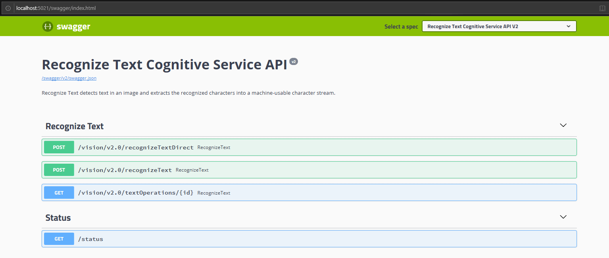
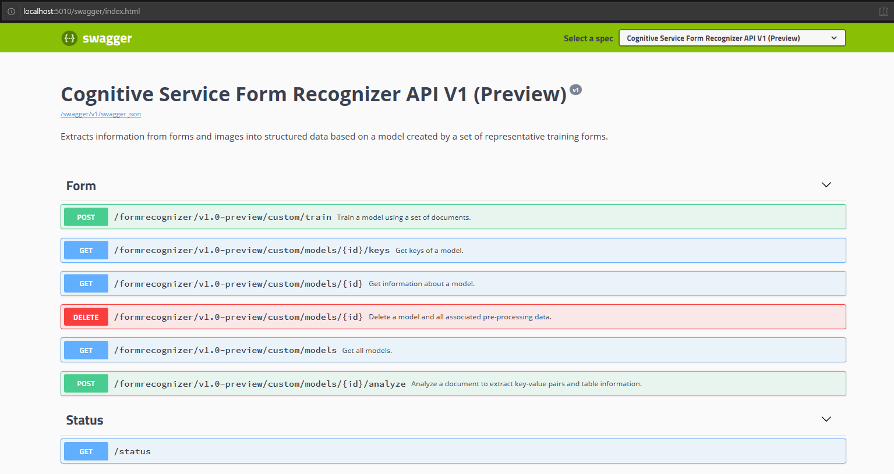

# Use multiple containers in a private network with Docker Compose

Learn how to deploy multiple Cognitive Services containers. This procedure shows you how to orchestrate multiple Docker container images with Docker Compose.

> [Docker Compose](https://docs.docker.com/compose/) is a tool for defining and running multi-container Docker applications. With Compose, you use a YAML file to configure your application’s services. Then, with a single command, you create and start all the services from your configuration.

When appropriate, orchestrating multiple container images on a single host computer can be compelling. In this article, we'll pull the Recognize Text service and Form Recognizer service together.

## Prerequisites

This procedure requires several tools that must be installed and run locally.

* Use an Azure subscription. If you don't have an Azure subscription, create a [free account](https://azure.microsoft.com/free/) before you begin.
* [Docker engine](https://www.docker.com/products/docker-engine) and validate that the Docker CLI works in a console window.
* An Azure resource with the correct pricing tier. Not all pricing tiers work with this container:
  * **Computer Vision** resource with F0 or Standard pricing tiers only.
  * **Form Recognizer** resource with F0 or Standard pricing tiers only.
  * **Cognitive Services** resource with the S0 pricing tier.

## Request access to the container registry

Complete and submit the [Cognitive Services Speech Containers Request form](https://aka.ms/speechcontainerspreview/) to request access to the container. 

[!INCLUDE [Request access to the container registry](../../../includes/cognitive-services-containers-request-access-only.md)]

[!INCLUDE [Authenticate to the container registry](../../../includes/cognitive-services-containers-access-registry.md)]

## Docker compose file

The YAML file defines all the services to be deployed. These services rely on either a `DockerFile` or an existing container image, in this case we'll use two preview images. Copy and paste the following YAML file and save it as *docker-compose.yaml*. Provide the appropriate _apikey_, _billing_, and _endpoint URI_ values in the _docker-compose.yml_ file below.

```yaml
version: '3.7'
services:
  forms:
    image: "containerpreview.azurecr.io/microsoft/cognitive-services-form-recognizer"
    environment:
       eula: accept
       billing: # < Your form recognizer billing URL >
       apikey: # < Your form recognizer API key >
       FormRecognizer__ComputerVisionApiKey: # < Your form recognizer API key >
       FormRecognizer__ComputerVisionEndpointUri: # < Your form recognizer URI >
    volumes:
       - type: bind
         source: e:\publicpreview\output
         target: /output
       - type: bind
         source: e:\publicpreview\input
         target: /input
    ports:
      - "5010:5000"

  ocr:
    image: "containerpreview.azurecr.io/microsoft/cognitive-services-recognize-text"
    environment:
      eula: accept
      apikey: # < Your recognize text API key >
      billing: # < Your recognize text billing URL >
    ports:
      - "5021:5000"
```

> [!IMPORTANT]
> Create the directories on the host machine that are specified under the `volumes` node. This is required as the directories must exist before attempting to mount an image with volume bindings.

## Start the configured docker compose services

A docker compose file enables the management of all the defined service's life-cycles; from starting/stopping and rebuilding services, viewing service status, and log streaming. Open a command-line interface from the project directory (where the *docker-compose.yaml* file sits).

> [!NOTE]
> To avoid errors, ensure that the host machine is correctly sharing drives with the **Docker Engine**. For example, if *e:\publicpreview* is used as a directory in the *docker-compose.yaml* share the *E Drive* with docker.

From the command-line interface, execute the following command to start (or restart) all the services defined in the *docker-compose.yaml*:

```console
docker-compose up
```

The first time executing the `docker-compose up` command with this configuration, **Docker** will pull the images configured under the `services` node -- downloading/mounting them:

```console
Pulling forms (containerpreview.azurecr.io/microsoft/cognitive-services-form-recognizer:)...
latest: Pulling from microsoft/cognitive-services-form-recognizer
743f2d6c1f65: Pull complete
72befba99561: Pull complete
2a40b9192d02: Pull complete
c7715c9d5c33: Pull complete
f0b33959f1c4: Pull complete
b8ab86c6ab26: Pull complete
41940c21ed3c: Pull complete
e3d37dd258d4: Pull complete
cdb5eb761109: Pull complete
fd93b5f95865: Pull complete
ef41dcbc5857: Pull complete
4d05c86a4178: Pull complete
34e811d37201: Pull complete
Pulling ocr (containerpreview.azurecr.io/microsoft/cognitive-services-recognize-text:)...
latest: Pulling from microsoft/cognitive-services-recognize-text
f476d66f5408: Already exists
8882c27f669e: Already exists
d9af21273955: Already exists
f5029279ec12: Already exists
1a578849dcd1: Pull complete
45064b1ab0bf: Download complete
4bb846705268: Downloading [=========================================>         ]  187.1MB/222.8MB
c56511552241: Waiting
e91d2aa0f1ad: Downloading [==============================================>    ]  162.2MB/176.1MB
```

The images are downloaded, then the image services are started.

```console
Starting docker_ocr_1   ... done
Starting docker_forms_1 ... doneAttaching to docker_ocr_1, docker_forms_1forms_1  | forms_1  | forms_1  | Notice: This Preview is made available to you on the condition that you agree to the Supplemental Terms of Use for Microsoft Azure Previews [https://go.microsoft.com/fwlink/?linkid=2018815], which supplement your agreement [https://go.microsoft.com/fwlink/?linkid=2018657] governing your use of Azure. If you do not have an existing agreement governing your use of Azure, you agree that your agreement governing use of Azure is the Microsoft Online Subscription Agreement [https://go.microsoft.com/fwlink/?linkid=2018755] (which incorporates the Online Services Terms [https://go.microsoft.com/fwlink/?linkid=2018760]). By using the Preview you agree to these terms.
forms_1  | 
forms_1  | 
forms_1  | Using '/input' for reading models and other read-only data.
forms_1  | Using '/output/forms/812d811d1bcc' for writing logs and other output data.
forms_1  | Logging to console.
forms_1  | Submitting metering to 'https://westus2.api.cognitive.microsoft.com/'.
forms_1  | WARNING: No access control enabled!
forms_1  | warn: Microsoft.AspNetCore.Server.Kestrel[0]
forms_1  |       Overriding address(es) 'http://+:80'. Binding to endpoints defined in UseKestrel() instead.
forms_1  | Hosting environment: Production
forms_1  | Content root path: /app/forms
forms_1  | Now listening on: http://0.0.0.0:5000
forms_1  | Application started. Press Ctrl+C to shut down.
ocr_1    | 
ocr_1    | 
ocr_1    | Notice: This Preview is made available to you on the condition that you agree to the Supplemental Terms of Use for Microsoft Azure Previews [https://go.microsoft.com/fwlink/?linkid=2018815], which supplement your agreement [https://go.microsoft.com/fwlink/?linkid=2018657] governing your use of Azure. If you do not have an existing agreement governing your use of Azure, you agree that your agreement governing use of Azure is the Microsoft Online Subscription Agreement [https://go.microsoft.com/fwlink/?linkid=2018755] (which incorporates the Online Services Terms [https://go.microsoft.com/fwlink/?linkid=2018760]). By using the Preview you agree to these terms.
ocr_1    |
ocr_1    | 
ocr_1    | Logging to console.
ocr_1    | Submitting metering to 'https://westcentralus.api.cognitive.microsoft.com/'.
ocr_1    | WARNING: No access control enabled!
ocr_1    | Hosting environment: Production
ocr_1    | Content root path: /
ocr_1    | Now listening on: http://0.0.0.0:5000
ocr_1    | Application started. Press Ctrl+C to shut down.
```

## Verify the service availability

[!INCLUDE [Tip for using docker list](../../../includes/cognitive-services-containers-docker-list-tip.md)]

Below is an example output:

```
IMAGE ID            REPOSITORY                                                                 TAG
2ce533f88e80        containerpreview.azurecr.io/microsoft/cognitive-services-form-recognizer   latest
4be104c126c5        containerpreview.azurecr.io/microsoft/cognitive-services-recognize-text    latest
```

### Test the recognize text container

Open a browser on the host machine and navigate to `localhost` with the specified port from the *docker-compose.yaml*, for example, `http://localhost:5021/swagger/index.html`. You can use the Try it feature of the API to test the recognize text endpoint.



### Test the form recognizer container

Open a browser on the host machine and navigate to `localhost` with the specified port from the *docker-compose.yaml*, for example, `http://localhost:5010/swagger/index.html`. You can use the Try it feature of the API to test the form recognizer endpoint.



## Next steps

> [!div class="nextstepaction"]
> [Cognitive Services Containers](../cognitive-services-container-support.md)