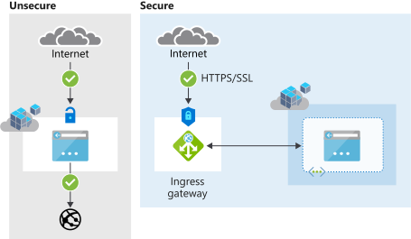

## Azure Cognitive Services container security

Security should be a primary focus whenever you're developing applications. The importance of security is a metric for success. When you're architecting a software solution that includes Cognitive Services containers, it's vital to understand the limitations and capabilities available to you. For more information about network security, see [Configure Azure Cognitive Services virtual networks][az-security].

> [!IMPORTANT]
> By default there is *no security* on the Cognitive Services container API. The reason for this is that most often the container will run as part of a pod which is protected from the outside by a network bridge. However, it is possible to enable authentication which works identically to the authentication used when accessing the [cloud-based Cognitive Services][request-authentication].

The diagram below illustrates the default and **non-secure** approach:

As an alternative and *secure* approach, consumers of Cognitive Services containers could augment a container with a front-facing component, keeping the container endpoint private. Let's consider a scenario where we use [Istio][istio] as an ingress gateway. Istio supports HTTPS/TLS and client-certificate authentication. In this scenario, the Istio frontend exposes the container access, presenting the client certificate that is whitelisted beforehand with Istio.

[Nginx][nginx] is another popular choice in the same category. Both Istio and Nginx act as a service mesh and offer additional features including things like load-balancing, routing, and rate-control.

### Container networking

The Cognitive Services containers are required to submit metering information for billing purposes. The only exception, is *Offline containers* as they follow a different billing methodology. Failure to allow list various network channels that the Cognitive Services containers rely on will prevent the container from working.

#### Allow list Cognitive Services domains and ports

The host should allow list **port 443** and the following domains:

* `*.cognitive.microsoft.com`
* `*.cognitiveservices.azure.com`

#### Disable deep packet inspection

> [Deep packet inspection](https://en.wikipedia.org/wiki/Deep_packet_inspection) (DPI) is a type of data processing that inspects in detail the data being sent over a computer network, and usually takes action by blocking, re-routing, or logging it accordingly.

Disable DPI on the secure channels that the Cognitive Services containers create to Microsoft servers. Failure to do so will prevent the container from functioning correctly.

[istio]: https://istio.io/
[nginx]: https://www.nginx.com
[request-authentication]: ../../authentication.md
[az-security]: ../../cognitive-services-virtual-networks.md
