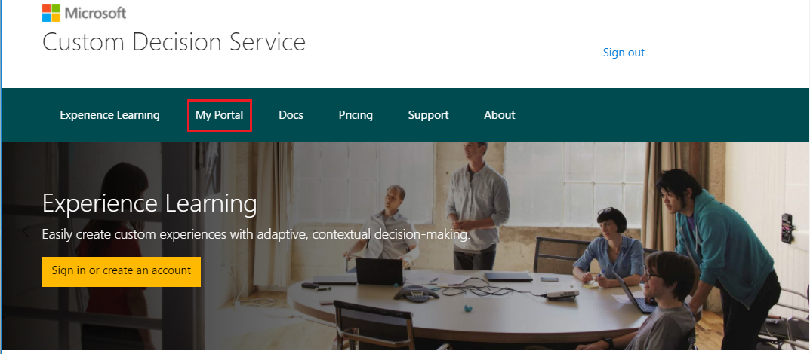
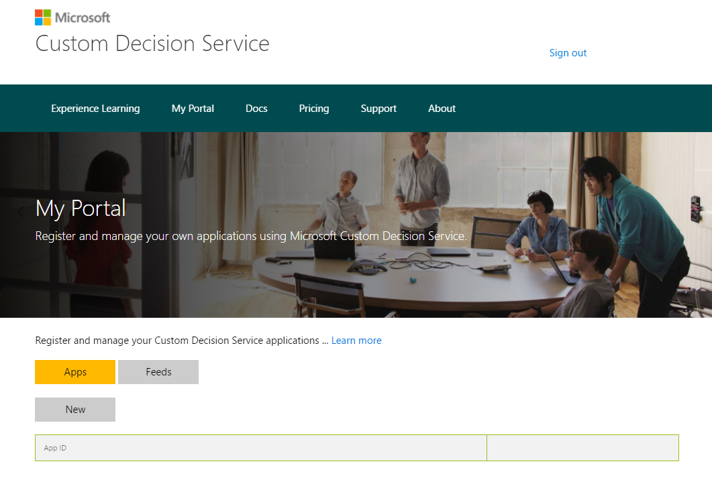

# Get started with Custom Decision Service (browser version)

This article explains how to get started with some basic options. The example here is for when you want to make calls to the Azure Custom Decision Service APIs directly from a browser.

## Register a new app on the portal

1.  To use Custom Decision Service for your application, register it on the portal. On the ribbon, click **My Portal**, as highlighted in the image:

    

    If you are not already signed in, the portal prompts you to sign in with your [Microsoft account](https://account.microsoft.com/account). After you have signed in, the portal displays your Microsoft account in the upper-right corner of the page.

2. To register your application, click the **New App** button. In this example, you register an application in the **pooled learning mode** as described in the [overview](custom-decision-service-overview.md#pooled-learning-mode). 

    

3. In the dialog box, choose an identifier for your application. Custom Decision Service requires a unique ID for each application. If someone else has already taken this ID, the system asks you to pick a different ID.

4. Specify an Action Set API. This setting is an RSS or Atom feed that communicates the available content for your application to Custom Decision Service. Enter a name for the feed, and enter the URL from which it is served. To do this step later, click the **Feeds** button and then click the **New Feed** button. An example that creates an RSS feed is described later.

5. To register your application in the [application-specific learning mode](custom-decision-service-overview.md#application-specific-learning-mode), select the **Advanced** check box in the lower-left corner. Enter a [connection string](../../storage/storage-configure-connection-string.md) for the Azure storage account where your application data is logged. For more information on how to create a storage account, see [How to create, manage, or delete a storage account](../../storage/storage-create-storage-account.md).

## Use the APIs

The APIs are fairly easy to use. (See the API reference for additional options and features.) Your application is modeled as having a front page, which links to several article pages. The front page uses Custom Decision Service to specify the ordering of the article pages. Insert the following code into the HTML head of the front page:

```html
// Define the "callback function" to render UI
<script> function callback(data) { … } </script>

// call Ranking API, after callback() is defined
<script src="https://ds.microsoft.com/<appId>/rank/<actionSetId>" async></script>
```

The `data` argument contains the ranking of URLs to be rendered. For more information, see the [API reference](custom-decision-service-api-reference.md).

To handle a click on the top article, invoke the following code on the front page:

```javascript
// call Reward API to report a click
$.ajax({
    type: "POST",
    url: '//ds.microsoft.com/<appId>/reward/' + data.eventId,,
    contentType: "application/json" })
```

Here `data` is the argument to the `callback()` function, as described previously. We provide an implementation example in the [tutorial](custom-decision-service-tutorial.md#use-the-apis).

Finally, you need to provide the Action Set API, which returns the list of articles (actions) to be considered by Custom Decision Service. Implement this API as an RSS feed, as shown here:

```xml
<rss version="2.0">
<channel>
   <item>
      <title><![CDATA[title (possibly with url) ]]></title>
      <link>url</link>
      <pubDate>Thu, 27 Apr 2017 16:30:52 GMT</pubDate>
    </item>
   <item>
       ....
   </item>
</channel>
</rss>
```

Here each top-level `<item>` element describes an article. `<link>` is mandatory and is used as an action ID by Custom Decision Service. Specify `<date>` (in a standard RSS format) if you have more than 15 articles. The 15 most recent articles are used. `<title>` is optional and is used to create text-related features for the article.
