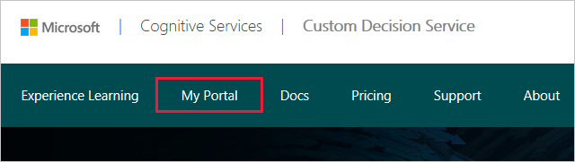

# Register your application

To use Custom Decision Service for your application, register it on the portal. This article explains how.

1. Go to the [front page](https://portal.ds.microsoft.com/) of Custom Decision Service. On the ribbon, click **My Portal**, as highlighted in the image:

    

    If you are not already signed in, the portal prompts you to sign in with your [Microsoft account](https://account.microsoft.com/account). After you have signed in, the portal displays your Microsoft account in the upper-right corner of the page.

2. To register your application, click the **New App** button.

3. In the dialog box, choose an App ID for your application. Custom Decision Service requires a unique ID for each application. If someone else has already taken this ID, the system asks you to pick a different one.

4. Specify an Action Set API. This setting is an RSS or Atom feed that communicates the available content for your application to Custom Decision Service. Enter a name for the feed, and enter the URL from which it is served. To do this step later, click the **Feeds** button and then click the **New feed** button. An example that creates an RSS feed is described later.

5. To register your application, select the **Custom App** check box in the lower-left corner. Enter a [connection string](../../storage/common/storage-configure-connection-string.md) for the Azure storage account where your application data is logged. For more information on how to create a storage account, see [How to create, manage, or delete a storage account](../../storage/common/storage-create-storage-account.md).

### Next steps

* Get started to optimize [a webpage](custom-decision-service-get-started-browser.md) or [a smartphone app](custom-decision-service-get-started-app.md).
* Work through a [tutorial](custom-decision-service-tutorial-news.md) for a more in-depth example.
* Consult the [API reference](custom-decision-service-api-reference.md) to learn more about the provided functionality.
