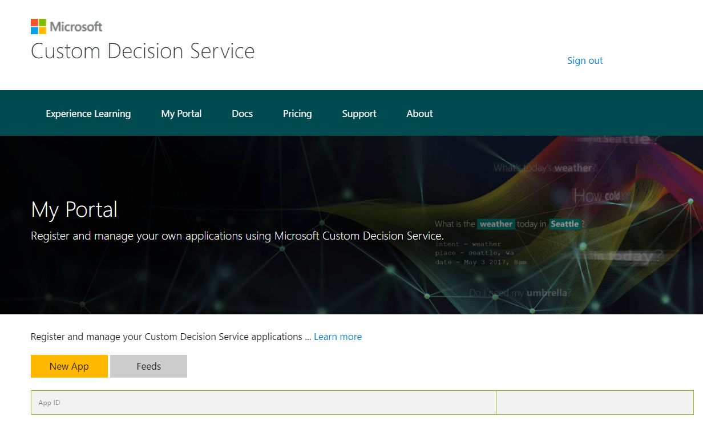
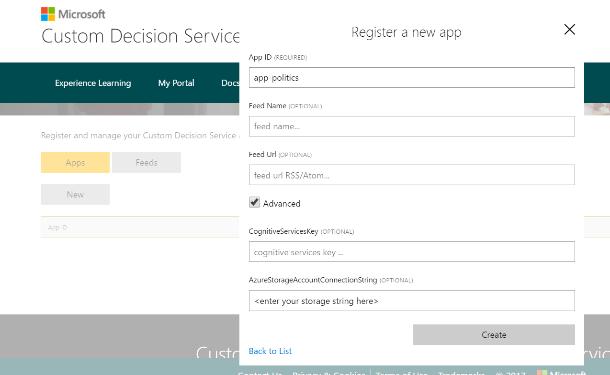
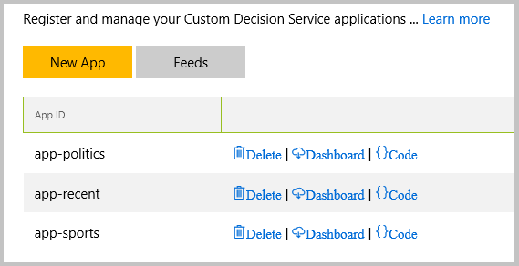
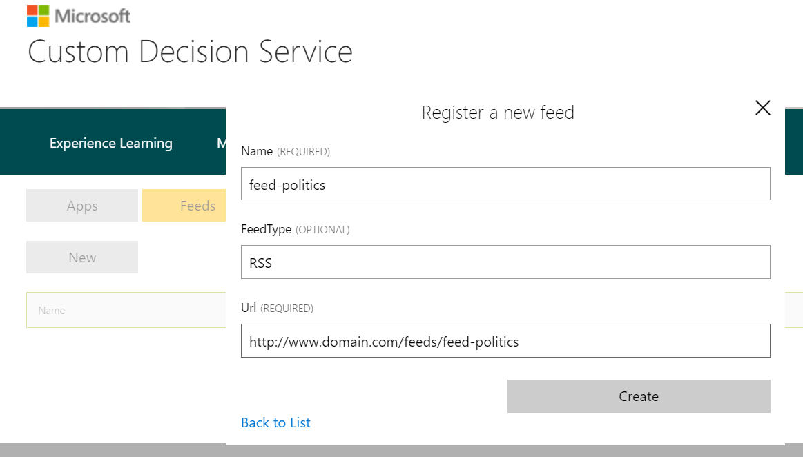
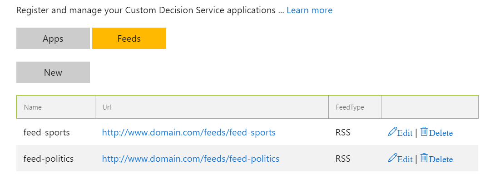

# Tutorial: Article personalization for contextual decision making

This tutorial focuses on personalizing the selection of articles on the front page of a website. The Custom Decision Service affects *multiple* lists of articles on the front page, for instance. Perhaps the page is a news website that covers only politics and sports. It would show three ranked lists of articles: politics, sports, and recent.

## Applications and action sets

Here's how to fit your scenario into the framework. Let's imagine three applications, one for each list that is being optimized:  app-politics, app-sports, and app-recent. To specify the candidate articles for each application, there are two action sets: one for politics and one for sports. The action set for app-recent comes automatically as a union of the other two sets.

> [!TIP]
> Action sets can be shared across applications in Custom Decision Service.

## Prepare action set feeds

Custom Decision Service consumes action sets via RSS or Atom feeds provided by the customer. You provide two feeds: one for politics and one for sports. Suppose they are served from
`http://www.domain.com/feeds/<feed-name>`.

Each feed provides a list of articles. In RSS, each one is specified by an `<item>` element, as follows:

```xml
<rss version="2.0"><channel>
   <item>
      <title><![CDATA[article title]]></title>
      <link>"article url"</link>
      <pubDate>publication date</pubDate>
    </item>
</channel></rss>
```

The order of articles matters. It specifies the default ranking, which is your best guess for how the articles should be ordered. The default ranking is then used for performance comparison on the [dashboard](#performance-dashboard).

For more information on the feed format, see the [API reference](custom-decision-service-api-reference.md#action-set-api-customer-provided).

## Register a new app

1. Sign in with your [Microsoft account](https://account.microsoft.com/account). On the ribbon, click **My Portal**.

2. To register a new application, click the **New App** button.

    

3. Enter a unique name for your application in the **App ID** text box. If this name is already in use by another customer, the system asks you to pick a different app ID. Select the **Advanced** check box, and enter the [connection string](../../storage/common/storage-configure-connection-string.md) for your Azure storage account. Normally, you use the same storage account for all your applications.

    

    After you register all three applications in the above scenario, they are listed:

    

    You can come back to this list by clicking the **Apps** button.

4. In the **New App** dialog box, specify an action feed. Action feeds can also be specified by clicking the **Feeds** button and then by clicking the **New Feed** button. Enter a **Name** for the new feed, enter the **URL** from which it is served, and enter the **Refresh Time**. The refresh time specifies how frequently Custom Decision Service should refresh the feed.

    

    Action feeds can be used by any app, regardless of where they're specified. After you specify both action feeds in a scenario, they are listed:

    

    You can come back to this list by clicking the **Feeds** button.

## Use the APIs

The Custom Decision Service ranks articles via the Ranking API. To use this API, insert the following code into the HTML head of the front page:

```html
<!-- Define the "callback function" to render UI -->
<script> function callback(data) { … } </script>

<!--  call Ranking API after callback() is defined, separately for each app -->
<script src="https://ds.microsoft.com/api/v2/app-politics/rank/feed-politics" async></script>
<script src="https://ds.microsoft.com/api/v2/app-sports/rank/feed-sports" async></script>
<script src="https://ds.microsoft.com/api/v2/app-recent/rank/feed-politics/feed-sports" async></script>
<!-- NB: action feeds for 'app-recent' are listed one after another. -->
```

The HTTP response from the Ranking API is a JSONP-formatted string. For app-politics, for example, the string looks like:

```json
callback({
   "ranking":[{"id":"url1"}, {"id":"url2"}, {"id":"url3"}],
   "eventId":"<opaque event string>",
   "appId":"app-politics",
   "actionSets":[{"id":"feed-politics","lastRefresh":"date"}] });
```

The browser then executes this string as a call to the `callback()` function. The `data` argument in the `callback()` function contains the app ID and the ranking of URLs to be rendered. In particular, `callback()` should use `data.appId` to distinguish between the three applications. `eventId` is used internally by Custom Decision Service to match the provided ranking with the corresponding click, if any.

> [!TIP]
> `callback()` might check each action feed for freshness by using the `lastRefresh` field. If a given feed is not sufficiently fresh, `callback()` might ignore the provided ranking, call this feed directly, and use the default ranking served by the feed.

For more information on specifications and additional options provided by the Ranking API, see the [API reference](custom-decision-service-api-reference.md).

The top article choices from the user are returned by calling the Reward API. When a top article choice is received, the following code should be invoked on the front page:

```javascript
$.ajax({
    type: "POST",
    url: '//ds.microsoft.com/api/v2/<appId>/reward/<eventId>',
    contentType: "application/json" })
```

Using `appId` and `eventId` in the click-handling code requires some care. For example, you can implement the `callback()` function as follows:

```javascript
function callback(data) {
    $.map(data.ranking, function (element) {
        //custom rendering function given content info
        render({appId:data.appId,
                article:element,
                onClick: element.id != data.rewardAction ? null :
                   function() {
                       $.ajax({
                       type: "POST",
                       url: '//ds.microsoft.com/api/v2/' + data.appId + '/reward/' + data.eventId,
                       contentType: "application/json" })}
                });
}}
```

In this example, implement the `render()` function to render a given article for a given application. This function inputs the app ID and the article (in the format from the Ranking API). The `onClick` parameter is the function that should be called from `render()` to handle a click. It checks whether the click is on the top slot. Then it calls the Reward API with the appropriate app ID and event ID.

## Next steps

* Consult the [API reference](custom-decision-service-api-reference.md) to learn more about the provided functionality.