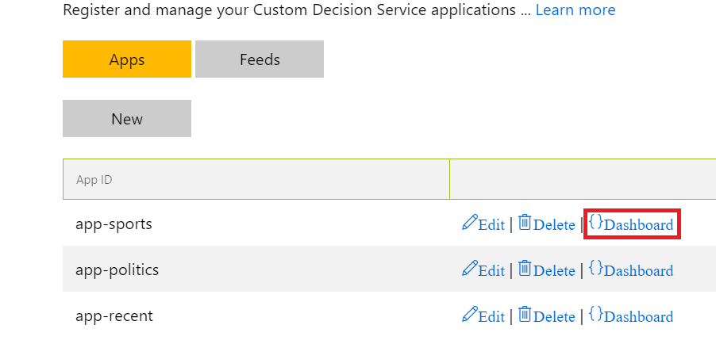
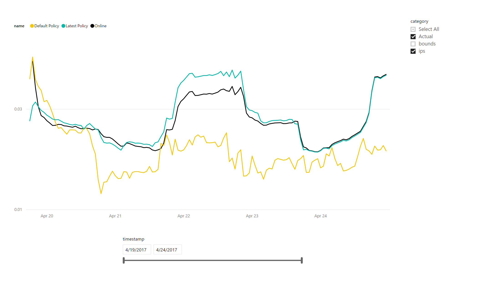
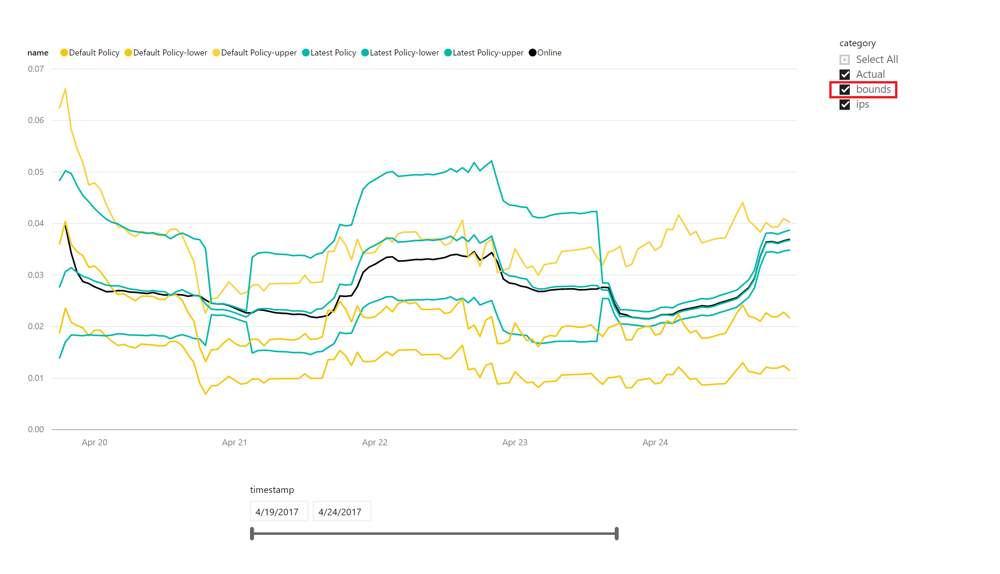

# Tutorial for Custom Decision Service

This tutorial focuses on personalizing the selection of articles on the front page of a website. We consider a typical scenario when Custom Decision Service is applied to *multiple* lists of articles on the same front page. For concreteness, suppose we have a news website that covers only politics and sports. This website features three ranked lists of articles: 'politics', 'sports', and 'recent'. We assume the news website has enough traffic for the [application-specific learning mode](custom-decision-service-overview.md#application-specific-learning-mode).

## Framing

First, let us explain how to fit your scenario into our framework. We create three applications, one for each list being optimized: respectively, 'app-politics', 'app-sports', and 'app-recent'. To specify the candidate articles for each application, we maintain two action sets: one for 'politics' and one for 'sports'. The action set for "app-recent" is obtained automatically as a union of the other two.

> [!TIP]
> Custom Decision Service allows action sets to be shared across applications.

## Prepare action set feeds

Custom Decision Service consumes action sets via RSS or Atom feeds provided by the customer. In our scenario, you need to provide two feeds: one for 'politics' and one for 'sports'. For concreteness, suppose they are served from
`http://www.domain.com/feeds/<feed-name>`.

Each feed provides a list of articles. In RSS, each article is specified by an `<item>` element as follows:

```xml
<rss version="2.0"><channel>
   <item>
      <title><![CDATA[article title]]></title>
      <link>"article url"</link>
      <pubDate>publication date</pubDate>
    </item>
</channel></rss>
```

The order of articles matters: it specifies the "default ranking", your best guess for how the articles should be ordered. The default ranking is then used for performance comparison on the [dashboard](#performance-dashboard).

For more information on the feed format, see [API reference](custom-decision-service-api-reference.md#action-set-api-customer-provided).

## Registration

Sign in with your [Microsoft Account](https://account.microsoft.com/account), and click *My Portal* menu item in the top ribbon.


To register a new application, click the "new app" button. Give your application a unique name and enter it in "app ID" field of the pop-up dialog. (The system may ask you to pick a different app id if this name is already in use by another customer.) Check "advanced" and enter the [connection string](../../storage/storage-configure-connection-string.md) for your Azure Storage account. Normally you would use the same Azure Storage account for all your applications


Once you register all three applications in our scenario, you should see them listed as follows:


(You can come back to this list by clicking the "Apps" button.)

You may use the "new app" dialog to specify an action feed. Action feeds can also be specified by clicking "feeds" button, and then "new feed" button.


Action feeds can be used by any app, regardless of whether they are specified. Once you specify both action feeds in our scenario, you should see them listed as follows:


(You can come back to this list by clicking the "feeds" button.)

## Our APIs

Custom Decision Service serves rankings of articles via Ranking API. To invoke this API, insert the following code into the HTML head of the front page.

```html
// Define the "callback function" to render UI
<script> function callback(data) { … } </script>

// call Ranking API after callback() is defined, separately for each app
<script src="https://ds.microsoft.com/app-politics/rank/feed-politics" async></script>
<script src="https://ds.microsoft.com/app-sports/rank/feed-sports" async></script>
<script src="https://ds.microsoft.com/app-recent/rank/feed-politics/feed-sports" async></script>
// NB: action feeds for 'app-recent' are listed one after another.
```

HTTP response from Ranking API is a JSONP-formatted string. For 'app-politics', for example, this string looks as follows.

```json
callback({
   "ranking":[{"id":"url1"}, {"id":"url2"}, {"id":"url3"}],
   "eventId":"<opaque event string>",
   "appId":"app-politics",
   "actionSets":[{"id":"feed-politics","lastRefresh":"date"}] });
```

The browser then executes this string as a call to `callback()` function. Thus, the `data` argument in `callback()` function contains the app id and the ranking of URLs to be rendered. In particular, `callback()` should use `data.appId` to distinguish between the three applications.

> [!TIP]
> `callback()` may check each action feed for freshness using `lastRefresh` field. If a given feed is not sufficiently fresh, `callback()` may ignore the provided ranking, call this feed directly, and use the default ranking served by the feed.

For more information on specifications and additional options provided by our APIs, see [API reference](custom-decision-service-api-reference.md).

## Performance dashboard

We provide a dashboard to track performance. To see the dashboard for a given app such as 'app-sports', go to the list of apps, as explained previously, and click "dashboard" link next to a given app.



The dashboard shows three plots:

- actual performance of Custom Decision Service ('online').
- counterfactual performance estimate for the default ranking: estimated performance if this ranking has been deployed ('default policy').
- counterfactual performance estimate for Custom Decision Service ('latest policy').

Counterfactual performance estimate for Custom Decision Service should closely track its online performance. We provide this plot as a check for our counterfactual evaluation methodology.



Y axis corresponds to rewards. Currently, a ranking is assigned reward 1 if top slot is clicked, and 0 otherwise. Rewards are expressed as running averages over a short time window: currently, one hour.

We also provide upper and lower confidence bounds for our counterfactual estimates. To see the upper/lower bounds, check the 'bounds' box in the right-hand corner.


