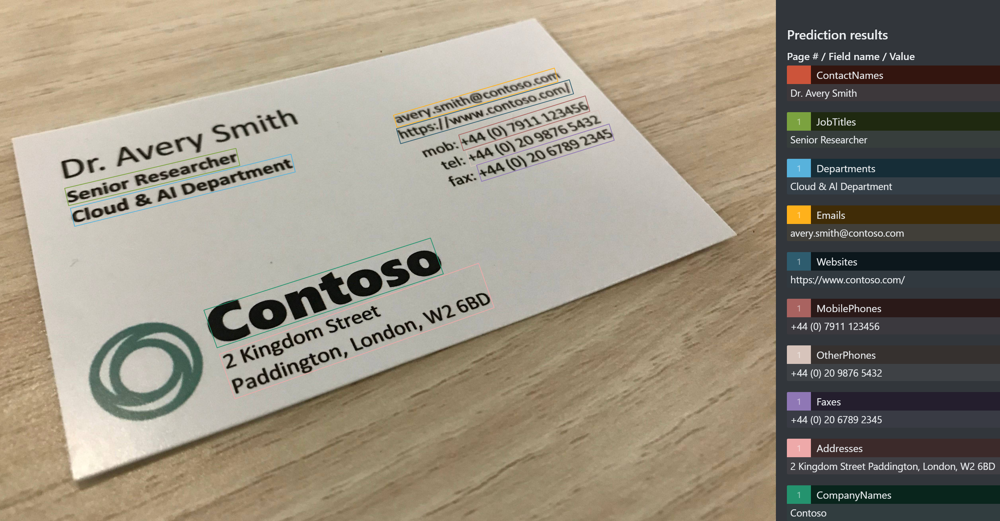

# Business card concepts

Azure Form Recognizer can analyze and extract contact information from business cards using one of its prebuilt models. The Business Card API combines powerful Optical Character Recognition (OCR) capabilities with our Business Card Understanding model to extract key information from business cards in English. It extracts personal contact info, company name, job title, and more. The Prebuilt Business Card API is publicly available in the Form Recognizer v2.1 preview. 

## What does the Business Card API do?

The Business Card API extracts key fields from business cards and returns them in an organized JSON response.


### Fields extracted:

* Contact names 
  * First names
  * Last names
* Company names 
* Departments 
* Job titles 
* Emails 
* Websites 
* Addresses 
* Phone numbers 
  * Mobile phones 
  * Faxes 
  * Work phones 
  * Other phones 

The Business Card API can also return all recognized text from the Business Card. This OCR output is included in the JSON response.  

### Input Requirements 

[!INCLUDE [input reqs](./includes/input-requirements-receipts.md)]

## The Analyze Business Card operation

The [Analyze Business Card](https://westcentralus.dev.cognitive.microsoft.com/docs/services/form-recognizer-api-v2-1-preview-1/operations/AnalyzeBusinessCardAsync) takes an image or PDF of a business card as the input and extracts the values of interest. The call returns a response header field called `Operation-Location`. The `Operation-Location` value is a URL that contains the Result ID to be used in the next step.

|Response header| Result URL |
|:-----|:----|
|Operation-Location | `https://cognitiveservice/formrecognizer/v2.1-preview.1/prebuilt/businessCard/analyzeResults/49a36324-fc4b-4387-aa06-090cfbf0064f` |

## The Get Analyze Business Card Result operation

The second step is to call the [Get Analyze Business Card Result](https://westcentralus.dev.cognitive.microsoft.com/docs/services/form-recognizer-api-v2-1-preview-1/operations/GetAnalyzeBusinessCardResult) operation. This operation takes as input the Result ID that was created by the Analyze Business Card operation. It returns a JSON response that contains a **status** field with the following possible values. You call this operation iteratively until it returns with the **succeeded** value. Use an interval of 3 to 5 seconds to avoid exceeding the requests per second (RPS) rate.

|Field| Type | Possible values |
|:-----|:----:|:----|
|status | string | notStarted: The analysis operation has not started.<br /><br />running: The analysis operation is in progress.<br /><br />failed: The analysis operation has failed.<br /><br />succeeded: The analysis operation has succeeded.|

When the **status** field has the **succeeded** value, the JSON response will include the business card understanding and optional text recognition results, if requested. The business card understanding result is organized as a dictionary of named field values, where each value contains the extracted text, normalized value, bounding box, confidence and corresponding word elements. The text recognition result is organized as a hierarchy of lines and words, with text, bounding box and confidence information.



### Sample JSON output

See the following example of a successful JSON response:
The "readResults" node contains all of the recognized text. Text is organized by page, then by line, then by individual words. The "documentResults" node contains the business-card-specific values that the model discovered. This is where you'll find useful contact information like the first name, last name, company name and more.

```json
{
	"status": "succeeded",
	"createdDateTime": "2020-08-20T17:41:19Z",
	"lastUpdatedDateTime": "2020-08-20T17:41:24Z",
	"analyzeResult": {
		"version": "2.1.0",
		"readResults": [
			{
				"page": 1,
				"angle": -17.0956,
				"width": 4032,
				"height": 3024,
				"unit": "pixel",
   				"lines": 
       					  {
						"text": "Dr. Avery Smith",
						"boundingBox": [
							419.3,
							1154.6,
							1589.6,
							877.9,
							1618.9,
							1001.7,
							448.6,
							1278.4
						],
						"words": [
							{
								"text": "Dr.",
								"boundingBox": [
									419,
							]
    
			}
		],
		"documentResults": [
			{
				"docType": "prebuilt:businesscard",
				"pageRange": [
					1,
					1
				],
				"fields": {
					"ContactNames": {
						"type": "array",
						"valueArray": [
							{
								"type": "object",
								"valueObject": {
									"FirstName": {
										"type": "string",
										"valueString": "Avery",
										"text": "Avery",
										"boundingBox": [
											703,
											1096,
											1134,
											989,
											1165,
											1109,
											733,
											1206
										],
										"page": 1
									},
									"LastName": {
										"type": "string",
										"valueString": "Smith",
										"text": "Smith",
										"boundingBox": [
											1186,
											976,
											1585,
											879,
											1618,
											998,
											1218,
											1096
										],
										"page": 1
									}
								},
								"text": "Dr. Avery Smith",
								"boundingBox": [
									419.3,
									1154.6,
									1589.6,
									877.9,
									1618.9,
									1001.7,
									448.6,
									1278.4
								],
								"confidence": 0.97
							}
						]
					},
					"JobTitles": {
						"type": "array",
						"valueArray": [
							{
								"type": "string",
								"valueString": "Senior Researcher",
								"text": "Senior Researcher",
								"boundingBox": [
									451.8,
									1301.9,
									1313.5,
									1099.9,
									1333.8,
									1186.7,
									472.2,
									1388.7
								],
								"page": 1,
								"confidence": 0.99
							}
						]
					},
					"Departments": {
						"type": "array",
						"valueArray": [
							{
								"type": "string",
								"valueString": "Cloud & Al Department",
								"text": "Cloud & Al Department",
								"boundingBox": [
									480.1,
									1403.3,
									1590.5,
									1129.6,
									1612.6,
									1219.6,
									502.3,
									1493.3
								],
								"page": 1,
								"confidence": 0.99
							}
						]
					},
					"Emails": {
						"type": "array",
						"valueArray": [
							{
								"type": "string",
								"valueString": "avery.smith@contoso.com",
								"text": "avery.smith@contoso.com",
								"boundingBox": [
									2107,
									934,
									2917,
									696,
									2935,
									764,
									2126,
									995
								],
								"page": 1,
								"confidence": 0.99
							}
						]
					},
					"Websites": {
						"type": "array",
						"valueArray": [
							{
								"type": "string",
								"valueString": "https://www.contoso.com/",
								"text": "https://www.contoso.com/",
								"boundingBox": [
									2121,
									1002,
									2992,
									755,
									3014,
									826,
									2143,
									1077
								],
								"page": 1,
								"confidence": 0.995
							}
						]
					},
					"MobilePhones": {
						"type": "array",
						"valueArray": [
							{
								"type": "phoneNumber",
								"text": "+44 (0) 7911 123456",
								"boundingBox": [
									2434.9,
									1033.3,
									3072,
									836,
									3096.2,
									914.3,
									2459.1,
									1111.6
								],
								"page": 1,
								"confidence": 0.99
							}
						]
					},
					"OtherPhones": {
						"type": "array",
						"valueArray": [
							{
								"type": "phoneNumber",
								"text": "+44 (0) 20 9876 5432",
								"boundingBox": [
									2473.2,
									1115.4,
									3139.2,
									907.7,
									3163.2,
									984.7,
									2497.2,
									1192.4
								],
								"page": 1,
								"confidence": 0.99
							}
						]
					},
					"Faxes": {
						"type": "array",
						"valueArray": [
							{
								"type": "phoneNumber",
								"text": "+44 (0) 20 6789 2345",
								"boundingBox": [
									2525,
									1185.4,
									3192.4,
									977.9,
									3217.9,
									1060,
									2550.5,
									1267.5
								],
								"page": 1,
								"confidence": 0.99
							}
						]
					},
					"Addresses": {
						"type": "array",
						"valueArray": [
							{
								"type": "string",
								"valueString": "2 Kingdom Street Paddington, London, W2 6BD",
								"text": "2 Kingdom Street Paddington, London, W2 6BD",
								"boundingBox": [
									1230,
									2138,
									2535.2,
									1678.6,
									2614.2,
									1903.1,
									1309,
									2362.5
								],
								"page": 1,
								"confidence": 0.977
							}
						]
					},
					"CompanyNames": {
						"type": "array",
						"valueArray": [
							{
								"type": "string",
								"valueString": "Contoso",
								"text": "Contoso",
								"boundingBox": [
									1152,
									1916,
									2293,
									1552,
									2358,
									1733,
									1219,
									2105
								],
								"page": 1,
								"confidence": 0.97
							}
						]
					}
				}
			}
		]
	}
}
```

Follow the [Extract business card data](./QuickStarts/python-business-cards.md) quickstart to implement business card data extraction using Python and the REST API.

## Customer Scenarios  

The data extracted with the Business Card API can be used to perform a variety of tasks. Extracting this contact info automatically saves time for those in client-facing roles. The following are a few examples of what our customers have accomplished with the Business Card API:

* Extract contact info from Business cards and quickly create phone contacts. 
* Integrate with CRM to automatically create contact using business card images. 
* Keep track of sales leads.  
* Extract contact info in bulk from existing business card images. 

The Business Card API also powers the [AIBuilder Business Card Processing feature](https://docs.microsoft.com/ai-builder/prebuilt-business-card).

## Next steps

- Follow the quickstart to get started [Business Cards API Python quickstart](./quickstarts/python-business-cards.md)
- Learn about the [Form Recognizer REST API](https://westcentralus.dev.cognitive.microsoft.com/docs/services/form-recognizer-api-v2-1-preview-1/operations/AnalyzeBusinessCardAsync)
- Learn more about [Form Recognizer](overview.md)

