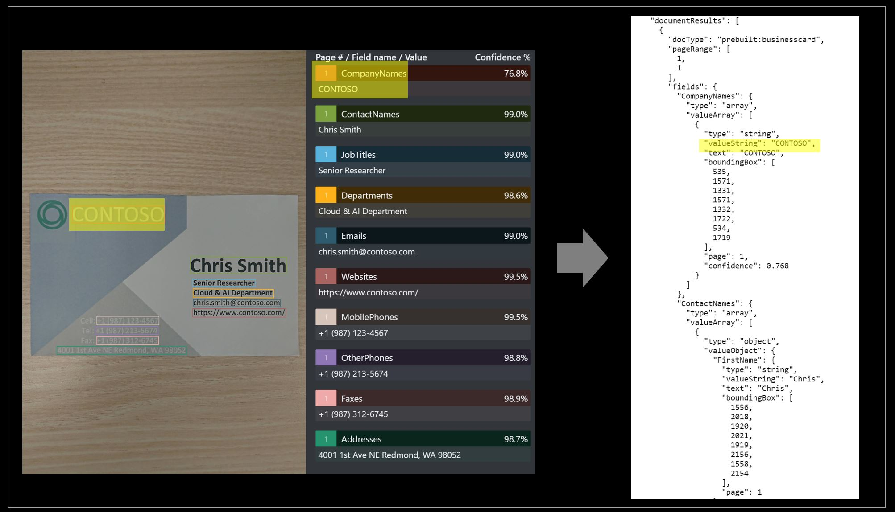

# Form Recognizer prebuilt business cards model

Azure Form Recognizer can analyze and extract contact information from business cards using its prebuilt business cards model. It combines powerful Optical Character Recognition (OCR) capabilities with our business card understanding model to extract key information from business cards in English. It extracts personal contact info, company name, job title, and more. The Prebuilt Business Card API is publicly available in the Form Recognizer v2.1.

## Customer scenarios

The data extracted with the Business Card API can be used to perform various tasks. Extracting this contact info automatically saves time for users in client-facing roles. The following are a few examples of what our customers have accomplished with the Business Card API:

* Extract contact info from Business cards and quickly create phone contacts.
* Integrate with CRM to automatically create contact using business card images.
* Keep track of sales leads.
* Extract contact info in bulk from existing business card images.

The Business Card API also powers the [AI Builder Business Card Processing feature](/ai-builder/prebuilt-business-card).


## Try it out

To try out the Form Recognizer receipt service, go to the online Sample UI Tool:

> [!div class="nextstepaction"]
> [Try Prebuilt Models](https://aka.ms/fott-2.1-ga)

## What does the Business Card service do?

The prebuilt Business Card API extracts key fields from business cards and returns them in an organized JSON response.



### Fields extracted:

|Name| Type | Description | Text | Value (standardized output) |
|:-----|:----|:----|:----|:----|
| ContactNames | array of objects | Contact name extracted from business card | [{ "FirstName": "Chris", "LastName": "Smith" }] | |
| FirstName | string | First (given) name of contact | "Chris" | "Chris" |
| LastName | string | Last (family) name of contact |     "Smith" | "Smith" |
| CompanyNames | array of strings | Company name extracted from business card | ["CONTOSO"] | CONTOSO |
| Departments | array of strings | Department or organization of contact | ["Cloud & Al Department"] | Cloud & Al Department |
| JobTitles | array of strings | Listed Job title of contact | ["Senior Researcher"] | Senior Researcher |
| Emails | array of strings | Contact email extracted from business card | ["chris.smith@contoso.com"] | chris.smith@contoso.com |
| Websites | array of strings | Website extracted from business card | ["https://www.contoso.com"] | https://www.contoso.com |
| Addresses | array of strings | Address extracted from business card | ["4001 1st Ave NE Redmond, WA 98052"] | 4001 1st Ave NE Redmond, WA 98052 |
| MobilePhones | array of phone numbers | Mobile phone number extracted from business card | ["+1 (987) 123-4567"] | +19871234567 |
| Faxes | array of phone numbers | Fax phone number extracted from business card | ["+1 (987) 312-6745"] | +19873126745 |
| WorkPhones | array of phone numbers | Work phone number extracted from business card | ["+1 (987) 213-5674"] | +19872135674 | 
| OtherPhones     | array of phone numbers | Other phone number extracted from business card | ["+1 (987) 213-5673"] | +19872135673 |


The Business Card API can also return all recognized text from the Business Card. This OCR output is included in the JSON response.

### Input Requirements

[!INCLUDE [input requirements](./includes/input-requirements-receipts.md)]

## Supported locales

**Pre-built business cards v2.1** supports the following locales: **en-us**, **en-au**, **en-ca**, **en-gb**, **en-in**

## The Analyze Business Card operation

The [Analyze Business Card](https://westus.dev.cognitive.microsoft.com/docs/services/form-recognizer-api-v2-1/operations/AnalyzeBusinessCardAsync) takes an image or PDF of a business card as the input and extracts the values of interest. The call returns a response header field called `Operation-Location`. The `Operation-Location` value is a URL that contains the Result ID to be used in the next step.

|Response header| Result URL |
|:-----|:----|
|Operation-Location | `https://westus.dev.cognitive.microsoft.com/docs/services/form-recognizer-api-v2-1/operations/AnalyzeBusinessCardAsync` |

## The Get Analyze Business Card Result operation

The second step is to call the [Get Analyze Business Card Result](https://westus.dev.cognitive.microsoft.com/docs/services/form-recognizer-api-v2-1/operations/GetAnalyzeBusinessCardResult) operation. This operation takes as input the Result ID that was created by the Analyze Business Card operation. It returns a JSON response that contains a **status** field with the following possible values. You call this operation iteratively until it returns with the **succeeded** value. Use an interval of 3 to 5 seconds to avoid exceeding the requests per second (RPS) rate.

|Field| Type | Possible values |
|:-----|:----:|:----|
|status | string | notStarted: The analysis operation has not started.<br /><br />running: The analysis operation is in progress.<br /><br />failed: The analysis operation has failed.<br /><br />succeeded: The analysis operation has succeeded.|

When the **status** field has the **succeeded** value, the JSON response will include the business card understanding and optional text recognition results, if requested. The business card understanding result is organized as a dictionary of named field values, where each value contains the extracted text, normalized value, bounding box, confidence, and corresponding word elements. The text recognition result is organized as a hierarchy of lines and words, with text, bounding box and confidence information.


### Sample JSON output

The response to the Get Analyze Business Card Result operation will be the structured representation of the business card with all the information extracted.  See here for a [sample business card file](https://github.com/Azure-Samples/cognitive-services-REST-api-samples/blob/master/curl/form-recognizer/business-card-english.jpg) and its structured output [sample business card output](https://github.com/Azure-Samples/cognitive-services-REST-api-samples/blob/master/curl/form-recognizer/business-card-result.json).

See the following example of a successful JSON response (the output has been shortened for simplicity):
* The `"readResults"` node contains all of the recognized text. Text is organized by page, then by line, then by individual words.
* The `"documentResults"` node contains the business-card-specific values that the model discovered. This is where you'll find useful contact information like the first name, last name, company name and more.

```json
{
	"status": "succeeded",
	"createdDateTime": "2021-05-27T02:18:35Z",
	"lastUpdatedDateTime": "2021-05-27T02:18:37Z",
	"analyzeResult": {
		"version": "2.1.0",
		"readResults": [
			{
				"page": 1,
				"angle": 0,
				"width": 703,
				"height": 1249,
				"unit": "pixel",
				"lines": [
					{
						"text": "CONTOSO",
						"boundingBox": [
							144,
							425,
							361,
							425,
							361,
							466,
							144,
							466
						],
						"words": [
							{
								"text": "CONTOSO",
								"boundingBox": [
									145,
									426,
									346,
									426,
									346,
									467,
									144,
									466
								],
								"confidence": 0.994
							}
						],
						"appearance": {
							"style": {
								"name": "other",
								"confidence": 0.878
							}
						}
					},
                    ...
                ]
            }
        ],   
		"documentResults": [
			{
				"docType": "prebuilt:businesscard",
				"pageRange": [
					1,
					1
				],
				"fields": {
					"Addresses": {
						"type": "array",
						"valueArray": [
							{
								"type": "string",
								"valueString": "4001 1st Ave NE Redmond, WA 98052",
								"text": "4001 1st Ave NE Redmond, WA 98052",
								"boundingBox": [
									108,
									755,
									410,
									755,
									410,
									775,
									108,
									775
								],
								"page": 1,
								"confidence": 0.987,
								"elements": [
									"#/readResults/0/lines/9/words/0",
									"#/readResults/0/lines/9/words/1",
									"#/readResults/0/lines/9/words/2",
									"#/readResults/0/lines/9/words/3",
									"#/readResults/0/lines/9/words/4",
									"#/readResults/0/lines/9/words/5",
									"#/readResults/0/lines/9/words/6"
								]
							}
						]
					},
					"CompanyNames": {
						"type": "array",
						"valueArray": [
							{
								"type": "string",
								"valueString": "CONTOSO",
								"text": "CONTOSO",
								"boundingBox": [
									145,
									426,
									346,
									426,
									346,
									467,
									144,
									466
								],
								"page": 1,
								"confidence": 0.986,
								"elements": [
									"#/readResults/0/lines/0/words/0"
								]
							}
						]
					},
					"ContactNames": {
						"type": "array",
						"valueArray": [
							{
								"type": "object",
								"valueObject": {
									"FirstName": {
										"type": "string",
										"valueString": "Chris",
										"text": "Chris",
										"boundingBox": [
											422,
											546,
											518,
											547,
											516,
											584,
											422,
											584
										],
										"page": 1,
										"elements": [
											"#/readResults/0/lines/1/words/0"
										]
									},
									"LastName": {
										"type": "string",
										"valueString": "Smith",
										"text": "Smith",
										"boundingBox": [
											526,
											547,
											644,
											546,
											641,
											584,
											524,
											584
										],
										"page": 1,
										"elements": [
											"#/readResults/0/lines/1/words/1"
										]
									}
								},
								"text": "Chris Smith",
								"boundingBox": [
									422,
									544.8,
									644,
									546,
									643.8,
									585.2,
									421.8,
									584
								],
								"page": 1,
								"confidence": 0.99,
								"elements": [
									"#/readResults/0/lines/1/words/0",
									"#/readResults/0/lines/1/words/1"
								]
							}
						]
					},
					"Departments": {
						"type": "array",
						"valueArray": [
							{
								"type": "string",
								"valueString": "Cloud & Al Department",
								"text": "Cloud & Al Department",
								"boundingBox": [
									427,
									619.5,
									618,
									621.6,
									617.8,
									641.6,
									426.8,
									639.5
								],
								"page": 1,
								"confidence": 0.989,
								"elements": [
									"#/readResults/0/lines/3/words/0",
									"#/readResults/0/lines/3/words/1",
									"#/readResults/0/lines/3/words/2",
									"#/readResults/0/lines/3/words/3"
								]
							}
						]
					},
					"Emails": {
						"type": "array",
						"valueArray": [
							{
								"type": "string",
								"valueString": "chris.smith@contoso.com",
								"text": "chris.smith@contoso.com",
								"boundingBox": [
									429,
									645,
									627,
									646,
									627,
									663,
									429,
									664
								],
								"page": 1,
								"confidence": 0.99,
								"elements": [
									"#/readResults/0/lines/4/words/0"
								]
							}
						]
					},
					"Faxes": {
						"type": "array",
						"valueArray": [
							{
								"type": "phoneNumber",
								"valuePhoneNumber": "+19873126745",
								"text": "+1 (987) 312-6745",
								"boundingBox": [
									200,
									732,
									345,
									732,
									345,
									752,
									200,
									752
								],
								"page": 1,
								"confidence": 0.99,
								"elements": [
									"#/readResults/0/lines/8/words/1",
									"#/readResults/0/lines/8/words/2",
									"#/readResults/0/lines/8/words/3"
								]
							}
						]
					},
					"JobTitles": {
						"type": "array",
						"valueArray": [
							{
								"type": "string",
								"valueString": "Senior Researcher",
								"text": "Senior Researcher",
								"boundingBox": [
									428,
									597.2,
									574,
									598,
									573.9,
									616,
									427.9,
									615.2
								],
								"page": 1,
								"confidence": 0.99,
								"elements": [
									"#/readResults/0/lines/2/words/0",
									"#/readResults/0/lines/2/words/1"
								]
							}
						]
					},
					"MobilePhones": {
						"type": "array",
						"valueArray": [
							{
								"type": "phoneNumber",
								"valuePhoneNumber": "+19871234567",
								"text": "+1 (987) 123-4567",
								"boundingBox": [
									201,
									685,
									348,
									685,
									348,
									706,
									201,
									706
								],
								"page": 1,
								"confidence": 0.995,
								"elements": [
									"#/readResults/0/lines/5/words/1",
									"#/readResults/0/lines/5/words/2",
									"#/readResults/0/lines/5/words/3"
								]
							}
						]
					},
					"Websites": {
						"type": "array",
						"valueArray": [
							{
								"type": "string",
								"valueString": "https://www.contoso.com/",
								"text": "https://www.contoso.com/",
								"boundingBox": [
									428,
									667,
									647,
									667,
									646,
									687,
									428,
									687
								],
								"page": 1,
								"confidence": 0.99,
								"elements": [
									"#/readResults/0/lines/6/words/0"
								]
							}
						]
					},
					"WorkPhones": {
						"type": "array",
						"valueArray": [
							{
								"type": "phoneNumber",
								"valuePhoneNumber": "+19872135674",
								"text": "+1 (987) 213-5674",
								"boundingBox": [
									198,
									709,
									344,
									709,
									344,
									729,
									198,
									729
								],
								"page": 1,
								"confidence": 0.985,
								"elements": [
									"#/readResults/0/lines/7/words/1",
									"#/readResults/0/lines/7/words/2",
									"#/readResults/0/lines/7/words/3"
								]
							}
						]
					}
				}
			}
		]
	}
}
```

## Next steps

* Try your own business cards and samples in the [Form Recognizer Sample UI](https://fott-preview.azurewebsites.net/).
* Complete a [Form Recognizer quickstart](quickstarts/client-library.md) to get started writing a business card processing app with Form Recognizer in the development language of your choice.
