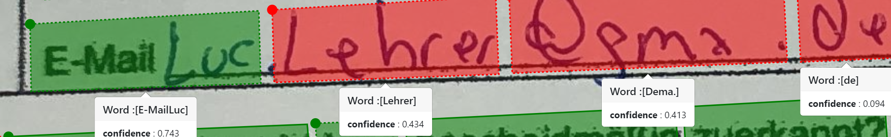

# Interpret Layout API JSON response

In this article, we'll discuss how to analyze and interpret the JSON object returned by Form Recognizer's Layout API. Form Recognizer can extract text, tables, selection marks, and structure information from documents using its Layout service. The Layout API extracts form data and returns an organized, structured JSON response using two operations:

* The [**Analyze Layout**](https://westcentralus.dev.cognitive.microsoft.com/docs/services/form-recognizer-api-v2-1-preview-3/operations/AnalyzeLayoutAsync) operation takes a document (image, TIFF, or PDF file) as the input and extracts the text, tables, selection marks, and structure of the document and returns a `resultID` to be used in the Get Analyze Layout Result operation.

* The [**Get Analyze Layout Result**](https://westcentralus.dev.cognitive.microsoft.com/docs/services/form-recognizer-api-v2-1-preview-3/operations/GetAnalyzeLayoutResult) operation takes as input the `resultID`  created by the Analyze Layout operation and returns a JSON response. At a high level, the JSON response is organized into three sections:

  * **readResults** - provides extracted text lines/words, selection marks (ex. check boxes), and basic information for each page of the input file.
  * **pageResults** - provides layout information for each page in the input file, such as data tables and key-value pairs.
  * **documentResults** - provides extracted semantic fields for each detected document in the input file.

## Supported Features

Each analyze operation outputs a subset of the results.

| Feature | Layout | Receipt / BusinessCard / IdDocument | Invoice | Custom (no labels) | Custom (labels) |
|---|:-:|:-:|:-:|:-:|:-:|
| Extracted text<br/>(#/readResults/*/lines) | ✔ | ✔ * | ✔ * | ✔ | ✔ |
| Selection marks<br/>(#/readResults/*/selectionMarks) | ✔ |   | ✔ | ✔ | ✔ |
| Data tables<br/>(#/pageResults/*/tables) | ✔ |   | ✔ | ✔ | ✔ |
| Key-value pairs<br/>(#/pageResults/*/keyValuePairs) |   |   |   | ✔ |   |
| Semantic fields<br/>(#/documentResults) |   | ✔ | ✔ |   | ✔ |

\* Available when includeTextDetails query parameter is set to true.

## Annotated JSON
Below is an annotated example of the different content in the analysis output JSON:
```jsonc
{
  "version": "2.1.0",

  // Extracted text, selection marks for each page in the input file.
  "readResults": [
    {
      // 1-based page number in the input file.
      "page": 1,  

      // The general orientation of the text in clockwise direction, 
      // measured in degrees between (-180, 180].
      "angle": 0.136,  

      // The width of the image/PDF in pixels/inches, respectively.
      "width": 8.2639,  

      // The height of the image/PDF in pixels/inches, respectively.
      "height": 11.6944,  

      // The unit used by the width, height and boundingBox properties:
      // pixel (jpeg/png/bmp/tiff), inch (PDF)
      "unit": "inch",  

      // List of text lines.
      "lines": [
        {
          // Extracted text from the text line.
          "text": "CUSTOMER REQUEST FORM",

          // Quadrangle bounding box describing the region covered by the text line,
          // where TopLeft is with respect to the text orientation.
          // [ TopLeft.X, TopLeft.Y, TopRight.X, TopRight.Y, BottomRight.X, BottomRight.Y, BottomLeft.X, BottomLeft.Y ]
          "boundingBox": [ 0.401, 1.6851, 2.9391, 1.6851, 2.9391, 1.8476, 0.401, 1.8476 ],

          // List of words in the text line.
          "words": [
            {
              // Extracted text from the word.
              "text": "CUSTOMER",

              // Quadrangle bounding box describing the region covered by the text word.
              "boundingBox": [ 0.4061, 1.6953, 1.4518, 1.6851, 1.4518, 1.8526, 0.401, 1.8526 ],

              // Estimated confidence of the text word.
              "confidence": 0.983
            },
            ...
          ],

          // Appearance properties of the text line.
          "appearance": {

            // General style of the text line.
            "style": {

              // Text style: handwriting, other (ex. print)
              "name": "other",

              // Estimated confidence of the predicted style.
              "confidence": 1
            }
          }          
        },
        ...
      ],

      // List of selection marks (ex. check boxes).
      "selectionMarks": [
        {
          // State of the selection mark: selected, unselected
          "state": "selected",

          // Quadrangle bounding box describing the region covered by the selection mark.
          "boundingBox": [ 0.401, 2.68, 0.4822, 2.68, 0.4822, 2.7713, 0.4061, 2.7764 ],

          // Estimated confidence of the selection mark.
          "confidence": 0.987
        },
        ...
      ]
    }
  ],

  // Layout information for each page in the input file.
  "pageResults": [
    {
      // 1-based page number in the input file.
      "page": 1,

      // List of data tables extracted from the page.
      "tables": [
        {
          // Number of rows.
          "rows": 6,

          // Number of columns.
          "columns": 4,

          // List of cells contained in the table.
          "cells": [
            {
              // Row index of the cell.
              "rowIndex": 0,

              // Column index of the cell.
              "columnIndex": 0,

              // Number of rows spanned by this cell (default=1).
              //"rowSpan": 1,

              // Number of columns spanned by this cell (default=1).
              //"columnSpan": 1,

              // Extracted cell text.
              "text": "ITEM",

              // Quadrangle bounding box describing the region covered by this cell.
              "boundingBox": [ 0.4438, 3.5183, 1.2886, 3.5183, 1.2886, 3.7697, 0.4438, 3.7697 ],

              // List of JsonPointer references to the words and selection marks constituting this cell.
              "elements": [ "#/readResults/0/lines/37/words/0" ]
            },
            ...
          ]
        },
        ...
      ],

      // List of key-value pairs extracted from the page.
      "keyValuePairs": [
        {
          // Extracted key.
          "key": {
            // Extracted key text.
            "text": "Name:",

            // Quadrangle bounding box describing the region covered by this key.
            "boundingBox": [ 2.5634, 3.2485, 2.9086, 3.2434, 2.9086, 3.3652, 2.5634, 3.3652 ],

            // List of JsonPointer references to the words constituting this key.
            "elements": [ "#/readResults/0/lines/33/words/0" ]
          },

          // Extracted value.
          "value": {
            // Extracted value text.
            "text": "John",

            // Quadrangle bounding box describing the region covered by this value.
            "boundingBox": [ 3, 3.2434, 3.2233, 3.2434, 3.2233, 3.3652, 3, 3.3652 ],

            // List of JsonPointer references to the words and selection marks constituting this value.
            "elements": [ "#/readResults/0/lines/33/words/1" ]
          },

          // Estimated confidence of the key-value pair.
          "confidence": 0.982
        },
        ...
      ]
    }
  ],

  // Extracted semantic fields for each detected document in the input file.
  "documentResults": [
    {
      // Detected document type.
      "docType": "prebuilt:invoice",

      // 1-based page number corresponding to the first and last page of the document.
      "pageRange": [ 1, 1 ],

      // Dictionary of detected semantic fields.
      "fields": {

        // Model-dependent name of the semantic field.
        "InvoiceTotal": {

          // Field data type: string, number, date, time, phoneNumber, country, gender, array, object
          "type": "number",

          // Semantic value normalized from the field text.
          "valueNumber": 14165.1,

          // Extracted field text.
          "text": "$14,165.10",

          // 1-based page number where the field is detected.
          "page": 1,

          // Quadrangle bounding box describing the region covered by the field.
          "boundingBox": [ 6.7708, 3.0641, 7.4781, 3.0688, 7.4734, 3.1961, 6.7708, 3.2055 ],

          // Estimated confidence of the field.
          "confidence": 0.949,

          // List of JsonPointer references to the words and selection marks constituting this field.
          "elements": [ "#/readResults/0/lines/15/words/0" ]
      },
      ...
    },
    ...
  ]
}
```

## Concepts (TODO: Need better name)

### Page Info
TODO: Picture of file with multiple pages, definition of width, height, and overall text angle.

### Text Line / Word

TODO: Visual representation of text line/word hierarchy.  Rough description of word as space delimited characters (with exception of CJK? need to verify).  Rough description of line as tab delimited words.  Include picture with examples.

### Selection Mark

TODO: Need a few visual examples of the types of selection marks we current support.

### Appearance

TODO: Not sure if we want to cover this right now.  If we do, just need a visual example and quick description.

### Table

TODO: Visual example of tables with rows/columns with row/column spans.  If we support isHeader, include examples.  Should document what types of tables we exclude (1 row or 1 column).  Consider describing how some tables are broken into multiple.  Indicate that we currently do not support multi-page tables.

### Key-Value Pair

TODO: Visual example of key-value pairs we currently extract.

### Document

TODO: Describe each document has a doc type with corresponding semantic schema.  Describe field types and their corresponding semantic normalization (links to ISO standards).  Additional description for array and object.

For each prebuilt doc type, link/include semantic schema similar to [Receipt service extracted fields](/azure/cognitive-services/form-recognizer/concept-receipts#fields-extracted) but using relative JsonPointer syntax structure.

### Bounding Box

TODO: Describe how bounding boxes are represented with 8 numbers and how top-left is defined.  Include example picture with tilted bounding box.

### Confidence

Products in the OneOCR family (including Form Recognizer) use a common term "confidence" across all fields that provide an analog measurement of the certainty of our prediction. For example, in our Layout service the "words" field has the member "confidence" which is a float in the range 0.0 to 1.0. We will explain what this number means and how it can be used.

Confidence values are estimates of certainty of a classification. To interpret this, consider an example prediction of a word with a confidence value of 0.80. What does this value mean? It means that 80% of the time we expect this prediction to be correct. That is a bit abstract when thinking of a single example. Thinking about confidence in the context of a collection of samples can help. Suppose you have 100 words and they all have confidence value greater than 0.80. Then we expect at least 80 of them will be correct. Furthermore, if they all have confidence value less than, say, 0.85, then we expect less than 85 of them will be correct. Therefore, if they all have confidence value equal to 0.8, we expect 80 to be correct. This may not be true for every collection of 100 words, but will average out to be true across data coming from all OCR domains.

How do we provide this? Our confidence values are [calibrated](https://en.wikipedia.org/wiki/Calibration_(statistics)) based on large datasets designed to represent the full range of data our models serve.

Whenever you see the term confidence used in a OneOCR product, this corresponds to a calibrated confidence value, and you can use it in that way. Depending on the output field, the confidence may refer to a different level of prediction:

* Text and selection mark is the confidence of the output value: the word or the selection state.
* For fields in custom forms, it is the confidence of the choice of value boxes corresponding to the proposed field.
* Future features may have a distinct level of confidence, which will be documented appropriately.

### Actionable uses of confidence: precision estimates and validation hints

So how can you use this confidence value in your workflow. Here we go through 2 scenarios which our customers can use confidence to manage uncertain in their solutions built in OneOCR.

* Suppose a customer wishes to achieve a fixed "maximum error rate" on a given field (such as word or form recognizer value prediction). Beyond this error rate, the customer will need to employ some human validation to ensure correctness of their solution. Then the confidence score can be used to prioritize the human resources. Here is a worked example:
  * Suppose a customer has an error tolerance of 3%. So in their application, it is acceptable to permit 3% of the solution output to be incorrect. This could be due to some downstream flexibility or their own SLAs. Then they can use the confidence score to estimate the amount of work necessary to (statistically) ensure they operate within this bound. First, they calculate the confidence scores of all samples in their data set. Then, they choose some precision level with which to bin the samples (we bind ours with stepsize 0.02 during calibration). For each sample that falls within that bin range, we will conservatively apply the lower confidence value to those samples. For each bin range b_i, indexed by the lower bound b_i, the predicted number of incorrect samples is (1.0 - b_i) * N_i. For example, if we look at bin (0.40, 0.42) where b_i = 0.4 and suppose N_i = 1000. Then we expect (1-0.4) * 1000 = 600 incorrect samples from this bin. For each bin, this calculation is done and an estimate is obtained for the total number of incorrect samples. They could then divide this number by the total number to get the estimated error rate of the straight-through solution. If this fall well below their requirement of 3%, they can safely bypass human validation. 
  * If error rate for the customer in the above example falls well above their target 3%, then they can choose an optimal cutoff for human-assisted validation. Let's say they allow the first 2% of error through and will use human validation for everything beyond that, aiming for a 1% error rate by the validators. Then they would choose a threshold b_j such that the weighted error sum for all bins above b_j is as close to (but less than) 2% as possible. This can be done on a holdout set of images from the customer's domain. 
* Suppose a new customer wishes to estimate the accuracy of our OCR predictions on their data, but they do not have a hand-labeled dataset with which to do so. Then the confidence score can be used as a proxy for the precision of our model on the dataset. Note that it cannot be used to estimate recall, since the confidence only applies to the words we have detected and returned.
  * The customer can compute the empirical confidence mean by the method described above: sum over i of b_i * N_i. This produces the estimated number of correct responses. We can divide this total by the total number of returned words to get an estimate of the precision. For example, in the example of the text in this textline we see that if we use bins of size 0.2 (for example) we will get bins starting at 0.0, 0.2, 0.4, 0.6, 0.8. The 0.0 bin contains "de", the 0.4 bin contains "Lehrer" and "Dema." and the 0.6 bin contains "E-mailLuc". So the calculation is: 1 * 0.0 + 0 * 0.2 + 2 * 0.4 + 1 * 0.6 + 0 * 0.8 = 1.4, which gives an estimate precision of 0.35 on this small dataset. In reality, 2 of the 4 predictions are correct (E-mailLuc is missing a space and Dema should be @sma) so the precision is 0.5.



```json
[
    {
    "boundingBox": [
        ...
    ],
    "text": "E-mailLuc",
    "confidence": 0.743
    },
    {
    "boundingBox": [
        ...
    ],
    "text": "Lehrer",
    "confidence": 0.434
    },
    {
    "boundingBox": [
        ...
    ],
    "text": "Dema.",
    "confidence": 0.413
    },
    {
    "boundingBox": [
        ...
    ],
    "text": "de",
    "confidence": 0.094
    }
]
```

## Limitations of confidence

As mentioned above, our confidence values are calibrated to estimate the confidence of each prediction based on Microsoft's datasets. These are built to reflect our customers' diversity, but they do not conform to any single customer's exact scenario. Thus, different customers may see different rates of validation failures than the confidence value suggests. It should be used as a guideline, from which a customer may base validation management decisions. Furthermore, for some customers with particularly challenging scenarios, we may not be "confident enough" in our predictions to meet their desired validation goals. We continually work to improve our products. As our products improve, we expect to enable more and more customers to achieve their goals, including with use of the confidence score.

### Elements
TODO: Describe JsonPoint references

## Semantic Schemas

#### Invoice

#### Receipt

| Field | Type | Description | Text | Value |
|-------|:----:|-------------|------|-------|
| ReceiptType | string | Type of sales receipt | Itemized |  |
| MerchantName | string | Name of the merchant issuing the receipt | Contoso |  |
| MerchantPhoneNumber | phoneNumber | Listed phone number of merchant | 987-654-3210 | +19876543210 |
| MerchantAddress | string | Listed address of merchant | 123 Main St Redmond WA 98052 |  |
| TransactionDate | date | Date the receipt was issued | June 06, 2019 | 2019-06-26  |
| TransactionTime | time | Time the receipt was issued | 4:49 PM | 16:49:00  |
| Total | number | Full transaction total of receipt | $14.34 | 14.34 |
| Subtotal | number | Subtotal of receipt, often before taxes are applied | $12.34 | 12.34 |
| Tax | number | Tax on receipt, often sales tax or equivalent | $2.34 | 2.34 |
| Tip | number | Tip included by buyer | $1.12 | 1.23 |
| Items | array of objects | Extracted line items, with name, quantity, unit price, and total price extracted | |
| Items/*/Name | string | Item name | Surface Pro 6 | |
| Items/*/Quantity | number | Quantity of each item | 2 | 2 |
| Items/*/Price | number | Individual price of each item unit | $999.99 | 999.99 |
| Items/*/TotalPrice | number | Total price of line item | $1,999.98 | 1999.98 |

#### Business Card

#### Id Document

