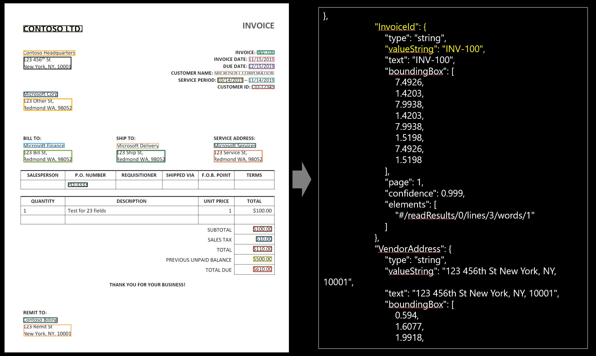
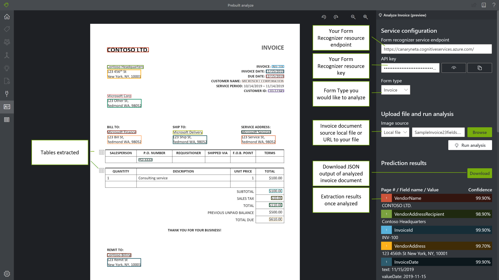

# Form Recognizer Pre-Built Invoice Service

Azure Form Recognizer can analyze and extract contact information from invoices using its invoice prebuilt models. The Invoice API enables customers to take invoices in a variety of formats and return structured data to automate the invoice processing. It combines our powerful [Optical Character Recognition (OCR)](https://docs.microsoft.com/en-us/azure/cognitive-services/computer-vision/concept-recognizing-text) capabilities with invoice understanding deep learning models to extract key information from invoices in English. It extracts the text, tables and information such as customer, vendor, invoice ID, invoice due date, total, invoice amount due, tax amount, ship to, bill to and lots more. The Prebuilt Invoice API is publicly available in the Form Recognizer v2.1 preview. 

## What does the Invoice service do?
The Invoice API extracts key fields from invoices and returns them in an organized structured JSON response. Invoices can be from a variety of formats and quality, including  phone-captured images, scanned documents, and digital PDFs. The invoice API will extract the structured output from all these invoices. 

## Try it out

To try out the Form Recognizer Invoice Service go the [Sample Labeling Tool online](https://fott-preview.azurewebsites.net/).

> [!div class="nextstepaction"]
> [Try Prebuilt Models](https://fott-preview.azurewebsites.net/)

You will need an Azure subscription [Create one for free](https://azure.microsoft.com/free/cognitive-services) and a [Form Recognzier resource](https://ms.portal.azure.com/#create/Microsoft.CognitiveServicesFormRecognizer) endpoint and key to try out the Form Recognizer Invoice service. 

### Fields extracted:
Following are the fields extracted from an invoice in the JSON output response (output below uses the following [sample invoice](https://../media/sample-invoice.jpg))  

|Name| Type | Description | Text | Value (standardized output) |
|:-----|:----|:----|:----| :----|
| CustomerName | string | Customer being invoiced | Microsoft Corp |  |
| CustomerId | string | Reference Id for the customer | CID-12345 |  |
| PurchaseOrder | string | A purchase order reference number | PO-3333 | |  |
| InvoiceId | string | Id for this specific invoice (often “Invoice Number”) | INV-100 | |  |
| InvoiceDate | date | Date the invoice was issued | 11/15/2019 | 
| DueDate | date | Date payment for this invoice is due | 12/15/2019 | 2019-12-15 | 2019-11-15 |
| VendorName | string | Vendor who has created this invoice | CONTOSO LTD. | |
| VendorAddress | string | Mailing address for the Vendor | 123 456th St New York, NY, 10001 | |
| VendorAddressRecipient | string | Name associated with the VendorAddress | Contoso Headquarters | |
| CustomerAddress | string | Mailing address for the Customer | 123 Other St, Redmond WA, 98052 | |
| CustomerAddressRecipient | string | Name associated with the CustomerAddress | Microsoft Corp | |
| BillingAddress | string | Explicit billing address for the customer | 123 Bill St, Redmond WA, 98052 | |
| BillingAddressRecipient | string | Name associated with the BillingAddress | Microsoft Services | |
| ShippingAddress | string | Explicit shipping address for the customer | 123 Ship St, Redmond WA, 98052 | |
| ShippingAddressRecipient | string | Name associated with the ShippingAddress | Microsoft Delivery | |
| SubTotal | number | Subtotal field identified on this invoice | $100.00 | 100 | 
| TotalTax | number | Total tax field identified on this invoice | $10.00 | 10 |
| InvoiceTotal | number | Total new charges associated with this invoice | $110.00 | 110 |
| AmountDue |  number | Total Amount Due to the vendor | $610.00 | 610 |
| ServiceAddress | string | Explicit service address or property address for the customer | 123 Service St, Redmond WA, 98052 | |
| ServiceAddressRecipient | string | Name associated with the ServiceAddress | Microsoft Services | |
| RemittanceAddress | string | Explicit remittance or payment address for the customer | 123 Remit St New York, NY, 10001 |  |
| RemittanceAddressRecipient | string | Name associated with the RemittanceAddress | Contoso Billing |  |
| ServiceStartDate | date | First date for the service period (for example, a utility bill service period) | 10/14/2019 | 2019-10-14 |
| ServiceEndDate | date | End date for the service period (for example, a utility bill service period) | 11/14/2019 | 2019-11-14 |
| PreviousUnpaidBalance | number | Explicit previously unpaid balance | $500.00 | 500 |

### Input Requirements 

[!INCLUDE [input reqs](./includes/input-requirements-receipts.md)]

## The Analyze Invoice operation

The [Analyze Invoice](https://westcentralus.dev.cognitive.microsoft.com/docs/services/form-recognizer-api-v2-1-preview-2/operations/AnalyzeInvoiceAsync) operation takes an image or PDF of an invoice as the input and extracts the values of interest. The call returns a response header field called `Operation-Location`. The `Operation-Location` value is a URL that contains the Result ID to be used in the next step.

|Response header| Result URL |
|:-----|:----|
|Operation-Location | `https://cognitiveservice/formrecognizer/v2.1-preview.2/prebuilt/invoice/analyzeResults/49a36324-fc4b-4387-aa06-090cfbf0064f` |

## The Get Analyze Invoice Result operation

The second step is to call the [Get Analyze Invoice Result](https://westcentralus.dev.cognitive.microsoft.com/docs/services/form-recognizer-api-v2-1-preview-2/operations/GetAnalyzeInvoiceResult) operation. This operation takes as input the Result ID that was created by the Analyze Invoice operation. It returns a JSON response that contains a **status** field with the following possible values. You call this operation iteratively until it returns with the **succeeded** value. Use an interval of 3 to 5 seconds to avoid exceeding the requests per second (RPS) rate.

|Field| Type | Possible values |
|:-----|:----:|:----|
|status | string | notStarted: The analysis operation has not started.  running: The analysis operation is in progress.  failed: The analysis operation has failed.  succeeded: The analysis operation has succeeded.|

When the **status** field has the **succeeded** value, the JSON response will include the invoice understanding results, tables extracted and optional text recognition results, if requested. The invoice understanding result is organized as a dictionary of named field values, where each value contains the extracted text, normalized value, bounding box, confidence and corresponding word elements. The text recognition result is organized as a hierarchy of lines and words, with text, bounding box and confidence information.

### Sample JSON output

The response to the Get Analyze Invoice Result operation will be the structured representation of the invoice with all the information extracted. 
See here for a [sample invoice file](./media/sample-invoice.jpg) and it's structured output [sample invoice output](./media/sample-invoice-output.json).

The JSON output has 3 parts: 
1. "readResults" node contains all of the recognized text and selection marks. Text is organized by page, then by line, then by individual words. 
2. "pageResults" node contains the tables and cells extracted with their bounding boxes, confidence and a reference to the lines and words in "readResults".
2. "documentResults" node contains the invoice specific values that the model discovered. This is where you'll find all the fields from the invoice such as invoice ID, ship to, bill to, customer, total and lots more.

## Next steps
Try your own invoices and samples in the [Form Recognizer Sample Labeling Tool](https://fott-preview.azurewebsites.net/).
Follow the [Extract invoice data](./QuickStarts/python-invoice.md) quickstart to implement invoice data extraction using Python and the REST API.

## See also
* [What is Form Recognizer?](./overview.md)
* [REST API reference docs](https://westcentralus.dev.cognitive.microsoft.com/docs/services/form-recognizer-api-v2-1-preview-2/operations/AnalyzeInvoiceAsync)

