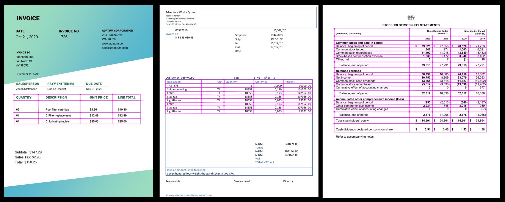

# Form Recognizer Layout service

Azure Form Recognizer can extract text, tables, selection marks, and structure information from documents using its Layout service. The Layout API enables customers to take documents in a variety of formats and return structured data and representation of the document. It combines our powerful [Optical Character Recognition (OCR)](https://docs.microsoft.com/azure/cognitive-services/computer-vision/concept-recognizing-text) capabilities with document understanding deep learning models to extract text, tables, selection marks, and structure of documents. 

## What does the Layout service do?

The Layout API extracts text, tables, selection marks, and structure information from documents with exceptional accuracy and returns them in an organized structured JSON response. Documents can be from a variety of formats and quality, including  phone-captured images, scanned documents, and digital PDFs. The Layout API will extract the structured output from all of these documents.

## Try it out

To try out the Form Recognizer Layout Service, go to the online sample UI tool:

> [!div class="nextstepaction"]
> [Sample UI](https://fott-preview.azurewebsites.net/)

You will need an Azure subscription ([create one for free](https://azure.microsoft.com/free/cognitive-services)) and a [Form Recognizer resource](https://ms.portal.azure.com/#create/Microsoft.CognitiveServicesFormRecognizer) endpoint and key to try out the Form Recognizer Layout API. 

### Input requirements 

[!INCLUDE [input requirements](./includes/input-requirements-receipts.md)]

## The Analyze Layout operation

The [Analyze Layout](https://westcentralus.dev.cognitive.microsoft.com/docs/services/form-recognizer-api-v2-1-preview-2/operations/AnalyzeLayoutAsync) operation takes a document (image, TIFF, or PDF file) as the input and extracts the text, tables, selection marks, and structure of the document. The call returns a response header field called `Operation-Location`. The `Operation-Location` value is a URL that contains the Result ID to be used in the next step.

|Response header| Result URL |
|:-----|:----|
|Operation-Location | `https://cognitiveservice/formrecognizer/v2.1-preview.2/prebuilt/layout/analyzeResults/44a436324-fc4b-4387-aa06-090cfbf0064f` |

## The Get Analyze Layout Result operation

The second step is to call the [Get Analyze Layout Result](https://westcentralus.dev.cognitive.microsoft.com/docs/services/form-recognizer-api-v2-1-preview-2/operations/GetAnalyzeLayoutResult) operation. This operation takes as input the Result ID that was created by the Analyze Layout operation. It returns a JSON response that contains a **status** field with the following possible values. 

|Field| Type | Possible values |
|:-----|:----:|:----|
|status | string | `notStarted`: The analysis operation has not started.  `running`: The analysis operation is in progress.  `failed`: The analysis operation has failed.  `succeeded`: The analysis operation has succeeded.|

You call this operation iteratively until it returns with the `succeeded` value. Use an interval of 3 to 5 seconds to avoid exceeding the requests per second (RPS) rate.

When the **status** field has the `succeeded` value, the JSON response will include the layout extraction results, text, tables, and selection marks extracted. The extracted data contains the extracted text lines and words, bounding box, text appearance handwritten indication, tables, and selection marks with an indication of selected/unselected. 

### Sample JSON output

The response to the Get Analyze Layout Result operation will be the structured representation of the document with all the information extracted. 
See here for a [sample document file](https://github.com/Azure-Samples/cognitive-services-REST-api-samples/tree/master/curl/form-recognizer/sample-layout.pdf) and its structured output [sample layout output](https://github.com/Azure-Samples/cognitive-services-REST-api-samples/tree/master/curl/form-recognizer/sample-layout-output.json).

The JSON output has two parts: 
* `"readResults"` node contains all of the recognized text and selection marks. Text is organized by page, then by line, then by individual words. 
* `"pageResults"` node contains the tables and cells extracted with their bounding boxes, confidence, and a reference to the lines and words in "readResults".

## Example Output

### Text

Layout extracts text from documents (PDF, TIFF) and images (jpg, png, bmp) with different text angles, colors, angles, photos of documents, faxes, printed, handwritten (English only) and mixed modes. Text is extracted with information on lines, words, bounding boxes, confidence scores, and style (handwritten or other). All the text information is included in the `"readResults"` section of the JSON output. 

### Tables

Layout extracts tables from documents (PDF, TIFF) and images (jpg, png, bmp). Documents can be scanned, photographed, or digitized. Tables can be complex tables with merged cells or columns, with or without borders, and with odd angles. Extracted tables include the number of columns and rows, row span, and column span. Each cell is extracted with its bounding box and reference to the text extracted in the `"readResults"` section. Table information is located in the `"pageResults"` section of the JSON output. 

### Selection marks

Layout also extracts selection marks from documents. Selection marks extracted include the bounding box, confidence, and state (selected/unselected). Selection mark information is extracted in the `"readResults"` section of the JSON output. 

## Next steps

- Try your own layout extraction using the [Form Recognizer Sample UI](https://fott-preview.azurewebsites.net/)
- Complete a [Form Recognizer client library quickstart](quickstarts/client-library.md) to get started extracting layouts in the language of your choice.
- Or, follow the [Extract Layout data](./QuickStarts/python-layout.md) quickstart to implement layout data extraction using Python and the REST API.

## See also

* [What is Form Recognizer?](./overview.md)
* [REST API reference docs](https://westcentralus.dev.cognitive.microsoft.com/docs/services/form-recognizer-api-v2-1-preview-2/operations/AnalyzeLayoutAsync)

