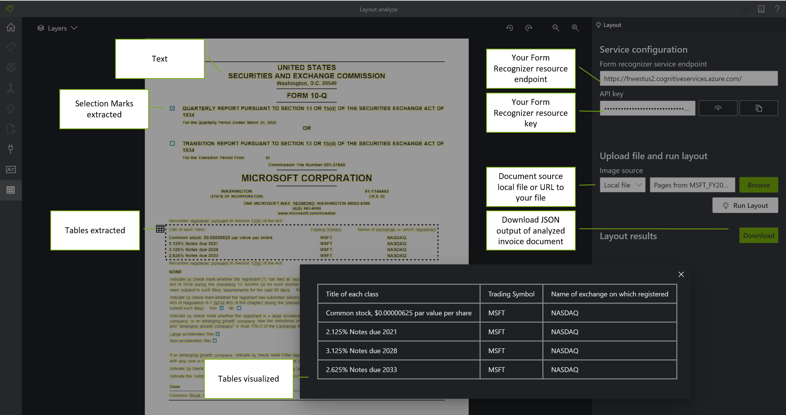

# Form Recognizer Layout service

Azure Form Recognizer's Layout API extracts text, tables, selection marks, and structure information from documents (PDF, TIFF) and images (JPG, PNG, BMP). It enables customers to take documents in a variety of formats and return structured data representations of the documents. It combines an enhanced version of our powerful [Optical Character Recognition (OCR)](../computer-vision/overview-ocr.md) capabilities with deep learning models to extract text, tables, selection marks, and document structure.

## What does the Layout service do?

The Layout API extracts text, tables with table headers included, selection marks, and structure information from documents with exceptional accuracy and returns an organized, structured, JSON response. Documents can be of a variety of formats and quality, including  phone-captured images, scanned documents, and digital PDFs. The Layout API will accurately extract the structured output from all of these documents.

## Try it

To try out the Form Recognizer Layout Service, go to the online sample UI tool:

> [!div class="nextstepaction"]
> [Try layout model](https://aka.ms/fott-2.1-ga "Start with the layout prebuilt model to extract data from your forms.")

You will need an Azure subscription ([create one for free](https://azure.microsoft.com/free/cognitive-services)) and a [Form Recognizer resource](https://ms.portal.azure.com/#create/Microsoft.CognitiveServicesFormRecognizer) endpoint and key to try out the Form Recognizer Layout API.

## Input requirements

[!INCLUDE [input requirements](./includes/input-requirements-receipts.md)]

## Analyze Layout

First, call the [Analyze Layout](https://westcentralus.dev.cognitive.microsoft.com/docs/services/form-recognizer-api-v2-1/operations/AnalyzeLayoutAsync) operation. Analyze Layout takes a document (image, TIFF, or PDF file) as the input and extracts the text, tables, selection marks, and structure of the document. The call returns a response header field called `Operation-Location`. The `Operation-Location` value is a URL that contains the Result ID to be used in the next step.

|Response header| Result URL |
|:-----|:----|
|Operation-Location | `https://cognitiveservice/formrecognizer/v2.1/layout/analyzeResults/{resultId}' |

## Get Analyze Layout Result

The second step is to call the [Get Analyze Layout Result](https://westcentralus.dev.cognitive.microsoft.com/docs/services/form-recognizer-api-v2-1/operations/GetAnalyzeLayoutResult) operation. This operation takes as input the Result ID that was created by the Analyze Layout operation. It returns a JSON response that contains a **status** field with the following possible values.

|Field| Type | Possible values |
|:-----|:----:|:----|
|status | string | `notStarted`: The analysis operation has not started.  `running`: The analysis operation is in progress.  `failed`: The analysis operation has failed.  `succeeded`: The analysis operation has succeeded.|

Call this operation iteratively until it returns the `succeeded` value. Use an interval of 3 to 5 seconds to avoid exceeding the requests per second (RPS) rate.

When the **status** field has the `succeeded` value, the JSON response will include the extracted layout, text, tables, and selection marks. The extracted data includes extracted text lines and words, bounding boxes, text appearance with handwritten indication, tables, and selection marks with selected/unselected indicated.

## Sample JSON output

The response to the *Get Analyze Layout Result* operation is a structured representation of the document with all the information extracted.
See here for a [sample document file](https://github.com/Azure-Samples/cognitive-services-REST-api-samples/tree/master/curl/form-recognizer/sample-layout.pdf) and its structured output [sample layout output](https://github.com/Azure-Samples/cognitive-services-REST-api-samples/tree/master/curl/form-recognizer/sample-layout-output.json).

The JSON output has two parts:

* `readResults` node contains all of the recognized text and selection marks. Text is organized by page, then by line, then by individual words.
* `pageResults` node contains the tables and cells extracted with their bounding boxes, confidence, and a reference to the lines and words in "readResults".

## Features

### Tables and table headers

Layout API extracts tables in the `pageResults` section of the JSON output. Documents can be scanned, photographed, or digitized. Tables can be complex with merged cells or columns, with or without borders, and with odd angles. Extracted table information includes the number of columns and rows, row span, and column span. Each cell with its bounding box is output along with information whether it's recognized as part of a header or not. The model predicted header cells can span multiple rows and are not necessarily the first rows in a table. They also work with rotated tables. Each table cell also includes the full text with references to the individual words in the `readResults` section.

:::image type="content" source="./media/layout-table-headers-example.png" alt-text="Layout table headers output":::

### Selection marks

Layout API also extracts selection marks from documents. Extracted selection marks include the bounding box, confidence, and state (selected/unselected). Selection mark information is extracted in the `readResults` section of the JSON output.

:::image type="content" source="./media/layout-selection-marks.png" alt-text="Layout selection marks output":::

### Text lines and words

Layout API extracts text from documents and images with multiple text angles and colors. It accepts photos of documents, faxes, printed and/or handwritten (English only) text, and mixed modes. Text is extracted with information provided on lines, words, bounding boxes, confidence scores, and style (handwritten or other). All the text information is included in the `readResults` section of the JSON output.

:::image type="content" source="./media/layout-text-extraction.png" alt-text="Layout text extraction output":::

### Natural reading order for text lines (Latin only)

You can specify the order in which the text lines are output with the `readingOrder` query parameter. Use `natural` for a more human-friendly reading order output as shown in the following example. This feature is only supported for Latin languages.

:::image type="content" source="./media/layout-reading-order-example.png" alt-text="Layout Reading order example" lightbox="../Computer-vision/Images/ocr-reading-order-example.png":::

### Handwritten classification for text lines (Latin only)

The response includes classifying whether each text line is of handwriting style or not, along with a confidence score. This feature is only supported for Latin languages. The following example shows the handwritten classification for the text in the image.

:::image type="content" source="./media/layout-handwriting-classification.png" alt-text="handwriting classification example":::

### Select page numbers or ranges for text extraction

For large multi-page documents, use the `pages` query parameter to indicate specific page numbers or page ranges for text extraction. The following example shows a document with 10 pages, with text extracted for both cases - all pages (1-10) and selected pages (3-6).

:::image type="content" source="./media/layout-select-pages-for-text.png" alt-text="Layout selected pages output":::

## Next steps

* Try your own layout extraction using the [Form Recognizer Sample UI tool](https://aka.ms/fott-2.1-ga)
* Complete a [Form Recognizer quickstart](quickstarts/client-library.md#analyze-layout) to get started extracting layouts in the development language of your choice.

## See also

* [What is Form Recognizer?](./overview.md)
* [REST API reference docs](https://westcentralus.dev.cognitive.microsoft.com/docs/services/form-recognizer-api-v2-1/operations/AnalyzeLayoutAsync)
