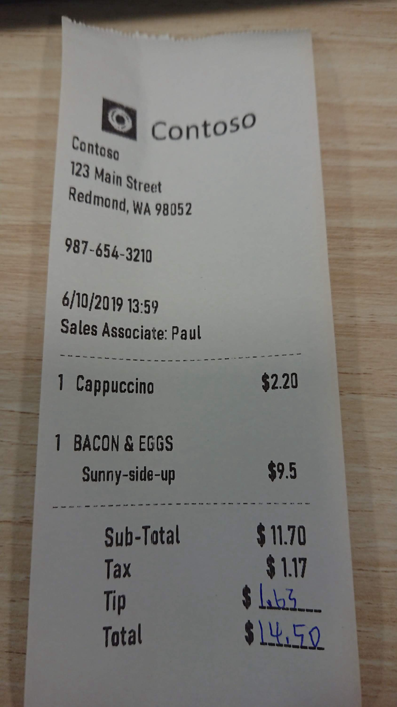

<!-- markdownlint-disable MD001 -->
<!-- markdownlint-disable MD024 -->
<!-- markdownlint-disable MD033 -->
<!-- markdownlint-disable MD034 -->
> [!NOTE]
> This guide uses cURL to execute REST API calls.

| [Form Recognizer REST API](https://westus.dev.cognitive.microsoft.com/docs/services/form-recognizer-api-v2-1-preview-3/operations/AnalyzeWithCustomForm)|[Azure REST API reference](/rest/api/azure/)|[Samples](https://github.com/Azure-Samples/cognitive-services-REST-api-samples/tree/master/curl/form-recognizer)|

## Prerequisites

* [cURL](https://curl.haxx.se/windows/) installed.
* [PowerShell version 6.0+](/powershell/scripting/install/installing-powershell-core-on-windows), or a similar command-line application.
* Azure subscription - [Create one for free](https://azure.microsoft.com/free/cognitive-services/)
* An Azure Storage blob that contains a set of training data. See [Build a training data set for a custom model](../../build-training-data-set.md) for tips and options for putting together your training data set. For this quickstart, you can use the files under the **Train** folder of the [sample data set](https://go.microsoft.com/fwlink/?linkid=2090451) (download and extract *sample_data.zip*).
* Once you have your Azure subscription, <a href="https://ms.portal.azure.com/#create/Microsoft.CognitiveServicesFormRecognizer"  title="Create a Form Recognizer resource"  target="_blank">create a Form Recognizer resource </a> in the Azure portal to get your key and endpoint. After it deploys, click **Go to resource**.
  * You will need the key and endpoint from the resource you create to connect your application to the Form Recognizer API. You'll paste your key and endpoint into the code below later in the quickstart.
  * You can use the free pricing tier (`F0`) to try the service, and upgrade later to a paid tier for production.
* A URL for an image of a receipt. You can use a [sample image](https://raw.githubusercontent.com/Azure-Samples/cognitive-services-REST-api-samples/master/curl/form-recognizer/contoso-allinone.jpg) for this quickstart.
* A URL for an image of a business card. You can use a [sample image](https://raw.githubusercontent.com/Azure/azure-sdk-for-python/master/sdk/formrecognizer/azure-ai-formrecognizer/samples/sample_forms/business_cards/business-card-english.jpg) for this quickstart.
* A URL for an image of an invoice. You can use a [sample document](https://raw.githubusercontent.com/Azure/azure-sdk-for-python/master/sdk/formrecognizer/azure-ai-formrecognizer/samples/sample_forms/forms/Invoice_1.pdf) for this quickstart.

## Analyze layout

You can use Form Recognizer to analyze and extract tables, selection marks, text, and structure in documents, without needing to train a model. For more information about layout extraction see the [Layout conceptual guide](../../concept-layout.md). Before you run the command, make these changes:

1. Replace `{Endpoint}` with the endpoint that you obtained with your Form Recognizer subscription.
1. Replace `{subscription key}` with the subscription key you copied from the previous step.
1. Replace `\"{your-document-url}` with one of the example URLs.

### [v2.1 preview](#tab/v2-1)

```bash
curl -v -i POST "https://{Endpoint}/formrecognizer/v2.1-preview.3/layout/analyze" -H "Content-Type: application/json" -H "Ocp-Apim-Subscription-Key: {subscription key}" --data-ascii "{​​​​​​​'source': '{your-document-url}'}​​​​​​​​"
```

### [v2.0](#tab/v2-0)

```bash
curl -v -i POST "https://{Endpoint}/formrecognizer/v2.0/layout/analyze" -H "Content-Type: application/json" -H "Ocp-Apim-Subscription-Key: {subscription key}" --data-ascii "{​​​​​​​'source': '{your-document-url}'}​​​​​​​​"
```

---

You'll receive a `202 (Success)` response that includes am **Operation-Location** header. The value of this header contains an operation ID that you can use to query the status of the asynchronous operation and get the results. In the following example, the string after `analyzeResults/` is the operation ID.

```console
https://cognitiveservice/formrecognizer/v2/layout/analyzeResults/54f0b076-4e38-43e5-81bd-b85b8835fdfb
```

### Get layout results

After you've called the **[Analyze Layout](https://westcentralus.dev.cognitive.microsoft.com/docs/services/form-recognizer-api-v2-1-preview-3/operations/AnalyzeLayoutAsync)** API, you call the **[Get Analyze Layout Result](https://westcentralus.dev.cognitive.microsoft.com/docs/services/form-recognizer-api-v2-1-preview-3/operations/GetAnalyzeLayoutResult)** API to get the status of the operation and the extracted data. Before you run the command, make these changes:

1. Replace `{Endpoint}` with the endpoint that you obtained with your Form Recognizer subscription.
1. Replace `{subscription key}` with the subscription key you copied from the previous step.
1. Replace `{resultId}` with the operation ID from the previous step.
<!-- markdownlint-disable MD024 -->

### [v2.1 preview](#tab/v2-1)

```bash
curl -v -X GET "https://{Endpoint}/formrecognizer/v2.1-preview.3/layout/analyzeResults/{resultId}" -H "Ocp-Apim-Subscription-Key: {subscription key}"
```

### [v2.0](#tab/v2-0)

```bash
curl -v -X GET "https://{Endpoint}/formrecognizer/v2.0/layout/analyzeResults/{resultId}" -H "Ocp-Apim-Subscription-Key: {subscription key}"
```

---

### Examine the results

You'll receive a `200 (success)` response with JSON content.

See the following invoice image and its corresponding JSON output.
* The `"readResults"` node contains every line of text with its respective bounding box placement on the page.
* The `"selectionMarks"` node (in v2.1 preview) shows every selection mark (checkbox, radio mark) and whether its status is "selected" or "unselected".
* The `"pageResults"` section includes the tables extracted. For each table, the text, row, and column index, row and column spanning, bounding box, and more are extracted.

:::image type="content" source="../../media/contoso-invoice.png" alt-text="Contoso project statement document with a table.":::

### [v2.1 preview](#tab/v2-1)

This output has been shortened for simplicity. See the [full sample output on GitHub](https://github.com/Azure-Samples/cognitive-services-REST-api-samples/blob/master/curl/form-recognizer/sample-layout-output.json).

```json
{
    "status": "succeeded",
    "createdDateTime": "2020-08-20T20:40:50Z",
    "lastUpdatedDateTime": "2020-08-20T20:40:55Z",
    "analyzeResult": {
        "version": "2.1.0",
        "readResults": [
            {
                "page": 1,
                "angle": 0,
                "width": 8.5,
                "height": 11,
                "unit": "inch",
                "lines": [
                    {
                        "boundingBox": [
                            0.5826,
                            0.4411,
                            2.3387,
                            0.4411,
                            2.3387,
                            0.7969,
                            0.5826,
                            0.7969
                        ],
                        "text": "Contoso, Ltd.",
                        "words": [
                            {
                                "boundingBox": [
                                    0.5826,
                                    0.4411,
                                    1.744,
                                    0.4411,
                                    1.744,
                                    0.7969,
                                    0.5826,
                                    0.7969
                                ],
                                "text": "Contoso,",
                                "confidence": 1
                            },
                            {
                                "boundingBox": [
                                    1.8448,
                                    0.4446,
                                    2.3387,
                                    0.4446,
                                    2.3387,
                                    0.7631,
                                    1.8448,
                                    0.7631
                                ],
                                "text": "Ltd.",
                                "confidence": 1
                            }
                        ]
                    },
                    ...
                        ]
                    }
                ],
                "selectionMarks": [
                    {
                        "boundingBox": [
                            3.9737,
                            3.7475,
                            4.1693,
                            3.7475,
                            4.1693,
                            3.9428,
                            3.9737,
                            3.9428
                        ],
                        "confidence": 0.989,
                        "state": "selected"
                    },
                    ...
                ]
            }
        ],
        "pageResults": [
            {
                "page": 1,
                "tables": [
                    {
                        "rows": 5,
                        "columns": 5,
                        "cells": [
                            {
                                "rowIndex": 0,
                                "columnIndex": 0,
                                "text": "Training Date",
                                "boundingBox": [
                                    0.5133,
                                    4.2167,
                                    1.7567,
                                    4.2167,
                                    1.7567,
                                    4.4492,
                                    0.5133,
                                    4.4492
                                ],
                                "elements": [
                                    "#/readResults/0/lines/12/words/0",
                                    "#/readResults/0/lines/12/words/1"
                                ]
                            },
                            ...
                        ]
                    },
                    ...
                ]
            }
        ]
    }
}
```

### [v2.0](#tab/v2-0)

This output has been shortened for simplicity. See the [full sample output on GitHub](https://github.com/Azure-Samples/cognitive-services-REST-api-samples/blob/master/curl/form-recognizer/sample-layout-output.json).

```json
{
    "status": "succeeded",
    "createdDateTime": "2020-08-20T20:36:52Z",
    "lastUpdatedDateTime": "2020-08-20T20:36:58Z",
    "analyzeResult": {
        "version": "2.0.0",
        "readResults": [
            {
                "page": 1,
                "language": "en",
                "angle": 0,
                "width": 8.5,
                "height": 11,
                "unit": "inch",
                "lines": [
                    {
                        "boundingBox": [
                            0.5826,
                            0.4411,
                            2.3387,
                            0.4411,
                            2.3387,
                            0.7969,
                            0.5826,
                            0.7969
                        ],
                        "text": "Contoso, Ltd.",
                        "words": [
                            {
                                "boundingBox": [
                                    0.5826,
                                    0.4411,
                                    1.744,
                                    0.4411,
                                    1.744,
                                    0.7969,
                                    0.5826,
                                    0.7969
                                ],
                                "text": "Contoso,",
                                "confidence": 1
                            },
                            {
                                "boundingBox": [
                                    1.8448,
                                    0.4446,
                                    2.3387,
                                    0.4446,
                                    2.3387,
                                    0.7631,
                                    1.8448,
                                    0.7631
                                ],
                                "text": "Ltd.",
                                "confidence": 1
                            }
                        ]
                    },
                    ...
                ]
            }
        ],
        "pageResults": [
            {
                "page": 1,
                "tables": [
                    {
                        "rows": 5,
                        "columns": 5,
                        "cells": [
                            {
                                "rowIndex": 0,
                                "columnIndex": 0,
                                "text": "Training Date",
                                "boundingBox": [
                                    0.5133,
                                    4.2167,
                                    1.7567,
                                    4.2167,
                                    1.7567,
                                    4.4492,
                                    0.5133,
                                    4.4492
                                ],
                                "elements": [
                                    "#/readResults/0/lines/14/words/0",
                                    "#/readResults/0/lines/14/words/1"
                                ]
                            },
                            ...
                        ]
                    },
                    ...
                ]
            }
        ]
    }
}
```

---

## Analyze receipts

This section demonstrates how to analyze and extract common fields from US receipts, using a pre-trained receipt model. For more information about receipt analysis, see the [Receipts conceptual guide](../../concept-receipts.md). To start analyzing a receipt, call the **[Analyze Receipt](https://westcentralus.dev.cognitive.microsoft.com/docs/services/form-recognizer-api-v2-1-preview-3/operations/AnalyzeReceiptAsync)** API using the cURL command below. Before you run the command, make these changes:

1. Replace `{Endpoint}` with the endpoint that you obtained with your Form Recognizer subscription.
1. Replace `{your receipt URL}` with the URL address of a receipt image.
1. Replace `{subscription key>` with the subscription key you copied from the previous step.

### [v2.1 preview](#tab/v2-1)

```bash
curl -i -X POST "https://{Endpoint}/formrecognizer/v2.1-preview.3/prebuilt/receipt/analyze" -H "Content-Type: application/json" -H "Ocp-Apim-Subscription-Key: {subscription key}" --data-ascii "{ 'source': '{your receipt URL}'}"
```

### [v2.0](#tab/v2-0)

```bash
curl -i -X POST "https://{Endpoint}/formrecognizer/v2.0/prebuilt/receipt/analyze" -H "Content-Type: application/json" -H "Ocp-Apim-Subscription-Key: {subscription key}" --data-ascii "{ 'source': '{your receipt URL}'}"
```

---

You'll receive a `202 (Success)` response that includes am **Operation-Location** header. The value of this header contains an operation ID that you can use to query the status of the asynchronous operation and get the results. In the following example, the string after `operations/` is the operation ID.

```console
https://cognitiveservice/formrecognizer/v2.0/prebuilt/receipt/operations/54f0b076-4e38-43e5-81bd-b85b8835fdfb
```

### Get the receipt results

After you've called the **Analyze Receipt** API, you call the **[Get Analyze Receipt Result](https://westcentralus.dev.cognitive.microsoft.com/docs/services/form-recognizer-api-v2-1-preview-3/operations/GetAnalyzeReceiptResult)** API to get the status of the operation and the extracted data. Before you run the command, make these changes:

1. Replace `{Endpoint}` with the endpoint that you obtained with your Form Recognizer subscription key. You can find it on your Form Recognizer resource **Overview** tab.
1. Replace `{operationId}` with the operation ID from the previous step.
1. Replace `{subscription key}` with your subscription key.

### [v2.1 preview](#tab/v2-1)

```bash
curl -X GET "https://{Endpoint}/formrecognizer/v2.1-preview.3/prebuilt/receipt/analyzeResults/{operationId}" -H "Ocp-Apim-Subscription-Key: {subscription key}"
```

### [v2.0](#tab/v2-0)

```bash
curl -X GET "https://{Endpoint}/formrecognizer/v2.0/prebuilt/receipt/analyzeResults/{operationId}" -H "Ocp-Apim-Subscription-Key: {subscription key}"
```

---

### Examine the response

You'll receive a `200 (Success)` response with JSON output. The first field, `"status"`, indicates the status of the operation. If the operation is not complete, the value of `"status"` will be `"running"` or `"notStarted"`, and you should call the API again, either manually or through a script. We recommend an interval of one second or more between calls.

The `"readResults"` node contains all of the recognized text (if you set the optional *includeTextDetails* parameter to `true`). Text is organized by page, then by line, then by individual words. The `"documentResults"` node contains the receipt-specific values that the model discovered. This is where you'll find useful key/value pairs like the tax, total, merchant address, and so on.

See the following receipt image and its corresponding JSON output.



This output has been shortened for readability. See the [full sample output on GitHub](https://github.com/Azure-Samples/cognitive-services-REST-api-samples/blob/master/curl/form-recognizer/receipt-result.json).

```json
{
  "status":"succeeded",
  "createdDateTime":"2019-12-17T04:11:24Z",
  "lastUpdatedDateTime":"2019-12-17T04:11:32Z",
  "analyzeResult":{
    "version":"2.1.0",
    "readResults":[
      {
        "page":1,
        "angle":0.6893,
        "width":1688,
        "height":3000,
        "unit":"pixel",
        "language":"en",
        "lines":[
          {
            "text":"Contoso",
            "boundingBox":[
              635,
              510,
              1086,
              461,
              1098,
              558,
              643,
              604
            ],
            "words":[
              {
                "text":"Contoso",
                "boundingBox":[
                  639,
                  510,
                  1087,
                  461,
                  1098,
                  551,
                  646,
                  604
                ],
                "confidence":0.955
              }
            ]
          },
          ...
        ]
      }
    ],
    "documentResults":[
      {
        "docType":"prebuilt:receipt",
        "pageRange":[
          1,
          1
        ],
        "fields":{
          "ReceiptType":{
            "type":"string",
            "valueString":"Itemized",
            "confidence":0.692
          },
          "MerchantName":{
            "type":"string",
            "valueString":"Contoso Contoso",
            "text":"Contoso Contoso",
            "boundingBox":[
              378.2,
              292.4,
              1117.7,
              468.3,
              1035.7,
              812.7,
              296.3,
              636.8
            ],
            "page":1,
            "confidence":0.613,
            "elements":[
              "#/readResults/0/lines/0/words/0",
              "#/readResults/0/lines/1/words/0"
            ]
          },
          "MerchantAddress":{
            "type":"string",
            "valueString":"123 Main Street Redmond, WA 98052",
            "text":"123 Main Street Redmond, WA 98052",
            "boundingBox":[
              302,
              675.8,
              848.1,
              793.7,
              809.9,
              970.4,
              263.9,
              852.5
            ],
            "page":1,
            "confidence":0.99,
            "elements":[
              "#/readResults/0/lines/2/words/0",
              "#/readResults/0/lines/2/words/1",
              "#/readResults/0/lines/2/words/2",
              "#/readResults/0/lines/3/words/0",
              "#/readResults/0/lines/3/words/1",
              "#/readResults/0/lines/3/words/2"
            ]
          },
          "MerchantPhoneNumber":{
            "type":"phoneNumber",
            "valuePhoneNumber":"+19876543210",
            "text":"987-654-3210",
            "boundingBox":[
              278,
              1004,
              656.3,
              1054.7,
              646.8,
              1125.3,
              268.5,
              1074.7
            ],
            "page":1,
            "confidence":0.99,
            "elements":[
              "#/readResults/0/lines/4/words/0"
            ]
          },
          "TransactionDate":{
            "type":"date",
            "valueDate":"2019-06-10",
            "text":"6/10/2019",
            "boundingBox":[
              265.1,
              1228.4,
              525,
              1247,
              518.9,
              1332.1,
              259,
              1313.5
            ],
            "page":1,
            "confidence":0.99,
            "elements":[
              "#/readResults/0/lines/5/words/0"
            ]
          },
          "TransactionTime":{
            "type":"time",
            "valueTime":"13:59:00",
            "text":"13:59",
            "boundingBox":[
              541,
              1248,
              677.3,
              1261.5,
              668.9,
              1346.5,
              532.6,
              1333
            ],
            "page":1,
            "confidence":0.977,
            "elements":[
              "#/readResults/0/lines/5/words/1"
            ]
          },
          "Items":{
            "type":"array",
            "valueArray":[
              {
                "type":"object",
                "valueObject":{
                  "Quantity":{
                    "type":"number",
                    "text":"1",
                    "boundingBox":[
                      245.1,
                      1581.5,
                      300.9,
                      1585.1,
                      295,
                      1676,
                      239.2,
                      1672.4
                    ],
                    "page":1,
                    "confidence":0.92,
                    "elements":[
                      "#/readResults/0/lines/7/words/0"
                    ]
                  },
                  "Name":{
                    "type":"string",
                    "valueString":"Cappuccino",
                    "text":"Cappuccino",
                    "boundingBox":[
                      322,
                      1586,
                      654.2,
                      1601.1,
                      650,
                      1693,
                      317.8,
                      1678
                    ],
                    "page":1,
                    "confidence":0.923,
                    "elements":[
                      "#/readResults/0/lines/7/words/1"
                    ]
                  },
                  "TotalPrice":{
                    "type":"number",
                    "valueNumber":2.2,
                    "text":"$2.20",
                    "boundingBox":[
                      1107.7,
                      1584,
                      1263,
                      1574,
                      1268.3,
                      1656,
                      1113,
                      1666
                    ],
                    "page":1,
                    "confidence":0.918,
                    "elements":[
                      "#/readResults/0/lines/8/words/0"
                    ]
                  }
                }
              },
              ...
            ]
          },
          "Subtotal":{
            "type":"number",
            "valueNumber":11.7,
            "text":"11.70",
            "boundingBox":[
              1146,
              2221,
              1297.3,
              2223,
              1296,
              2319,
              1144.7,
              2317
            ],
            "page":1,
            "confidence":0.955,
            "elements":[
              "#/readResults/0/lines/13/words/1"
            ]
          },
          "Tax":{
            "type":"number",
            "valueNumber":1.17,
            "text":"1.17",
            "boundingBox":[
              1190,
              2359,
              1304,
              2359,
              1304,
              2456,
              1190,
              2456
            ],
            "page":1,
            "confidence":0.979,
            "elements":[
              "#/readResults/0/lines/15/words/1"
            ]
          },
          "Tip":{
            "type":"number",
            "valueNumber":1.63,
            "text":"1.63",
            "boundingBox":[
              1094,
              2479,
              1267.7,
              2485,
              1264,
              2591,
              1090.3,
              2585
            ],
            "page":1,
            "confidence":0.941,
            "elements":[
              "#/readResults/0/lines/17/words/1"
            ]
          },
          "Total":{
            "type":"number",
            "valueNumber":14.5,
            "text":"$14.50",
            "boundingBox":[
              1034.2,
              2617,
              1387.5,
              2638.2,
              1380,
              2763,
              1026.7,
              2741.8
            ],
            "page":1,
            "confidence":0.985,
            "elements":[
              "#/readResults/0/lines/19/words/0"
            ]
          }
        }
      }
    ]
  }
}
```

## Analyze business cards

### [v2.1 preview](#tab/v2-1)

This section demonstrates how to analyze and extract common fields from English business cards, using a pre-trained model. For more information about business card analysis, see the [Business cards conceptual guide](../../concept-business-cards.md). To start analyzing a business card, you call the **[Analyze Business Card](https://westcentralus.dev.cognitive.microsoft.com/docs/services/form-recognizer-api-v2-1-preview-3/operations/AnalyzeBusinessCardAsync)** API using the cURL command below. Before you run the command, make these changes:

1. Replace `{Endpoint}` with the endpoint that you obtained with your Form Recognizer subscription.
1. Replace `{your business card URL}` with the URL address of a receipt image.
1. Replace `{subscription key}` with the subscription key you copied from the previous step.

```bash
curl -i -X POST "https://{Endpoint}/formrecognizer/v2.1-preview.3/prebuilt/businessCard/analyze" -H "Content-Type: application/json" -H "Ocp-Apim-Subscription-Key: {subscription key}" --data-ascii "{ 'source': '{your receipt URL}'}"
```

You'll receive a `202 (Success)` response that includes am **Operation-Location** header. The value of this header contains an operation ID that you can use to query the status of the asynchronous operation and get the results.

```console
https://cognitiveservice/formrecognizer/v2.1-preview.3/prebuilt/businessCard/analyzeResults/54f0b076-4e38-43e5-81bd-b85b8835fdfb
```

### Get business card results

After you've called the **Analyze Business Card** API, you call the **[Get Analyze Business Card Result](https://westcentralus.dev.cognitive.microsoft.com/docs/services/form-recognizer-api-v2-1-preview-3/operations/GetAnalyzeBusinessCardResult)** API to get the status of the operation and the extracted data. Before you run the command, make these changes:

1. Replace `{Endpoint}` with the endpoint that you obtained with your Form Recognizer subscription key. You can find it on your Form Recognizer resource **Overview** tab.
1. Replace `{resultId}` with the operation ID from the previous step.
1. Replace `{subscription key}` with your subscription key.

```bash
curl -v -X GET "https://westcentralus.api.cognitive.microsoft.com/formrecognizer/v2.1-preview.3/prebuilt/businessCard/analyzeResults/{resultId}"
-H "Ocp-Apim-Subscription-Key: {subscription key}"
```

### Examine the response

You'll receive a `200 (Success)` response with JSON output.

The `"readResults"` node contains all of the recognized text. Text is organized by page, then by line, then by individual words. The `"documentResults"` node contains the business-card-specific values that the model discovered. This is where you'll find useful contact information like the company name, first name, last name, phone number, and so on.


This sample JSON output has been shortened for readability. See the [full sample output on GitHub](https://github.com/Azure-Samples/cognitive-services-REST-api-samples/blob/master/curl/form-recognizer/business-card-result.json).

```json
{
    "status": "succeeded",
    "createdDateTime": "2020-06-04T08:19:29Z",
    "lastUpdatedDateTime": "2020-06-04T08:19:35Z",
    "analyzeResult": {
        "version": "2.1.1",
        "readResults": [
            {
                "page": 1,
                "angle": -17.0956,
                "width": 4032,
                "height": 3024,
                "unit": "pixel"
            }
        ],
        "documentResults": [
            {
                "docType": "prebuilt:businesscard",
                "pageRange": [
                    1,
                    1
                ],
                "fields": {
                    "ContactNames": {
                        "type": "array",
                        "valueArray": [
                            {
                                "type": "object",
                                "valueObject": {
                                    "FirstName": {
                                        "type": "string",
                                        "valueString": "Avery",
                                        "text": "Avery",
                                        "boundingBox": [
                                            703,
                                            1096,
                                            1134,
                                            989,
                                            1165,
                                            1109,
                                            733,
                                            1206
                                        ],
                                        "page": 1
                                },
                                "text": "Dr. Avery Smith",
                                "boundingBox": [
                                    419.3,
                                    1154.6,
                                    1589.6,
                                    877.9,
                                    1618.9,
                                    1001.7,
                                    448.6,
                                    1278.4
                                ],
                                "confidence": 0.993
                            }
                        ]
                    },
                    "Emails": {
                        "type": "array",
                        "valueArray": [
                            {
                                "type": "string",
                                "valueString": "avery.smith@contoso.com",
                                "text": "avery.smith@contoso.com",
                                "boundingBox": [
                                    2107,
                                    934,
                                    2917,
                                    696,
                                    2935,
                                    764,
                                    2126,
                                    995
                                ],
                                "page": 1,
                                "confidence": 0.99
                            }
                        ]
                    },
                    "Websites": {
                        "type": "array",
                        "valueArray": [
                            {
                                "type": "string",
                                "valueString": "https://www.contoso.com/",
                                "text": "https://www.contoso.com/",
                                "boundingBox": [
                                    2121,
                                    1002,
                                    2992,
                                    755,
                                    3014,
                                    826,
                                    2143,
                                    1077
                                ],
                                "page": 1,
                                "confidence": 0.995
                            }
                        ]
                    }
                }
            }
        ]
    }
}
```

The script will print responses to the console until the **Analyze Business Card** operation completes.

### [v2.0](#tab/v2-0)

> [!IMPORTANT]
> This feature isn't available in the selected API version.

---

## Analyze invoices

### [v2.1 preview](#tab/v2-1)

To start analyzing an invoice, use the cURL command below. For more information about invoice analysis, see the [Invoice conceptual guide](../../concept-invoices.md). Before you run the command, make these changes:

1. Replace `{Endpoint}` with the endpoint that you obtained with your Form Recognizer subscription.
1. Replace `{your invoice URL}` with the URL address of an invoice document.
1. Replace `{subscription key}` with your subscription key.

```bash
curl -v -i POST "https://{Endpoint}/formrecognizer/v2.1-preview.3/prebuilt/invoice/analyze" -H "Content-Type: application/json" -H "Ocp-Apim-Subscription-Key:  {subscription key}" --data-ascii "{​​​​​​​'source': '{your invoice URL}'}​​​​​​​​"
```

You'll receive a `202 (Success)` response that includes am **Operation-Location** header. The value of this header contains an operation ID that you can use to query the status of the asynchronous operation and get the results.

```console
https://cognitiveservice/formrecognizer/v2.1-preview.3/prebuilt/invoice/analyzeResults/54f0b076-4e38-43e5-81bd-b85b8835fdfb
```

### Get invoice results

After you've called the **[Analyze Invoice](https://westcentralus.dev.cognitive.microsoft.com/docs/services/form-recognizer-api-v2-1-preview-3/operations/5ed8c9843c2794cbb1a96291)** API, you call the **[Get Analyze Invoice Result](https://westcentralus.dev.cognitive.microsoft.com/docs/services/form-recognizer-api-v2-1-preview-3/operations/5ed8c9acb78c40a2533aee83)** API to get the status of the operation and the extracted data. Before you run the command, make these changes:

1. Replace `{Endpoint}` with the endpoint that you obtained with your Form Recognizer subscription key. You can find it on your Form Recognizer resource **Overview** tab.
1. Replace `{resultId}` with the operation ID from the previous step.
1. Replace `{subscription key}` with your subscription key.

```bash
curl -v -X GET "https://{Endpoint}/formrecognizer/v2.1-preview.3/prebuilt/invoice/analyzeResults/{resultId}" -H "Ocp-Apim-Subscription-Key: {subscription key}"
```

### Examine the response

You'll receive a `200 (Success)` response with JSON output.

* The `"readResults"` field contains every line of text that was extracted from the invoice.
* The `"pageResults"` includes the tables and selections marks extracted from the invoice.
* The `"documentResults"` field contains key/value information for the most relevant parts of the invoice.

See the following invoice document and its corresponding JSON output.

* [Sample invoice](https://github.com/Azure-Samples/cognitive-services-REST-api-samples/tree/master/curl/form-recognizer/sample-invoice.pdf)

This JSON content has been shortened for readability. See the [full sample output on GitHub](https://github.com/Azure-Samples/cognitive-services-REST-api-samples/blob/master/curl/form-recognizer/sample-invoice-output.json).

```json
{
    "status": "succeeded",
    "createdDateTime": "2020-11-06T23:32:11Z",
    "lastUpdatedDateTime": "2020-11-06T23:32:20Z",
    "analyzeResult": {
        "version": "2.1.0",
        "readResults": [{
            "page": 1,
            "angle": 0,
            "width": 8.5,
            "height": 11,
            "unit": "inch"
        }],
        "pageResults": [{
            "page": 1,
            "tables": [{
                "rows": 3,
                "columns": 4,
                "cells": [{
                    "rowIndex": 0,
                    "columnIndex": 0,
                    "text": "QUANTITY",
                    "boundingBox": [0.4953,
                    5.7306,
                    1.8097,
                    5.7306,
                    1.7942,
                    6.0122,
                    0.4953,
                    6.0122]
                },
                {
                    "rowIndex": 0,
                    "columnIndex": 1,
                    "text": "DESCRIPTION",
                    "boundingBox": [1.8097,
                    5.7306,
                    5.7529,
                    5.7306,
                    5.7452,
                    6.0122,
                    1.7942,
                    6.0122]
                },
                ...
                ],
                "boundingBox": [0.4794,
                5.7132,
                8.0158,
                5.714,
                8.0118,
                6.5627,
                0.4757,
                6.5619]
            },
            {
                "rows": 2,
                "columns": 6,
                "cells": [{
                    "rowIndex": 0,
                    "columnIndex": 0,
                    "text": "SALESPERSON",
                    "boundingBox": [0.4979,
                    4.963,
                    1.8051,
                    4.963,
                    1.7975,
                    5.2398,
                    0.5056,
                    5.2398]
                },
                {
                    "rowIndex": 0,
                    "columnIndex": 1,
                    "text": "P.O. NUMBER",
                    "boundingBox": [1.8051,
                    4.963,
                    3.3047,
                    4.963,
                    3.3124,
                    5.2398,
                    1.7975,
                    5.2398]
                },
                ...
                ],
                "boundingBox": [0.4976,
                4.961,
                7.9959,
                4.9606,
                7.9959,
                5.5204,
                0.4972,
                5.5209]
            }]
        }],
        "documentResults": [{
            "docType": "prebuilt:invoice",
            "pageRange": [1,
            1],
            "fields": {
                "AmountDue": {
                    "type": "number",
                    "valueNumber": 610,
                    "text": "$610.00",
                    "boundingBox": [7.3809,
                    7.8153,
                    7.9167,
                    7.8153,
                    7.9167,
                    7.9591,
                    7.3809,
                    7.9591],
                    "page": 1,
                    "confidence": 0.875
                },
                "BillingAddress": {
                    "type": "string",
                    "valueString": "123 Bill St, Redmond WA, 98052",
                    "text": "123 Bill St, Redmond WA, 98052",
                    "boundingBox": [0.594,
                    4.3724,
                    2.0125,
                    4.3724,
                    2.0125,
                    4.7125,
                    0.594,
                    4.7125],
                    "page": 1,
                    "confidence": 0.997
                },
                "BillingAddressRecipient": {
                    "type": "string",
                    "valueString": "Microsoft Finance",
                    "text": "Microsoft Finance",
                    "boundingBox": [0.594,
                    4.1684,
                    1.7907,
                    4.1684,
                    1.7907,
                    4.2837,
                    0.594,
                    4.2837],
                    "page": 1,
                    "confidence": 0.998
                },
                ...
            }
        }]
    }
}
```

### [v2.0](#tab/v2-0)

> [!IMPORTANT]
> This feature isn't available in the selected API version.

---

## Analyze ID Document

### [v2.1 preview](#tab/v2-1)

To start analyzing an identification document, use the cURL command below. For more information about identity document analysis, see the [Identity documents conceptual guide](../../concept-identification-cards.md). To start analyzing an identity document, you call the **[Analyze ID Document]https://westus.dev.cognitive.microsoft.com/docs/services/form-recognizer-api-v2-1-preview-3/operations/5f74a7738978e467c5fb8707)** API using the cURL command below. Before you run the command, make these changes:

1. Replace `{endpoint}` with the endpoint that you obtained with your Form Recognizer subscription.
1. Replace `{your ID document URL}` with the URL address of a receipt image.
1. Replace `{subscription key}` with the subscription key you copied from the previous step.

### [v2.1 preview](#tab/v2-1

```bash
curl -i -X POST "https://{endpoint}/formrecognizer/v2.1-preview.3/prebuilt/idDocument/analyze" -H "Content-Type: application/json" -H "Ocp-Apim-Subscription-Key: {subscription key}" --data-ascii "{ 'source': '{your  ID document URL}'}"
```

### [v2.0](#tab/v2-0)

> [!IMPORTANT]
> This feature isn't available in the selected API version.

---

You'll receive a `202 (Success)` response that includes an **Operation-Location** header. The value of this header contains a result ID that you can use to query the status of the asynchronous operation and get the results. In the following example, the string after `analyzeResults/` is the result ID.

```console
https://westus.api.cognitive.microsoft.com/formrecognizer/v2.1-preview.3/prebuilt/idDocument/analyzeResults/0c6cb19e-538f-4b8d-98b7-e105c9995ba6
```

### Get the Analyze ID Document result

After you've called the **Analyze ID Document** API, call the **[Get Analyze Id Document Result](https://westus.dev.cognitive.microsoft.com/docs/services/form-recognizer-api-v2-1-preview-3/operations/5f74a7daad1f2612c46f5822)** API to get the status of the operation and the extracted data.  Before you run the command, make these changes:

1. Replace `{endpoint}` with the endpoint that you obtained with your Form Recognizer subscription key. You can find it on your Form Recognizer resource **Overview** tab.
1. Replace `{resultId}` with the operation ID from the previous step.
1. Replace `{subscription key}` with your subscription key.

### [v2.1 preview](#tab/v2-1)

```bash
curl -X GET "https://{endpoint}/formrecognizer/v2.1-preview.3/prebuilt/idDocument/analyzeResults/{resultId}" -H "Ocp-Apim-Subscription-Key: {subscription key}"
```

### Examine the response

You'll receive a `200 (Success)` response with JSON output. The first field, `"status"`, indicates the status of the operation. If the operation is not complete, the value of `"status"` will be `"running"` or `"notStarted"`, and you should call the API again, either manually or through a script until you receive  the `succeeded` value. We recommend an interval of one second or more between calls.

* The `"readResults"` field contains every line of text that was extracted from the identity document.
* The `"documentResults"` field contains an array of objects, each representing an ID document detected in the input document.

Below is a sample identity document and  its corresponding JSON output

* :::image type="content" source="https://raw.githubusercontent.com/Azure-Samples/cognitive-services-REST-api-samples/master/curl/form-recognizer/id-license.jpg" alt-text="sample driver's license":::

```json
{
    "status": "succeeded",
    "createdDateTime": "2021-04-13T17:24:52Z",
    "lastUpdatedDateTime": "2021-04-13T17:24:55Z",
    "analyzeResult": {
      "version": "2.1.0",
      "readResults": [
        {
          "page": 1,
          "angle": -0.2823,
          "width": 450,
          "height": 294,
          "unit": "pixel"
        }
      ],
      "documentResults": [
        {
          "docType": "prebuilt:idDocument:driverLicense",
          "docTypeConfidence": 0.995,
          "pageRange": [
            1,
            1
          ],
          "fields": {
            "Address": {
              "type": "string",
              "valueString": "123 STREET ADDRESS YOUR CITY WA 99999-1234",
              "text": "123 STREET ADDRESS YOUR CITY WA 99999-1234",
              "boundingBox": [
                158,
                151,
                326,
                151,
                326,
                177,
                158,
                177
              ],
              "page": 1,
              "confidence": 0.965
            },
            "Country": {
              "type": "country",
              "valueCountry": "USA",
              "confidence": 0.99
            },
            "DateOfBirth": {
              "type": "date",
              "valueDate": "1958-01-06",
              "text": "01/06/1958",
              "boundingBox": [
                187,
                133,
                272,
                132,
                272,
                148,
                187,
                149
              ],
              "page": 1,
              "confidence": 0.99
            },
            "DateOfExpiration": {
              "type": "date",
              "valueDate": "2020-08-12",
              "text": "08/12/2020",
              "boundingBox": [
                332,
                230,
                414,
                228,
                414,
                244,
                332,
                245
              ],
              "page": 1,
              "confidence": 0.99
            },
            "DocumentNumber": {
              "type": "string",
              "valueString": "LICWDLACD5DG",
              "text": "LIC#WDLABCD456DG",
              "boundingBox": [
                162,
                70,
                307,
                68,
                307,
                84,
                163,
                85
              ],
              "page": 1,
              "confidence": 0.99
            },
            "FirstName": {
              "type": "string",
              "valueString": "LIAM R.",
              "text": "LIAM R.",
              "boundingBox": [
                158,
                102,
                216,
                102,
                216,
                116,
                158,
                116
              ],
              "page": 1,
              "confidence": 0.985
            },
            "LastName": {
              "type": "string",
              "valueString": "TALBOT",
              "text": "TALBOT",
              "boundingBox": [
                160,
                86,
                213,
                85,
                213,
                99,
                160,
                100
              ],
              "page": 1,
              "confidence": 0.987
            },
            "Region": {
              "type": "string",
              "valueString": "Washington",
              "confidence": 0.99
            },
            "Sex": {
              "type": "gender",
              "valueGender": "M",
              "text": "M",
              "boundingBox": [
                226,
                190,
                232,
                190,
                233,
                201,
                226,
                201
              ],
              "page": 1,
              "confidence": 0.99
            }
          }
        }
      ]
    }
  }
```

### [v2.0](#tab/v2-0)

> [!IMPORTANT]
> This feature isn't available in the selected API version.

---

## Train a custom model

To train a custom model, you'll need a set of training data in an Azure Storage blob. You need a minimum of five filled-in forms (PDF documents and/or images) of the same type/structure. See [Build a training data set for a custom model](../../build-training-data-set.md) for tips and options for putting together your training data.

Training without labeled data is the default operation and is simpler. Alternatively, you can manually label some or all of your training data beforehand. This is a more complex process but results in a better trained model.

> [!NOTE]
> You can also train models with a graphical user interface such as the [Form Recognizer sample labeling tool](../../quickstarts/label-tool.md).


### Train a model without labels

To train a Form Recognizer model with the documents in your Azure blob container, call the **[Train Custom Model](https://westus.dev.cognitive.microsoft.com/docs/services/form-recognizer-api-v2-1-preview-3/operations/TrainCustomModelAsync)** API by running the following cURL command. Before you run the command, make these changes:

1. Replace `{Endpoint}` with the endpoint that you obtained with your Form Recognizer subscription.
1. Replace `{subscription key}` with the subscription key you copied from the previous step.
1. Replace `{SAS URL}` with the Azure Blob storage container's shared access signature (SAS) URL. [!INCLUDE [get SAS URL](../sas-instructions.md)]

   :::image type="content" source="../../media/quickstarts/get-sas-url.png" alt-text="SAS URL retrieval":::

### [v2.1 preview](#tab/v2-1)

```bash
curl -i -X POST "https://{Endpoint}/formrecognizer/v2.1-preview.3/custom/models" -H "Content-Type: application/json" -H "Ocp-Apim-Subscription-Key: {subscription key}" --data-ascii "{ 'source': '{SAS URL}'}"
```

### [v2.0](#tab/v2-0)

```bash
curl -i -X POST "https://{Endpoint}/formrecognizer/v2.0/custom/models" -H "Content-Type: application/json" -H "Ocp-Apim-Subscription-Key: {subscription key}" --data-ascii "{ 'source': '{SAS URL}'}"
```

---

You'll receive a `201 (Success)` response with a **Location** header. The value of this header is the ID of the new model being trained.

### Train a model with labels

To train with labels, you need to have special label information files (`\<filename\>.pdf.labels.json`) in your blob storage container alongside the training documents. The [Form Recognizer sample labeling tool](../../quickstarts/label-tool.md) provides a UI to help you create these label files. Once you have them, you can call the **[Train Custom Model](https://westus.dev.cognitive.microsoft.com/docs/services/form-recognizer-api-v2-1-preview-3/operations/TrainCustomModelAsync)** API, with the `"useLabelFile"` parameter set to `true` in the JSON body.

Before you run the command, make these changes:

1. Replace `{Endpoint}` with the endpoint that you obtained with your Form Recognizer subscription.
1. Replace `{subscription key}` with the subscription key you copied from the previous step.
1. Replace `{SAS URL}` with the Azure Blob storage container's shared access signature (SAS) URL. [!INCLUDE [get SAS URL](../sas-instructions.md)]

   :::image type="content" source="../../media/quickstarts/get-sas-url.png" alt-text="SAS URL retrieval":::

### [v2.1 preview](#tab/v2-1)

```bash
curl -i -X POST "https://{Endpoint}/formrecognizer/v2.1-preview.3/custom/models" -H "Content-Type: application/json" -H "Ocp-Apim-Subscription-Key: {subscription key}" --data-ascii "{ 'source': '{SAS URL}', 'useLabelFile':true}"
```

### [v2.0](#tab/v2-0)

```bash
curl -i -X POST "https://{Endpoint}/formrecognizer/v2.0/custom/models" -H "Content-Type: application/json" -H "Ocp-Apim-Subscription-Key: {subscription key}" --data-ascii "{ 'source': '{SAS URL}', 'useLabelFile':true }"
```

---

You'll receive a `201 (Success)` response with a **Location** header. The value of this header is the ID of the new model being trained.

### Get training results

After you've started the train operation, you use a new operation, **[Get Custom Model](https://westus.dev.cognitive.microsoft.com/docs/services/form-recognizer-api-v2-1-preview-3/operations/GetCustomModel)** to check the training status. Pass the model ID into this API call to check the training status:

1. Replace `{Endpoint}` with the endpoint that you obtained with your Form Recognizer subscription key.
1. Replace `{subscription key}` with your subscription key
1. Replace `{model ID}` with the model ID you received in the previous step

### [v2.1 preview](#tab/v2-1)

```bash
curl -X GET "https://{Endpoint}/formrecognizer/v2.1-preview.3/custom/models/{model ID}" -H "Content-Type: application/json" -H "Ocp-Apim-Subscription-Key: {subscription key}"
```

### [v2.0](#tab/v2-0)

```bash
curl -X GET "https://{Endpoint}/formrecognizer/v2.0/custom/models/{model ID}" -H "Content-Type: application/json" -H "Ocp-Apim-Subscription-Key: {subscription key}"
```

---

You'll receive a `200 (Success)` response with a JSON body in the following format. Notice the `"status"` field. This will have the value `"ready"` once training is complete. If the model is not finished training, you'll need to query the service again by rerunning the command. We recommend an interval of one second or more between calls.

The `"modelId"` field contains the ID of the model you're training. You'll need this for the next step.

```json
{
  "modelInfo":{
    "status":"ready",
    "createdDateTime":"2019-10-08T10:20:31.957784",
    "lastUpdatedDateTime":"2019-10-08T14:20:41+00:00",
    "modelId":"1cfb372bab404ba3aa59481ab2c63da5"
  },
  "trainResult":{
    "trainingDocuments":[
      {
        "documentName":"invoices\\Invoice_1.pdf",
        "pages":1,
        "errors":[

        ],
        "status":"succeeded"
      },
      {
        "documentName":"invoices\\Invoice_2.pdf",
        "pages":1,
        "errors":[

        ],
        "status":"succeeded"
      },
      {
        "documentName":"invoices\\Invoice_3.pdf",
        "pages":1,
        "errors":[

        ],
        "status":"succeeded"
      },
      {
        "documentName":"invoices\\Invoice_4.pdf",
        "pages":1,
        "errors":[

        ],
        "status":"succeeded"
      },
      {
        "documentName":"invoices\\Invoice_5.pdf",
        "pages":1,
        "errors":[

        ],
        "status":"succeeded"
      }
    ],
    "errors":[

    ]
  },
  "keys":{
    "0":[
      "Address:",
      "Invoice For:",
      "Microsoft",
      "Page"
    ]
  }
}
```

## Analyze forms with a custom model

Next, you'll use your newly trained model to analyze a document and extract key-value pairs and tables from it. Call the **[Analyze Form](https://westus.dev.cognitive.microsoft.com/docs/services/form-recognizer-api-v2-1-preview-3/operations/AnalyzeWithCustomForm)** API by running the following cURL command. Before you run the command, make these changes:

1. Replace `{Endpoint}` with the endpoint that you obtained from your Form Recognizer subscription key. You can find it on your Form Recognizer resource **Overview** tab.
1. Replace `{model ID}` with the model ID that you received in the previous section.
1. Replace `{SAS URL}` with an SAS URL to your file in Azure storage. Follow the steps in the Training section, but instead of getting a SAS URL for the whole blob container, get one for the specific file you want to analyze.
1. Replace `{subscription key}` with your subscription key.

### [v2.1 preview](#tab/v2-1)

```bash
curl -v "https://{Endpoint}/formrecognizer/v2.1-preview.3/custom/models/{model ID}/analyze?includeTextDetails=true" -H "Content-Type: application/json" -H "Ocp-Apim-Subscription-Key: {subscription key}" -d "{ 'source': '{SAS URL}' } "
```

### [v2.0](#tab/v2-0)

```bash
curl -v "https://{Endpoint}/formrecognizer/v2.0/custom/models/{model ID}/analyze?includeTextDetails=true" -H "Content-Type: application/json" -H "Ocp-Apim-Subscription-Key: {subscription key}" -d "{ 'source': '{SAS URL}' } "
```

---

You'll receive a `202 (Success)` response with an **Operation-Location** header. The value of this header includes a results ID you use to track the results of the Analyze operation. Save this results ID for the next step.

### Get the Analyze results

Call the Get **[Analyze Form Result](https://westcentralus.dev.cognitive.microsoft.com/docs/services/form-recognizer-api-v2-1-preview-3/operations/GetAnalyzeFormResult)** API to query the results of the Analyze operation.

1. Replace `{Endpoint}` with the endpoint that you obtained from your Form Recognizer subscription key. You can find it on your Form Recognizer resource **Overview** tab.
1. Replace `{result ID}` with the ID that you received in the previous section.
1. Replace `{subscription key}` with your subscription key.

### [v2.1 preview](#tab/v2-1)

```bash
curl -X GET "https://{Endpoint}/formrecognizer/v2.1-preview.3/custom/models/{model ID}/analyzeResults/{result ID}" -H "Ocp-Apim-Subscription-Key: {subscription key}"
```

### [v2.0](#tab/v2-0)

```bash
curl -X GET "https://{Endpoint}/formrecognizer/v2.0/custom/models/{model ID}/analyzeResults/{result ID}" -H "Ocp-Apim-Subscription-Key: {subscription key}"
```

---

You'll receive a `200 (Success)` response with a JSON body in the following format. The output has been shortened for simplicity. Notice the `"status"` field near the bottom. This will have the value `"succeeded"` when the Analyze operation is complete. If the Analyze operation hasn't completed, you'll need to query the service again by rerunning the command. We recommend an interval of one second or more between calls.

In custom models trained without labels, the key/value pair associations and tables are in the `"pageResults"` node of the JSON output. In custom models trained with labels, the  key/value pair associations are in the `"documentResults"` node. If you also specified plain text extraction through the *includeTextDetails* URL parameter, then the `"readResults"` node will show the content and positions of all the text in the document.

This sample JSON output has been shortened for simplicity. See the [full sample output on GitHub](https://github.com/Azure-Samples/cognitive-services-REST-api-samples/blob/master/curl/form-recognizer/analyze-result-invoice-6.pdf.json).

### [v2.1 preview](#tab/v2-1)

```JSON
{
  "status": "succeeded",
  "createdDateTime": "2020-08-21T01:13:28Z",
  "lastUpdatedDateTime": "2020-08-21T01:13:42Z",
  "analyzeResult": {
    "version": "2.1.0",
    "readResults": [
      {
        "page": 1,
        "angle": 0,
        "width": 8.5,
        "height": 11,
        "unit": "inch",
        "lines": [
          {
            "text": "Project Statement",
            "boundingBox": [
              5.0444,
              0.3613,
              8.0917,
              0.3613,
              8.0917,
              0.6718,
              5.0444,
              0.6718
            ],
            "words": [
              {
                "text": "Project",
                "boundingBox": [
                  5.0444,
                  0.3587,
                  6.2264,
                  0.3587,
                  6.2264,
                  0.708,
                  5.0444,
                  0.708
                ]
              },
              {
                "text": "Statement",
                "boundingBox": [
                  6.3361,
                  0.3635,
                  8.0917,
                  0.3635,
                  8.0917,
                  0.6396,
                  6.3361,
                  0.6396
                ]
              }
            ]
          },
          ...
        ]
      }
    ],
    "pageResults": [
      {
        "page": 1,
        "keyValuePairs": [
          {
            "key": {
              "text": "Date:",
              "boundingBox": [
                6.9833,
                1.0615,
                7.3333,
                1.0615,
                7.3333,
                1.1649,
                6.9833,
                1.1649
              ],
              "elements": [
                "#/readResults/0/lines/2/words/0"
              ]
            },
            "value": {
              "text": "9/10/2020",
              "boundingBox": [
                7.3833,
                1.0802,
                7.925,
                1.0802,
                7.925,
                1.174,
                7.3833,
                1.174
              ],
              "elements": [
                "#/readResults/0/lines/3/words/0"
              ]
            },
            "confidence": 1
          },
          ...
        ],
        "tables": [
          {
            "rows": 5,
            "columns": 5,
            "cells": [
              {
                "text": "Training Date",
                "rowIndex": 0,
                "columnIndex": 0,
                "boundingBox": [
                  0.6944,
                  4.2779,
                  1.5625,
                  4.2779,
                  1.5625,
                  4.4005,
                  0.6944,
                  4.4005
                ],
                "confidence": 1,
                "rowSpan": 1,
                "columnSpan": 1,
                "elements": [
                  "#/readResults/0/lines/15/words/0",
                  "#/readResults/0/lines/15/words/1"
                ],
                "isHeader": true,
                "isFooter": false
              },
              ...
            ]
          }
        ],
        "clusterId": 0
      }
    ],
    "documentResults": [],
    "errors": []
  }
}
```

### [v2.0](#tab/v2-0)

```JSON
{
  "status": "succeeded",
  "createdDateTime": "2020-08-21T00:46:25Z",
  "lastUpdatedDateTime": "2020-08-21T00:46:32Z",
  "analyzeResult": {
    "version": "2.0.0",
    "readResults": [
      {
        "page": 1,
        "angle": 0,
        "width": 8.5,
        "height": 11,
        "unit": "inch",
        "lines": [
          {
            "text": "Project Statement",
            "boundingBox": [
              5.0153,
              0.275,
              8.0944,
              0.275,
              8.0944,
              0.7125,
              5.0153,
              0.7125
            ],
            "words": [
              {
                "text": "Project",
                "boundingBox": [
                  5.0153,
                  0.275,
                  6.2278,
                  0.275,
                  6.2278,
                  0.7125,
                  5.0153,
                  0.7125
                ]
              },
              {
                "text": "Statement",
                "boundingBox": [
                  6.3292,
                  0.275,
                  8.0944,
                  0.275,
                  8.0944,
                  0.7125,
                  6.3292,
                  0.7125
                ]
              }
            ]
          },
        ...
        ]
      }
    ],
    "pageResults": [
      {
        "page": 1,
        "keyValuePairs": [
          {
            "key": {
              "text": "Date:",
              "boundingBox": [
                6.9722,
                1.0264,
                7.3417,
                1.0264,
                7.3417,
                1.1931,
                6.9722,
                1.1931
              ],
              "elements": [
                "#/readResults/0/lines/2/words/0"
              ]
            },
            "confidence": 1
          },
         ...
        ],
        "tables": [
          {
            "rows": 4,
            "columns": 5,
            "cells": [
              {
                "text": "Training Date",
                "rowIndex": 0,
                "columnIndex": 0,
                "boundingBox": [
                  0.6931,
                  4.2444,
                  1.5681,
                  4.2444,
                  1.5681,
                  4.4125,
                  0.6931,
                  4.4125
                ],
                "confidence": 1,
                "rowSpan": 1,
                "columnSpan": 1,
                "elements": [
                  "#/readResults/0/lines/15/words/0",
                  "#/readResults/0/lines/15/words/1"
                ],
                "isHeader": true,
                "isFooter": false
              },
              ...
            ]
          }
        ],
        "clusterId": 0
      }
    ],
    "documentResults": [],
    "errors": []
  }
}
```

---

### Improve results

[!INCLUDE [improve results](../improve-results-unlabeled.md)]

## Manage custom models

### Get a list of custom models

Use the **[List Custom Models](https://westcentralus.dev.cognitive.microsoft.com/docs/services/form-recognizer-api-v2-1-preview-3/operations/GetCustomModels)** API in the following command to return a list of all the custom models that belong to your subscription.

1. Replace `{Endpoint}` with the endpoint that you obtained with your Form Recognizer subscription.
1. Replace `{subscription key}` with the subscription key you copied from the previous step.

### [v2.1 preview](#tab/v2-1)

```bash
curl -v -X GET "https://{Endpoint}/formrecognizer/v2.1-preview.3/custom/models?op=full"
-H "Ocp-Apim-Subscription-Key: {subscription key}"
```

### [v2.0](#tab/v2-0)

```bash
curl -v -X GET "https://{Endpoint}/formrecognizer/v2.0/custom/models?op=full"
-H "Ocp-Apim-Subscription-Key: {subscription key}"
```

---

You'll receive a `200` success response, with JSON data like the following. The `"modelList"` element contains all of your created models and their information.

```json
{
  "summary": {
    "count": 0,
    "limit": 0,
    "lastUpdatedDateTime": "string"
  },
  "modelList": [
    {
      "modelId": "string",
      "status": "creating",
      "createdDateTime": "string",
      "lastUpdatedDateTime": "string"
    }
  ],
  "nextLink": "string"
}
```

### Get a specific model

To retrieve detailed information about a specific custom model, use the **[Get Custom Model](https://westcentralus.dev.cognitive.microsoft.com/docs/services/form-recognizer-api-v2-1-preview-3/operations/GetCustomModel)** API in the following command.

1. Replace `{Endpoint}` with the endpoint that you obtained with your Form Recognizer subscription.
1. Replace `{subscription key}` with the subscription key you copied from the previous step.
1. Replace `{modelId}` with the ID of the custom model you want to look up.

### [v2.1 preview](#tab/v2-1)

```bash
curl -v -X GET "https://{Endpoint}/formrecognizer/v2.1-preview.3/custom/models/{modelId}" -H "Ocp-Apim-Subscription-Key: {subscription key}"
```

### [v2.0](#tab/v2-0)

```bash
curl -v -X GET "https://{Endpoint}/formrecognizer/v2.0/custom/models/{modelId}" -H "Ocp-Apim-Subscription-Key: {subscription key}"
```

---

You'll receive a `200` success response, with JSON data like the following.

```json
{
  "modelInfo": {
    "modelId": "string",
    "status": "creating",
    "createdDateTime": "string",
    "lastUpdatedDateTime": "string"
  },
  "keys": {
    "clusters": {}
  },
  "trainResult": {
    "trainingDocuments": [
      {
        "documentName": "string",
        "pages": 0,
        "errors": [
          "string"
        ],
        "status": "succeeded"
      }
    ],
    "fields": [
      {
        "fieldName": "string",
        "accuracy": 0.0
      }
    ],
    "averageModelAccuracy": 0.0,
    "errors": [
      {
        "message": "string"
      }
    ]
  }
}
```

### Delete a model from the resource account

You can also delete a model from your account by referencing its ID. This command calls the **[Delete Custom Model](https://westcentralus.dev.cognitive.microsoft.com/docs/services/form-recognizer-api-v2-1-preview-3/operations/DeleteCustomModel)** API to delete the model used in the previous section.
code
1. Replace `{Endpoint}` with the endpoint that you obtained with your Form Recognizer subscription.
1. Replace `{subscription key}` with the subscription key you copied from the previous step.
1. Replace `{modelId}` with the ID of the custom model you want to look up.

### [v2.1 preview](#tab/v2-1)

```bash
curl -v -X DELETE "https://{Endpoint}/formrecognizer/v2.1-preview.3/custom/models/{modelId}" -H "Ocp-Apim-Subscription-Key: {subscription key}"
```

### [v2.0](#tab/v2-0)

```bash
curl -v -X DELETE "https://{Endpoint}/formrecognizer/v2.0/custom/models/{modelId}" -H "Ocp-Apim-Subscription-Key: {subscription key}"
```

---

You'll receive a `204` success response, indicating that your model is marked for deletion. Model artifacts will be removed within 48 hours.

## Next steps

In this quickstart, you used the Form Recognizer REST API to train models and analyze forms in different ways. Next, see the reference documentation to explore the Form Recognizer API in more depth.

> [!div class="nextstepaction"]
> [REST API reference documentation](https://westus.dev.cognitive.microsoft.com/docs/services/form-recognizer-api-v2-1-preview-3/operations/AnalyzeWithCustomForm)

* [What is Form Recognizer?](../../overview.md)
