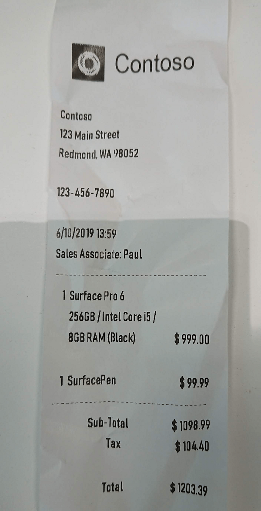

# What is Form Recognizer?

[!INCLUDE [TLS 1.2 enforcement](../../../includes/cognitive-services-tls-announcement.md)]

Azure Form Recognizer is a cognitive service that lets you build automated data processing software using machine learning technology. Identify and extract text, key/value pairs and table data from your form documents&mdash;the service outputs structured data that includes the relationships in the original file. You quickly get accurate results that are tailored to your specific content without heavy manual intervention or extensive data science expertise. Use Form Recognizer to automate data entry in your applications.

Form Recognizer is comprised of custom document processing models, the prebuilt receipt and business card models, and the layout API. You can call Form Recognizer models by using a REST API or client library SDKs to reduce complexity and integrate it into your workflow or application.

Form Recognizer is made up of the following services:
* **[Custom models](#custom-models)** - Extract key/value pairs and table data from forms. These models are trained with your own data, so they're tailored to your forms.
* **[Prebuilt models](#prebuilt-models)** - Extract data from unique form types using prebuilt models. Currently available are prebuilt models for sales receipts and business cards in English.
* **[Layout API](#layout-api)** - Extract text and table structures, along with their bounding box coordinates, from documents.

## Custom models

Form Recognizer custom models train to your own data, and you only need five sample input forms to start. A trained document processing model can output structured data that includes the relationships in the original form document. After you train the model, you can test and retrain it and eventually use it to reliably extract data from more forms according to your needs.

You have the following options when you train custom models: training with labeled data and without labeled data.

### Train without labels

By default, Form Recognizer uses unsupervised learning to understand the layout and relationships between fields and entries in your forms. When you submit your input forms, the algorithm clusters the forms by type, discovers what keys and tables are present, and associates values to keys and entries to tables. This doesn't require manual data labeling or intensive coding and maintenance, and we recommend you try this method first.

See [Build a training data set](./build-training-data-set.md) for tips on how to collect your training documents.

### Train with labels

When you train with labeled data, the model does supervised learning to extract values of interest, using the labeled forms you provide. This results in better-performing models and can produce models that work with complex forms or forms containing values without keys.

Form Recognizer uses the [Layout API](#layout-api) to learn the expected sizes and positions of printed and handwritten text elements. Then it uses user-specified labels to learn the key/value associations in the documents. We recommend that you use five manually labeled forms of the same type to get started when training a new model and add more labeled data as needed to improve the model accuracy.

## Prebuilt models

Form Recognizer also includes Prebuilt models for automated data processing of unique form types.

### Prebuilt Receipt model

The Prebuilt Receipt model is used for reading English sales receipts from Australia, Canada, Great Britain, India, and the United States&mdash;the type used by restaurants, gas stations, retail, and so on. This model extracts key information such as the time and date of the transaction, merchant information, amounts of taxes, line items, totals and more. In addition, the prebuilt receipt model is trained to recognize and return all of the text on a receipt. See the [Receipts](./concept-receipts.md) conceptual guide for more info.

### Prebuilt Business Cards model

The Business Cards model enables you to extract information such as the person's name, job title, address, email, company, and phone numbers from business cards in English. See the [Business cards](./concept-business-cards.md) conceptual guide for more info.

## Layout API

Form Recognizer can also extract text and table structure (the row and column numbers associated with the text) using high-definition optical character recognition (OCR).

## Get started

Follow a quickstart to get started extracting data from your forms. We recommend that you use the free service when you're learning the technology. Remember that the number of free pages is limited to 500 per month.

* [Client library quickstarts](./quickstarts/client-library.md) (all languages, multiple scenarios)
* Web UI quickstarts
  * [Train with labels - sample labeling tool](quickstarts/label-tool.md)
* REST quickstarts
  * Train custom models and extract form data
    * [Train without labels - cURL](quickstarts/curl-train-extract.md)
    * [Train without labels - Python](quickstarts/python-train-extract.md)
    * [Train with labels - Python](quickstarts/python-labeled-data.md)
  * Extract data from sales receipts
    * [Extract receipt data - cURL](quickstarts/curl-receipts.md)
    * [Extract receipt data - Python](quickstarts/python-receipts.md)
  * Extract data from business cards
    * [Extract business card data - Python](quickstarts/python-business-cards.md)
  * Extract text and table structure from forms
    * [Extract layout data - Python](quickstarts/python-layout.md)

### Review the REST APIs

You'll use the following APIs to train models and extract structured data from forms.

|Name |Description |
|---|---|
| **Train Custom Model**| Train a new model to analyze your forms by using five forms of the same type. Set the _useLabelFile_ parameter to `true` to train with manually labeled data. |
| **Analyze Form** |Analyze a single document passed in as a stream to extract text, key/value pairs and tables from the form with your custom model.  |
| **Analyze Receipt** |Analyze a single receipt document to extract key information and other receipt text.|
| **Analyze Business Card** |Analyze a business card to extract key information and text.|
| **Analyze Layout** |Analyze the layout of a form to extract text and table structure.|

Explore the [REST API reference documentation](https://westus2.dev.cognitive.microsoft.com/docs/services/form-recognizer-api-v2/operations/AnalyzeWithCustomForm) to learn more. If you're familiar with a previous version of the API, see the [What's new](./whats-new.md) article to learn about recent changes.

## Input requirements

[!INCLUDE [input requirements](./includes/input-requirements.md)]

## Data privacy and security

As with all the cognitive services, developers using the Form Recognizer service should be aware of Microsoft policies on customer data. See the [Cognitive Services page](https://www.microsoft.com/trustcenter/cloudservices/cognitiveservices) on the Microsoft Trust Center to learn more.

## Next steps

Complete a [client library quickstart](quickstarts/client-library.md) to get started writing a forms processing app with Form Recognizer in the language of your choice.