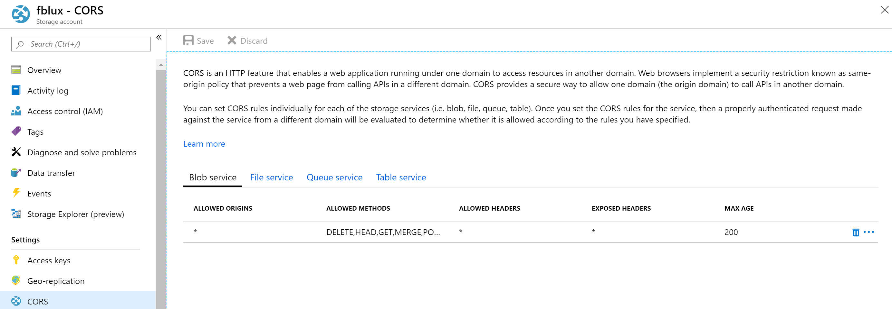
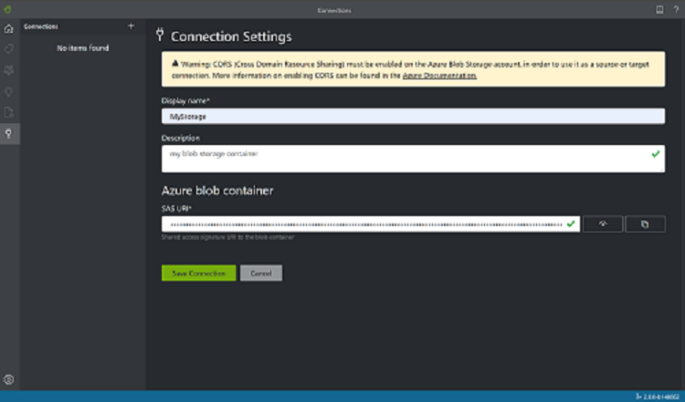
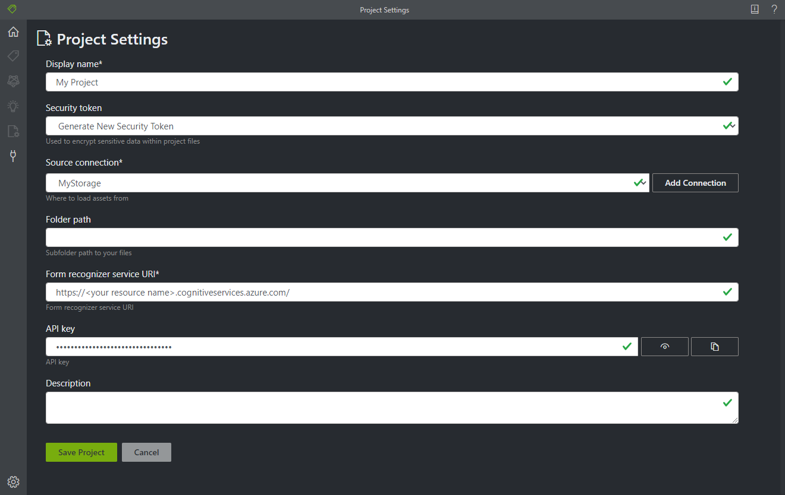
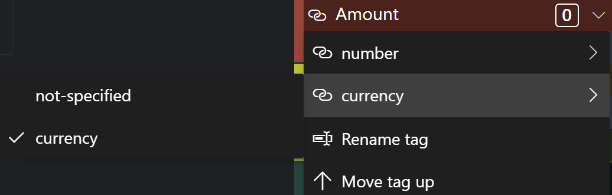
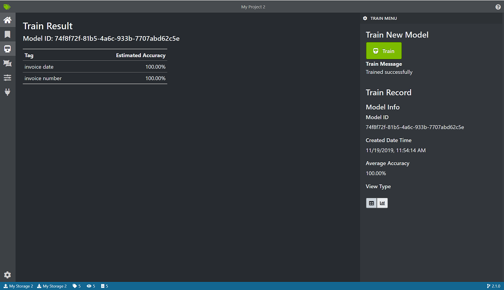

# Train a Form Recognizer model with labels using the sample labeling tool

In this quickstart, you'll use the Form Recognizer REST API with the sample labeling tool to train a custom model with manually labeled data. See the [Train with labels](../overview.md#train-with-labels) section of the overview to learn more about this feature.

If you don't have an Azure subscription, create a [free account](https://azure.microsoft.com/free/?WT.mc_id=A261C142F) before you begin.

## Prerequisites

To complete this quickstart, you must have:

- A set of at least six forms of the same type. You'll use this data to train the model and test a form. You can use a [sample data set](https://go.microsoft.com/fwlink/?linkid=2090451) for this quickstart. Upload the training files to the root of a blob storage container in an Azure Storage account.

## Create a Form Recognizer resource

[!INCLUDE [create resource](../includes/create-resource.md)]

## Set up the sample labeling tool

You'll use the Docker engine to run the sample labeling tool. Follow these steps to set up the Docker container. For a primer on Docker and container basics, see the [Docker overview](https://docs.docker.com/engine/docker-overview/).

> [!TIP]
> The OCR Form Labeling Tool is also available as an open source project on GitHub. The tool is a TypeScript web application built using React + Redux. To learn more or contribute, see the [OCR Form Labeling Tool](https://github.com/microsoft/OCR-Form-Tools/blob/master/README.md#run-as-web-application) repo. To try out the tool online, go to the [FOTT website](https://fott.azurewebsites.net/).   

1. First, install Docker on a host computer. This guide will show you how to use local computer as a host. If you want to use a Docker hosting service in Azure, see the [Deploy the sample labeling tool](../deploy-label-tool.md) how-to guide. 

   The host computer must meet the following hardware requirements:

    | Container | Minimum | Recommended|
    |:--|:--|:--|
    |Sample labeling tool|2 core, 4-GB memory|4 core, 8-GB memory|

   Install Docker on your machine by following the appropriate instructions for your operating system: 
   * [Windows](https://docs.docker.com/docker-for-windows/)
   * [macOS](https://docs.docker.com/docker-for-mac/)
   * [Linux](https://docs.docker.com/install/)

1. Get the sample labeling tool container with the `docker pull` command.
    ```
    docker pull mcr.microsoft.com/azure-cognitive-services/custom-form/labeltool
    ```
1. Now you're ready to run the container with `docker run`.
    ```
    docker run -it -p 3000:80 mcr.microsoft.com/azure-cognitive-services/custom-form/labeltool eula=accept
    ```

   This command will make the sample labeling tool available through a web browser. Go to `http://localhost:3000`.

> [!NOTE]
> You can also label documents and train models using the Form Recognizer REST API. To train and Analyze with the REST API, see [Train with labels using the REST API and Python](./python-labeled-data.md).

## Set up input data

First, make sure all the training documents are of the same format. If you have forms in multiple formats, organize them into subfolders based on common format. When you train, you'll need to direct the API to a subfolder.

### Configure cross-domain resource sharing (CORS)

Enable CORS on your storage account. Select your storage account in the Azure portal and click the **CORS** tab on the left pane. On the bottom line, fill in the following values. Then click **Save** at the top.

* Allowed origins = * 
* Allowed methods = \[select all\]
* Allowed headers = *
* Exposed headers = * 
* Max age = 200

> [!div class="mx-imgBorder"]
> 

## Connect to the sample labeling tool

The sample labeling tool connects to a source (where your original forms are) and a target (where it exports the created labels and output data).

Connections can be set up and shared across projects. They use an extensible provider model, so you can easily add new source/target providers.

To create a new connection, click the **New Connections** (plug) icon, in the left navigation bar.

Fill in the fields with the following values:

* **Display Name** - The connection display name.
* **Description** - Your project description.
* **SAS URL** - The shared access signature (SAS) URL of your Azure Blob Storage container. To retrieve the SAS URL, open the Microsoft Azure Storage Explorer, right-click your container, and select **Get shared access signature**. Set the expiry time to some time after you'll have used the service. Make sure the **Read**, **Write**, **Delete**, and **List** permissions are checked, and click **Create**. Then copy the value in the **URL** section. It should have the form: `https://<storage account>.blob.core.windows.net/<container name>?<SAS value>`.



## Create a new project

In the sample labeling tool, projects store your configurations and settings. Create a new project and fill in the fields with the following values:

* **Display Name** - the project display name
* **Security Token** - Some project settings can include sensitive values, such as API keys or other shared secrets. Each project will generate a security token that can be used to encrypt/decrypt sensitive project settings. You can find security tokens in the Application Settings by clicking the gear icon at the bottom of the left navigation bar.
* **Source Connection** - The Azure Blob Storage connection you created in the previous step that you would like to use for this project.
* **Folder Path** - Optional - If your source forms are located in a folder on the blob container, specify the folder name here
* **Form Recognizer Service Uri** - Your Form Recognizer endpoint URL.
* **API Key** - Your Form Recognizer subscription key.
* **Description** - Optional - Project description



## Label your forms

When you create or open a project, the main tag editor window opens. The tag editor consists of three parts:

* A resizable preview pane that contains a scrollable list of forms from the source connection.
* The main editor pane that allows you to apply tags.
* The tags editor pane that allows users to modify, lock, reorder, and delete tags. 

### Identify text elements

Click **Run OCR on all files** on the left pane to get the text layout information for each document. The labeling tool will draw bounding boxes around each text element.

### Apply labels to text

Next, you'll create tags (labels) and apply them to the text elements that you want the model to recognize.

1. First, use the tags editor pane to create the tags you'd like to identify.
   1. Click **+** to create a new tag.
   1. Enter the tag name.
   1. Press Enter to save the tag.
1. In the main editor, click and drag to select one or multiple words from the highlighted text elements.
1. Click on the tag you want to apply, or press the corresponding keyboard key. The number keys are assigned as hotkeys for the first 10 tags. You can reorder your tags using the up and down arrow icons in the tag editor pane.
    > [!Tip]
    > Keep the following tips in mind when you're labeling your forms.
    > * You can only apply one tag to each selected text element.
    > * Each tag can only be applied once per page. If a value appears multiple times on the same form, create different tags for each instance. For example: "invoice# 1", "invoice# 2" and so on.
    > * Tags cannot span across pages.
    > * Label values as they appear on the form; don't try to split a value into two parts with two different tags. For example, an address field should be labeled with a single tag even if it spans multiple lines.
    > * Don't include keys in your tagged fields&mdash;only the values.
    > * Table data should be detected automatically and will be available in the final output JSON file. However, if the model fails to detect all of your table data, you can manually tag these fields as well. Tag each cell in the table with a different label. If your forms have tables with varying numbers of rows, make sure you tag at least one form with the largest possible table.
    > * Use the buttons to the right of the **+** to search, rename, reorder, and delete your tags.
    > * To remove an applied tag without deleting the tag itself, select the tagged rectangle on the document view and press the delete key.


Follow the steps above to label at least five of your forms.

### Specify tag value types

Optionally, you can set the expected data type for each tag. Open the context menu to the right of a tag and select a type from the menu. This feature allows the detection algorithm to make certain assumptions that will improve the text-detection accuracy. It also ensures that the detected values will be returned in a standardized format in the final JSON output. 

> [!div class="mx-imgBorder"]
> 

The following value types and variations are currently supported:
* `string`
    * default, `no-whitespaces`, `alphanumeric`
* `number`
    * default, `currency`
* `date` 
    * default, `dmy`, `mdy`, `ymd`
* `time`
* `integer`

> [!NOTE]
> See these rules for date formatting:
> 
> The following characters can be used as DMY date delimiters: `, - / . \`. Whitespace cannot be used as a delimiter. For example:
> * 01,01,2020
> * 01-01-2020
> * 01/01/2020
>
> The day and month can each be written as one or two digits, and the year can be two or four digits:
> * 1-1-2020
> * 1-01-20
>
> If a DMY date string has eight digits, the delimiter is optional:
> * 01012020
> * 01 01 2020
>
> The month can also be written as its full or short name. If the name is used, delimiter characters are optional:
> * 01/Jan/2020
> * 01Jan2020
> * 01 Jan 2020

## Train a custom model

Click the Train icon on the left pane to open the Training page. Then click the **Train** button to begin training the model. Once the training process completes, you'll see the following information:

* **Model ID** - The ID of the model that was created and trained. Each training call creates a new model with its own ID. Copy this string to a secure location; you'll need it if you want to do prediction calls through the REST API.
* **Average Accuracy** - The model's average accuracy. You can improve model accuracy by labeling additional forms and training again to create a new model. We recommend starting by labeling five forms and adding more forms as needed.
* The list of tags, and the estimated accuracy per tag.



After training finishes, examine the **Average Accuracy** value. If it's low, you should add more input documents and repeat the steps above. The documents you've already labeled will remain in the project index.

> [!TIP]
> You can also run the training process with a REST API call. To learn how to do this, see [Train with labels using Python](./python-labeled-data.md).

## Analyze a form

Click on the Predict (light bulb) icon on the left to test your model. Upload a form document that you haven't used in the training process. Then click the **Predict** button on the right to get key/value predictions for the form. The tool will apply tags in bounding boxes and will report the confidence of each tag.

> [!TIP]
> You can also run the Analyze API with a REST call. To learn how to do this, see [Train with labels using Python](./python-labeled-data.md).

## Improve results

Depending on the reported accuracy, you may want to do further training to improve the model. After you've done a prediction, examine the confidence values for each of the applied tags. If the average accuracy training value was high, but the confidence scores are low (or the results are inaccurate), you should add the file used for prediction into the training set, label it, and train again.

The reported average accuracy, confidence scores, and actual accuracy can be inconsistent when the analyzed documents differ from those used in training. Keep in mind that some documents look similar when viewed by people but can look distinct to the AI model. For example, you might train with a form type that has two variations, where the training set consists of 20% variation A and 80% variation B. During prediction, the confidence scores for documents of variation A are likely to be lower.

## Save a project and resume later

To resume your project at another time or in another browser, you need to save your project's security token and reenter it later. 

### Get project credentials
Go to your project settings page (slider icon) and take note of the security token name. Then go to your application settings (gear icon), which shows all of the security tokens in your current browser instance. Find your project's security token and copy its name and key value to a secure location.

### Restore project credentials
When you want to resume your project, you first need to create a connection to the same blob storage container. Repeat the steps above to do this. Then, go to the application settings page (gear icon) and see if your project's security token is there. If it isn't, add a new security token and copy over your token name and key from the previous step. Then click Save Settings. 

### Resume a project

Finally, go to the main page (house icon) and click Open Cloud Project. Then select the blob storage connection, and select your project's *.vott* file. The application will load all of the project's settings because it has the security token.

## Next steps

In this quickstart, you've learned how to use the Form Recognizer sample labeling tool to train a model with manually labeled data. If you'd like to integrate the labeling tool into your own application, use the REST APIs that deal with labeled data training.

> [!div class="nextstepaction"]
> [Train with labels using Python](./python-labeled-data.md)
