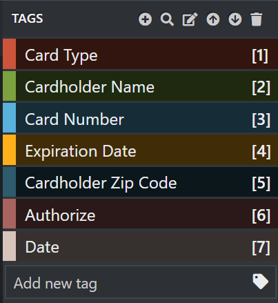

# Train a Form Recognizer model with labels using the sample labeling tool

In this quickstart, you'll use the Form Recognizer REST API with the sample labeling tool to train a custom model with manually labeled data. See the [Train with labels](../overview.md#train-with-labels) section of the overview to learn more about this feature.

If you don't have an Azure subscription, create a [free account](https://azure.microsoft.com/free/?WT.mc_id=A261C142F) before you begin.

## Prerequisites

To complete this quickstart, you must have:
- Access to the Form Recognizer limited-access preview. To get access to the preview, fill out and submit the [Form Recognizer access request form](https://aka.ms/FormRecognizerRequestAccess). You'll receive an email with a link to create a Form Recognizer resource.
- Access to the Form Recognizer sample labeling tool. To get access, fill out and submit the [Form Recognizer label tool request form](https://aka.ms/LabelToolRequestAccess). You'll receive an email with instructions on how to obtain your credentials and access the private container registry. 
- A set of at least 11 forms of the same type. You will use this data to train the model and test a form. You can use a [sample data set](https://go.microsoft.com/fwlink/?linkid=2090451) for this quickstart. Upload the training files to the root of a blob storage container in an Azure Storage account.

## Set up the sample labeling tool

There are two ways to get access to the sample labeling tool. 
* You can deploy an Azure web app and run it in your browser. Click the button below to deploy the sample labeling tool in your Azure subscription. (TBD)
* You can run the labeling tool as a docker container. Use the following command to deploy the container to your device. (TBD)

## Set up input data

First, make sure all the training documents are of the same format. If you have forms in multiple formats, organize them into sub-folders based on common format. When you train, you'll need to direct the API to a sub-folder.

### Configure cross-domain resource sharing (CORS)

Enable CORS on your storage account. Select your storage account in the Azure portal and click the **CORS** tab on the left pane. On the bottom line, fill in the follwoing values. Then click **Save** at the top.

* Allowed origins = * 
* Allowed methods = \[select all\]
* Allowed headers = *
* Exposed headers = * 
* Max age = 200

> [!div class="mx-imgBorder"]
> 

## Connect to the sample labeling tool

The sample labeling tool connects to a source (where your original forms are) and a target (the location where it exports the created labels and output data).

Connections can be set up and shared across projects. They use an extensible provider model, so you can easily add new source/target providers.

To create a new connection, click the **New Connections** (plug) icon, in the left hand navigation bar.

Fill in the fields with the following values:

* **Display Name** - The connection display name.
* **Description** - Your project description.
* **Provider** - Select **Azure Blob Storage** as the provider.
* **Account Name** - Your Azure Storage account name.
* **Container Name** - The name of your Azure storage container where the source forms are located.
* **SAS** - The shared access signature (SAS) URL of your Azure Blob Storage container. To retrieve the SAS URL, open the Microsoft Azure Storage Explorer, right-click your container, and select **Get shared access signature**. Set the expiry time to some time after you'll have used the service. Make sure the **Read**, **Write**, **Delete**, and **List** permissions are checked, and click **Create**. Then copy the value in the **URL** section. It should have the form: `https://<storage account>.blob.core.windows.net/<container name>?<SAS value>`.

## Create a new project

In the sample labeling tool, projects store your configurations and settings. Create a new project and fill in the fields with the following values:

* **Display Name** - the project display name
* **Security Token** - Some project settings can include sensitive values, such as API keys or other shared secrets. Each project will generate a security token that can be used to encrypt/decrypt sensitive project settings. Security tokens can be found in Application Settings by clicking the gear icon in the lower corner of the left hand navigation bar.
* **Source Connection** - The Azure Blob Storage connection you created in the previous step which you would like to use for this project.
* **Folder Path** - Optional - If your source forms are located in a folder on the blob container please specify the folder name here
* **Form Recognizer Service Uri** - Your Form Recognizer endpoint URL.
* **API Key** - Your Form Recognizer subscription key.
* **Description** - Optional - Project description

## Label your forms

When you create or open a project, the main tag editor window opens. The tag editor consists of three parts:

* A resizable preview pane that contains a scrollable list of forms from the source connection.
* The main editor pane that allows you to apply tags.
* The tags editor pane that allows users to modify, lock, reorder, and delete tags. 

Follow these steps to label your forms:

1. First, use the tags editor pane to create the tags (labels) you'd like to identify.
1. Select a form on the left to load it into the main tag editor.
1. Click and drag to select one or multiple words from the highlighted terms.
1. Click on the tag you want to apply, or press corresponding keyboard key.

> [!TIP]
> The number keys are assigned as hotkeys for the first ten tags. You can reorder your tags using the up and down arrow icons in the tag editor pane.

Follow the above steps to label 10 of your forms, and then move on to the next step.

## Train a custom model

Click the Train (traincar) icon in the left pane to open the Training page. Then click the **Train** button to begin training the model. Once the training process completes you'll see the following information:

* **Model ID** - The ID of the model that was just created and trained. Each training call creates a new model with its own ID. You'll need this string to call the **Analyze Form** API.
* **Model Accuracy** - The model's average accuracy. You can improve model accuracy by labeling additional forms and training again to create a new model. We recommend starting by labeling 10 forms and adding more forms as needed.
* The list of tags, and the estimated accuracy per tag.

> [!NOTE]
> You can also label and train using the Form Recognizer REST API. To train and Analyze with the REST API, see [Train with labels using the REST API and Python](./python-labeled-data.md).

## Analyze a form

Click on the Predict (rectangles) icon on the left to test your model. Select the form that you didn't use in the training process. Then click **Predict** tab on the right to get key/value predictions for the form. 

## Next steps

In this quickstart, you learned how to use the Form Recognizer sample labeling tool to train a model with manually labeled data. Next, see the [API reference documentation](https://aka.ms/form-recognizer/api) to explore the Form Recognizer API in more depth.
