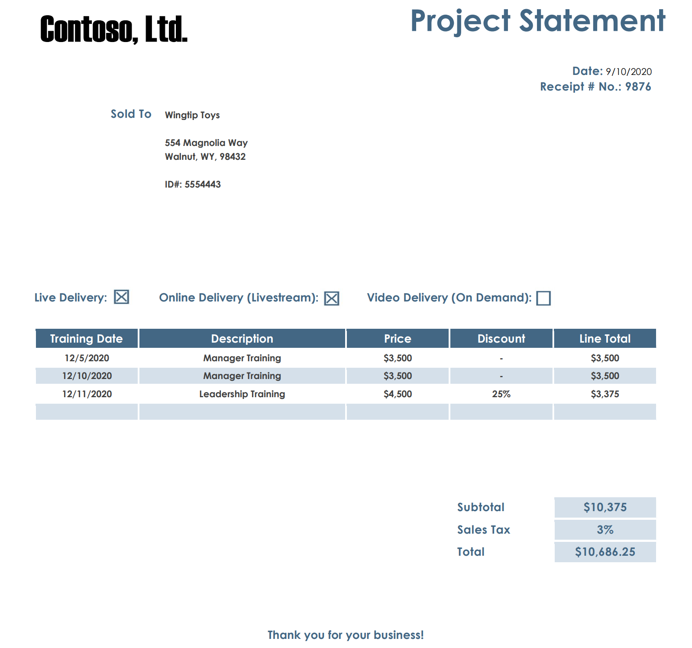

# Quickstart: Extract text and layout information using the Form Recognizer REST API with Python

In this quickstart, you'll use the Azure Form Recognizer REST API with Python to extract text layout information and table data from form documents.

If you don't have an Azure subscription, create a [free account](https://azure.microsoft.com/free/?WT.mc_id=A261C142F) before you begin.

## Prerequisites

To complete this quickstart, you must have:
- Access to the Form Recognizer limited-access preview. To get access to the preview, fill out and submit the [Form Recognizer access request](https://aka.ms/FormRecognizerRequestAccess) form.
- [Python](https://www.python.org/downloads/) installed (if you want to run the sample locally).
- A form document. You can download an image from the [sample data set](https://go.microsoft.com/fwlink/?linkid=2090451) for this quickstart.

## Create a Form Recognizer resource

[!INCLUDE [create resource](../includes/create-resource.md)]

## Analyze the form layout

To start analyzing the layout, you call the **Analyze Layout** API using the Python script below. Before you run the script, make these changes:

1. Replace `<Endpoint>` with the endpoint that you obtained with your Form Recognizer subscription.
1. Replace `<path to your form>` with the path to your local form document.
1. Replace `<subscription key>` with the subscription key you copied from the previous step.

    ```python
    import http.client, urllib.request, urllib.parse, urllib.error, base64

    source = r"<path to your form>"
    body = {"url":source}
    body = json.dumps(body)

    headers = {
        # Request headers
        'Content-Type': 'application/json',
        'Ocp-Apim-Subscription-Key': '<subscription key>',
    }

    try:
        conn = http.client.HTTPSConnection('<Endpoint>')
        conn.request("POST", "/formrecognizer/v2.0-preview/layout/analyze", body, headers)
        response = conn.getresponse()
        data = response.read()
        operationURL = "" + response.getheader("Operation-Location")
        print ("Location header: " + operationURL)
        conn.close()
    except Exception as e:
        print(e)
        exit()
    ```

1. Save the code in a file with a .py extension. For example, *form-recognizer-layout.py*.
1. Open a command prompt window.
1. At the prompt, use the `python` command to run the sample. For example, `python form-recognizer-layout.py`.

You'll receive a `202 (Success)` response that includes an **Operation-Location** header, which the script will print to the console. This header contains an operation ID that you can use to query the status of the asynchronous operation and get the results. In the following example value, the string after `operations/` is the operation ID.

```console
https://cognitiveservice/formrecognizer/v2.0-preview/layout/operations/54f0b076-4e38-43e5-81bd-b85b8835fdfb
```

## Get the layout results

After you've called the **Analyze Layout** API, you call the **Get Analyze Layout Result** API to get the status of the operation and the extracted data. Add the following code to the bottom of your Python script. This extracts the operation ID value and passes it to a new API call. This script calls the API at regular intervals until the results are available. We recommend an interval of one second or more.

```python
operationId = operationURL.split("operations/")[1]

conn = http.client.HTTPSConnection('<Endpoint>')
while True:
    try:
        conn.request("GET", f"/formrecognizer/v2.0-preview/layout/analyzeResults/{operationId}", "", headers)
        responseString = conn.getresponse().read().decode('utf-8')
        responseDict = json.loads(responseString)
        conn.close()
        print(responseString)
        if 'status' in responseDict and responseDict['status'] not in ['notStarted','running']:
            break
        time.sleep(1)
    except Exception as e:
        print(e)
        exit()
```

1. Save the script.
1. Again use the `python` command to run the sample. For example, `python form-recognizer-layout.py`.

### Examine the response

The script will print responses to the console until the **Analyze Layout** operation completes. Then, it will print the extracted data in JSON format. The `"readResults"` field contains every line of text with its respective bounding box placement on the page. The `"pageResults"` field shows every piece of text withing tables, each with its row-column coordinate.

See the following invoice image and its corresponding JSON output. The output has been shortened for readability.

> [!div class="mx-imgBorder"]
> 

```json
{ 
  "status":"succeeded",
  "createdDateTime":"2019-11-12T19:55:36Z",
  "lastUpdatedDateTime":"2019-11-12T19:55:43Z",
  "analyzeResult":{ 
    "version":"2.0.0",
    "readResults":[ 
      { 
        "page":1,
        "language":"en",
        "angle":0,
        "width":8.5,
        "height":11,
        "unit":"inch",
        "lines":[ 
          { 
            "language":"en",
            "boundingBox":[ 
              0.5384,
              1.1583,
              1.4466,
              1.1583,
              1.4466,
              1.3534,
              0.5384,
              1.3534
            ],
            "text":"Contoso",
            "words":[ 
              { 
                "boundingBox":[ 
                  0.5384,
                  1.1583,
                  1.4466,
                  1.1583,
                  1.4466,
                  1.3534,
                  0.5384,
                  1.3534
                ],
                "text":"Contoso",
                "confidence":1
              }
            ]
          },
          { 
            "language":"en",
            "boundingBox":[ 
              0.7994,
              1.5143,
              1.3836,
              1.5143,
              1.3836,
              1.6154,
              0.7994,
              1.6154
            ],
            "text":"Address:",
            "words":[ 
              { 
                "boundingBox":[ 
                  0.7994,
                  1.5143,
                  1.3836,
                  1.5143,
                  1.3836,
                  1.6154,
                  0.7994,
                  1.6154
                ],
                "text":"Address:",
                "confidence":1
              }
            ]
          },
          ...
          { 
            "language":"en",
            "boundingBox":[ 
              6.2285,
              3.4114,
              6.3919,
              3.4114,
              6.3919,
              3.5119,
              6.2285,
              3.5119
            ],
            "text":"PT",
            "words":[ 
              { 
                "boundingBox":[ 
                  6.2285,
                  3.4114,
                  6.3919,
                  3.4114,
                  6.3919,
                  3.5119,
                  6.2285,
                  3.5119
                ],
                "text":"PT",
                "confidence":1
              }
            ]
          }
        ]
      }
    ],
    "pageResults":[ 
      { 
        "page":1,
        "tables":[ 
          { 
            "rows":2,
            "columns":6,
            "cells":[ 
              { 
                "rowIndex":0,
                "columnIndex":0,
                "text":"Invoice Number",
                "boundingBox":[ 
                  0.5075,
                  2.8088,
                  1.9061,
                  2.8088,
                  1.9061,
                  3.3219,
                  0.5075,
                  3.3219
                ],
                "elements":[ 
                  "#/readResults/0/lines/8/words/0",
                  "#/readResults/0/lines/8/words/1"
                ]
              },
              ...
            ]
          }
        ]
      }
    ]
  }
}
```

## Next steps

In this quickstart, you used the Form Recognizer REST API with Python to extract the text layout of an invoice. Next, see the reference documentation to explore the Form Recognizer API in more depth.

> [!div class="nextstepaction"]
> [REST API reference documentation](https://westus2.dev.cognitive.microsoft.com/docs/services/form-recognizer-api/operations/AnalyzeLayout)
