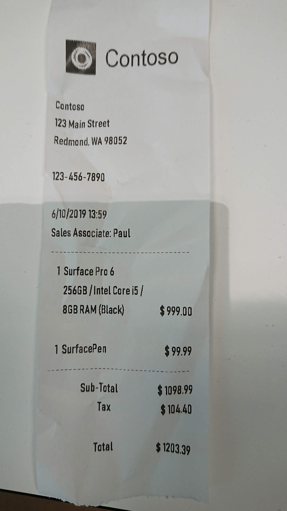

# Quickstart: Extract receipt data using the Form Recognizer REST API with Python

In this quickstart, you'll use the Azure Form Recognizer REST API with Python to extract and identify relevant information in sales receipts.

If you don't have an Azure subscription, create a [free account](https://azure.microsoft.com/free/?WT.mc_id=A261C142F) before you begin.

## Prerequisites
To complete this quickstart, you must have:
- Access to the Form Recognizer limited-access preview. To get access to the preview, fill out and submit the [Form Recognizer access request](https://aka.ms/FormRecognizerRequestAccess) form.
- [Python](https://www.python.org/downloads/) installed (if you want to run the sample locally).
- A URL for an image of a receipt. You can use a [sample image](https://github.com/Azure-Samples/cognitive-services-REST-api-samples/blob/master/curl/form-recognizer/contoso-receipt.png?raw=true) for this quickstart.

## Create a Form Recognizer resource

[!INCLUDE [create resource](../includes/create-resource.md)]

## Analyze a receipt

To start analyzing a receipt, you call the **Analyze Receipt** API using the Python script below. Before you run the script, make these changes:

1. Replace `<Endpoint>` with the endpoint that you obtained from your Form Recognizer subscription key. You can find it on your Form Recognizer resource **Overview** tab.
1. Replace `<your receipt URL>` with the URL address of a receipt image.
1. Replace `<subscription key>` with the subscription key you copied from the previous step.

    ```python
    import http.client, urllib.request, urllib.parse, urllib.error, base64

    source = r"<your receipt URL>"
    body = {"url":source}
    body = json.dumps(body)

    headers = {
        # Request headers
        'Content-Type': 'application/json',
        'Ocp-Apim-Subscription-Key': '<subscription key>',
    }

    try:
        conn = http.client.HTTPSConnection('<Endpoint>')
        conn.request("POST", "/formrecognizer/v1.0-preview/prebuilt/receipt/asyncBatchAnalyze", body, headers)
        response = conn.getresponse()
        data = response.read()
        operationURL = "" + response.getheader("Operation-Location")
        print ("Operation-Location header: " + operationURL)
        conn.close()
    except Exception as e:
        print(e)
        exit()
    ```

1. Save the code in a file with a .py extension. For example, *form-recognizer-receipts.py*.
1. Open a command prompt window.
1. At the prompt, use the `python` command to run the sample. For example, `python form-recognizer-receipts.py`.

You'll receive a `202 (Success)` response that includes an **Operation-Location** header, which the script will print to the console. This header contains an operation ID that you can use to query the status of the operation and get the analysis results. In the following example value, the string after `operations/` is the operation ID.

```console
https://cognitiveservice/formrecognizer/v1.0-preview/prebuilt/receipt/operations/54f0b076-4e38-43e5-81bd-b85b8835fdfb
```

## Get the receipt results

After you've called the **Analyze Receipt** API, you call the **Get Receipt Result** API to get the status of the operation and the extracted data. Add the following code to the bottom of your Python script. This extracts the operation ID value and passes it to a new API call. The operation is asynchronous, so this script calls the API at regular intervals until the results are available. We recommend an interval of one second or more.

```python
operationId = operationURL.split("operations/")[1]

conn = http.client.HTTPSConnection('<Endpoint>')
while True:
    try:
        conn.request("GET", f"/formrecognizer/v1.0-preview/prebuilt/receipt/operations/{operationId}", "", headers)
        responseString = conn.getresponse().read().decode('utf-8')
        responseDict = json.loads(responseString)
        conn.close()
        print(responseString)
        if 'status' in responseDict and responseDict['status'] not in ['NotStarted','Running']:
            break
        time.sleep(1)
    except Exception as e:
        print(e)
        exit()
```

1. Save the script.
1. Again use the `python` command to run the sample. For example, `python form-recognize-analyze.py`.

### Examine the response

The script will print responses to the console until the Analyze operation completes. Then, it will print the extracted text data in JSON format. The `"recognitionResults"` field contains every line of text that was extracted from the receipt, and the `"understandingResults"` field contains key/value information for the most relevant parts of the receipt.

See the following receipt image and its corresponding JSON output. The output has been shortened for readability.



```json
{
  "status": "Succeeded",
  "recognitionResults": [{
    "page": 1,
    "clockwiseOrientation": 0.36,
    "width": 1688,
    "height": 3000,
    "unit": "pixel",
    "lines": [{
      "boundingBox": [616, 291, 1050, 278, 1053, 384, 620, 397],
      "text": "Contoso",
      "words": [{
        "boundingBox": [619, 292, 1051, 284, 1052, 382, 620, 398],
        "text": "Contoso"
      }]
    }, {
      "boundingBox": [322, 588, 501, 600, 497, 655, 318, 643],
      "text": "Contoso",
      "words": [{
        "boundingBox": [330, 590, 501, 602, 499, 654, 326, 644],
        "text": "Contoso"
      }]
    },
    ...
    ]
  }],
  "understandingResults": [{
    "pages": [1],
    "fields": {
      "Subtotal": {
        "valueType": "numberValue",
        "value": 1098.99,
        "text": "1098.99",
        "elements": [{
          "$ref": "#/recognitionResults/0/lines/14/words/1"
        }]
      },
      "Total": {
        "valueType": "numberValue",
        "value": 1203.39,
        "text": "1203.39",
        "elements": [{
          "$ref": "#/recognitionResults/0/lines/18/words/1"
        }]
      },
      "Tax": {
        "valueType": "numberValue",
        "value": 104.4,
        "text": "$104.40",
        "elements": [{
          "$ref": "#/recognitionResults/0/lines/16/words/0"
        }, {
          "$ref": "#/recognitionResults/0/lines/16/words/1"
        }]
      },
      "MerchantAddress": {
        "valueType": "stringValue",
        "value": "123 Main Street Redmond, WA 98052",
        "text": "123 Main Street Redmond, WA 98052",
        "elements": [{
          "$ref": "#/recognitionResults/0/lines/2/words/0"
        }, {
          "$ref": "#/recognitionResults/0/lines/2/words/1"
        }, {
          "$ref": "#/recognitionResults/0/lines/2/words/2"
        }, {
          "$ref": "#/recognitionResults/0/lines/3/words/0"
        }, {
          "$ref": "#/recognitionResults/0/lines/3/words/1"
        }, {
          "$ref": "#/recognitionResults/0/lines/3/words/2"
        }]
      },
      "MerchantName": {
        "valueType": "stringValue",
        "value": "Contoso",
        "text": "Contoso",
        "elements": [{
          "$ref": "#/recognitionResults/0/lines/1/words/0"
        }]
      },
      "MerchantPhoneNumber": {
        "valueType": "stringValue",
        "value": null,
        "text": "123-456-7890",
        "elements": [{
          "$ref": "#/recognitionResults/0/lines/4/words/0"
        }]
      },
      "TransactionDate": {
        "valueType": "stringValue",
        "value": "2019-06-10",
        "text": "6/10/2019",
        "elements": [{
          "$ref": "#/recognitionResults/0/lines/5/words/0"
        }]
      },
      "TransactionTime": {
        "valueType": "stringValue",
        "value": "13:59:00",
        "text": "13:59",
        "elements": [{
          "$ref": "#/recognitionResults/0/lines/5/words/1"
        }]
      }
    }
  }]
}
```

## Next steps

In this quickstart, you used the Form Recognizer REST API with Python to train a model and run it in a sample scenario. Next, see the reference documentation to explore the Form Recognizer API in more depth.

> [!div class="nextstepaction"]
> [REST API reference documentation](https://westus2.dev.cognitive.microsoft.com/docs/services/form-recognizer-api/operations/AnalyzeReceipt)
