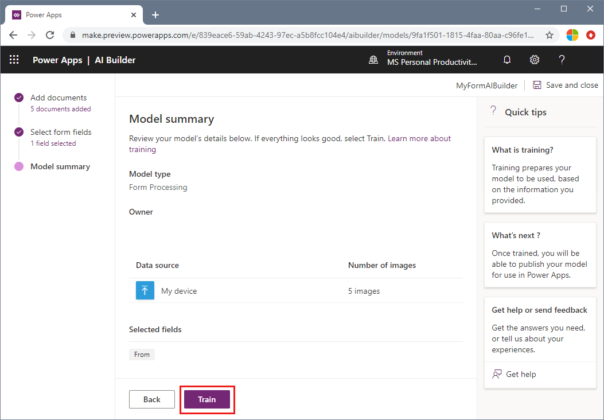
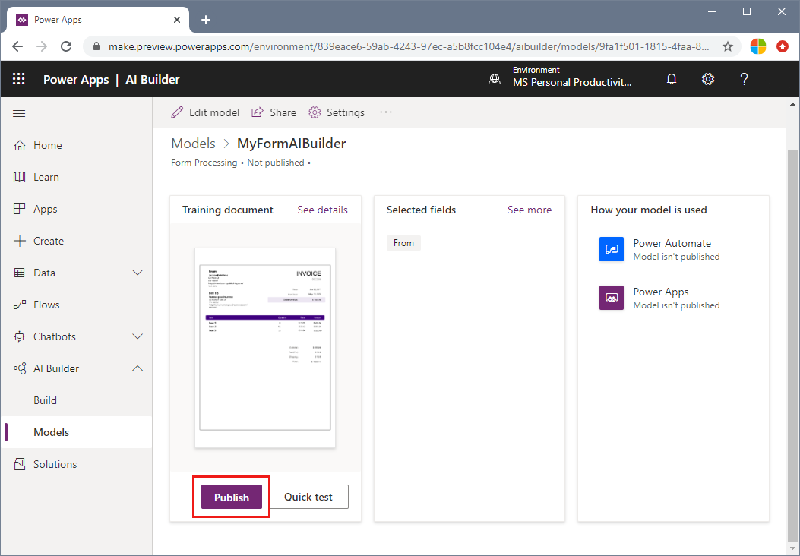

# Tutorial: Create a form-processing app with AI Builder

[AI Builder](/ai-builder/overview) is a Power Platform capability that allows you to automate processes and predict outcomes to improve business performance. You can use AI Builder form processing to create AI models that identify and extract key-value pairs and table data from form documents.

> [!NOTE]
> This project is also available as a [Microsoft Learn module](/learn/modules/get-started-with-form-processing/).

In this tutorial, you learn how to:

> [!div class="checklist"]
> * Create a form processing AI model
> * Train your model
> * Publish your model to use in Azure Power Apps or Power Automate

## Prerequisites

* A set of at least five forms of the same type to use for training/testing data. See [Build a training data set](./build-training-data-set.md) for tips and options for putting together your training data set. For this quickstart, you can use the files under the **Train** folder of the [sample data set](https://go.microsoft.com/fwlink/?linkid=2128080).
* A Power Apps or Power Automate license - see the [Licensing Guide](https://go.microsoft.com/fwlink/?linkid=2085130). The license must include [Common Data Service](https://powerplatform.microsoft.com/common-data-service/).
* An AI Builder [add-on or trial](https://go.microsoft.com/fwlink/?LinkId=2113956&clcid=0x409).

## Create a form processing project

1. Go to [Power Apps](https://make.powerapps.com/) or [Power Automate](https://flow.microsoft.com/signin), and sign in with your organization account.
1. In the left pane, select **AI Builder** > **Build**.
1. Select the **Form Processing** card.
1. Type a name for your model.
1. Select **Create**.

## Upload and analyze documents

On the **Add documents** page, you need to provide sample documents to train your model for the type of form you want to extract information from. After you upload your documents, AI Builder analyzes them to check that they're sufficient to train a model.

> [!NOTE]
> AI Builder does not currently support the following types of form processing input data:
>
> - Complex tables (nested tables, merged headers or cells, and so on)
> - Check boxes or radio buttons
> - PDF documents longer than 50 pages
> - Fillable PDFs
>
> For more information about requirements for input documents, see [input requirements](./overview.md#input-requirements).

### Upload your documents

1. Select **Add documents**, select a minimum of five documents, and then select **Upload**.
1. After the upload is completed, select **Close**.
1. Then select **Analyze**.

> [!NOTE] 
> After you upload these documents, you can still remove some of the documents or upload additional ones.

> [!div class="mx-imgBorder"]
> 

### Analyze your documents

During the analysis step, AI Builder examines the documents that you uploaded and detects the fields and tables. The time it takes to complete this operation depends on the number of documents provided, but in most cases it should only take a few minutes.

When the analysis has finished, select the thumbnail to open the field selection experience.

> [!IMPORTANT]
> If the analysis failed, it's likely because AI Builder couldn't detect structured text in your documents. Verify that the documents you updated follow the [input requirements](./overview.md#input-requirements).

## Select your form fields

On the field selection page, you choose the fields that matter to you:

1. To select a field, click on a rectangle that indicates a detected field in the document, or select multiple fields by clicking and dragging. You can also select fields from the right-side pane.
1. Click the name of the selected field if you want to rename it to align with your needs or normalize the extracted labels.

    When you click on a detected field, the following information appears:

    - **Field name**: The name of the label for the detected field.
    - **Field value**: The value for the detected field.

> [!div class="mx-imgBorder"]
> 

### Label undetected fields

If the field you want to label wasn't detected automatically by the model, you can draw a rectangle around its value and type a label name in the dialog that appears.

## Train your model

1. Select **Next** to check your selected form fields. If everything looks good, select **Train** to train your model.

    > [!div class="mx-imgBorder"]
    > 
1. When training completes,  select **Go to Details page** in the **Training complete** screen.
## Quick-test your model

The Details page allows you to test your model before you publish or use it:

1. On the Details page, select **Quick test**.
2. You can either drag and drop a document or select **Upload from my device** to upload your test file. The quick-test should only take a few seconds before displaying the results.
3. You can select **Start over** to run another test or **Close** if you're finished.

### Troubleshooting tips

If you're getting bad results or low confidence scores for certain fields, try the following tips:

- Retrain using forms with different values in each field.
- Retrain using a larger set of training documents. The more documents you tag, the more AI Builder will learn how to better recognize the fields.
- You can optimize PDF files by selecting only certain pages to train with. Use the **Print** > **Print to PDF** option to select certain pages within your document.

## Publish your model

If you're happy with your model, select **Publish**  to publish it. When publishing completes, your model is promoted as **Published** and is ready to be used.

> [!div class="mx-imgBorder"]
> 

After you've published your form processing model, you can use it in a [Power Apps canvas app](/ai-builder/form-processor-component-in-powerapps) or in [Power Automate](/ai-builder/form-processing-model-in-flow).

## Next steps

Follow the AI Builder documentation for using a form-processing model.

* [Use the form-processor component in Power Apps](/ai-builder/form-processor-component-in-powerapps)
* [Use a form-processing model in Power Automate](/ai-builder/form-processing-model-in-flow)