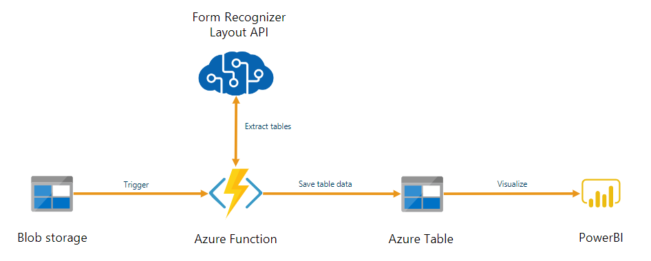
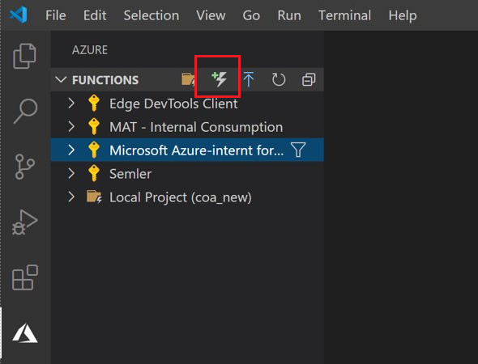

# Tutorial: Use an Azure Function to process stored documents

You can use Form Recognizer as part of an automated data processing pipeline built with Azure Functions. This guide shows you how to use an Azure function to process documents that are uploaded to an Azure blob storage container. This workflow extracts table data from stored documents using the Form Recognizer Layout service and saves the table data in a .csv file in Azure. You can then display the data using Microsoft Power BI (not covered here).

> [!div class="mx-imgBorder"]
> 

In this tutorial, you learn how to:

> [!div class="checklist"]
> * Create an Azure Storage account
> * Create an Azure Functions project
> * Extract layout data from uploaded forms
> * Upload layout data to Azure Storage

## Prerequisites

* Azure subscription - [Create one for free](https://azure.microsoft.com/free/cognitive-services)
* <a href="https://ms.portal.azure.com/#create/Microsoft.CognitiveServicesFormRecognizer"  title="Create a Form Recognizer resource"  target="_blank">create a Form Recognizer resource <span class="docon docon-navigate-external x-hidden-focus"></span></a> in the Azure portal to get your Form Recognizer key and endpoint. After it deploys, click **Go to resource**.
  * You'll need the key and endpoint from the resource you create to connect your application to the Form Recognizer API. You'll paste your key and endpoint into the code below later in the quickstart.
  * You can use the free pricing tier (`F0`) to try the service, and upgrade later to a paid tier for production.
* A local PDF document to analyze. You can download this [sample document](https://github.com/Azure-Samples/cognitive-services-REST-api-samples/blob/master/curl/form-recognizer/sample-layout.pdf) to use.
* [Python 3.8.x](https://www.python.org/downloads/) installed.
* [Azure Storage Explorer](https://azure.microsoft.com/features/storage-explorer/) installed.
* [Azure Functions Core Tools](../../azure-functions/functions-run-local.md?tabs=windows%2ccsharp%2cbash#install-the-azure-functions-core-tools) installed.
* Visual Studio Code with the following extensions installed:
  * [Azure Functions extension](/azure/developer/python/tutorial-vs-code-serverless-python-01#visual-studio-code-python-and-the-azure-functions-extension)
  * [Python extension](https://code.visualstudio.com/docs/python/python-tutorial#_install-visual-studio-code-and-the-python-extension)

## Create an Azure Storage account

[Create an Azure Storage account](https://ms.portal.azure.com/#create/Microsoft.StorageAccount-ARM) on the Azure portal. Select **StorageV2** as the Account kind.

On the left pane, select the **CORS** tab, and remove the existing CORS policy if any exists.

Once that has deployed, create two empty blob storage containers, named **test** and **output**.

## Create an Azure Functions project

Open Visual Studio Code. If you've installed the Azure Functions extension, you should see an Azure logo on the left navigation pane. Select it. Create a new project, and when prompted create a local folder **coa_new** to contain the project.




You'll be prompted to configure a number of settings:
* In the **Select a language** prompt, select Python.
* In the **Select a template** prompt, select Azure Blob Storage trigger. Then give the default trigger a name.
* In the **Select setting** prompt, opt to create new local app settings.
* Select your Azure subscription with the storage account you created. Then you need to enter the name of the storage container (in this case, `test/{name}`)
* Opt to open the project in the current window. 


When you've completed these steps, VSCode will add a new Azure Function project with a *\_\_init\_\_.py* Python script. This script will be triggered when a file is uploaded to the **test** storage container, but it won't do anything.

## Test the function

Press F5 to run the basic function. VSCode will prompt you to select a storage account to interface with. Select the storage account you created and continue.

Open Azure Storage Explorer and upload a sample PDF document to the **Test** container. Then check the VSCode terminal. The script should log that it was triggered by the PDF upload.


Stop the script before continuing.

## Add form processing code

Next, you'll add your own code to the Python script to call the Form Recognizer service and parse the uploaded documents using the Form Recognizer [Layout API](concept-layout.md).

In VSCode, navigate to the function's *requirements.txt* file. This defines the dependencies for your script. Add the following Python packages to the file:

```
cryptography
azure-functions
azure-storage-blob
azure-identity
requests
pandas
numpy
```

Then, open the *\_\_init\_\_.py* script. Add the following `import` statements:

```Python
import logging
from azure.storage.blob import BlobServiceClient
import azure.functions as func
import json
import time
from requests import get, post
import os
from collections import OrderedDict
import numpy as np
import pandas as pd
```

You can leave the generated `main` function as-is. You'll add your custom code inside this function.

```python
# This part is automatically generated
def main(myblob: func.InputStream):
    logging.info(f"Python blob trigger function processed blob \n"
    f"Name: {myblob.name}\n"
    f"Blob Size: {myblob.length} bytes")
```

The following code block calls the Form Recognizer [Analyze Layout](https://westcentralus.dev.cognitive.microsoft.com/docs/services/form-recognizer-api-v2-1-preview-2/operations/AnalyzeLayoutAsync) API on the uploaded document. Fill in your endpoint and key values. 


# [version 2.0](#tab/2-0)

```Python
# This is the call to the Form Recognizer endpoint
    endpoint = r"Your Form Recognizer Endpoint"
    apim_key = "Your Form Recognizer Key"
    post_url = endpoint + "/formrecognizer/v2.0/Layout/analyze"
    source = myblob.read()

    headers = {
    # Request headers
    'Content-Type': 'application/pdf',
    'Ocp-Apim-Subscription-Key': apim_key,
        }

    text1=os.path.basename(myblob.name)
```

# [version 2.1 preview](#tab/2-1)

```Python
# This is the call to the Form Recognizer endpoint
    endpoint = r"Your Form Recognizer Endpoint"
    apim_key = "Your Form Recognizer Key"
    post_url = endpoint + "/formrecognizer/v2.1-preview.3/Layout/analyze"
    source = myblob.read()

    headers = {
    # Request headers
    'Content-Type': 'application/pdf',
    'Ocp-Apim-Subscription-Key': apim_key,
        }

    text1=os.path.basename(myblob.name)
```
---

> [!IMPORTANT]
> Go to the Azure portal. If the Form Recognizer resource you created in the **Prerequisites** section deployed successfully, click the **Go to Resource** button under **Next Steps**. You can find your key and endpoint in the resource's **key and endpoint** page, under **resource management**. 
>
> Remember to remove the key from your code when you're done, and never post it publicly. For production, consider using a secure way of storing and accessing your credentials. For more information, see the [Cognitive Services security](../cognitive-services-security.md) article.

Next, add code to query the service and get the returned data. 


```Python
resp = requests.post(url = post_url, data = source, headers = headers)
    if resp.status_code != 202:
        print("POST analyze failed:\n%s" % resp.text)
        quit()
    print("POST analyze succeeded:\n%s" % resp.headers)
    get_url = resp.headers["operation-location"]

    wait_sec = 25
    
    time.sleep(wait_sec)
    # The layout API is async therefore the wait statement
    
    resp =requests.get(url = get_url, headers = {"Ocp-Apim-Subscription-Key": apim_key})
    
    resp_json = json.loads(resp.text)
    
    
    status = resp_json["status"]
    
    
    if status == "succeeded":
        print("Layout Analysis succeeded:\n%s")
        results=resp_json
    else:
        print("GET Layout results failed:\n%s")
        quit()

    results=resp_json
```

Then add the following code to connect to the Azure Storage **output** container. Fill in your own values for the storage account name and key. You can get the key on the **Access keys** tab of your storage resource in the Azure portal.

```Python
# This is the connection to the blob storage, with the Azure Python SDK
    blob_service_client = BlobServiceClient.from_connection_string("DefaultEndpointsProtocol=https;AccountName="Storage Account Name";AccountKey="storage account key";EndpointSuffix=core.windows.net")
    container_client=blob_service_client.get_container_client("output")
```

The following code parses the returned Form Recognizer response, constructs a .csv file, and uploads it to the **output** container. 


> [!IMPORTANT]
> You will likely need to edit this code to match the structure of your own form documents.

```Python
# The code below is how I extract the json format into tabular data 
    # Please note that you need to adjust the code below to your form structure
    # It probably won't work out-of-box for your specific form
    pages = results["analyzeResult"]["pageResults"]

    def make_page(p):
        res=[]
        res_table=[]
        y=0
        page = pages[p]
        for tab in page["tables"]:
            for cell in tab["cells"]:
                res.append(cell)
                res_table.append(y)
            y=y+1
    
        res_table=pd.DataFrame(res_table)
        res=pd.DataFrame(res)
        res["table_num"]=res_table[0]
        h=res.drop(columns=["boundingBox","elements"])
        h.loc[:,"rownum"]=range(0,len(h))
        num_table=max(h["table_num"])
        return h, num_table, p

    h, num_table, p= make_page(0)   

    for k in range(num_table+1):
        new_table=h[h.table_num==k]
        new_table.loc[:,"rownum"]=range(0,len(new_table))
        row_table=pages[p]["tables"][k]["rows"]
        col_table=pages[p]["tables"][k]["columns"]
        b=np.zeros((row_table,col_table))
        b=pd.DataFrame(b)
        s=0
        for i,j in zip(new_table["rowIndex"],new_table["columnIndex"]):
            b.loc[i,j]=new_table.loc[new_table.loc[s,"rownum"],"text"]
            s=s+1

```

Finally, the last block of code uploads the extracted table and text data to your blob storage element.

```Python
    # Here is the upload to the blob storage
    tab1_csv=b.to_csv(header=False,index=False,mode='w')
    name1=(os.path.splitext(text1)[0]) +'.csv'
    container_client.upload_blob(name=name1,data=tab1_csv)
```

## Run the function

Press F5 to run the function again. Use Azure Storage Explorer to upload a sample PDF form to the **Test** storage container. This action should trigger the script to run, and you should then see the resulting .csv file (displayed as a table) in the **output** container.

You can connect this container to Power BI to create rich visualizations of the data it contains.

## Next steps

In this tutorial, you learned how to use an Azure Function written in Python to automatically process uploaded PDF documents and output their contents in a more data-friendly format. Next, learn how to use Power BI to display the data.

> [!div class="nextstepaction"]
> [Microsoft Power BI](https://powerbi.microsoft.com/integrations/azure-table-storage/)

* [What is Form Recognizer?](overview.md)
* Learn more about the [Layout API](concept-layout.md)