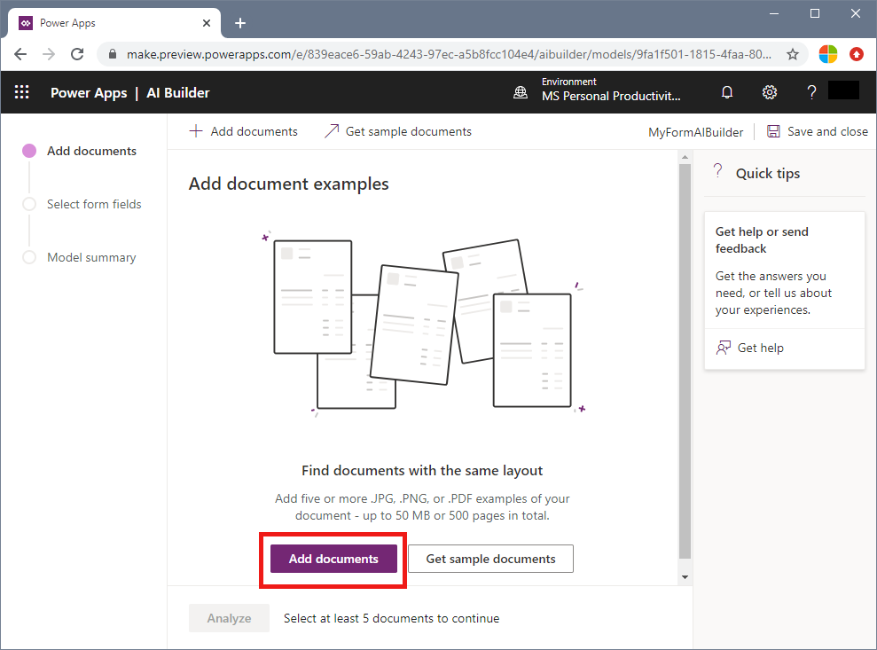

# Tutorial: Create a document scanner app with AI Builder

[AI Builder](https://docs.microsoft.com/en-us/ai-builder/overview) is a Power Platform capability that allows you to easily automate processes and predict outcomes to help improve business performance. You can use AI Builder form processing to create AI models that use machine learning technology to identify and extract key-value pairs and table data from form documents.

In this tutorial, you learn how to:

> [!div class="checklist"]
> * Create a form processing AI model
> * Train your model
> * Publish your model to Azure PowerApps or Flow

## Prerequisites

* Azure subscription - [Create one for free](https://azure.microsoft.com/free/).
* A set of at least five forms of the same type to use for training/testing data. See [Build a training data set for a custom model](../../build-training-data-set.md) for tips and options for putting together your training data set. For this quickstart, you can use the files under the **Train** folder of the [sample data set](https://go.microsoft.com/fwlink/?linkid=2128080).

## Sign in to AI Builder
1. Go to [Power Apps](https://make.powerapps.com/) or [Power Automate](https://flow.microsoft.com/signin), and sign in with your organization account.
1. In the left pane, select **AI Builder** > **Build**.
1. Select the **Form Processing** card.
1. Type a name for your model.
1. Select **Create**.

## Upload and analyze documents

On the **Add documents** page, you need to provide sample documents to train your model for the type of form you want to extract information from. After you upload your documents, AI Builder analyzes them to check that they're sufficient to train a model.

> [!NOTE]
> AI Builder does not currently support the following types of form processing input data:
>
> - Complex tables (nested tables, merged headers or cells, and so on)
> - Check boxes or radio buttons
> - PDF documents longer than 50 pages
> - Fillable PDFs

### Upload your documents

1. Select **Add documents**, select a minimum of five documents, and then select **Upload**.
1. After the upload is completed, select **Close**.
1. Select **Analyze**.

For more information about requirements for input documents, see [Requirements and limitations](form-processing-model-requirements.md).

> [!div class="mx-imgBorder"]
> 

> [!NOTE] 
> After you upload these documents, you can still remove some of the documents or upload additional ones.

### Analyze your documents

During the analysis step, AI Builder examines the documents that you uploaded and detects the fields and tables. The time it takes to complete this operation depends on the number of documents provided, but in most cases it should only take a few minutes.

When the analysis has finished, select the thumbnail to open the field selection experience.

> [!IMPORTANT]
> If the analysis failed, it's likely because AI Builder couldn't detect structured text in your documents. Verify that the documents you updated follow the [requirements and optimizations tips](tbd).

## Select your form fields

To start, choose the fields that matter to you:

 1. Select the detected template card: **\<*Your model name*> form**.
 1. To select the fields, hover over a rectangle that indicates a detected field in the document, or select them in the right-side pane.
 1. Select **Edit** next to the selected field if you want to rename fields to align with your needs or normalize the extracted labels.

    When you hover over a detected field, the following information appears:

    - **Field name**: The name of the label for the detected field.
    - **Field value**: The value for the detected field.
    - **Confidence level**: Confidence score of retrieving this field compared to the trained model.

## Train and validate your model

1. Select **Next** to check your selected form fields. If everything looks good, select **Train** to train your model.
1. When training completes,  select **Go to Details page** in the **Training complete** screen.

## Quick-test your model

The Details page allows you to test your model before you publish or use it:

1. On the Details page, select **Quick test**.
2. You can either drag and drop a document or select **Upload from my device** to upload your test file. The quick-test should only take a few seconds before displaying the results.
3. You can select **Start over** to run another test or **Close** if you are finished.

## Troubleshooting tips

If you have trouble training your model, try the following:

- Optimize your data using the guidance in the [Requirements](form-processing-model-requirements.md) topic.
- If you're getting bad results or low confidence scores for certain fields, create a new form-processing model and upload more documents. The more documents you tag, the more AI Builder will learn how to better recognize the fields.
- Download and test with [sample material](https://go.microsoft.com/fwlink/?linkid=2103171).

## Publish your model

If you're happy with your model, you can select **Publish**  to publish it. When publishing completes, your model is promoted as **Published** and is ready to be used.

After you've published your form processing model, you can use it in a [PowerApps canvas app](https://docs.microsoft.com/en-us/ai-builder/form-processor-component-in-powerapps) or in [Power Automate](https://docs.microsoft.com/en-us/ai-builder/form-processing-model-in-flow).

## Clean up resources

If you're not going to continue to use this application, delete
<resources> with the following steps:

1. From the left-hand menu...
2. ...click Delete, type...and then click Delete

## Next steps

Follow the AI Builder documentation for using a form-processing model.

* [Use the form-processor component in Power Apps](https://docs.microsoft.com/en-us/ai-builder/form-processor-component-in-powerapps)
* [Use a form-processing model in Power Automate](https://docs.microsoft.com/en-us/ai-builder/form-processing-model-in-flow)