# Tutorial: Use Form Recognizer with Azure Logic Apps to analyze invoices

In this tutorial, you create a workflow in Azure Logic Apps that uses Form Recognizer, a service that is part of Azure Cognitive Services suite, to extract data from invoices. You use Form Recognizer to first train a model using a sample data set and then test the model using another data set. The sample data used in this tutorial is stored in Azure Storage blob containers.

Here's what this tutorial covers:

> [!div class="checklist"]
> * Request access for Form Recognizer
> * Create an Azure Storage blob container
> * Upload sample data to the Azure blob container
> * Create an Azure Logic App
> * Configure the logic app to use a Form Recognizer resource
> * Test the workflow by running the logic app

## Prerequisites

* Azure subscription - [Create one for free](https://azure.microsoft.com/free/).

## Request access for Form Recognizer

Form Recognizer is available in a limited-access preview. To get access to the preview, fill out and submit the [Form Recognizer access request](https://aka.ms/FormRecognizerRequestAccess) form. Once your request is approved by the Azure Cognitive Services team, you'll receive an email with instructions for accessing the service.

## Understand the invoice to be analyzed

The sample data set that we use to train the model and test the model is available as a .zip file from [GitHub](https://go.microsoft.com/fwlink/?linkid=2090451). Download and extract the .zip file and open an invoice PDF file under the **/Train** folder. Notice how it has a table with the invoice number, invoice date, etc. 

> [!div class="mx-imgBorder"]
> 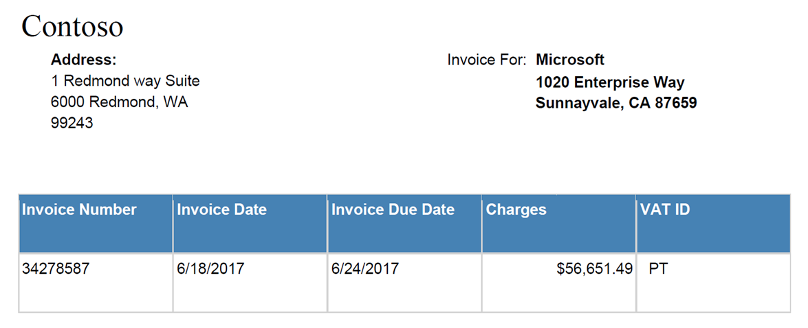

In this tutorial, we learn how to extract the information from such tables into a JSON format using a workflow created using Azure Logic Apps and Form Recognizer.

## Create an Azure Storage blob container

You use this container to upload sample data that is required to train the model.

1. Follow the instructions in [Create an Azure Storage account](../../storage/common/storage-account-create.md) to create a storage account. Use **formrecostorage** as the storage account name.
1. Follow the instructions in [Create an Azure blob container](../../storage/blobs/storage-quickstart-blobs-portal.md) to create a container within the Azure Storage account. Use **formrecocontainer** as the container name. Make sure you set the public access level to **Container (anonymous read access for containers and blobs)**.

    > [!div class="mx-imgBorder"]
    > 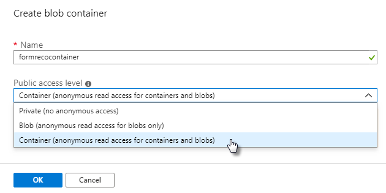

## Upload sample data to the Azure blob container

Download the sample data available at [GitHub](https://go.microsoft.com/fwlink/?linkid=2090451). Extract the data to a local folder and upload the contents of the **/Train** folder to the **formrecocontainer** that you created earlier. Follow the instructions at [Upload a block blob](../../storage/blobs/storage-quickstart-blobs-portal.md#upload-a-block-blob) to upload data to a container.

Copy the URL of the container. You will need this later in this tutorial. If you created the storage account and the container with the same names as listed in this tutorial, the URL will be *https:\//formrecostorage.blob.core.windows.net/formrecocontainer/*.

## Create a Form Recognizer resource

[!INCLUDE [create resource](./includes/create-resource.md)]

## Create your logic app

You can use Azure Logic Apps to automate and orchestrate tasks and workflows. In this tutorial, you create a logic app that is triggered by receiving an invoice that you want to analyze as an email attachment. In this workflow, you perform the following tasks:
* Configure the logic app to trigger automatically when you receive an email with an invoice attached.
* Configure the logic app to use a Form Recognizer **Train Model** operation to train a model using the sample data that you uploaded to the Azure blob storage.
* Configure the logic app to use a Form Recognizer **Analyze Form** operation to use the model that you already trained. This component will analyze the invoice that you provide to this logic app based on the model that it trained earlier.

Let's start! Follow these steps to set up your workflow.

1. From the main Azure menu, select **Create a resource** > **Integration** > **Logic App**.

1. Under **Create logic app**, provide details about your logic app as shown here. After you're done, select **Create**.

   | Property | Value | Description |
   |----------|-------|-------------|
   | **Name** | <*logic-app-name*> | Your logic app name, which can contain only letters, numbers, hyphens (`-`), underscores (`_`), parentheses (`(`, `)`), and periods (`.`). This example uses "My-First-Logic-App". |
   | **Subscription** | <*Azure-subscription-name*> | Your Azure subscription name |
   | **Resource group** | <*Azure-resource-group-name*> | The name for the [Azure resource group](./../../azure-resource-manager/management/overview.md) used to organize related resources. This example uses "My-First-LA-RG". |
   | **Location** | <*Azure-region*> | The region where to store your logic app information. This example uses "West US". |
   | **Log Analytics** | Off | Keep the **Off** setting for diagnostic logging. |
   ||||

1. After Azure deploys your app, on the Azure toolbar, select **Notifications** > **Go to resource** for your deployed logic app. Or, you can find and select your logic app by typing the name in the search box.

   The Logic Apps Designer opens and shows a page with an introduction video and commonly used triggers. Under **Templates**, select **Blank Logic App**.

   > [!div class="mx-imgBorder"]
   > 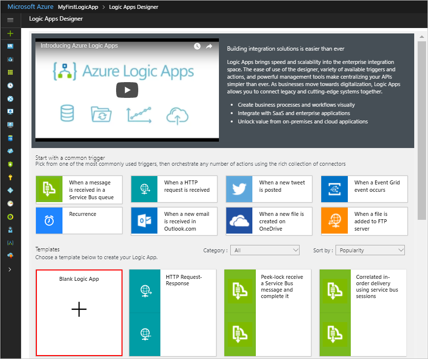

### Configure the logic app to trigger the workflow when an email arrives

In this tutorial, you trigger the workflow when an email is received with an attached invoice. For this tutorial, we choose Office 365 as the email service but you can use any other email provider that you wish to use.

1. From the tabs, select All, select **Office 365 Outlook**, and then under **Triggers**, select **When a new email arrives**.

    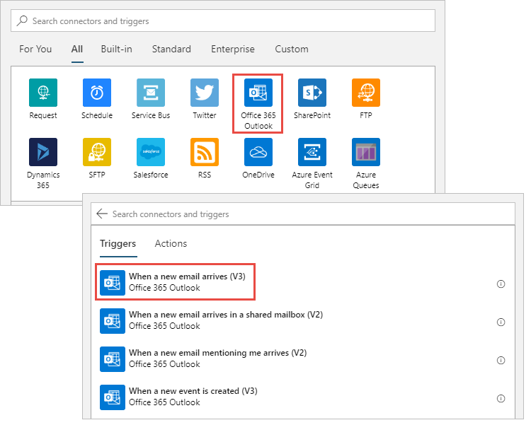

1. In the **Office 365 Outlook** box, click **Sign in**, and enter the details to log into an Office 365 account.

1. In the next dialog box, perform the following steps.
    1. Select the folder that should be monitored for any new email.
    1. For **Has attachments** select **Yes**. This ensures that only the emails with attachments trigger the workflow.
    1. For **Include attachments** select **Yes**. This ensures that the contents of the attachment are used in downstream processing.

        > [!div class="mx-imgBorder"]
        > 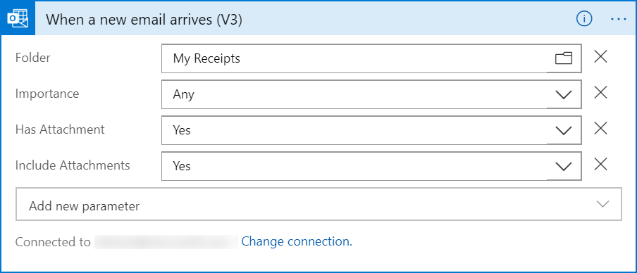

1. Click **Save** from the toolbar at the top.

### Configure the logic app to use Form Recognizer Train Model operation

Before you can use the Form Recognizer service to analyze invoices, you need to train a model by providing it some sample invoices data that the model can analyze and learn from.

1. Select **New step**, and under **Choose an action**, search for **Form Recognizer**. From the results that show up, select **Form Recognizer**, and then under the actions that are available for Form Recognizer, select **Train Model**.

    > [!div class="mx-imgBorder"]
    > 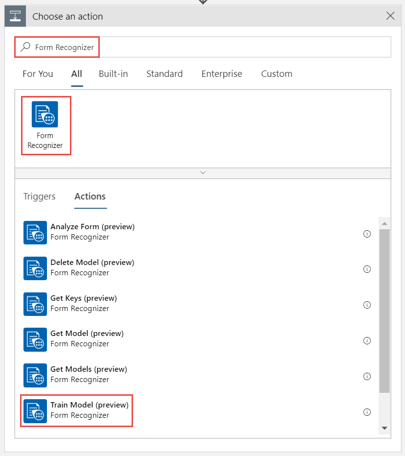

1. In the Form Recognizer dialog box, provide a name for the connection, and enter the endpoint URL and the key that you retrieved for the Form Recognizer resource.

    > [!div class="mx-imgBorder"]
    > 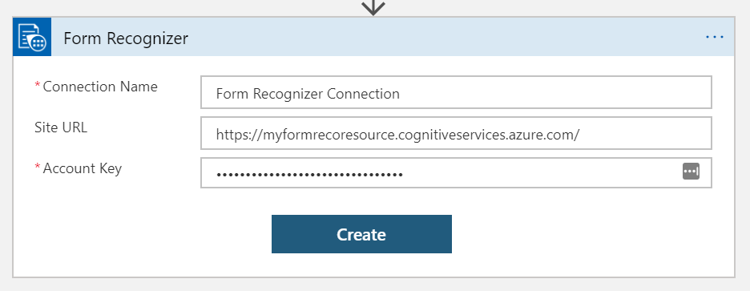

    Click **Create**.

1. In the **Train Model** dialog box, for **Source**, enter the URL for the container where you uploaded the sample data.

    > [!div class="mx-imgBorder"]
    > 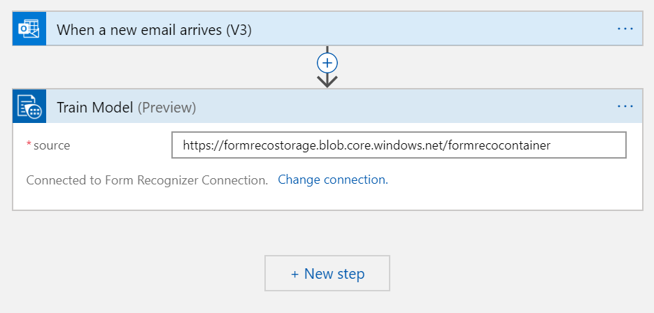

1. Click **Save** from the toolbar at the top.

### Configure the logic app to use the Form Recognizer Analyze Form operation

In this section, you add the **Analyze Form** operation to the workflow. This operation uses the already trained model to analyze a new invoice that is provided to the logic app.

1. Select **New step**, and under **Choose an action**, search for **Form Recognizer**. From the results that show up, select **Form Recognizer**, and then under the actions that are available for Form Recognizer, select **Analyze Form**.

    > [!div class="mx-imgBorder"]
    > 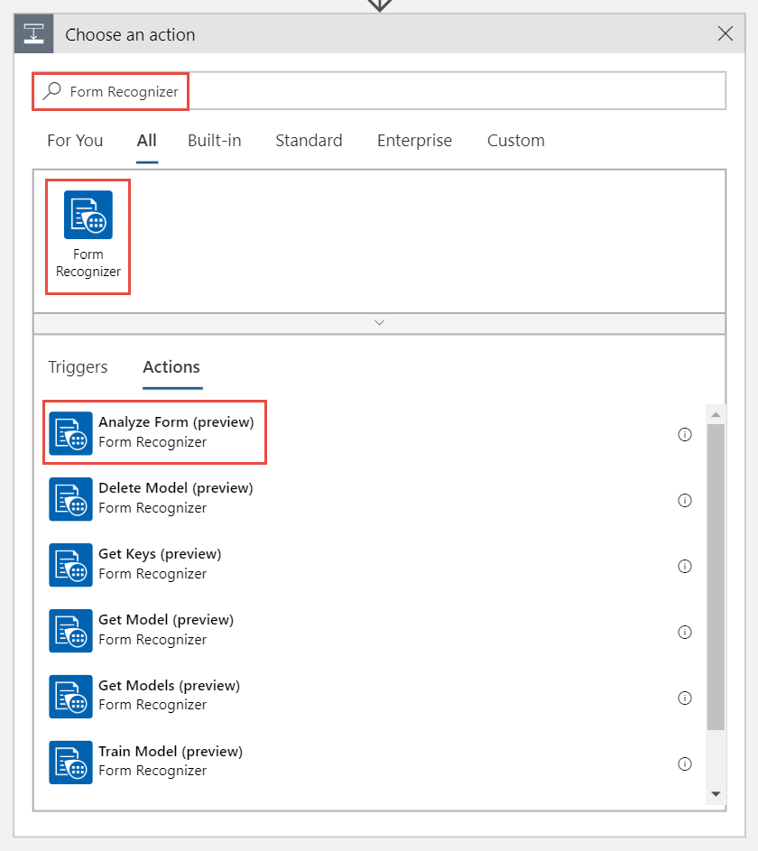

1. In the **Analyze Form** dialog box, do the following:

    1. Click the **Model ID** text box, and in the dialog box that opens up, under **Dynamic Content** tab, select **modelId**. By doing this you provide the flow application with the model ID of the model you trained in the last section.

        > [!div class="mx-imgBorder"]
        > 

    2. Click the **Document** text box, and in the dialog box that opens up, under **Dynamic Content** tab, select **Attachments Content**. By doing this you configure the flow to use the sample invoice file that is attached in the email that is sent to trigger the workflow.

        > [!div class="mx-imgBorder"]
        > 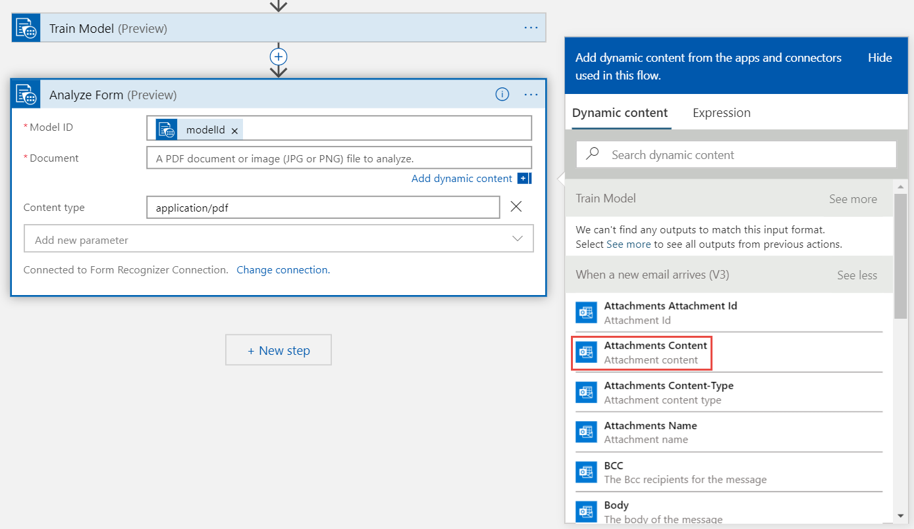

1. Click **Save** from the toolbar at the top.

### Extract the table information from the invoice

In this section, we configure the logic app to extract the information from the table within the invoices.

1. Select **Add an action**, and under **Choose an action**, search for **Compose** and under the actions that are available, select **Compose** again.
    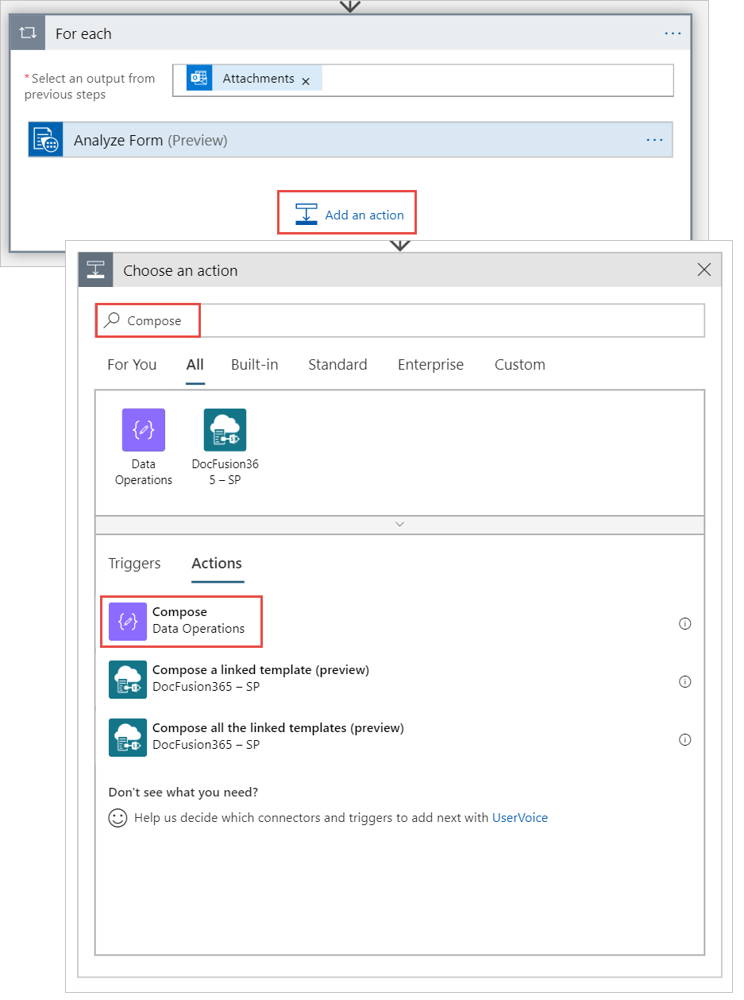

1. In the **Compose** dialog box, click the **Inputs** text box, and from the dialog box that pops up, select **tables**.

    > [!div class="mx-imgBorder"]
    > 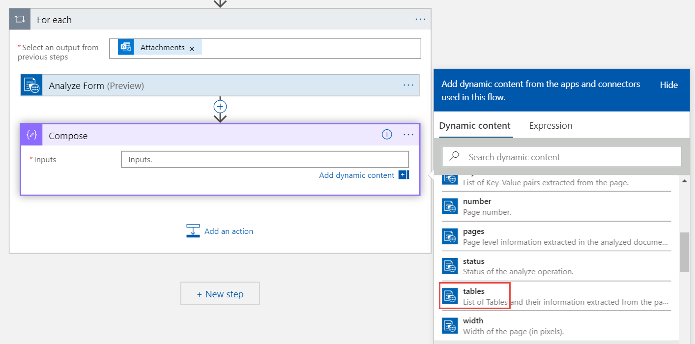

1. Click **Save**.

## Test your logic app

To test the logic app, use the sample invoices in the **/Test** folder of the sample data set that you downloaded from [GitHub](https://go.microsoft.com/fwlink/?linkid=2090451). Perform the following steps:

1. From the Azure Logic Apps designer for your app, select **Run** from the toolbar at the top. The workflow is now active and waits to receive an email with the invoice attached.
1. Send an email with a sample invoice attached to the email address that you provided while creating the logic app. Make sure the email is delivered to the folder that you provided while configuring the logic app.
1. As soon as the email is delivered to the folder, the Logic Apps Designer shows a screen with the progress of each stage. In the screenshot below, you see that an email with attachment is received and the workflow is in progress.

    > [!div class="mx-imgBorder"]
    > 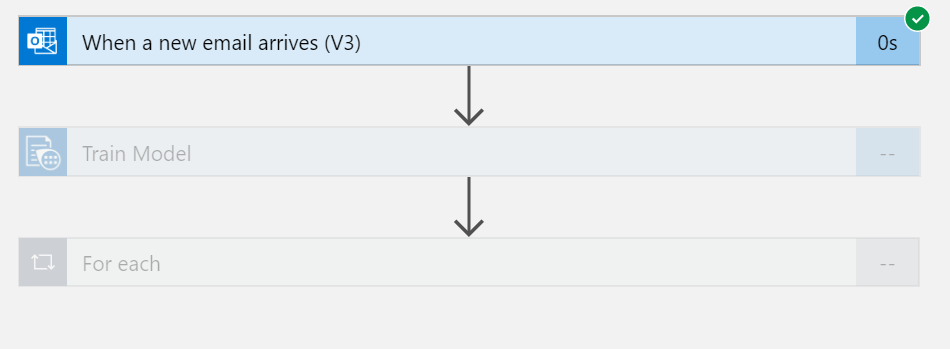

1. After all the stages of the workflow have finished running, the Logic Apps Designer shows a green checkbox against every stage. In the designer window, select **For each 2**, and then select **Compose**.

    > [!div class="mx-imgBorder"]
    > 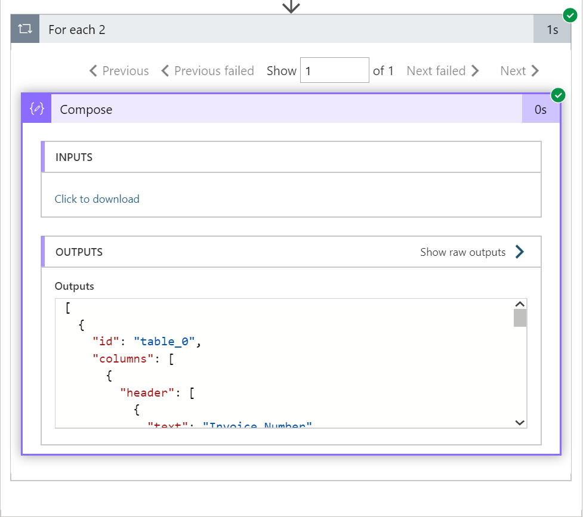

    From the **OUTPUTS** box, copy the output and paste it to any text editor.

1. Compare the JSON output with the sample invoice that you sent as an attachment in the email. Verify that the JSON data corresponds to the data in the table within the invoice.

    ```json
    [
      {
        "id": "table_0",
        "columns": [
          {
            "header": [
              {
                "text": "Invoice Number",
                "boundingBox": [
                  38.5,
                  585.2,
                  113.4,
                  585.2,
                  113.4,
                  575.8,
                  38.5,
                  575.8
                ]
              }
            ],
            "entries": [
              [
                {
                  "text": "7689302",
                  "boundingBox": [
                    38.5,
                    549.8,
                    77.3,
                    549.8,
                    77.3,
                    536.2,
                    38.5,
                    536.2
                  ],
                  "confidence": 1
                }
              ]
            ]
          },
          {
            "header": [
              {
                "text": "Invoice Date",
                "boundingBox": [
                  139.7,
                  585.2,
                  198.5,
                  585.2,
                  198.5,
                  575.8,
                  139.7,
                  575.8
                ]
              }
            ],
            "entries": [
              [
                {
                  "text": "3/09/2015",
                  "boundingBox": [
                    139.7,
                    548.1,
                    184,
                    548.1,
                    184,
                    536.2,
                    139.7,
                    536.2
                  ],
                  "confidence": 1
                }
              ]
            ]
          },
          {
            "header": [
              {
                "text": "Invoice Due Date",
                "boundingBox": [
                  240.5,
                  585.2,
                  321,
                  585.2,
                  321,
                  575.8,
                  240.5,
                  575.8
                ]
              }
            ],
            "entries": [
              [
                {
                  "text": "6/29/2016",
                  "boundingBox": [
                    240.5,
                    549,
                    284.8,
                    549,
                    284.8,
                    536.2,
                    240.5,
                    536.2
                  ],
                  "confidence": 1
                }
              ]
            ]
          },
          {
            "header": [
              {
                "text": "Charges",
                "boundingBox": [
                  341.3,
                  585.2,
                  381.2,
                  585.2,
                  381.2,
                  575.8,
                  341.3,
                  575.8
                ]
              }
            ],
            "entries": [
              [
                {
                  "text": "$22,123.24",
                  "boundingBox": [
                    380.6,
                    548.5,
                    430.5,
                    548.5,
                    430.5,
                    536.2,
                    380.6,
                    536.2
                  ],
                  "confidence": 1
                }
              ]
            ]
          },
          {
            "header": [
              {
                "text": "VAT ID",
                "boundingBox": [
                  442.1,
                  590,
                  474.8,
                  590,
                  474.8,
                  575.8,
                  442.1,
                  575.8
                ]
              }
            ],
            "entries": [
              [
                {
                  "text": "QR",
                  "boundingBox": [
                    447.7,
                    549.8,
                    462.6,
                    549.8,
                    462.6,
                    536.2,
                    447.7,
                    536.2
                  ],
                  "confidence": 1
                }
              ]
            ]
          }
        ]
      }
    ]
    ```
    You have successfully completed this tutorial!

## Next steps

In this tutorial, you set up an Azure Logic Apps workflow to use Form Recognizer to train a model and extract the contents of an invoice. Next, learn how to build a training data set so you can create a similar scenario with your own forms.

> [!div class="nextstepaction"]
> [Build a training data set](build-training-data-set.md)