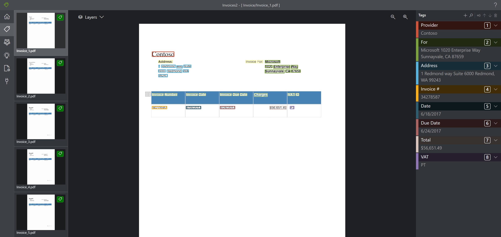

# What's new in Form Recognizer?

The Form Recognizer service is updated on an ongoing basis. Use this article to stay up to date with feature enhancements, fixes, and documentation updates.

## August 2020

### New features

**Form Recognizer v2.1 public preview is now available.** V2.1-preview.1 has been released, including the following features: 

- **REST API reference is available** - View the [v2.1-preview.1 reference](https://westcentralus.dev.cognitive.microsoft.com/docs/services/form-recognizer-api-v2-1-preview-1/operations/AnalyzeBusinessCardAsync) 
- **New languages supported In addition to English**, the following [languages](language-support.md) are now supported: for `Layout` and `Train Custom Model`: English (`en`), Chinese (Simplified) (`zh-Hans`), Dutch (`nl`), French (`fr`), German (`de`), Italian (`it`), Portuguese (`pt`) and Spanish (`es`).
- **Checkbox / Selection Mark detection** – Form Recognizer supports detection and extraction of selection marks such as check boxes and radio buttons. Selection Marks are extracted in `Layout` and you can now also label and train in `Train Custom Model` - _Train with Labels_ to extract key value pairs for selection marks. 
- **Model Compose** allows multiple models to be composed and called with a single model ID. When a document is submitted to be analyzed with a composed model ID, a classification step is first performed to route it to the correct custom model. Model compose is available for `Train Custom Model` - _Train with labels_.
- **Model name** add a friendly name to your custom models for easier management and tracking.
- **[New pre-built model for Business Cards](concept-business-cards.md)** for extracting common fields in English, language business cards.
- **[New locales for pre-built Receipts](concept-receipts.md)** in addition to EN-US, support is now available for EN-AU, EN-CA, EN-GB, EN-IN
- **Quality improvements** for `Layout`, `Train Custom Model` - _Train without Labels_ and _Train with Labels_.

**v2.0** includes the following update:
-	The [client libraries](quickstarts/client-library.md) for NET, Python, Java, and JavaScript have entered General Availability. 

**New samples** are available on GitHub. 
- The [Knowledge Extraction Recipes - Forms Playbook](https://github.com/microsoft/knowledge-extraction-recipes-forms) collects best practices from real Form Recognizer customer engagements and provides usable code samples, checklists, and sample pipelines used in developing these projects. 
- The [sample labeling tool](https://github.com/microsoft/OCR-Form-Tools) has been updated to support the new v2.1 functionality. See this [quickstart](quickstarts/label-tool.md) for getting started with the tool. 
- The [Intelligent Kiosk](https://github.com/microsoft/Cognitive-Samples-IntelligentKiosk/blob/master/Documentation/FormRecognizer.md) Form Recognizer sample shows how to integrate `Analyze Receipt` and `Train Custom Model` - _Train without Labels_.

## July 2020

### New features

* **v2.0 reference available** View the [v2.0 API Reference](https://westus2.dev.cognitive.microsoft.com/docs/services/form-recognizer-api-v2/operations/AnalyzeWithCustomForm) and the updated SDKs for [.NET](https://docs.microsoft.com/dotnet/api/overview/azure/ai.formrecognizer-readme-pre?view=azure-dotnet), [Python](https://docs.microsoft.com/python/api/overview/azure/?view=azure-python), [Java](https://docs.microsoft.com/java/api/overview/azure/ai-formrecognizer-readme-pre?view=azure-java-preview), and [JavaScript](https://docs.microsoft.com/javascript/api/overview/azure/?view=azure-node-latest).
* **Table enhancements and Extraction enhancements** includes accuracy improvements and table extractions enhancements, specifically, the capability to learn tables headers and structures in _custom train without labels_. 

* **Currency support** Detection and extraction of global currency symbols.
* **Azure Gov** Form Recognizer is now also available in Azure Gov.
* **Enhanced security features**: 
   * **Bring your own key**  Form Recognizer automatically encrypts your data when persisted to the cloud to protect it and to help you to meet your organizational security and compliance commitments. By default, your subscription uses Microsoft-managed encryption keys. You can now also manage your subscription with your own encryption keys. [Customer-managed keys (CMK), also known as bring your own key (BYOK)](https://docs.microsoft.com/azure/cognitive-services/form-recognizer/form-recognizer-encryption-of-data-at-rest), offer greater flexibility to create, rotate, disable, and revoke access controls. You can also audit the encryption keys used to protect your data.  
   * **Private endpoints** – Enables you on a virtual network (VNet) to [securely access data over a Private Link. ](https://docs.microsoft.com/azure/private-link/private-link-overview)

## June 2020

### New features
* **CopyModel API added to client SDKs** You can now use the client SDKs to copy models from one subscription to another. See [Back up and recover models](./disaster-recovery.md) for general information on this feature.
* **Azure Active Directory integration** You can now use your Azure AD credentials to authenticate your Form Recognizer client objects in the SDKs.
* **SDK-specific changes** This includes both minor feature additions and breaking changes. See the SDK changelogs for more information.
  * [C# SDK Preview 3 changelog](https://github.com/Azure/azure-sdk-for-net/blob/master/sdk/formrecognizer/Azure.AI.FormRecognizer/CHANGELOG.md)
  * [Python SDK Preview 3 changelog](https://github.com/Azure/azure-sdk-for-python/blob/master/sdk/formrecognizer/azure-ai-formrecognizer/CHANGELOG.md)
  * [Java SDK Preview 3 changelog](https://github.com/Azure/azure-sdk-for-java/blob/master/sdk/formrecognizer/azure-ai-formrecognizer/CHANGELOG.md)
  * [JavaScript SDK Preview 3 changelog](https://github.com/Azure/azure-sdk-for-js/blob/%40azure/ai-form-recognizer_1.0.0-preview.3/sdk/formrecognizer/ai-form-recognizer/CHANGELOG.md)

## April 2020

### New features
* **SDK support for Form Recognizer API v2.0 Public Preview** This month we expanded our service support to include a preview SDK for Form Recognizer v2.0 (preview) release. Use the links below to get started with your language of choice: 
   * [.NET SDK](https://docs.microsoft.com/dotnet/api/overview/azure/ai.formrecognizer-readme-pre?view=azure-dotnet)
   * [Java SDK](https://docs.microsoft.com/java/api/overview/azure/ai-formrecognizer-readme-pre?view=azure-java-preview)
   * [Python SDK](https://docs.microsoft.com/python/api/overview/azure/ai-formrecognizer-readme-pre?view=azure-python-preview)
   * [JavaScript SDK](https://docs.microsoft.com/javascript/api/overview/azure/ai-form-recognizer-readme-pre?view=azure-node-preview)

  The new SDK supports all the features of the v2.0 REST API for Form Recognizer. For example, you can train a model with or without labels and extract text, key value pairs and tables from your forms, extract data from receipts with the pre-built receipts service and extract text and tables with the layout service from your documents. You can share your feedback on the SDKs through the [SDK Feedback form](https://aka.ms/FR_SDK_v1_feedback).
 
* **Copy Custom Model** You can now copy models between regions and subscriptions using the new Copy Custom Model feature. Before invoking the Copy Custom Model API, you must first obtain authorization to copy into the target resource by calling the Copy Authorization operation against the target resource endpoint.
   * [Generate a copy authorization](https://westus2.dev.cognitive.microsoft.com/docs/services/form-recognizer-api-v2/operations/CopyCustomFormModelAuthorization) REST API
   * [Copy a custom model](https://westus2.dev.cognitive.microsoft.com/docs/services/form-recognizer-api-v2/operations/CopyCustomFormModel) REST API 

### Security improvements

* Customer Managed Keys are now available for FormRecognizer. For more information, see [Data encryption at rest for Form Recognizer](https://docs.microsoft.com/azure/cognitive-services/form-recognizer/form-recognizer-encryption-of-data-at-rest).
* Use Managed Identities for access to Azure resources with Azure Active Directory. For more information, see [Authorize access to managed identities](https://docs.microsoft.com/azure/cognitive-services/authentication#authorize-access-to-managed-identities).

## March 2020 

### New features

* **Value types for labeling** You can now specify the types of values you're labeling with the Form Recognizer sample labeling tool. The following value types and variations are currently supported:
  * `string`
    * default, `no-whitespaces`, `alphanumeric`
  * `number`
    * default, `currency`
  * `date` 
    * default, `dmy`, `mdy`, `ymd`
  * `time`
  * `integer`

  See the [Sample labeling tool](./quickstarts/label-tool.md#specify-tag-value-types) guide to learn how to use this feature.

* **Table visualization** The sample labeling tool now displays tables that were recognized in the document. This lets you view the tables that have been recognized and extracted from the document, prior to labeling and analyzing. This feature can be toggled on/off using the layers option.

  This is an example of how tables are recognized and extracted:

  > [!div class="mx-imgBorder"]
  > 

    The extracted tables are available in the JSON output under `"pageResults"`.

  > [!IMPORTANT]
  > Labeling tables isn't supported. If tables are not recognized and extrated automatically, you can only label them as key/value pairs. When labeling tables as key/value pairs, label each cell as a unique value.

### Extraction enhancements

This release includes extraction enhancements and accuracy improvements, specifically, the capability to label and extract multiple key/value pairs in the same line of text. 
 
### Sample labeling tool is now open-source

The Form Recognizer sample labeling tool is now available as an open-source project. You can integrate it within your solutions and make customer-specific changes to meet your needs.

For more information about the Form Recognizer sample labeling tool, review the documentation available on [GitHub](https://github.com/microsoft/OCR-Form-Tools/blob/master/README.md).

### TLS 1.2 enforcement

TLS 1.2 is now enforced for all HTTP requests to this service. For more information, see [Azure Cognitive Services security](../cognitive-services-security.md).

## January 2020

This release introduces the Form Recognizer 2.0 (preview). In the sections below, you'll find more information about new features, enhancements, and changes. 

### New features

* **Custom model**
  * **Train with labels** You can now train a custom model with manually labeled data. This results in better-performing models and can produce models that work with complex forms or forms containing values without keys.
  * **Asynchronous API** You can use async API calls to train with and analyze large data sets and files.
  * **TIFF file support** You can now train with and extract data from TIFF documents.
  * **Extraction accuracy improvements**

* **Prebuilt receipt model**
  * **Tip amounts** You can now extract tip amounts and other handwritten values.
  * **Line item extraction** You can extract line item values from receipts.
  * **Confidence values** You can view the model's confidence for each extracted value.
  * **Extraction accuracy improvements**

* **Layout extraction** You can now use the Layout API to extract text data and table data from your forms.

### Custom model API changes

All of the APIs for training and using custom models have been renamed, and some synchronous methods are now asynchronous. The following are major changes:

* The process of training a model is now asynchronous. You initiate training through the **/custom/models** API call. This call returns an operation ID, which you can pass into **custom/models/{modelID}** to return the training results.
* Key/value extraction is now initiated by the **/custom/models/{modelID}/analyze** API call. This call returns an operation ID, which you can pass into **custom/models/{modelID}/analyzeResults/{resultID}** to return the extraction results.
* Operation IDs for the Train operation are now found in the **Location** header of HTTP responses, not the **Operation-Location** header.

### Receipt API changes

The APIs for reading sales receipts have been renamed.

* Receipt data extraction is now initiated by the **/prebuilt/receipt/analyze** API call. This call returns an operation ID, which you can pass into **/prebuilt/receipt/analyzeResults/{resultID}** to return the extraction results.

### Output format changes

The JSON responses for all API calls have new formats. Some keys and values have been added, removed, or renamed. See the quickstarts for examples of the current JSON formats.

## Next steps

Complete a [quickstart](quickstarts/curl-train-extract.md) to get started with the [Form Recognizer APIs](https://westus2.dev.cognitive.microsoft.com/docs/services/form-recognizer-api-v2/operations/AnalyzeWithCustomForm).
