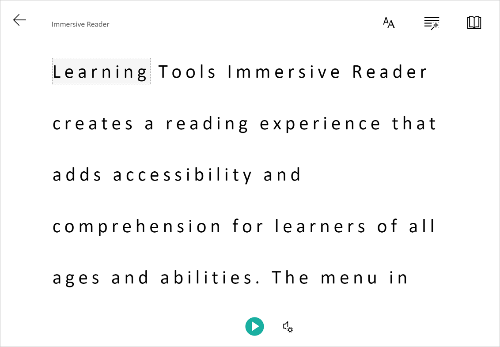
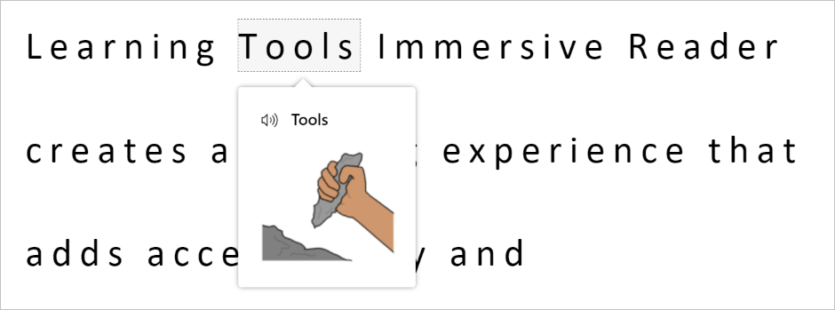
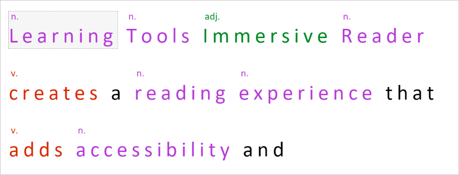
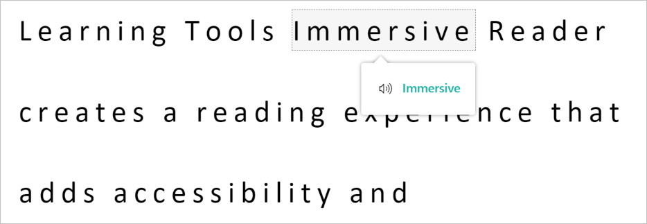
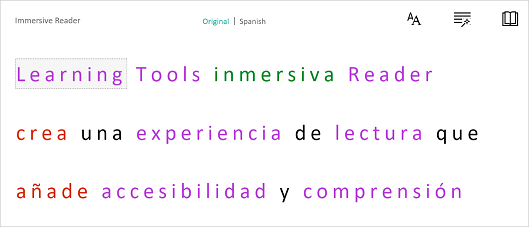

# What is Immersive Reader?

[!INCLUDE [TLS 1.2 enforcement](../../../includes/cognitive-services-tls-announcement.md)]

The [Immersive Reader](https://www.onenote.com/learningtools) is an inclusively designed tool that implements proven techniques to improve reading comprehension for emerging readers, language learners, and people with learning differences such as dyslexia.

You can use Immersive Reader in your web application by using the Immersive Reader SDK.

## What does Immersive Reader do?

The Immersive Reader is designed to make reading more accessible for everyone.

* Shows content in a minimal reading view

  

* Displays pictures of commonly used words

  

* Highlights nouns, verbs, adjectives, and adverbs

  

* Reads your content out loud to you

  

* Translates your content into another language

  

* Breaks down words into syllables

  

## How does Immersive Reader work?

The Immersive Reader is a standalone web app that, when invoked using the Immersive Reader JavaScript SDK, is displayed on top of your existing web app via an `iframe`. When you call the API to launch the Immersive Reader, you specify the content you wish to show in the Immersive Reader. Our SDK handles the creation and styling of the `iframe` and communication with the Immersive Reader backend service, which processes the content for parts of speech, text to speech, translation, and so on.

## Next steps

Get started with Immersive Reader:

* Jump into the [quickstarts](./quickstarts/client-libraries.md?pivots=programming-language-csharp)
* Explore the [Immersive Reader SDK on GitHub](https://github.com/microsoft/immersive-reader-sdk)
* Read the [Immersive Reader SDK Reference](./reference.md)
