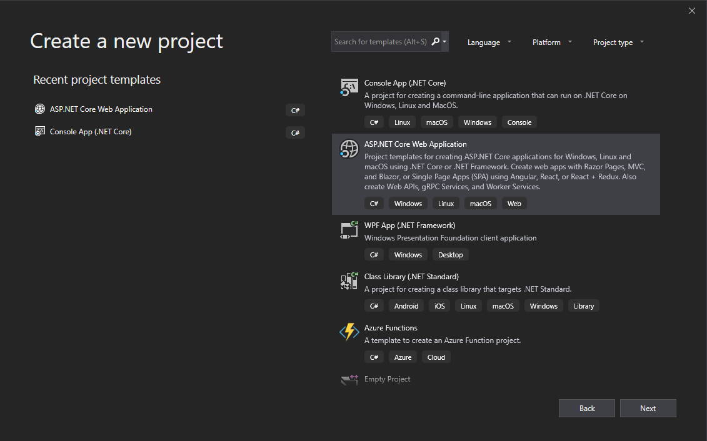
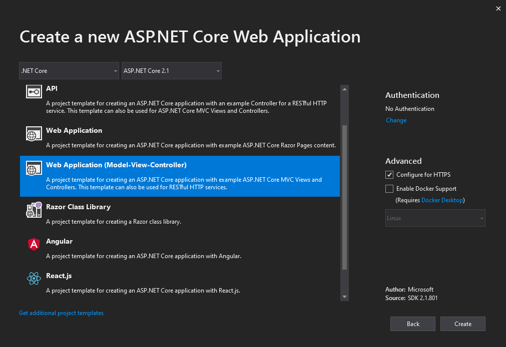
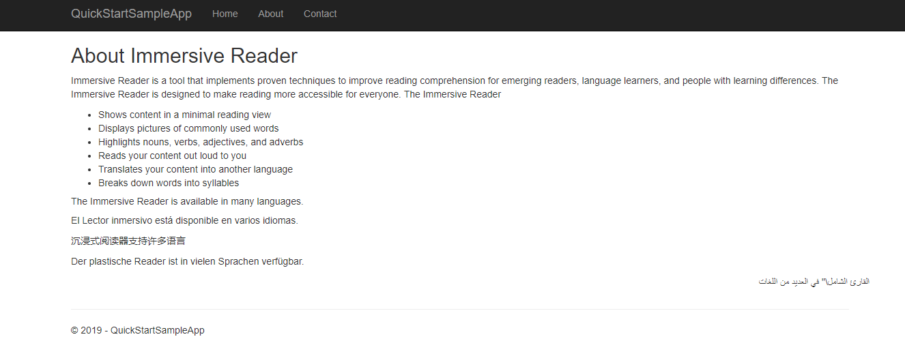

# Quickstart: Create a web app that launches the Immersive Reader (C#)

The [Immersive Reader](https://www.onenote.com/learningtools) is an inclusively designed tool that implements proven techniques to improve reading comprehension.

In this quickstart, you build a web app from scratch and integrate the Immersive Reader by using the Immersive Reader SDK. A full working sample of this quickstart is available [here](https://github.com/microsoft/immersive-reader-sdk/tree/master/samples/quickstart-csharp).

If you don't have an Azure subscription, create a [free account](https://azure.microsoft.com/free/?WT.mc_id=A261C142F) before you begin.

## Prerequisites

* [Visual Studio 2017](https://visualstudio.microsoft.com/downloads)
* A subscription key for Immersive Reader. Get one by following [these instructions](https://docs.microsoft.com/azure/cognitive-services/cognitive-services-apis-create-account).

## Create a web app project

Create a new project in Visual Studio, using the ASP.NET Core Web Application template with built-in Model-View-Controller.





## Acquire an access token

You need your subscription key and endpoint for this next step. You can find your subscription key in the Keys page of your Immersive Reader resource in the Azure portal. You can find your endpoint in the Overview page.

Right-click on the project in the _Solution Explorer_ and choose **Manage User Secrets**. This will open a file called _secrets.json_. Replace the contents of that file with the following, supplying your subscription key and endpoint where appropriate.

```json
{
  "SubscriptionKey": YOUR_SUBSCRIPTION_KEY,
  "Endpoint": YOUR_ENDPOINT
}
```

Open _Controllers\HomeController.cs_, and replace the `HomeController` class with the following code.

```csharp
public class HomeController : Controller
{
    private readonly string SubscriptionKey;
    private readonly string Endpoint;

    public HomeController(Microsoft.Extensions.Configuration.IConfiguration configuration)
    {
        SubscriptionKey = configuration["SubscriptionKey"];
        Endpoint = configuration["Endpoint"];

        if (string.IsNullOrEmpty(Endpoint) || string.IsNullOrEmpty(SubscriptionKey))
        {
            throw new ArgumentNullException("Endpoint or subscriptionKey is null!");
        }
    }

    public IActionResult Index()
    {
        return View();
    }

    [Route("token")]
    public async Task<string> Token()
    {
        return await GetTokenAsync();
    }

    /// <summary>
    /// Exchange your Azure subscription key for an access token
    /// </summary>
    private async Task<string> GetTokenAsync()
    {
        using (var client = new System.Net.Http.HttpClient())
        {
            client.DefaultRequestHeaders.Add("Ocp-Apim-Subscription-Key", SubscriptionKey);
            using (var response = await client.PostAsync(Endpoint, null))
            {
                return await response.Content.ReadAsStringAsync();
            }
        }
    }
}
```

## Add sample content

Now, we'll add some sample content to this web app. Open _Views\Home\Index.cshtml_ and replace the automatically generated code with this sample:

```html
<h1 id='title'>Geography</h1>
<span id='content'>
    <p>The study of Earth's landforms is called physical geography. Landforms can be mountains and valleys. They can also be glaciers, lakes or rivers. Landforms are sometimes called physical features. It is important for students to know about the physical geography of Earth. The seasons, the atmosphere and all the natural processes of Earth affect where people are able to live. Geography is one of a combination of factors that people use to decide where they want to live.</p>
</span>

<div class='immersive-reader-button' data-button-style='iconAndText' onclick='launchImmersiveReader()'></div>

@section scripts {
<script type='text/javascript' src='https://contentstorage.onenote.office.net/onenoteltir/immersivereadersdk/immersive-reader-sdk.0.0.1.js'></script>
<script type='text/javascript' src='https://code.jquery.com/jquery-3.3.1.min.js'></script>
<script type='text/javascript'>
    function getImmersiveReaderTokenAsync() {
        return new Promise((resolve) => {
            $.ajax({
                url: '/token',
                type: 'GET',
                success: token => {
                    resolve(token);
                }
            });
        });
    }

    async function launchImmersiveReader() {
        const content = {
            title: document.getElementById('title').innerText,
            chunks: [ {
                content: document.getElementById('content').innerText,
                lang: 'en'
            } ]
        };

        const token = await getImmersiveReaderTokenAsync();
        ImmersiveReader.launchAsync(token, content, { uiZIndex: 1000000 });
    }
</script>
}
```

## Build and run the app

From the menu bar, select **Debug > Start Debugging**, or press **F5** to start the application.

In your browser, you should see:



When you click on the "Immersive Reader" button, you'll see the Immersive Reader launched with the content on the page.


## Next steps

* View the [tutorial](./tutorial.md) to see what else you can do with the Immersive Reader SDK
* Explore the [Immersive Reader SDK](https://github.com/Microsoft/immersive-reader-sdk) and the [Immersive Reader SDK Reference](./reference.md)
