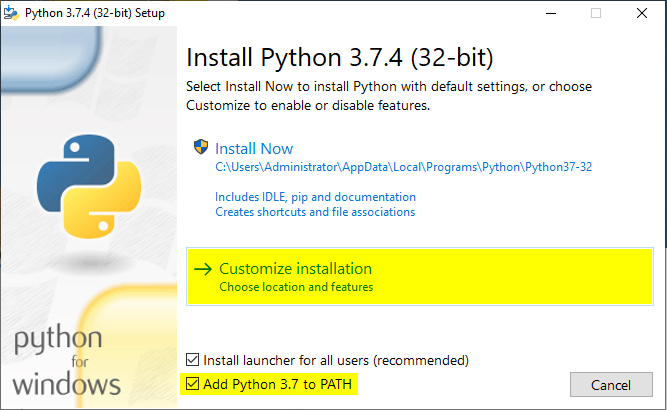
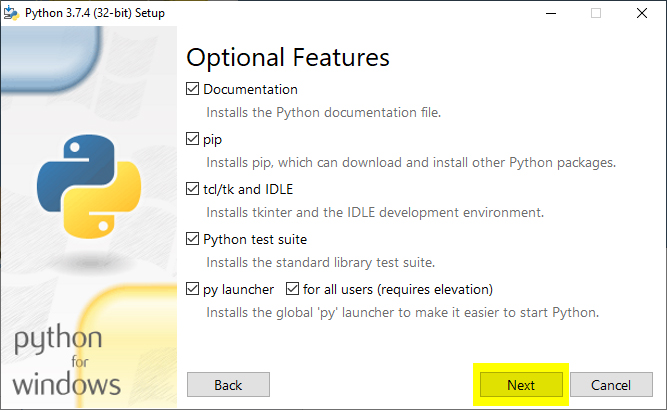

---
title: "Tutorial: Launch the Immersive Reader using Python"
titleSuffix: Azure Cognitive Services
description: In this tutorial, you'll create a Python application that launches the Immersive Reader.
services: cognitive-services
author: dylankil
manager: nitinme

ms.service: cognitive-services
ms.subservice: immersive-reader
ms.topic: tutorial
ms.date: 01/14/2020
ms.author: dylankil
ms.custom: tracking-python
#Customer intent: As a developer, I want to learn more about the Immersive Reader SDK so that I can fully utilize all that the SDK has to offer.
---

# Tutorial: Launch the Immersive Reader using the Python sample project

In the [overview](./overview.md), you learned about what the Immersive Reader is and how it implements proven techniques to improve reading comprehension for language learners, emerging readers, and students with learning differences. This tutorial covers how to create a Python web application that launches the Immersive Reader. In this tutorial, you learn how to:

> [!div class="checklist"]
> * Create a Python web app with Pip, Flask, Jinja, and virtualenv using a sample project
> * Acquire an access token
> * Launch the Immersive Reader with sample content

If you don't have an Azure subscription, create a [free account](https://azure.microsoft.com/free/?WT.mc_id=A261C142F) before you begin.

## Prerequisites

* An Immersive Reader resource configured for Azure Active Directory authentication. Follow [these instructions](./how-to-create-immersive-reader.md) to get set up. You will need some of the values created here when configuring the environment properties. Save the output of your session into a text file for future reference.
* [Git](https://git-scm.com/)
* [Immersive Reader SDK](https://github.com/microsoft/immersive-reader-sdk)
* [Python](https://www.python.org/downloads/) and [pip](https://docs.python.org/3/installing/index.html). Starting with Python 3.4, pip is included by default with the Python binary installers.
* [Flask](https://flask.palletsprojects.com/en/1.0.x/)
* [Jinja](http://jinja.pocoo.org/docs/2.10/)
* [virtualenv](https://virtualenv.pypa.io/en/latest/) and [virtualenvwrapper-win for Windows](https://pypi.org/project/virtualenvwrapper-win/) or [virtualenvwrapper for OSX](https://virtualenvwrapper.readthedocs.io/en/latest/)
* [requests module](https://pypi.org/project/requests/2.7.0/)
* An IDE such as [Visual Studio Code](https://code.visualstudio.com/)

## Configure authentication credentials

Create a new file called _.env_, and paste the following code into it, supplying the values given when you created your Immersive Reader resource.

```text
TENANT_ID={YOUR_TENANT_ID}
CLIENT_ID={YOUR_CLIENT_ID}
CLIENT_SECRET={YOUR_CLIENT_SECRET}
SUBDOMAIN={YOUR_SUBDOMAIN}
```

Be sure not to commit this file into source control, as it contains secrets that should not be made public.

The **getimmersivereadertoken** API endpoint should be secured behind some form of authentication (for example, [OAuth](https://oauth.net/2/)) to prevent unauthorized users from obtaining tokens to use against your Immersive Reader service and billing; that work is beyond the scope of this tutorial.

## Create a Python web app on Windows

Create a Python web app using `flask` on Windows.

Install [Git](https://git-scm.com/).

After Git is installed open a Command Prompt and 'clone' the Immersive Reader SDK Git repository to a folder on your computer

```cmd
git clone https://github.com/microsoft/immersive-reader-sdk.git
```

Install [Python](https://www.python.org/downloads/).

Check the Add Python to PATH box.



Add Optional Features by checking the boxes then click the 'Next' button.



Choose 'Custom installation' and set the installation path as your root folder e.g. `C:\Python37-32\` then click the 'Install' button.


After Python Installation is complete, open a Command Prompt and `cd` to the Python Scripts folder.

```cmd
cd C:\Python37-32\Scripts
```

Install Flask.

```cmd
pip install flask
```

Install Jinja2. A full featured template engine for Python.

```cmd
pip install jinja2
```

Install virtualenv. A tool to create isolated Python environments.

```cmd
pip install virtualenv
```

Install virtualenvwrapper-win. The idea behind virtualenvwrapper is to ease usage of virtualenv.

```cmd
pip install virtualenvwrapper-win
```

Install the requests module. Requests is an Apache2 Licensed HTTP library, written in Python.

```cmd
pip install requests
```

Install the python-dotenv module. This module reads the key-value pair from .env file and adds them to environment variable.

```cmd
pip install python-dotenv
```

Make a virtual environment

```cmd
mkvirtualenv advanced-python
```

`cd` to the sample project root folder.

```cmd
cd C:\immersive-reader-sdk\js\samples\advanced-python
```

Connect the sample project with the environment. This maps the newly created virtual environment to the sample project root folder.

```cmd
setprojectdir .
```

Activate the virtual environment.

```cmd
activate
```

The project should now be active and you'll see something like `(advanced-python) C:\immersive-reader-sdk\js\samples\advanced-python>` in the Command Prompt.

Deactivate the environment.

```cmd
deactivate
```

The `(advanced-python)` prefix should now be gone as the environment is now deactivated.

To reactivate the environment run `workon advanced-python` from the sample project root folder.

```cmd
workon advanced-python
```

### Launch the Immersive Reader with sample content

When the environment is active, run the sample project by entering `flask run` from the sample project root folder.

```cmd
flask run
```

Open your browser and navigate to _http://localhost:5000_.

## Create a Python web app on OSX

Create a Python web app using `flask` on OSX.

Install [Git](https://git-scm.com/).

After Git is installed open Terminal and 'clone' the Immersive Reader SDK Git repository to a folder on your computer

```bash
git clone https://github.com/microsoft/immersive-reader-sdk.git
```

Install [Python](https://www.python.org/downloads/).

The Python root folder e.g. `Python37-32` should now be in the Applications folder.

After Python Installation is complete, open Terminal and `cd` to the Python Scripts folder.

```bash
cd immersive-reader-sdk/js/samples/advanced-python
```

Install pip.

```bash
curl https://bootstrap.pypa.io/get-pip.py -o get-pip.py
```

Then run the following to install pip for the currently signed-in user to avoid permissions issues.

```bash
python get-pip.py --user
```

```bash
sudo nano /etc/paths
```

- Enter your password, when prompted.
- Add the path of your pip installation to your PATH variable.
- Go to the bottom of the file, and enter the path you wish to add as the last item of the list e.g. `PATH=$PATH:/usr/local/bin`.
- Hit control-x to quit.
- Enter `Y` to save the modified buffer.
- That's it! To test it, in new Terminal window, type: `echo $PATH`.

Install Flask.

```bash
pip install flask --user
```

Install Jinja2. A full featured template engine for Python.

```bash
pip install Jinja2 --user
```

Install virtualenv. A tool to create isolated Python environments.

```bash
pip install virtualenv --user
```

Install virtualenvwrapper. The idea behind virtualenvwrapper is to ease usage of virtualenv.

```bash
pip install virtualenvwrapper --user
```

Install the requests module. Requests is an Apache2 Licensed HTTP library, written in Python.

```bash
pip install requests --user
```

Install the python-dotenv module. This module reads the key-value pair from .env file and adds them to environment variable.

```bash
pip install python-dotenv --user
```

Choose a folder where you would like to keep your virtual environments and run this command

```bash
mkdir ~/.virtualenvs
```

`cd` to the Immersive Reader SDK Python sample application folder.

```bash
cd immersive-reader-sdk/js/samples/advanced-python
```

Make a virtual environment

```bash
mkvirtualenv -p /usr/local/bin/python3 advanced-python
```

Connect the sample project with the environment. This maps the newly created virtual environment to the sample project root folder.

```bash
setprojectdir .
```

Activate the virtual environment.

```bash
activate
```

The project should now be active and you'll see something like `(advanced-python) /immersive-reader-sdk/js/samples/advanced-python>` in the Command Prompt.

Deactivate the environment.

```bash
deactivate
```

The `(advanced-python)` prefix should now be gone as the environment is now deactivated.

To reactivate the environment run `workon advanced-python` from the sample project root folder.

```bash
workon advanced-python
```

## Launch the Immersive Reader with sample content

When the environment is active, run the sample project by entering `flask run` from the sample project root folder.

```bash
flask run
```

Open your browser and navigate to _http://localhost:5000_.

## Next steps

* Explore the [Immersive Reader SDK](https://github.com/microsoft/immersive-reader-sdk) and the [Immersive Reader SDK Reference](./reference.md)
* View code samples on [GitHub](https://github.com/microsoft/immersive-reader-sdk/tree/master/js/samples/)
