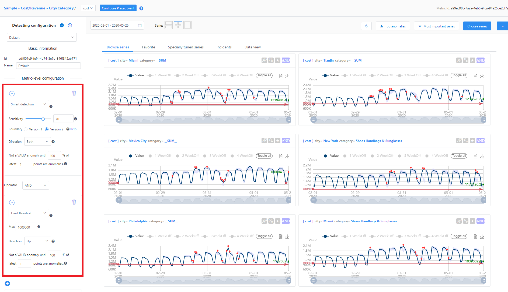
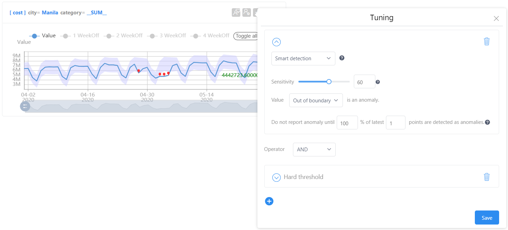
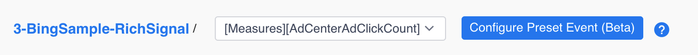

# How to: configure metrics and anomaly detection using the web portal

Use this article to start configuring your Metrics Advisor instance using the web portal. To browse the metrics for a specific data feed, go to the **Data feeds** page and select one of the feeds. This will display a list of metrics associated with it.

Click on one of the metric names to see its details. In this detailed view, you can switch to another metric in the same data feed using the drop down list in the top right corner of the screen.

When you first view a metrics' details, you can load a time series by letting Metrics Advisor choose one for you, or by specifying values to be included for each dimension. 

You can also select time ranges, and change the layout of the page. Note the following:
- The start time is inclusive.
- The end time is exclusive. 

You can click the **Incidents** tab to view anomalies, and find a link to the [Incident hub](diagnose-an-incident.md).

## Tune the anomaly detection configuration

A metric can apply one or more anomaly detection configurations. There is a default configuration for each metric, which you can edit or add to, according to your data needs.

### Tune the configuration for all series in current metric

This configuration will be applied to all the series in this metric, except for ones with a separate configuration. A metric level configuration is applied by default when data is onboarded, and is shown on the left panel. Users can directly edit metric level config on metric page. 

There are additional parameters like **Direction**, and **valid anomaly** that can be used to further tune the configuration. You can combine different detection methods as well. 

### Tune the configuration for a specific series or group

If you want to tune a group of series, you can specify the dimension value to select a group. The number of specified dimensions should be less than the total number of dimensions in the series. Using this configuration will be applied to the series instead of the metric level configuration. Whichever preset event is chosen, the result shows in "Browse series" tab at the same time with anomaly detection series charts.

Click **Advanced Configuration** below the metric level configuration options to see the group level configuration.You can add a configuration for an individual series, or group of series by clicking the **+** icon in this window. The parameters are similar to the metric-level configuration parameters, but you may need to specify at least one dimension value for a group-level configuration to identify a group of series. And specify all dimension values for series-level configuration to identify a specific series. After setting the conditions for this group, save it.

### Anomaly Detection Methods

Metrics Advisor offers multiple anomaly detection methods. You can use one or combine them using logical operators by clicking the **+** button. 

**Smart detection** 

Smart detection is powered by machine learning that learns patterns from historical data, and uses them for future detection. When using this method, the **Sensitivity** is the most important parameter for tuning the detection results. You can drag it to a smaller or larger value to affect the visualization on the right side of the page. Choose one that fits your data and save it. 

In smart detection mode, the sensitivity and boundary version parameters are used to fine tune the anomaly detection result.

Sensitivity can affect the width of the expected value range of each point. When increased, the expected value range will be tighter, and more anomalies will be reported:

When the sensitivity is turned down, the expected value range will be wider, and fewer anomalies will be reported:

**Boundary version**

Two versions of boundaries are provided by Metrics Advisor. tolerant disturbance has relative small or great magnitude compared with regular value magnitude

Seasonal series:

**Change threshold** 

Change threshold is normally used when metric data generally stays around a certain range. The threshold is set according to **Change percentage**. The **Change threshold** mode is able to detect anomalies in the scenarios:

* Your data is normally stable and smooth. You want to be notified when there are fluctuations.
* Your data is normally quite unstable and fluctuates a lot. You want to be notified when it becomes too stable or flat.

Use the following steps to use this mode:

1. Select **Change threshold** as your anomaly detection method when you set the anomaly detection configurations for your metrics or time series.

    

2. Select the **out of the range** or **in the range** parameter based on your scenario.

    If you want to detect fluctuations**, select **out of the range**. For example, with the settings below, any data point that changes over 10% compared to the previous one will be detected as an outlier.

    

    If you want to detect flat lines in your data, select **in the range**. For example, with the settings below, any data point that changes within 0.01% compared to the previous one will be detected as an outlier. Because the threshold is so small (0.01%), it detects flat lines in the data as outliers.

    

3. Set the percentage of change that will count as an anomaly, and which previously captured data points will be used for comparison. This comparison is always between the current data point, and a single data point N points before it.
    
    **Direction** is only valid if you're using the **out of the range** mode:
    
    * "Up" means to only detect anomalies when (current data point) - (comparing data point) > **+** threshold%.
    * "Down" means to only detect anomalies when (current data point) - (comparing data point) < **-** threshold%.
 
- **Hard threshold** is a basic method for anomaly detection. You can set an upper and/or lower bound to determine the expected value range. Any points fall out of the boundary will be identified as an anomaly. 

## Preset Events

Sometimes, expected events and occurrences (such as holidays) can generate anomalous data. Using preset events, you can add flags to the anomaly detection output, during specified times. This feature should be configured after your data feed is onboarded. Each metric can only have one preset event configuration.

> [!Note]
> Preset event configuration will take holidays into consideration during anomaly detection, and may change your results. It will be applied to the data points ingested after you save the configuration. 

Click the **Configure Preset Event** button next to the metrics drop down list on each metric details page. 

In the window that appears, configure the options according to your usage. Make sure **Enable holiday event** is selected to use the configuration. 

The **Holiday event** section helps you suppress unnecessary anomalies detected during holidays. There are two options for the **Strategy** option that you can apply:

* **Suppress holiday**: Suppresses all anomalies and alerts in anomaly detection results during holiday period.
* **Holiday as weekend**: Calculates the average expected values of several corresponding weekends before the holiday, and bases the anomaly status off of these values.

There are several other values you can configure:

|Option  |Description  |
|---------|---------|
|**Choose one dimension as country**     | Choose a dimension that contains country information. For example a country code.         |
|**Country code mapping**     | The mapping between a standard [country code](https://wikipedia.org/wiki/ISO_3166-1_alpha-2), and chosen dimension's country data.        |
|**Holiday options**    | Whether to take into account all holidays, only PTO (Paid Time Off) holidays, or only Non-PTO holidays.         |
|**Days to expand**    |  The impacted days before and after a holiday.        |

The **Cycle event** section can be used in some scenarios to help reduce unnecessary alerts by using cyclic patterns in the data. For example: 

- Metrics that have multiple patterns or cycles, such as both a weekly and monthly pattern. 
- Metrics that do not have a clear pattern, but the data is comparable Year over Year (YoY), Month over Month (MoM), Week Over Week (WoW), or Day Over Day (DoD).
 
Not all options are selectable for every granularity. The available options per granularity are below:

| Granularity | YoY | MoM | WoW | DoD |
|:-|:-|:-|:-|:-|
| Yearly | X | X | X | X |
| Monthly | X | X | X | X |
| Weekly | ✔ | X | X | X |
| Daily | ✔ | ✔ | ✔ | X |
| Hourly | ✔ | ✔ | ✔ | ✔ |
| Minutely | X | X | X | X |
| Secondly | X | X | X | X |
| Custom* | ✔ | ✔ | ✔ | ✔ |

X - Unavailable.  
✔ - Available.
  
\* When using a custom granularity in seconds, only available if the metric is longer than one hour and less than one day.

Cycle event is used to reduce anomalies if they follow a cyclic pattern, but it will report an anomaly if multiple data points don't follow the pattern. **Strict mode** is used to enable anomaly reporting if even one data point doesn't follow the pattern. 

## View recent incidents

Metrics Advisor detects anomalies on all your time series data in near real-time. However, not all of these anomalies would be escalated to customers, because they might not critical enough to be noticed. Aggregation will be performed on anomalies to get related anomalies clustered for escalating a potential incident. You can view these incidents from the **Incident** tab in metrics details page. 

Click on an incident and you will be taken to the **Anomaly Incidents** page where you can see more details about it. Click on **Manage incidents in a new Incident hub**, and you will be taken to the [Incident Hub](diagnose-incident.md) page where you can find all incidents under the specific metric. 

## View diagnostic insights

With fine-tuned detecting configuration, anomalies that detected mostly reflect real business issues. Metrics Advisor performs analysis on multi-dimensional metrics, like anomaly clustering, incident correlation and root cause analysis. Use these features to analyze and diagnose incidents in your data. See [How to: Diagnose an incident](diagnose-incident.md) for more information.

## Subscribe anomalies for notification

If you'd like to get notified whenever an anomaly is detected, you can subscribe to alerts for the metric, using a web hook. See [How to: configure alerts](alerts.md) for more information.

- [Add and manage data feeds](datafeeds.md)
    - [Configurations for different data sources](../data-feeds-from-different-sources.md)
- [Send anomaly feedback to your instance](anomaly-feedback.md)
- [Diagnose incidents](diagnose-incident.md).
- [Create alerts](alerts.md)
