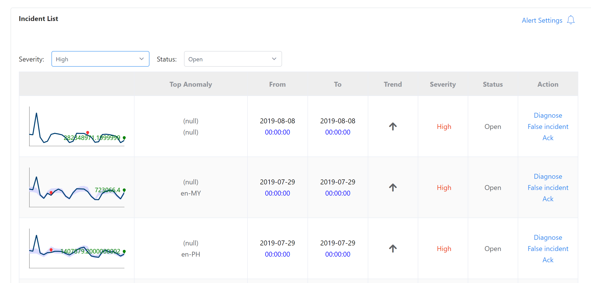
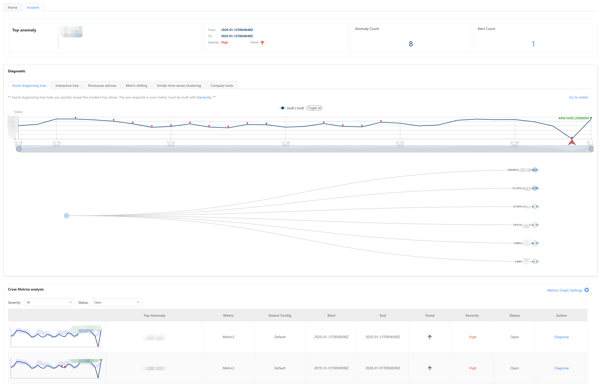
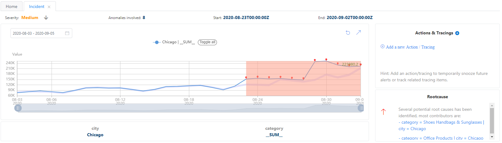
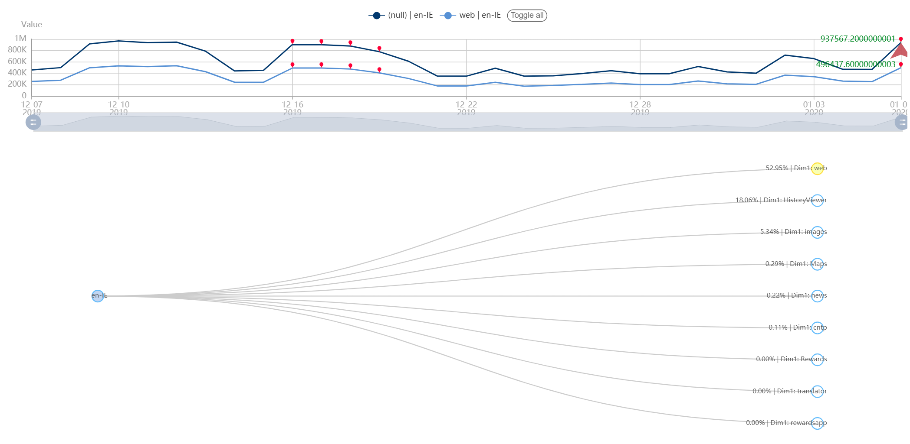
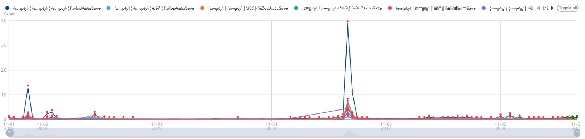
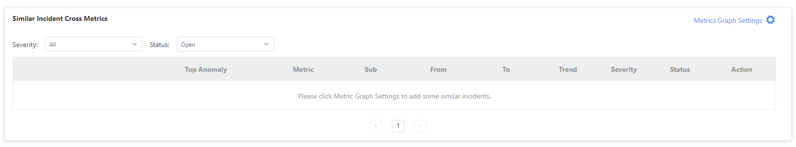

# How-to: Diagnose an incident using Metrics Monitor

Metrics Advisor provides several features for diagnostics, and to give an in-depth view of detected incidents, and provide root-cause analysis. When data is ingested, Metrics Advisor will group incidents into a hierarchy to provide structure.

Click on **Incident hub** in the left navigation window to see all incidents under a given metric. At the top of the page, you can select different metrics to see their detection configurations, and detection results, and change the time range.

The **overview** section contains detection results, including counts of the anomalies and alerts within in the selected time range.

Detected incidents within the selected metric and time range are listed in the **Incident list**. There are options to filter and order the incidents. For example, by severity. Click on one of the incidents to go to the **Incident** Page for further diagnostics.

The **Diagnostic** section lets you perform in-depth analysis on an incident, and tools to identify root-causes.

## Root cause advice

The **Root cause advices** tab contains automatic suggestions for likely causes for an incident. this feature is only available if there is an  **all up** setting for the dimension. If the metric has no dimension, the root cause will be itself. Root causes are listed in the section under the tab and there might be several reasons listed. If there is no data in the table, it means your dimension doesn't satisfy the requirements to perform the analysis.

When the root cause metric is provided with specific dimensions, you can click **go to metric** to view more details of the metric.

## Incident tree

Along with automated analysis on potential root causes, Metrics Advisor supports manual root cause analysis, using the **Incident Tree**. There are two kinds of incident tree in incident page: the **quick diagnose** tree, and the **interactive tree**.

The quick diagnosis tree is for diagnosing a current incident, and the root node is limited to current incident root node. You can expand and collapse the tree nodes by clicking on it, and its series will be shown together with the current incident series in the chart above the tree.

The interactive tree lets you diagnose current incidents as well as older incidents, and ones that are related. When using the interactive tree,right click on a node to open an action menu, where you can choose a dimension to drill up through the root nodes, and a dimension to drill down for each node. By clicking on the cancel button of the dimension list on the top, you can remove the drilling up or down from this dimension. left click a node to select it and show its series together with current incident series in the chart.

## Anomaly drill down

When you're viewing incident information, you may need to get more detailed information, for example, for different dimensions, and timestamps. If your data has one or more dimensions, you can use the drill down function to get a more detailed view. 

To use the drill down function, click on the **Metric Drilling** tab in the **Incident hub**. 

The **Dimensions** setting is a list of dimensions for an incident, you can select other available dimension values for each one. After the dimension values are changed. The **Timestamp** setting lets view the current incident at different moments in time.

## Choose dimension

### Select drilling options and choose a dimension

There are two types of drill down options: **Drill down** and **Horizontal comparison**.

> [!Note]
> 1. For drill down, you can explore the data from different dimension values, except the selected dimensions. 
> 2. For horizontal comparison, you can explore the data from different dimension values, except the all-up dimensions.

### Value comparison for different dimension values

The second section of the drill down tab is a table with comparisons for different dimension values. It includes the value, baseline value, difference value, delta value and whether it is an anomaly.
 

### value and expected value comparisons for different dimension value

The third section of the drill down tab is an histogram with the values and expected values, for different dimension values. The histogram is sorted by the difference between value and expected value. You can find the unexpected value with the biggest impact easily. For example, in the above picture, we can find that, except the all up value, **US7** contributes the most for the anomaly.

###  Raw value visualization
The last part of drill down tab is a line chart of the raw values. With this chart provided, don't need to navigate to the metric page to view details.

## View similar anomalies using Time Series Clustering

When viewing an incident, you can use the **Similar time-series-clustering** tab to see the various series associated with it. Series in one group are summarized together. From the above picture, we can know that there is at least two series groups. This feature is only available if the following requirements are met:

1. Metrics must have one or more dimensions or dimension values.
2. The series within one metric must have a similar trend.

Available dimensions are listed on the top the the tab, and you can make a selection to specify the series.

## Related incidents cross metrics

Sometimes you may need to check the incidents of different metrics at the same time, or related incidents in other metrics. You can find a list of related incidents in the **Compare tools** tab. 

Before you can see related incidents for current metric, you need to add a relationship between metrics. Click **Metrics Graph Settings** to add a relationship. Only metrics with same dimension names can be related. Use the following parameters.

- Current Data feed & Metric: the data feed and metric of current incident
- Direction: the direction of relationship between two metrics. (not effect to related incidents list now)
- Another Data feed & Metric : the data feed and metric to connect with current metric

## Compare time series

Sometimes when an anomaly is detected on a specific time series, it's helpful to compare it with multiple other series in a single visualization. 
Click on the **Compare tools** tab, and then click on the blue **+ Add** button. 

Select a series from your data feed. You can choose the same granularity or a different one. Select the target dimensions and load the series trend, then click **Ok** to compare it with a previous series. The series will be put together in one visualization. You can continue to add more series for comparison and get further insights. Click the drop down menu at the top of the **Compare tools** tab to compare the time series data over a period of time, shifted.  

> [!Warning]
> To enable a shifted comparison, the granularity of your data must support it. For example, if your data is weekly and you use the **Day over day** comparison, you will get no results. In this example, you would use the **Month over month** comparison instead.

After selecting a shifted comparison, you can select whether you want to compare the data values, the delta values, or the percentage delta.

> [!Note]
> 1. Data value is the raw data value.
> 2. Delta value is the difference between raw value and compared value.
> 3. Percentage delta value is the difference between raw value and compared value divided by compared value.

## Next steps 

- [Add and manage data feeds](datafeeds.md)
    - [Configurations for different data sources](../data-feeds-from-different-sources.md)
- [Send anomaly feedback to your instance](anomaly-feedback.md)
- [Configure metrics and anomaly detection](configure-metrics.md)