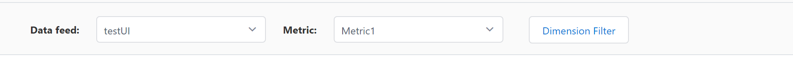
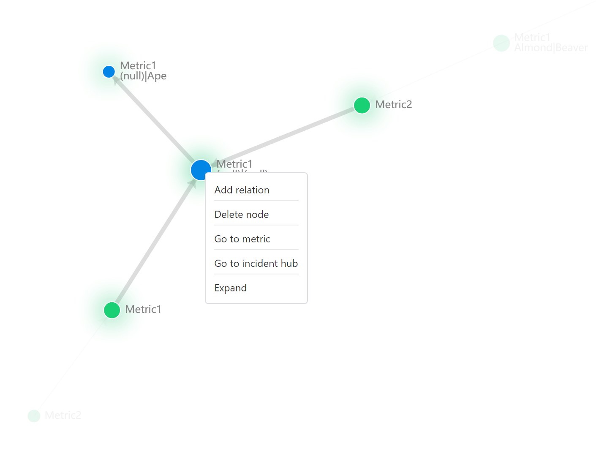
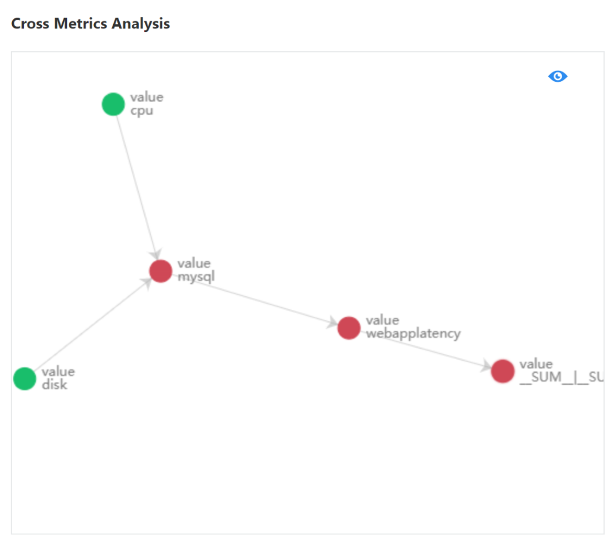

# How-to: Build a metrics graph to analyze related metrics

Each metric in Metrics Advisor is monitored separately by learning from historical data and predict the future trend. As of now the learning is still limited within individual metric, however, in some cases several metrics may have relation with each other, anomaly status needs to be analyzed across multiple metrics. Metrics Graph could definitely help in this scenario. 

Give an example in real world scenario, a manufacturing pipeline is consist of  multiple key components(A,B,C). Each component generate telemetry that indicates the running/health status of it. If these health telemetries are ingested into Metrics Advisor for anomaly detection, they will be monitored separately. However, there's dependency among them, anomaly on one component(A) could leads to another anomaly on its downstream component(B). Getting to know the dependency and root cause as soon as possible is important for engineers on duty.

Metrics Graph enables customers to map experience in mind into a topology graph, which could be shared to all team members and also make it possible to analyze related metrics together. Eventually accelerate incident diagnostic process and save time to get incident resolved. 

## Select a metric to put the first node to the graph

Click 'Metrics Graph' tab on navigation bar, you will enter the metrics graph page. The first thing to build a metrics graph is to put a node into the graph. Select a data feed and metric at the top of the page. 

After choosing a metric, a node will be showed in below panel. 

## Add a node/relation on existing node

Next thing is to add another node and specify a relation on existing node(s). Select existing node and right click on it, a context menu will be triggered with several options. 

Click 'Add relation', you are be able to choose another metric and specify the relation type between the two nodes. You could also apply specific dimension filter to the new added metric. 

Repeat above steps, you are able to build a metrics graph which describes the interrelation for all related metrics. 

**Hint on node colors**

- When you select a metric and dimension filter, all the nodes has the same metric and dimension filter in the graph will be colored as **blue**.
- All the nodes which representing a metric in the graph but not a selected metric node will be colored as **green**.
- If currently there's anomaly observed on the metric, the node will be colored as **red**.

## View related metrics anomaly status in incident hub

When the metrics graph is built, whenever there's anomaly detected on metrics within the graph, you are able to view related anomaly status and better understand the incident from a global view. 

Click into one incident of a metric which belongs to one metrics graph. Scroll down, cross metrics analysis shows under the diagnostic part, with related incidents. 

