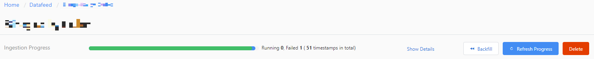

# How-to: Onboard your data

## Avoid loading partial data

Partial data is caused by inconsistencies between the data stored in Metrics Advisor and the data source. This can happen when the data source is updated after Metrics Advisor has finished pulling data. Metrics Advisor pulls data from a given data source once.

For example, suppose you have two data sources. If the data for a given date is available in the first data source, but not the second, Metrics Advisor will only retrieve metrics from the first data source. If this data is later added to the second data source, Metrics Advisor won't retrieve it. 

You can try to [backfill](#backfill-your-data-feed) historical data (described below) to mitigate inconsistencies but this won't trigger new anomaly alerts, if alerts for those time points have already been triggered. This process may add additional workload to the system, and is not automatic.

To avoid loading partial data, we recommend two approaches:

1. Generate data in one transaction:

    Ensure the metric values for all dimension combinations at the same timestamp are stored to the data source in one transaction. In the above example, wait until data from all data sources is ready, and then load it into Metrics Advisor in one transaction. Metrics Advisor can poll the data feed regularly until data is successfully (or partially) retrieved.

2. Set the ingestion time offset parameter:

    Set the **Ingestion time offset** parameter for your data feed to delay the ingestion until the data is fully prepared. This can be useful for some data sources which don't support transactions such as Azure Table Storage. See [Advanced settings](#advanced-settings) for details.

## Add a data feed using the web Portal

After signing into your Metrics Advisor portal with your Active Directory account, click **Get started**. Then, on the main page of the portal, click **Add data feed** from the left menu.

### Add connection settings

Next you'll input a set of parameters to connect your time-series data source. 
* **Source Type**: The type of data source where your time series data is stored.
* **Granularity**: The interval between consecutive data points in your time series data. Currently we support these options: Yearly, Monthly, Weekly, Daily, Hourly, and Customize. The customization option supports the lowest interval of 60 seconds.
  * **Seconds**: The number of seconds when granularityName is set as "Customize".
* **Ingest data since (UTC)**: The baseline start time for data ingestion while startOffsetInSeconds is often used to add an offset to help with data consistency.

Next, you'll need to specify the connection information of the data source as well as the custom queries which are used to convert the data into the required schema. For details on the other fields and connecting different types of data sources, see [Add data feeds from different data sources](../data-feeds-from-different-sources.md).

### Data schema requirements and configuration

[!INCLUDE [data schema requirements](../includes/data-schema-requirements.md)]

After the connection string and query string are set, select **Verify and get schema** to verify the connection and run the query to get your data schema from the data source. Normally it takes a few seconds depending on your data source connection. If there's an error at this step, confirm that:

1. Your connection string and query are correct.
2. Your Metrics Advisor instance is able to connect to the data source if there are firewall settings.

Once the data schema is loaded, select the appropriate fields.

If the timestamp of a data point is omitted, Metrics Advisor will use the timestamp when the data point is ingested instead. For each data feed, you can specify at most one column as a timestamp. If you get a message that a column cannot be specified as a timestamp, check your query or data source, and whether there are multiple timestamps in the query result - not only in the preview data. When performing data ingestion, Metrics Advisor can only consume only one chunk (one day, one hour, etc., according to the granularity) of time-series data from the given source each time.

|Selection  |Description  |Notes  |
|---------|---------|---------|
| **Display Name** | Name to be displayed on the portal instead of the original column name. | |
|**Timestamp**     | The timestamp of a data point. If omitted, Metrics Advisor will use the timestamp when the data point is ingested instead. For each data feed, you can specify at most one column as timestamp.        | Optional. Should be specified with at most one column. If you get a **column cannot be specified as Timestamp** error, check your query or data source for duplicate timestamps.      |
|**Measure**     |  The numeric values in the data feed. For each data feed, you can specify multiple measures but at least one column should be selected as measure.        | Should be specified with at least one column.        |
|**Dimension**     | Categorical values. A combination of different values identifies a particular single-dimension time series, for example: country, language, tenant. You can select zero or more columns as dimensions. Note: be cautious when selecting a non-string column as a dimension. | Optional.        |
|**Ignore**     | Ignore the selected column.        | Optional. See the below text.       |

If you want to ignore columns, we recommend updating your query or data source to exclude those columns. You can also ignore columns using **Ignore columns** and then then **Ignore** on the specific columns. If a column should be a dimension and is mistakenly set as *Ignored*, Metrics Advisor may end up ingesting partial data. For example, assume the data from your query is as below:

Row ID | Timestamp | Country | Language | Income
--- | --- | --- | --- | ---
1 | 2019/11/10 | China | ZH-CN | 10000
2 | 2019/11/10 | China | EN-US | 1000
3 | 2019/11/10 | US | ZH-CN | 12000
4 | 2019/11/11 | US | EN-US | 23000
... | ...

If *Country* is a dimension and *Language* is set as *Ignored*, then the first and second rows will have the same dimensions. Metrics Advisor will arbitrarily use one value from the two rows. Metrics Advisor will not aggregate the rows in this case.

## Specify a name for the data feed and check the ingestion progress
 
Give a custom name for the data feed, which will be displayed on the portal. Then Click on **Submit**. In the data feed details page, you can use the ingestion progress bar to view status information.

To check ingestion failure details: 

1. Click **Show Details**.
2. Click **Status** then choose **Failed** or **Error**.
3. Hover over a failed ingestion, and view the details message that appears.

A *failed* status indicates the ingestion for this data source will be retried later.
An *Error* status indicates Metrics Advisor won't retry for the data source. To reload data, you need trigger a backfill/reload manually.

You can also reload the progress of an ingestion by clicking **Refresh Progress**.

## Next steps
- [Managing your data feed](../datafeeds.md)
- [Configurations for different data sources](../data-feeds-from-different-sources.md)
- [Send anomaly feedback to your instance](anomaly-feedback.md)
- [Diagnose incidents](diagnose-incident.md).
- [Configure metrics and anomaly detection](configure-metrics.md)