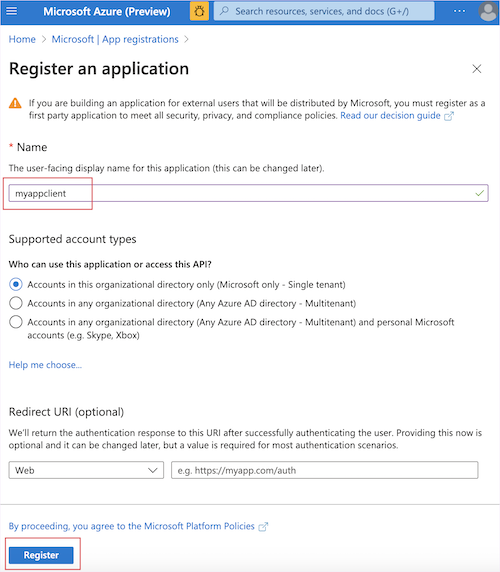

# Quickstart: create a Metrics Monitor instance

Use this quickstart to get started with Metrics Monitor by creating an instance in your Azure subscription.

## Prerequisites

* Azure subscription - [Create one for free](https://azure.microsoft.com/free/cognitive-services/)

### Setting up

Metrics Monitor will use a client application, and your organization's Azure Active Directory for authentication. If you want to use an existing client application, your account should have the *owner* role set for it.

## Create a client application

1. In the Azure portal, on the left navigation panel, select **Azure Active Directory**.
2. In the Azure Active Directory pane, select **App Registrations** from the Azure Active Directory left-hand navigation menu.
3. Select **New Registration**.
4. Assign a name for this new Client application.
5. Leave the other fields as default.
6. Select **Registration**.
7. Copy & store application(client) ID of this client application.

### Get client application and Tenant IDs

After creating above client application, you will need its client ID. You can find it by going to the **Overview** page of your client application, and selecting the  **copy** button next to application(client) ID.

   

A tenant represents an organization in Azure Active Directory. It's a dedicated Azure AD service instance that an organization receives and owns after signing up for a Microsoft cloud service. Each Azure AD tenant is distinct and separate from other Azure AD tenants.

To get the tenant ID, select copy button next to **Directory (tenant) ID**.

   

## Create a new Metrics Monitor resource

Use the [Azure Portal](https://aka.ms/newgualala) to create a new Metrics Monitor resource.

On the Create page, provide the following information:

| Information  | Description  |
|---------|---------|
|Name     | A descriptive, unique name for your resource. Write down this value, as it will be used in the URL to access your resource.        |
|Subscription     | One of your available Azure subscriptions.        |
|Location     | The location of your resource. Different locations may introduce latency, but won't impact service availability.        |
|Pricing tier     | You can use the free pricing tier (`F0`) to try the service, and upgrade later to a paid tier for production.       |
|Resource Group     | The Azure resource group that will contain your resource. You can create a new group or add it to a pre-existing one.        |
|Azure Active Directory client ID     | The client application ID from the above step.         |
|Azure Active Directory tenant ID     | The client application tenant ID from the above step.         |

After inputting all above fields, select **Create** to start deploying an instance. It may take around 30 minutes for deployment to complete.

## Configure the client application

After your resource deploys, you will need to add its URL to your client application as a redirect URI.

1. In the Azure portal, on the left navigation panel, select **Azure Active Directory**.
2. In the Azure Active Directory panel, select **App Registrations** from the Azure Active Directory left-hand navigation menu.
3. On the application list, select the client application you created in previous step - **Create a Client application**.
4. Select **Authentication** in the left panel.
5. Select **Add a platform** > **Web** to add a web platform.

6. Add a web redirect URI by pasting the website URL of your resource to the **Redirect URI**  field.
   The URL for your resource will be: `https://<resource-name>.azurewebsites.net`. Replace `<resource-name>` with the name you set in the previous step.
7. Make sure **Implicit grant** > **ID tokens** is selected.
8. Select **Save**.

You can start using your Metrics Monitor instance with the web portal, and through the REST API. You can check both URLs in the Cognitive service instance you've created.
If you want to access this service using the REST API or Client library, you will need an authentication key.

## Clean up resources

If you want to clean up and remove a Cognitive Services subscription, you can delete the resource or resource group. Deleting the resource group also deletes any other resources associated with it.

In the Azure portal, expand the menu on the left side to open the menu of services, and choose Resource Groups to display the list of your resource groups.
Locate the resource group containing the resource to be deleted
Right-click on the resource group listing. Select **Delete resource group**, and confirm.

## Next Steps

- [Build your first monitor on web](web-portal.md)
