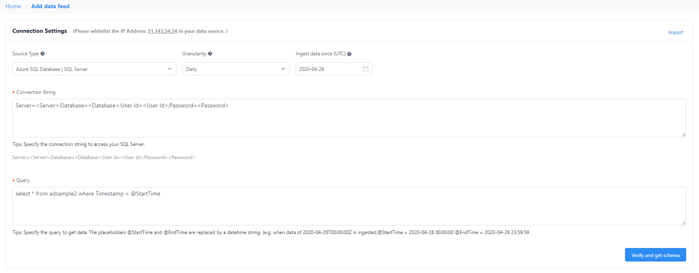
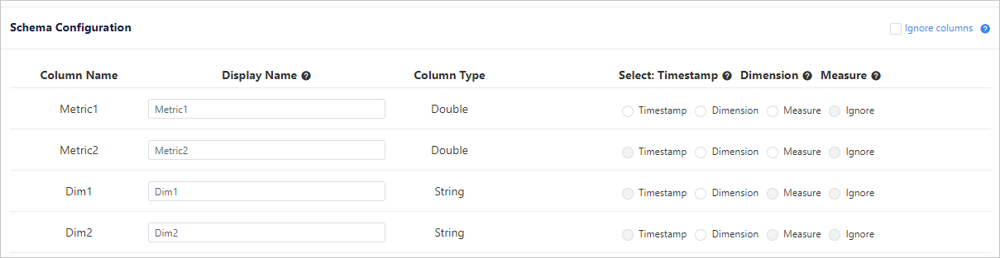
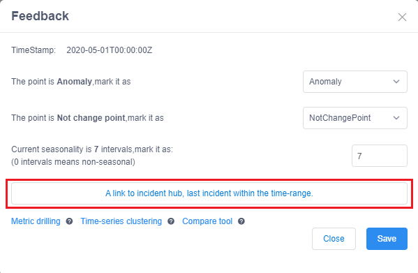

# Quickstart: Metrics Advisor using the web portal

Metrics Advisor provides a web portal to help you onboard your data and begin using the service. 

* Onboard your metric data
* View your metrics and visualizations
* Fine-tune detection configurations
* Explore diagnostic insights
* Create and subscribe to anomaly alerts

## Prerequisites

* Azure subscription - [Create one for free](https://azure.microsoft.com/free/cognitive-services/)
* A [Metrics Advisor instance](create-instance.md)
  * You can access the web portal for your instance at: `https://<resource-name>.azurewebsites.net` where `<resource-name>` is the name for your Metrics Advisor resource.

This document uses a SQL Database as an example for creating your first monitor.

## Onboard time series data

Metrics Advisor provides connectors for different data sources, such as SQL Database, Azure Data Explorer, and Azure Table Storage. The steps for connecting data are similar for different connectors, although some configuration parameters may vary. 

This quickstart uses a SQL Database as an example. You can also [connect your data from a different source](../data-feeds-from-different-sources.md) 

To get started, sign into your Metrics Advisor portal, with your Active Directory account. From the landing page, select **Get started**. After the main page of the portal loads, select **Add data feed** from the left menu.

### Configure connection settings

> [!TIP]
> See [how to add data feeds](../how-tos/datafeeds.md) for details on the available parameters.

Add the data feed by connecting to your time-series data source. Start by selecting the following parameters:

* **Source Type**: The type of data source where your time series data is stored.
* **Granularity**: The interval between consecutive data points in your time series data, for example Yearly, Monthly, Daily. The lowest interval customization supports is 60 seconds.
* **Ingest data since (UTC)**: The start time for the first timestamp to be ingested. 

Next, specify the **Connection string** with the credentials for your data source, and a custom **Query**. The query is used to specify the data to be ingested, and converted into the required schema.

### Verify the connection and load the data schema

After the connection string and query string are created, select **Verify and get schema** to verify the connection and run the query to get your data schema from the data source. Normally it takes a few seconds depending on your data source connection. If there's an error at this step, confirm that:

1. Your connection string and query are correct.
2. Your Metrics Advisor instance is able to connect to the data source if there are firewall settings.

### Schema configuration

Once the data schema is loaded and shown like below, select the appropriate fields.

|Selection  |Description  |Notes  |
|---------|---------|---------|
|**Timestamp**     | The timestamp of a data point. If omitted, Metrics Advisor will use the timestamp when the data point is ingested instead. For each data feed, you could specify at most one column as timestamp.        | Optional. Should be specified with at most one column.       |
|**Measure**     |  The numeric values in the data feed. For each data feed, you could specify multiple measures but at least one column should be selected as measure.        | Should be specified with at least one column.        |
|**Dimension**     | Categorical values. A combination of different values identifies a particular single-dimension time series, for example: country, language, tenant. You could select none or arbitrary number of columns as dimensions. Note: if you're selecting a non-string column as dimension, be cautious with dimension explosion. | Optional.        |
|**Ignore**     | Ignore the selected column.        |         |

Give a custom name for the data feed, which will be displayed on the portal. Click on **Submit**. 

## Tune detection configuration

After the data feed is added, Metrics Advisor will attempt to ingest metric data from the specified start date. It will take some time for data to be fully ingested, and you can view the ingestion status by clicking **Ingestion progress** at the top of the data feed page. If data is ingested, Metrics Advisor will apply detection, and continue to monitor the source for new data.

When detection is applied, click one of the metrics listed in data feed to find the **Metric detail page** to: 
- View visualizations of all time series slices under this metric
- Update detecting configuration to meet expected results
- Set up notification for detected anomalies

## View the diagnostic insights

After tuning the detection configuration, anomalies that are found should reflect actual anomalies in your data. Metrics Advisor performs analysis on multi-dimensional metrics, like anomaly clustering, incident correlation and root cause analysis. Use these features to analyze and diagnose incidents in your data.

To view the diagnostic insights, click on the red dots on data visualizations, which represent detected anomalies. A window will appear with a link to incident analysis page. 

After clicking the link, You will be pivoted to the incident analysis page belonging to the anomaly, with several diagnostics insights. At the top, there will be statistics about the incident, such as **Severity**, **Anomalies involved**, and impacted **Start time** and **End time**. 

Next you'll see the ancestor anomaly of the incident, and automated root-cause advice. This automated root cause advice is generated upon diagnosing the incident trees of all related anomalies, including: deviation, distribution and contribution to the parent anomalies. 

Based on these, you can already get a straightforward view of what is happening and the impact of the incident as well as the most potential root cause. So that immediate action could be taken to resolve incident as soon as possible. 

But you can also pivot across more diagnostics insights leveraging additional features to drill down anomalies by dimension, view similar anomalies and do comparison across metrics. Please find more at [How to: diagnose an incident](../how-tos/diagnose-incident.md). 

## Get notified when new anomalies are found

If you'd like to get alerted when an anomaly is detected in your data, you can create a subscription for one or more of your metrics. Metrics Advisor uses web hooks to send alerts.

### Step 1: Create a web hook

A web hook is the entry point for all of the information you alerts you will receive. Currently, Metrics Advisor only supports sending alerts through a web hook. For details on how to create a hook, please refer to the **Create a web hook** section in [How-to: Configure and subscribe to an alert](../how-tos/alerts.md#create-a-web-hook). 

### Configure alert settings

An alert setting determines how and which alert notifications should be sent. You can set multiple alert settings for each metric. two important settings are **Alert for** which specifies the anomalies to be included, and **Filter anomaly options** which defines which anomalies to include in the alert. See the **Add or Edit alert settings** section in [How-to: Configure and subscribe to an alert](../how-tos/alerts.md#create-a-web-hook#add-or-edit-alert-settings). for more details.

## Next Steps

- [Onboard and manage data feeds](../how-tos/datafeeds.md)
    - [Configurations for different data sources](../data-feeds-from-different-sources.md)
- [Use the REST API or Client libraries](rest-api-and-client-library.md)
- [Send anomaly feedback to your instance](../how-tos/anomaly-feedback.md)
- [Diagnose incidents](../how-tos/diagnose-incident.md).
- [Create alerts](../how-tos/alerts.md).