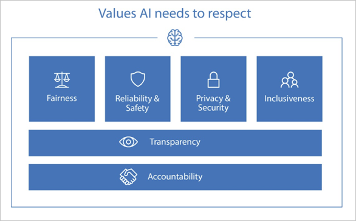

# Guidelines for responsible implementation of Personalizer

For people and society to realize the full potential of AI, implementations need to be designed in such a way that they earn the trust of those adding AI to their applications and the users of applications built with AI. These guidelines are aimed at helping you to implement Personalizer in a way that helps you build trust in your company and service. Be sure to pause to research, learn and deliberate on the impact of the personalization on people's lives. When in doubt, seek guidance.

These guidelines are not intended as legal advice and you should separately ensure that your application complies with the fast-paced developments in the law in this area and in your sector.

Also, in designing your application using Personalizer, you should consider a broad set of responsibilities you have when developing any data-centric AI system, including ethics, privacy, security, safety, inclusion, transparency and accountability. You can read more about these in the [Recommended reading](#recommended-reading) section.

You can use the following content as a starter checklist, and customize and refine it to your scenario. This document has two main sections: The first is dedicated to highlighting responsible use considerations when choosing scenarios, features and rewards for Personalizer. The second take a set of values Microsoft believes should be considered when building AI systems, and provides actionable suggestions and risks on how your use of Personalizer influences them.

## Your responsibility

All guidelines for responsible implementation build on the foundation that developers and businesses using Personalizer are responsible and accountable for the effects of using these algorithms in society. If you are developing an application that your organization will deploy, you should recognize your role and responsibility for its operation and how it affects people. If you are designing an application to be deployed by a third party, come to a shared understanding with them of who is ultimately responsible for the behavior of the application, and document that understanding.

Trust is built on the notion of fulfilled commitments - consider your users, society, and the legal framework your applications works in, to identify explicit and implicit commitments they may have.

Microsoft is continuously putting effort into its tools and documents to help you act on these responsibilities. [Provide feedback to Microsoft](mailto:cogsvcs-RL-feedback@microsoft.com?subject%3DPersonalizer%20Responsible%20Use%20Feedback&body%3D%5BPlease%20share%20any%20question%2C%20idea%20or%20concern%5D) if you believe additional tools, product features and documents would help you implement these guidelines for using Personalizer.

## Factors for responsibly implementing Personalizer

Implementing Personalizer can be of great value to your users and your business. To implement Personalizer responsibly, start by considering the following guidelines when:

* Choosing use cases to apply Personalization.
* Building [reward functions](concept-rewards.md).
* Choosing which [features](concepts-features.md) about the context and possible actions you will use for personalization.

## Choosing use cases for Personalizer

Using a service that learns to personalize content and user interfaces is useful. It can also be misapplied if the way the personalization creates negative side effects in the real world, including if users are unaware of content personalization.

Examples of uses of Personalizer with heightened potential for negative side effects or a lack of transparency include scenarios where the "reward" depends on many long-term complex factors that, when over-simplified into an immediate reward can have unfavorable results for individuals. These tend to be considered "consequential" choices, or choices that involve a risk of harm. For example:

* **Finance**: Personalizing offers on loan, financial, and insurance products, where risk factors are based on data the individuals don't know about, can't obtain, or can't dispute.
* **Education**: Personalizing ranks for school courses and education institutions where recommendations may propagate biases and reduce users' awareness of other options.
* **Democracy and Civic Participation**: Personalizing content for users with the goal of influencing opinions is consequential and manipulative.
* **Third-party reward evaluation**: Personalizing items where the reward is based on a latter 3rd party evaluation of the user, instead of having a reward generated by the user's own behavior.
* **Intolerance to Exploration**: Any situation where the exploration behavior of Personalizer may cause harm.

When choosing use cases for Personalizer:

* Start the design process considering how the personalization helps your users.
* Consider the negative consequences in the real world if some items aren't ranked for users due to personalization patterns or exploration.
* Consider whether your use case constitutes automated processing which significantly affects data subjects that is regulated under [GDPR](https://eur-lex.europa.eu/legal-content/EN/TXT/?uri=CELEX:32016R0679) Article 22 or other laws.
* Consider self-fulfilling prophecy loops. This may happen if a personalization reward trains a model so it may subsequently further exclude a demographic group from accessing relevant content. For example, most people in a low-income neighborhood don't obtain a premium insurance offer, and slowly nobody in the neighborhood tends to see the offer at all if there isn't enough exploration.
* Save copies of models and learning policies in case it is necessary to reproduce Personalizer in the future. You can do this periodically or every model refresh period.
* Consider the level of exploration adequate for the space and how to use it as a tool to mitigate "echo chamber" effects.

## Selecting features for Personalizer

Personalizing content depends on having useful information about the content and the user. Keep in mind, for some applications and industries, some user features can be directly or indirectly considered discriminatory and potentially illegal.

Consider the effect of these features:

* **User demographics**: Features regarding sex, gender, age, race, religion: These features may be not allowed in certain applications for regulatory reasons, and it may not be ethical to personalize around them because the personalization would propagate generalizations and bias. An example of this bias propagation is a job posting for engineering not being shown to elderly or gender-based audiences.
* **Locale information**: In many places of the world, location information (such as a zip code, postal code, or neighborhood name) can be highly correlated with income, race and religion.
* **User Perception of Fairness**: Even in cases where your application is making sound decisions, consider the effect of users perceiving that content displayed in your application changes in a way that appears to be correlated to features that would be discriminatory.
* **Unintended Bias in Features**:       There are types of biases that may be introduced by using features that only affect a subset of the population. This requires extra attention if features are being generated algorithmically, such as when using image analysis to extract items in a picture or text analytics to discover entities in text. Make yourself aware of the characteristics of the services you use to create these features.

Apply the following practices when choosing features to send in contexts and actions to Personalizer:

* Consider the legality and ethics of using certain features for some applications, and whether innocent-looking features may be proxies for others you want to or should avoid,
* Be transparent to users that algorithms and data analysis are being used to personalize the options they see.
* Ask yourself: Would my users care and be happy if I used this information to personalize the content for them? Would I feel comfortable showing them how the decision was made to highlight or hide certain items?
* Use behavioral rather than classification or segmentation data based on other characteristics. Demographic information was traditionally used by retailers for historical reasons – demographic attributes seemed simple to collect and act upon before a digital era, - but question how relevant demographic information is when you have actual interaction, contextual, and historical data that relates more closely to the preferences and identity of users.
* Consider how to prevent features from being 'spoofed' by malicious users, which if exploited in large numbers can lead to training Personalizer in misleading ways to purposefully disrupt, embarrass and harass certain classes of users.
* When appropriate and feasible, design your application to allow your users to opt in or opt out of having certain personal features used. These could be grouped, such as "Location information", "Device Information", "Past Purchase History" etc.

## Computing rewards for Personalizer

Personalizer strives to improve the choice of which action to reward based on the reward score provided by your application business logic.

A well-built reward score will act as a short-term proxy to a business goal, that is tied to an organization's mission.

For example, rewarding on clicks will make the Personalizer Service seek clicks at the expense of everything else, even if what is clicked on is distracting or not tied to a business outcome.

As a contrasting example, a news site may want to set rewards tied to something more meaningful than clicks, such as "Did the user spend enough time to read the content?" "Did they click on relevant articles or references?". With Personalizer it is easy to tie metrics closely to rewards. But be careful not to confound short-term user engagement with good outcomes.

### Unintended consequences from reward scores
Reward scores may be built with the best of intentions, but can still create unexpected consequences or unintended results on how Personalizer ranks content.

Consider the following examples:

* Rewarding video content personalization on the percentage of the video length watched will probably tend to rank shorter videos.
* Rewarding social media shares, without sentiment analysis of how it's shared or the content itself, may lead to ranking offensive, unmoderated, or inflammatory content, which tends to incite a lot of "engagement", but adds little value.
* Rewarding the action on user interface elements that users don't expect to change may interfere with the usability and predictability of the user interface, where buttons are surprisingly changing location or purpose without warning, making it harder for certain groups of users to stay productive.

Implement these best practices:

* Run offline experiments with your system using different reward approaches to understand impact and side-effects.
* Evaluate your reward functions and ask yourself how would an extremely naïve person bend its interpretation and reach undesirable outcomes with it.

## Responsible design considerations

The following are areas of design for responsible implementations of AI. Learn more abut this framework in [The Future Computed](https://news.microsoft.com/futurecomputed/).

### Accountability
*People who design and deploy AI Systems must be accountable for how their systems operate*.

* Create internal guidelines on how to implement Personalizer, document, and communicate them to your team, executives, and suppliers.
* Perform periodic reviews of how reward scores are computed, perform offline evaluations to see what features are affecting Personalizer, and use the results to eliminate unneeded and unnecessary features.
* Communicate clearly to your users how Personalizer is used, to what purpose, and with what data.
* Archive information and assets - such as models, learning policies, and other data - that Personalizer uses to function, to be able to reproduce results.

### Transparency
*AI Systems Should be Understandable*. With Personalizer:

* *Give users information about how the content was personalized.* For example, you can show your users a button labeled `Why These Suggestions?` showing which top features of the user and actions played a role in the results of Personalizer.
* Make sure your terms of use make mention that you will use information about users and their behavior to personalize the experience.

### Fairness
*AI Systems should treat all people fairly*.

* Don't use Personalizer for use cases where the outcomes are long-term, consequential, or involve real harm.
* Don't use features that are not appropriate to personalize content with, or that may help propagate undesired biases. For example, anyone with similar financial circumstances should see the same personalized recommendations for financial products.
* Understand biases that may exist in features that are sourced from editors, algorithmic tools, or users themselves.

### Reliability and safety
*AI Systems should perform reliably and safely*. For Personalizer:

* *Don't provide actions to Personalizer that shouldn't be chosen*. For example, inappropriately movies should be filtered out of the actions to personalize if making a recommendation for an anonymous or under-age user.
* *Manage your Personalizer model as a business asset*.  Consider how often to save and back up the model and learning policies behind your Personalizer Loop, and otherwise treat it as an important business asset. Reproducing past results is important for self-audit and measuring improvement.
* *Provide channels to get direct feedback from users*. In addition to coding safety checks to make sure only the right audiences see the right content, provide a feedback mechanism for users to report content that may be surprising or disturbing. Especially if your content comes from users or 3rd parties, consider using Microsoft Content Moderator or additional tools to review and validate content.
* *Perform frequent offline Evaluations*. This will help you monitor trends and make sure effectiveness is known.
* *Establish a process to detect and act on malicious manipulation*. There are actors that will take advantage of machine learning and AI systems' ability to learn from their environment to shift the outcome towards their goals. If your use of Personalizer is in a position to influence important choices, make sure to have appropriate means to detect and mitigate these classes of attacks, including human review in appropriate circumstances.

### Security and privacy
*AI Systems should be secure and respect privacy*. When using Personalizer:

* *Inform users up front about the data that is collected and how it is used and obtain their consent beforehand*, following your local and industry regulations.
* *Provide privacy-protecting user controls.* For applications that store personal information, consider providing an easy-to-find button for functions such as:
   * `Show me all you know about me`
   * `Forget my last interaction`
   * `Delete all you know about me`

In some cases, these may be legally required. Consider the tradeoffs in retraining models periodically so they don't contain traces of deleted data.

### Inclusiveness
*Address a broad range of human needs and experiences*.
* *Provide personalized experiences for accessibility-enabled interfaces.* The efficiency that comes from good personalization - applied to reduce the amount of effort, movement, and needless repetition in interactions-  can be especially beneficial to people with disabilities.
* *Adjust application behavior to context*. You can use Personalizer to disambiguate between intents in a chat bot, for example, as the right interpretation may be contextual and one size may not fit all.

## Proactive readiness for increased data protection and governance

It is hard to predict specific changes in regulatory contexts, but in general it would be wise to go beyond the minimum legal framework in ensuring respectful use of personal data, and providing transparency and choice related to algorithmic decision making.

* Consider planning ahead to a situation where there may be new restrictions on data collected from individuals, and there is a need to show how it was used to make decisions.
* Consider extra readiness where users may include marginalized vulnerable populations, children, users in economic vulnerability, or users otherwise susceptible to influence from algorithmic manipulation.
* Consider the widespread dissatisfaction with how audience-targeting and audience-influencing data collection programs and algorithms have played out, and how to avoid proven strategic errors.

## Proactive assessments during your project lifecycle

Consider creating methods for team members, users and business owners to report concerns regarding responsible use, and creating a process that prioritizes their resolution and prevents retaliation.

Any person thinking about side effects of use of any technology is limited by their perspective and life experience. Expand the range of opinions available by bringing in more diverse voices into your teams, users, or advisory boards; such that it is possible and encouraged for them to speak up. Consider training and learning materials to further expand the team knowledge in this domain, and to add capability to discuss complex and sensitive topics.

Consider treating tasks regarding responsible use just like other crosscutting tasks in the application lifecycle, such as tasks related to user experience, security, or DevOps. These tasks and their requirements can't be an afterthought. Responsible use should be discussed and verified throughout the application lifecycle.

## Questions and feedback

Microsoft is continuously putting effort into tools and documents to help you act on these responsibilities. Our team invites you to [provide feedback to Microsoft](mailto:cogsvcs-RL-feedback@microsoft.com?subject%3DPersonalizer%20Responsible%20Use%20Feedback&body%3D%5BPlease%20share%20any%20question%2C%20idea%20or%20concern%5D)  if you believe additional tools, product features, and documents would help you implement these guidelines for using Personalizer.

## Recommended reading

* See Microsoft's six principles for the responsible development of AI published in the January 2018 book, [The Future Computed](https://news.microsoft.com/futurecomputed/)
* [Who Owns the Future?](https://www.goodreads.com/book/show/15802693-who-owns-the-future) by Jaron Lanier.
* [Weapons of Math Destruction](https://www.goodreads.com/book/show/28186015-weapons-of-math-destruction) by - Cathy O'Neil
* [Ethics and Data Science](https://www.oreilly.com/library/view/ethics-and-data/9781492043898/) by DJ Patil, Hilary Mason, Mike Loukides.
* [ACM Code of Ethics](https://www.acm.org/code-of-ethics)
* [Genetic Information Nondiscrimination Act - GINA](https://en.wikipedia.org/wiki/Genetic_Information_Nondiscrimination_Act)
* [FATML Principles for Accountable Algorithms](https://www.fatml.org/resources/principles-for-accountable-algorithms)

## Next steps

[Features: action and context](concepts-features.md).
