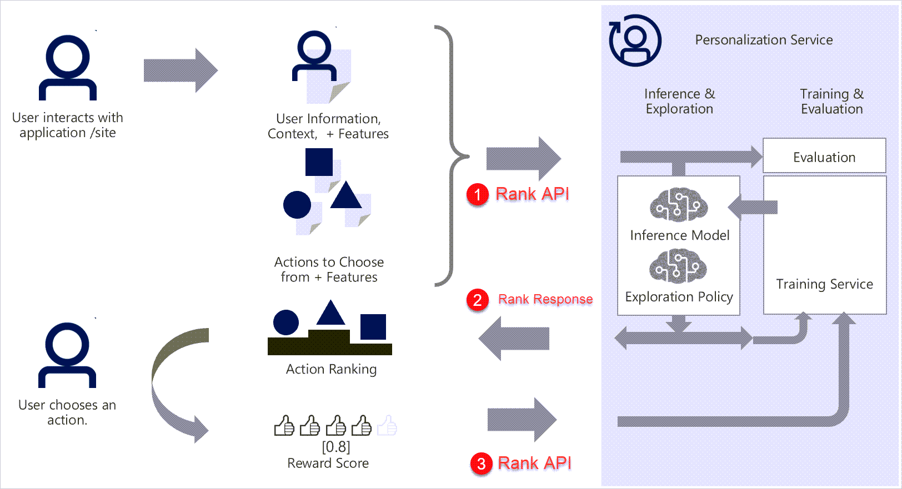

# How Personalizer works

The Personalizer resource, your _learning loop_, uses machine learning to build the model that predicts the top action for your content. The model is trained exclusively on your data that you sent to it with the **Rank** and **Reward** calls. Every loop is completely independent of each other.

## Rank and Reward APIs impact the model

You send _actions with features_ and _context features_ to the Rank API. The **Rank** API decides to use either:

* _Exploit_: The current model to decide the best action based on past data.
* _Explore_: Select a different action instead of the top action. You [configure this percentage](how-to-settings.md#configure-exploration-to-allow-the-learning-loop-to-adapt) for your Personalizer resource in the Azure portal.

You determine the reward score and send that score to the Reward API. The **Reward** API:

* Collects data to train the model by recording the features and reward scores of each rank call.
* Uses that data to update the model based on the configuration specified in the _Learning Policy_.

## Your system calling Personalizer

The following image shows the architectural flow of calling the Rank and Reward calls:

1. You send _actions with features_ and _context features_ to the Rank API.

    * Personalizer decides whether to exploit the current model or explore new choices for the model.
    * The ranking result is sent to EventHub.
1. The top rank is returned to your system as _reward action ID_.
    Your system presents that content and determines a reward score based on your own business rules.
1. Your system returns the reward score to the learning loop.
    * When Personalizer receives the reward, the reward is sent to EventHub.
    * The rank and reward are correlated.
    * The AI model is updated based on the correlation results.
    * The inference engine is updated with the new model.

## Personalizer retrains your model

Personalizer retrains your model based on your **Model frequency update** setting on your Personalizer resource in the Azure portal.

Personalizer uses all the data currently retained, based on the **Data retention** setting in number of days on your Personalizer resource in the Azure portal.

## Research behind Personalizer

Personalizer is based on cutting-edge science and research in the area of [Reinforcement Learning](concepts-reinforcement-learning.md) including papers, research activities, and ongoing areas of exploration in Microsoft Research.

## Next steps

Learn about [top scenarios](where-can-you-use-personalizer.md) for Personalizer