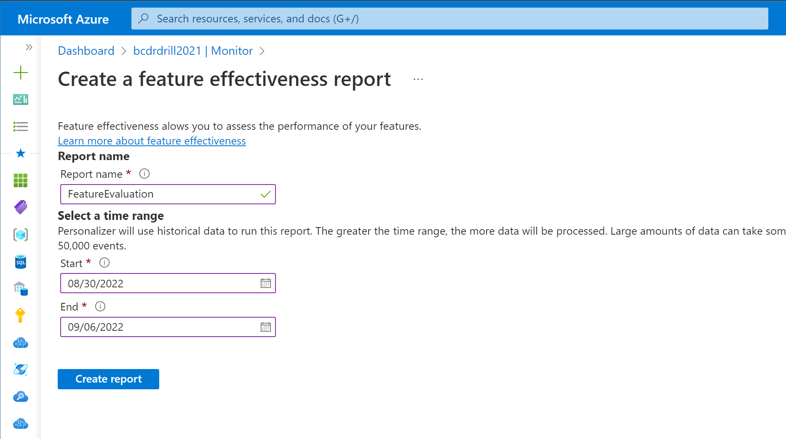

# Evaluate feature importances

Personalizer can report just how important each feature is to the underlying RL model by conducting a _feature evaluation_. Feature evaluations are particularly useful to:

* Understand which features are most or least important to the model.
* Brainstorm additional features that may be beneficial to learning, by deriving inspiration from what features are currently important in the model.
* Identify potentially unimportant or non-useful features that should be considered for further analysis or potential removal. 
* Troubleshoot common problems and errors that may occur when designing features and sending them to Personalizer.

## Preliminary: What is a feature evaluation?

Feature evaluations are conducted by training and running a copy of your current model configuration on historically collected log data in a specified time period. Note that: Your current model's performance is not affected by running a feature evaluation.

The process of feature evaluation can be described as below:

* Train and evaluate the model over the evaluation period using all features and obtain an average reward score, _Rall-features_.
    * For each feature F sent to Personalizer in the evaluation period, train and evaluate the model over using all features _except for F_, and obtain an average reward score, _Rexluding-F_.
* Compute the absolute normalized difference between _Rall-features_ and _Rexluding-F_. This is the _feature importance score_ of feature F.

Feature importance scores are a measure of how important a particular feature is to your model. More specifically, the scores quantify how much of the average reward is obtained due to the inclusion of a particular feature. Feature importance scores are a number between 0 (least important) and 100 (most important) and are shown in a report created by running a _Feature Evaluation_. Note that since the evaluation is run over a specific time period, the feature importances can change as additional data is sent to Personalizer and as your users, scenarios, and data change over time. 

## Creating a feature evaluation

To obtain feature importance scores, you must create a feature evaluation over a period of log (historical) data. This generates a report containing the feature importance scores. This report is viewable in the Azure Portal. To create a feature evaluation:

* Go to the [Azure portal](https://portal.azure.com)
* Select your Personalizer resource
* Click on the _Monitor_ section from the side navigation pane
* Click on the _Features_ tab
* Click on "Create report" and a new screen should appear
* Choose a name for your report
* Choose _start_ and _end_ times for your evaluation period
* Click on "Create report"

:::row:::
    :::column span="":::
        
    :::column-end:::
    :::column span="":::
        
   :::column-end:::
:::row-end:::

Next, your report name should appear in the reports table below. Creating a feature evaluation will take some time (typically several hours) depending on the length of the evaluation period and the volume of data sent to Personalizer. While the report is being created, the _Status_ column will indicate "Running" for your evaluation. The _Status_ will update to "Succeeded" once completed.

You can run multiple feature evaluations over various periods of time that your Personalizer resource has log data. Make sure that your [data retention period](how-to-settings.md#data-retention) is set sufficiently long to enable you to perform evaluations over older data.

## Viewing a feature evaluation report

## Interpreting feature importance scores

### Features with a high importance score

Features with higher importance scores are more influential to the model during the evaluation period. Again, note that since the evaluation is run over a specific time period, the feature importances can change as additional data is sent to Personalizer and as your users, scenarios, and data change over time. 

Important features can provide inspiration for designing additional features to be included in the model. For example, if you see the context feature "MobileBatteryLevel" as having high importance in an grocery shopping website, you may think that the connection type may also affect customer purchase choices. It may be worthwhile to explore adding features about connectivity type and bandwidth.

### Features with a low importance score

Features with low importance scores are good candidates for further analysis. Not all low scoring features necessarily _bad_. Low scores can occur for one or more several reasons. The list below can help you get started with analyzing why your features have low scores:

* The feature was rarely observed in the data during the evaluation period. 
    * Check The _Feature occurrences_ in your feature evaluation. If it's low in comparison to other features, this may indicate that feature was not present often enough for the model to determine if it's valuable or not.
* The feature values remained relatively consistent and did not add value.
    * Check The _Number of unique values_ in your feature evaluation. If it's lower than you would expect, this may indicate that the feature did not vary much during the evaluation period and won't provide significant insight.
* The feature values were too noisy (random) and provided little value.
    * Check the _Number of unique values_ in your feature evaluation. If it's higher than you expected, or high in comparison to other features, this may indicate that the feature was too noisy during the evaluation period.
* There is a data or formatting issue.
    * Check to make sure the features are formatted and sent to Personalizer in the way you expect.
* The feature score is low, and the reasons above do not apply, then the feature may not be valuable to model learning and performance.
    * Consider removing the feature as it's not helping your model maximize the average reward. 
    
Removing features with low importance scores can help speed up model learning by reducing the amount of data needed to learn. It can also potentially improve the performance of the model. However, this is not guaranteed and further analysis may be needed.

#### Common issues with feature design and formatting

- **Sending personally identifiable information (PII).** PII specific to one individual (such as name, phone number, credit card number, IP address) shouldn't be used with Personalizer.
- **Sending user IDs** With large numbers of users, it's unlikely that this information is relevant to Personalizer learning to maximize the average reward score. Sending user IDs (even if non-PII) will likely add more noise to the model and is not recommended.
- **Sending unique values that will rarely occur more than a few times**. as precise timestamps instead of featurized time values. Instead, it is recommended to bucketize your features to a higher level-of-detail. For example, having features such as `"Context.TimeStamp.Day":"Monday"` or `"Context.TimeStamp.Hour":13` can be useful as there are only 7 and 24 unique values, respectively. However, `"Context.TimeStamp":"1985-04-12T23:20:50.52Z"` is very precise and has an extremely large number of unique values, which makes it very difficult for Personalizer to learn from it.

## Next steps

[Analyze policy performances with an offline evaluation](how-to-offline-evaluation.md) with Personalizer.

